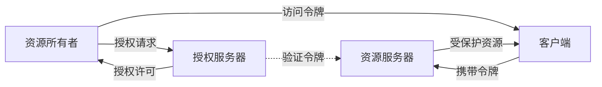
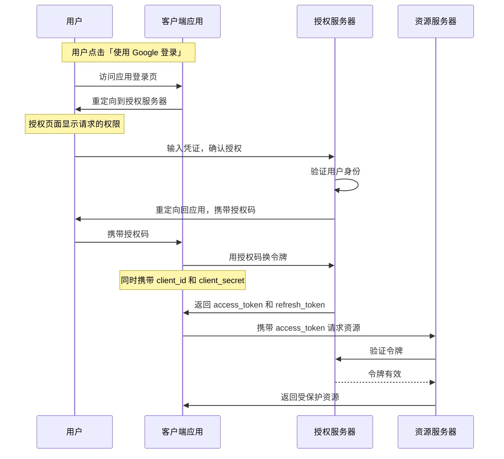

2010 年之前，如果你想用某个第三方应用访问 Google 邮箱中的联系人，你会面临一个两难选择：要么把 Google 账号密码交给这个应用，要么放弃使用。把这家小公司不认识的第三方应用可能看到你所有的邮件、联系人、甚至以你的身份发送邮件。你信任 Google，但你信任这个第三方应用吗？

OAuth 2.0 就是为了解决这个问题而诞生的。它让你不必交出密码，就能授权第三方应用访问你的数据。**这不是一个小功能，而是一种重新定义用户与数据关系的革命性设计。**

## 一、OAuth 2.0 的诞生背景

在 OAuth 出现之前，「授权」通常意味着共享密码。2006 年，Twitter 开放 API 时，第三方 Twitter 客户端需要用户提供 Twitter 账号密码才能访问。这种模式存在严重问题：第三方应用拥有完全的账号控制权，可以随时修改密码、读取所有数据、甚至以用户身份操作。用户无法细粒度地控制权限，也不知道应用到底获取了哪些数据。

2007 年，Google、Yahoo、Facebook 等公司联合启动了 OAuth 协议的标准化工作。2007 年底发布了 OAuth Core 1.0，但这个版本存在会话固定攻击漏洞。2010 年，OAuth 2.0（RFC 6749）正式发布，成为现代 Web 授权的事实标准。

OAuth 2.0 解决的核心问题是：**让用户能够在不暴露密码的前提下，授权第三方应用访问受保护资源。** 这个设计看似简单，却深刻影响了整个互联网的身份授权生态。

## 二、四种核心角色

OAuth 2.0 协议定义了四种角色，每种角色承担不同的职责：

**资源所有者（Resource Owner）** 是拥有受保护资源的实体，通常是最终用户。当你说「允许 Notion 访问我的 Google 日历」时，你就是资源所有者。用户可以对应用授权访问自己的数据，也可以拒绝访问。资源所有者拥有授权的最终决定权。

**客户端（Client）** 是希望访问受保护资源的应用程序。客户端分为两类：机密客户端（Confidential Client）能够安全地保管客户端密钥，如后端服务；公共客户端（Public Client）无法安全保管密钥，如单页应用（SPA）、移动 App。两者在安全性上存在本质差异，因此协议对它们的要求不同。

**授权服务器（Authorization Server）** 是负责验证资源所有者身份、获取授权、签发访问令牌的服务。授权服务器是 OAuth 2.0 架构的核心，它位于用户与应用之间，扮演「中间人」的角色，确保应用不会直接获得用户的凭证。

**资源服务器（Resource Server）** 是托管受保护资源的服务器，能够接受和验证访问令牌，返回相应的资源。资源服务器与授权服务器可以是同一个服务，也可以是独立的服务。

## 三、核心概念解析

**访问令牌（Access Token）** 是授权服务器签发的凭证，代表用户授予客户端的权限范围。客户端在请求资源时携带令牌，资源服务器验证令牌后决定是否返回资源。令牌是 OAuth 2.0 安全模型的关键：应用得到的是令牌而不是用户密码，令牌可以被撤销、可以限定作用域、可以设置有效期。

访问令牌通常是不透明的，客户端不需要理解令牌的内容。但���际实现中，令牌通常采用 JWT 格式，这样可以省去每次验证都要查询授权服务器的麻烦。令牌的内容可能包括：谁授权的（sub）、给了谁（client_id）、有什么权限（scope）、什么时候过期（exp）等。

**刷新令牌（Refresh Token）** 是用于获取新访问令牌的凭证。当访问令牌过期后，客户端可以使用刷新令牌向授权服务器申请新的访问令牌，整个过程用户无感知。刷新令牌的存在使得短命访问令牌 + 长命刷新令牌的组合成为可能：攻击者即便窃取了访问令牌，影响也是有限的。

**作用域（Scope）** 定义了令牌代表的权限范围。用户可以只授权应用读取数据的权限，而不授权写入权限。最常见的作用域是 `openid`，表示使用 OpenID Connect 进行身份认证。作用域由授权服务器定义，客户端声明自己需要哪些作用域，资源所有者在授权页面决定授予哪些。

**客户端 ID（Client ID）** 和**客户端密钥（Client Secret）** 是客户端在授权服务器注册后获得的凭证。Client ID 是公开信息，用于标识客户端应用；Client Secret 是机密信息，用于证明客户端身份，不能泄露给前端。

## 四、协议流程详解

OAuth 2.0 的核心流程是授权码流程，整个交互分为六个步骤：

**步骤一：用户发起授权请求**。客户端构造授权 URL，将用户重定向到授权服务器。URL 参数包括 `client_id`（客户端标识）、`redirect_uri`（回调地址）、`scope`（请求的作用域）、`state`（随机字符串，用于 CSRF 防护）、`response_type=code`（表示使用授权码模式）。

**步骤二：用户登录并授权**。授权服务器显示登录页面和客户端请求的权限列表。用户输入凭证登录，然后选择是否授予请求的权限。注意：用户密码直接发送给授权服务器，客户端永远不会看到用户的密码。

**步骤三：授权服务器回调**。用户授权后，授权服务器生成授权码，将用户重定向回客户端的 `redirect_uri`，并在 URL 参数中携带 `code`（授权码）和 `state`（原样返回，用于验证）。

**步骤四：客户端换取令牌**。客户端收到授权码后，立即向授权服务器的令牌端点发送请求，用授权码换取访问令牌。这个请求必须通过后端发送，因为需要携带 `client_secret`。

**步骤五：授权服务器验证并签发令牌**。授权服务器收到请求后，验证授权码的有效性（未使用、未过期、redirect_uri 匹配），验证客户端凭证，签发访问令牌和刷新令牌。

**步骤六：客户端使用令牌访问资源**。客户端携带访问令牌向资源服务器请求受保护资源。资源服务器验证令牌后返回相应的数据。

## 五、OAuth 2.0 的安全机制

OAuth 2.0 在设计上包含多层安全保护，但这些保护并非自动生效，需要正确实现才能发挥作用。

**CSRF 防护**通过 `state` 参数实现。客户端在发起授权请求前生成一个随机字符串，保存在会话中；授权服务器回调时原样返回这个字符串；客户端验证回调中的 `state` 与保存的值是否一致。如果不一致，说明请求可能被伪造。这个机制防止攻击者诱导用户访问授权回调，窃取授权码。

**Redirect URI 验证**是防止令牌泄露的关键。客户端在注册时向授权服务器登记自己使用的回调地址。授权服务器在回调时验证 `redirect_uri` 与注册的地址完全匹配。攻击者如果试图将自己的服务器设置为回调地址，授权服务器会拒绝。

**令牌的有效期控制**限制了泄露的影响范围。访问令牌应该有合理的有效期（建议不超过 1 小时），这样即使令牌泄露，攻击者也只能在有限时间内使用。刷新令牌有效期可以更长（建议 7-30 天），但应该有使用次数限制和撤销机制。

**客户端凭证验证**确保只有合法的客户端才能获取令牌。授权码模式下，客户端在换取令牌时必须提供 `client_secret`，证明请求确实来自注册的应用而非伪造。

---

## 思考题

**问题 1**：在 OAuth 2.0 授权码流程中，为什么需要先签发授权码再用授权码换令牌，而不是直接签发访问令牌？这种设计有什么安全优势？

参考答案

这种设计有多个安全优势。首先，授权码通过 URL 参数传递，暴露在浏览器地址栏，暴露时间窗口很短（通常立即被后端接收）；而访问令牌是后端到后端的请求，不会出现在浏览器历史记录。其次，授权码换取令牌时需要提供 `client_secret`，确保即使攻击者截获了授权码，也无法获取令牌。第三，这种设计允许授权服务器在签发令牌前进行额外的验证（如检查 PKCE 码、验证代码复杂度）。直接签发令牌意味着所有信息都暴露在可能被攻击者监视的渠道中。

**问题 2**：OAuth 2.0 的设计假设授权服务器和资源服务器之间可以直接通信以验证令牌。但在大规模分布式系统中，资源服务器可能有数千个，授权服务器可能部署在不同的数据中心。如何在不增加延迟的前提下设计高效的令牌验证机制？

参考答案

主流方案有三种：令牌内嵌策略——使用 JWT 格式的令牌，将用户信息和权限签名在令牌中，资源服务器只需验证签名而不需要查询授权服务器，适合权限信息相对稳定的场景；集中缓存策略——资源服务器本地缓存验证结果，设置短于令牌有效期的 TTL，适合读多写少的场景；分布式缓存策略——使用 Redis 集群存储令牌状态，资源服务器查询缓存而非直接请求授权服务器，适合令牌撤销必须立即生效的场景。生产环境中，通常组合使用：JWT 令牌减少验证开销 + 短 TTL 缓存平衡一致性和性能 + 撤销列表处理紧急撤销需求。

