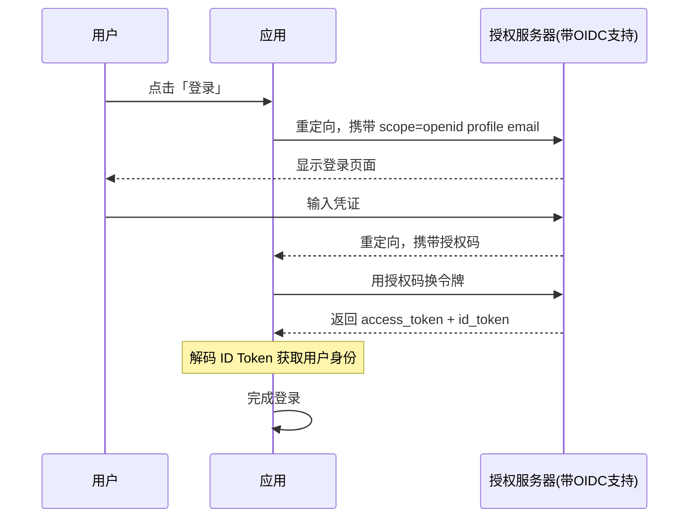

OAuth 2.0 解决了「授权」问题：**第三方应用可以访问你的 Google Drive 文档，但 Google 不知道你是谁。** 你把文件分享给了某个持有有效令牌的应用，但这个应用只知道拿到了文件访问权，不知道这代表的是谁的身份。

OpenID Connect（简称 OIDC）填补了这个空白。它在 OAuth 2.0 之上添加了身份认证层，让应用不仅能获取用户的资源访问权限，还能获取用户的身份信息。**OIDC = OAuth 2.0 + 身份层。**

## 一、为什么需要 OIDC

OAuth 2.0 的核心是授权，授权的结果是访问令牌（Access Token）。访问令牌代表的是「用户授权这个应用访问某些资源」，但它不回答「这个用户到底是谁」。

考虑一个实际场景：用户使用「使用 Google 登录」功能。如果使用纯 OAuth 2.0，应用拿到 Access Token 后，只能用这个 Token 调用 Google 的 API 获取用户信息。但这里存在几个问题：应用需要额外调用一个 API 才能获取用户身份，延迟增加；如果 Google 没有提供用户信息 API，或者 API 格式不符合应用期望，实现就会很麻烦；如果应用需要验证用户的邮箱是否已验证、用户的生日是否大于 18 岁，这些信息在 OAuth 2.0 中无法标准化地获取。

OIDC 的解决方案是在 OAuth 2.0 流程中额外返回一个 **ID Token**。ID Token 是一个特殊的令牌，包含用户的身份信息，格式为 JWT。应用收到 ID Token 后，可以立即知道用户是谁，不需要额外调用 API。



## 二、OIDC 的三个核心流程

OIDC 构建在 OAuth 2.0 之上，复用了 OAuth 2.0 的授权流程，但在响应中增加了 ID Token。OIDC 定义了三种授权流程：

**Authorization Code Flow**（授权码流程）是 OIDC 的标准流程，适用于有后端服务的 Web 应用。流程与 OAuth 2.0 授权码流程完全一致，但要求请求中包含 `scope=openid`。响应中除 Access Token 外，还包含 ID Token。

**Implicit Flow**（隐式流程）曾是 SPA 的选择，但由于安全问题已被 OIDC Core 规范废弃。隐式流程在响应中直接返回 Access Token 和 ID Token，通过 URL 片段传递。2028 年后，OIDC 将不再支持此流程。

**Hybrid Flow**（混合流程）结合了授权码和隐式流程的特点。部分令牌通过 URL 片段返回（ID Token 或 Access Token），其余通过后端兑换。混合流程出现在 OIDC 规范早期，现在已不推荐。

当前最佳实践是**授权码流程 + PKCE**，无论 OAuth 2.0 还是 OIDC。

## 三、ID Token 的结构与验证

ID Token 是 OIDC 的核心，它是一个经过签名的 JWT，包含用户身份信息和元数据。

**JWT 结构回顾**：JWT 由三部分组成，用点号分隔。Header 是 JSON，包含令牌类型和签名算法；Payload 是 JSON，包含 Claims；Signature 是签名结果。

**ID Token 的标准 Claims**：

| Claim | 说明 |
|---|---|
| `iss` | 签发者，授权服务器的 Issuer |
| `sub` | Subject，用户唯一标识符 |
| `aud` | 受众，应用的 Client ID |
| `exp` | 过期时间，Unix 时间戳 |
| `iat` | 签发时间，Unix 时间戳 |
| `auth_time` | 用户认证时间 |
| `nonce` | 防重放攻击的随机数 |

```json title="ID Token Payload 示例"
{
  "iss": "https://auth.example.com/realms/demo",
  "sub": "95ecc380-afe9-11e4-9b6d-70011522d62d",
  "aud": "my-app-client-id",
  "exp": 1709875200,
  "iat": 1709871600,
  "auth_time": 1709871595,
  "nonce": "RANDOM_STATE_VALUE_32BYTES"
}
```

**ID Token 的验证流程**：

```java title="IdTokenValidator.java"
import java.nio.charset.StandardCharsets;
import java.security.KeyFactory;
import java.security.PublicKey;
import java.security.spec.X509EncodedKeySpec;
import java.util.Base64;
import java.util.Map;

public class IdTokenValidator {
    
    public record TokenClaims(
        String subject,
        String issuer,
        String audience,
        long expiresAt,
        long issuedAt,
        long authTime
    ) {}
    
    public TokenClaims validate(
            String idToken,
            String expectedIssuer,
            String expectedAudience,
            String expectedNonce,
            PublicKey signingKey) throws Exception {
        
        String[] parts = idToken.split("\\.");
        if (parts.length != 3) {
            throw new IllegalArgumentException("Invalid token format");
        }
        
        Map<String, Object> header = parseJson(decodeBase64Url(parts[0]));
        Map<String, Object> payload = parseJson(decodeBase64Url(parts[1]));
        String signature = parts[2];
        
        String algorithm = (String) header.get("alg");
        if (!algorithm.startsWith("RS")) {
            throw new SecurityException("Only RSA algorithms are allowed for ID Token");
        }
        
        String payloadJson = parts[0] + "." + parts[1];
        byte[] payloadBytes = payloadJson.getBytes(StandardCharsets.UTF_8);
        byte[] signatureBytes = decodeBase64Url(signature);
        
        if (!verifySignature(payloadBytes, signatureBytes, signingKey, algorithm)) {
            throw new SecurityException("Invalid signature");
        }
        
        String issuer = (String) payload.get("iss");
        if (!issuer.equals(expectedIssuer)) {
            throw new SecurityException("Invalid issuer");
        }
        
        String aud = (String) payload.get("aud");
        if (!aud.equals(expectedAudience)) {
            throw new SecurityException("Invalid audience");
        }
        
        long exp = ((Number) payload.get("exp")).longValue();
        if (exp * 1000L < System.currentTimeMillis()) {
            throw new SecurityException("Token expired");
        }
        
        if (expectedNonce != null) {
            String nonce = (String) payload.get("nonce");
            if (!expectedNonce.equals(nonce)) {
                throw new SecurityException("Invalid nonce");
            }
        }
        
        return new TokenClaims(
            (String) payload.get("sub"),
            issuer,
            aud,
            exp,
            ((Number) payload.get("iat")).longValue(),
            payload.containsKey("auth_time") 
                ? ((Number) payload.get("auth_time")).longValue() 
                : 0
        );
    }
    
    private byte[] decodeBase64Url(String input) {
        return Base64.getUrlDecoder().decode(input);
    }
    
    private Map<String, Object> parseJson(byte[] bytes) {
        // 简化实现，实际应使用 Jackson 或 Gson
        return Map.of();
    }
    
    private boolean verifySignature(
            byte[] data, byte[] signature, 
            PublicKey key, String algorithm) {
        // 实际实现使用 Signature 类验证
        return true;
    }
}
```

## 四、UserInfo Endpoint

ID Token 包含了最基本的身份信息，但 OIDC 还定义了 UserInfo Endpoint，允许应用获取更完整的用户资料。

UserInfo Endpoint 是授权服务器提供的 API，通过 Access Token 访问（而非 ID Token）。请求返回包含用户 Claims 的 JSON 对象。

```java title="UserInfoClient.java"
import java.net.URI;
import java.net.http.HttpClient;
import java.net.http.HttpRequest;
import java.net.http.HttpResponse;
import java.util.Map;

public class UserInfoClient {
    
    private final HttpClient httpClient;
    private final URI userInfoEndpoint;
    
    public UserInfoClient(HttpClient httpClient, URI userInfoEndpoint) {
        this.httpClient = httpClient;
        this.userInfoEndpoint = userInfoEndpoint;
    }
    
    public Map<String, Object> getUserInfo(String accessToken) throws Exception {
        HttpRequest request = HttpRequest.newBuilder()
            .uri(userInfoEndpoint)
            .header("Authorization", "Bearer " + accessToken)
            .GET()
            .build();
        
        HttpResponse<String> response = httpClient.send(
            request, HttpResponse.BodyHandlers.ofString());
        
        if (response.statusCode() == 200) {
            return parseJson(response.body());
        }
        throw new RuntimeException("UserInfo request failed: " + response.statusCode());
    }
}
```

UserInfo Endpoint 返回的标准 Claims 包括：`name`（用户全名）、`given_name`（名）、`family_name`（姓）、`email`（邮箱）、`email_verified`（邮箱是否已验证）、`picture`（头像 URL）等。

## 五、Discovery 文档与配置

OIDC 定义了 Discovery 机制，允许客户端自动发现授权服务器的配置信息，而无需硬编码各种端点 URL。

Discovery 文档是一个 JSON 文件，通过 `/.well-known/openid-configuration` 端点获取。

```json title="openid-configuration 示例"
{
  "issuer": "https://auth.example.com/realms/demo",
  "authorization_endpoint": "https://auth.example.com/realms/demo/protocol/openid-connect/auth",
  "token_endpoint": "https://auth.example.com/realms/demo/protocol/openid-connect/token",
  "userinfo_endpoint": "https://auth.example.com/realms/demo/protocol/openid-connect/userinfo",
  "jwks_uri": "https://auth.example.com/realms/demo/protocol/openid-connect/certs",
  "response_types_supported": ["code", "none", "id_token", "token"],
  "subject_types_supported": ["public"],
  "id_token_signing_alg_values_supported": ["RS256"],
  "scopes_supported": ["openid", "profile", "email"],
  "token_endpoint_auth_methods_supported": ["client_secret_basic", "client_secret_post"],
  "claims_supported": ["sub", "iss", "auth_time", "acr", "name", "email"]
}
```

通过 Discovery 文档，OIDC 客户端可以：动态发现授权服务器的所有端点；获取支持的签名算法列表；了解支持的 Claims 范围；验证授权服务器的配置是否符合预期。

## 六、Claims 与 Scope 的关系

OIDC 中，Scope 和 Claims 有对应关系。请求不同的 Scope，会获得不同的 Claims。

| Scope | 返回的 Claims |
|---|---|
| `openid` | `sub`（必须） |
| `profile` | `name`, `family_name`, `given_name`, `preferred_username`, `picture`, `gender`, `birthdate`, `locale`, `updated_at` |
| `email` | `email`, `email_verified` |
| `phone` | `phone_number`, `phone_number_verified` |
| `address` | `address`（完整地址对象） |

应用在发起授权请求时，应该只请求自己需要的 Scope，既减少用户授权页面的信息量，也降低信息泄露的风险。

:::tip 最佳实践
最小化 Scope 请求原则：只请求应用真正需要的 Claims。如果只需要用户标识，使用 `openid` 就够了；如果需要邮箱，再加 `email` Scope。不必要的 Scope 会被用户视为隐私侵犯，影响信任度。
:::

---

## 思考题

**问题 1**：ID Token 和 Access Token 都可以在 OIDC 流程中获得，它们有什么区别？各自的使用场景是什么？

<details>
<summary>参考答案</summary>

核心区别在于用途。ID Token 是身份凭证，专门用于告诉应用「当前用户是谁」，格式为 JWT，包含用户的身份信息（sub、name、email 等）。Access Token 是资源访问凭证，用于向资源服务器 API 请求用户数据，格式可以是 JWT 也可以是不透明字符串，包含授权信息（scope、client_id 等。实际使用：ID Token 用于应用判断用户身份、建立本地会话、展示用户信息；Access Token 用于调用 Google API、GitHub API 等需要访问用户数据的场景。两者可能同时存在，各自承担不同职责。
</details>

**问题 2**：OIDC 的 `nonce` 参数用于防止重放攻击。请分析：nonce 是如何工作的？为什么隐式流程中 nonce 尤为重要？授权码流程是否也需要 nonce？

<details>
<summary>参考答案</summary>

nonce 工作流程：客户端在发起授权请求时生成随机字符串，包含在请求中；授权服务器将 nonce 包含在 ID Token 中返回；客户端收到 ID Token 后，验证 ID Token 中的 nonce 与自己生成的是否一致。如果不一致，说明 ID Token 被重放或伪造。隐式流程中 nonce 尤为重要，因为 ID Token 通过 URL 片段返回，可能被记录在浏览器历史记录、Referer 头、服务器日志中，攻击者有机会获取这些 URL 并提取 ID Token。授权码流程中，ID Token 通过后端到后端的 `/token` 端点返回，不会暴露在前端渠道，安全性更高。但授权码流程中，如果存在其他风险（如授权码被截获），nonce 仍能提供额外保护。所以 OIDC 最佳实践是无论哪种流程都使用 nonce。
</details>
