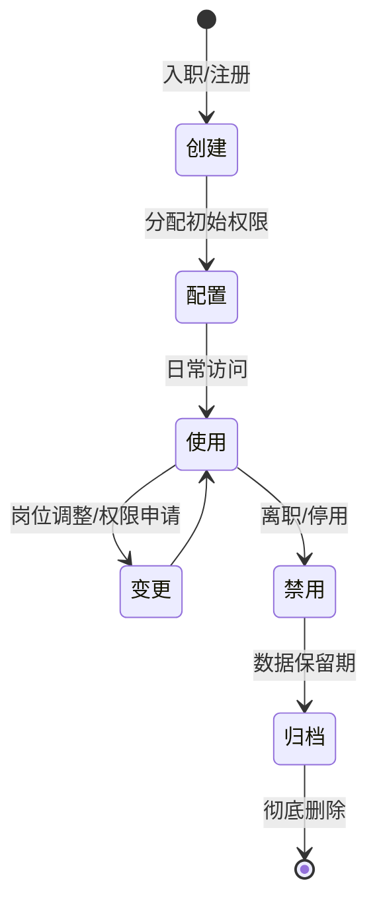
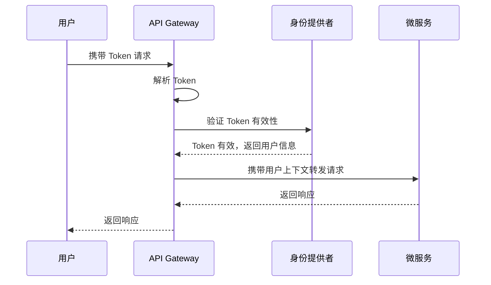

凌晨两点，某金融系统的安全运营中心突然告警：发现 3000 个异常登录尝试，全部来自同一个被攻陷的内部账号。安全团队紧急响应，却发现这个账号拥有「超级管理员」权限，可以访问核心账务系统。事后复盘发现，这个账号的创建时间是三年前，创建者早已离职，但账号从未被清理。

这个场景揭示了一个残酷的事实：**大多数安全事件的根源不是外部黑客入侵，而是身份与访问管理的失控。** gartner 数据显示，超过 80% 的数据泄露与身份相关的漏洞有关。iam 不是锦上添花的安全组件，而是整个安全架构的基石。

## 一、IAM 的定义与核心概念

身份与访问管理（Identity and Access Management，简称 IAM）是用于管理数字身份全生命周期的框架、方法论和技术系统的总称。它的核心目标是确保「正确的人，在正确的时间，以正确的方式，访问正确的资源」。

理解 IAM 需要掌握五个核心概念：

**身份（Identity）** 是指在数字系统中唯一标识一个实体（用户、服务、设备或组织）的属性集合。一个自然人可能拥有多个身份：工作邮箱、个人邮箱、社保账号、手机号码。每个身份都由一组属性定义，如姓名、工号、部门、角色。

**凭证（Credential）** 是用于验证身份真实性的数据。常见的凭证包括密码、数字证书、API 密钥、生物特征等。凭证与身份的关系就像钥匙与锁：只有持有正确凭证的人，才能证明自己就是声称的那个身份。

**认证（Authentication）** 是验证凭证有效性的过程，简称 AuthN。当用户输入密码时，系统会验证密码是否与存储的哈希值匹配；当用户使用指纹解锁手机时，传感器会验证指纹特征是否与注册的模板一致。认证回答的问题是「你是谁？」

**授权（Authorization）** 是在认证通过后，决定身份可以访问哪些资源的過程，简称 AuthZ。授权回答的问题是「你能做什么？」同一个认证通过的用户，根据其角色或权限级别，可能被授予或拒绝访问特定的资源。

**审计（Audit）** 是对身份和访问行为进行记录、监控和审查的过程。审计日志是事后追溯和安全合规的基础，没有审计的授权是无根之木。

## 二、身份生命周期管理

身份不是静态的，它从创建到消亡经历一个完整的生命周期。有效的身份生命周期管理是 IAM 系统的核心能力。

**创建阶段** 需要建立身份与真实个体的映射关系。对于员工，通常与 HR 系统同步；对于外部用户，可能通过自助注册流程创建。无论哪种方式，都需要建立身份验证机制确保身份的真实性。

**配置阶段** 根据身份的类型、岗位、部门等因素，分配初始的访问权限。这个阶段最容易出现权限过宽的问题：新员工入职时，为了避免「账号用不了」的投诉，管理员往往会一次性授予大量权限，形成「权限堆积」。

**使用阶段** 是身份生命周期中最长的阶段。用户的访问行为持续发生，系统需要持续验证权限、记录日志、处理权限变更请求。

**变更阶段** 包括权限的增删改查。当用户岗位调整时，需要及时回收旧权限、授予新权限。变更的及时性直接影响安全态势——研究表明，75% 的内部威胁发生在员工提出离职后的两周内。

**禁用阶段** 是身份生命周期的终结点。离职、转岗、合同到期都需要及时禁用账号。但实践中，很多系统的禁用操作并不彻底：账号禁用后，相关的 API Token、OAuth 应用授权、SSH Key 可能仍然有效。

**归档与删除阶段** 涉及数据的合规保留和最终销毁。不同法规对数据保留期限有不同要求（GDPR 要求在合理期限内删除，金融行业可能要求保留更长时间），需要在合规和成本之间取得平衡。

## 三、IAM 系统的核心组件

一个完整的 IAM 系统由多个相互协作的组件构成：

**身份提供者（Identity Provider，IdP）** 是管理身份信息的核心系统。IdP 负责用户身份数据的存储、认证逻辑的执行、以及身份断言的签发。常见的 IdP 包括 Keycloak、Okta、Azure AD、以及企业自建的 IdP 系统。

**目录服务（Directory Service）** 是存储和组织身份数据的底层服务。LDAP（Lightweight Directory Access Protocol）是最成熟的目录服务协议，Active Directory 则是 Windows 域环境中的事实标准。目录服务不仅存储用户信息，还管理组、联系人、组织单元等对象。

**策略引擎（Policy Engine）** 负责执行授权决策。当访问请求到达时，策略引擎会根据预定义的策略规则，结合请求上下文（用户身份、资源类型、操作类型、时间、地点、设备状态等）做出允许或拒绝的决策。

**凭证管理（Credential Management）** 系统负责凭证的整个生命周期：生成、存储、轮换、撤销。对于密码，需要管理密码策略（复杂度、有效期、历史记录）；对于证书，需要管理证书颁发、续期和吊销流程。

**单点登录（SSO）网关** 允许用户使用一组凭证访问多个应用。SSO 降低了用户记忆多套密码的负担，同时为企业提供了集中的身份管理入口。

**审计日志系统** 记录所有与身份和访问相关的安全事件。完整的审计日志应包括：谁（Who）在什么时间（When）从什么地方（Where）用什么设备（Which）访问了什么资源（What），结果是成功还是失败。

## 四、IAM 在现代架构中的地位

云原生和微服务的兴起深刻改变了 IAM 的角色定位。

在传统的单体架构中，应用自带用户管理和权限控制逻辑。每个系统维护自己的用户表，自行实现认证授权。这种模式的问题在于：用户需要在每个系统中注册账号，密码策略参差不齐，权限管理分散导致安全风险无法统一管控。

微服务架构要求身份逻辑的「中央集权」。当系统被拆分为数十甚至数百个服务时，每个服务都实现一套认证授权是不现实的。更合理的做法是将身份逻辑抽取为独立的服务（Sidecar 或 Gateway 模式），所有服务都依赖这个共享的身份服务进行访问控制。

**零信任架构** 将 IAM 推向新的高度。传统模型假设内网是可信的，防火墙内部是安全的；零信任模型则假设任何网络位置都不可信，每次访问都需要验证。身份成为零信任的核心：从「在防火墙内」变成「你是谁、你用的是什么设备、你现在在哪里」。

**服务间认证** 是微服务时代的新挑战。当服务 A 调用服务 B 时，如何确认请求确实来自 A 而不是被伪造？mTLS（Mutual TLS）通过双向证书验证解决这个问题。SPIFFE（Secure Production Identity Framework for Everyone）提供了一种标准化的服务身份方案，每个服务获得唯一的加密身份，消除了手动管理证书的复杂性。

**API 安全** 要求将 IAM 能力暴露为服务。OAuth 2.0 和 OpenID Connect 成为 API 授权的事实标准。API 网关不仅做路由，还需要验证访问令牌、检查 Scope、处理令牌轮换。

---

## 思考题

**问题 1**：在微服务架构中，如果将身份服务部署为独立的 Gateway，所有的身份验证都经过它，会不会成为单点故障？有哪些高可用设计方案可以缓解这个问题？

参考答案

常见的解决方案包括：多实例部署 + 负载均衡，确保任意实例故障时有其他实例接管；令牌采用分布式存储（如 Redis 集群），避免本地缓存失效；使用死信队列处理认证失败后的重试；实现降级策略，在身份服务不可用时根据历史决策进行有限度的放行或严格拒绝。关键是确保身份服务本身不成为性能瓶颈，同时保证故障时的优雅降级。

**问题 2**：为什么很多企业在实施 IAM 时会遇到很大的阻力？从组织和技术两个角度分析原因，以及可能的应对策略。

参考答案

组织层面：IAM 涉及权限的重新分配，会触动既得利益者（拥有过多权限的管理员、业务负责人等），引发抵触情绪；不同部门对安全优先级的认知不同，IT 部门关注安全，业务部门关注效率。技术层面：遗留系统改造复杂，很多老系统没有标准化的身份接口，改造成本高； IAM 系统的配置复杂，权限模型的抽象与业务需求之间存在 Gap。应对策略是采用渐进式改造，先从不敏感的系统和部门试点；为业务部门提供清晰的效率提升价值；选择兼容性好的 IAM 方案降低集成成本。

