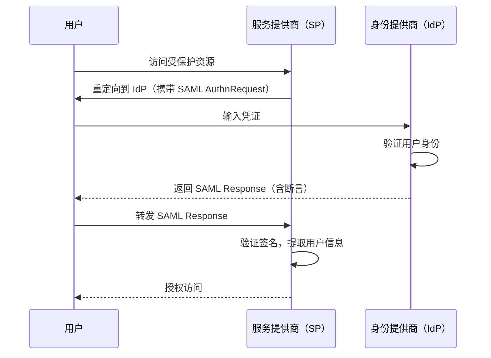
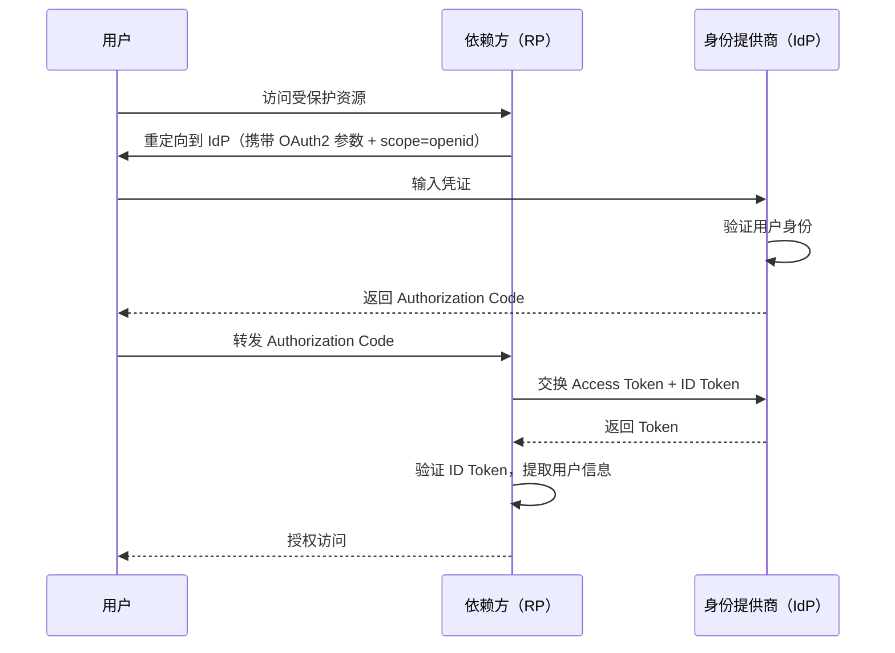
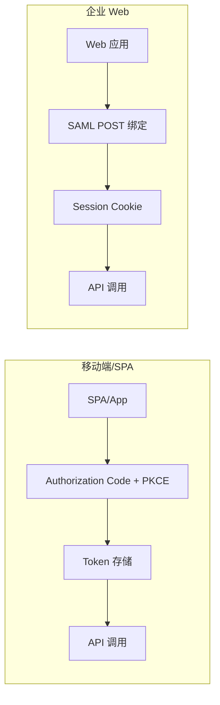
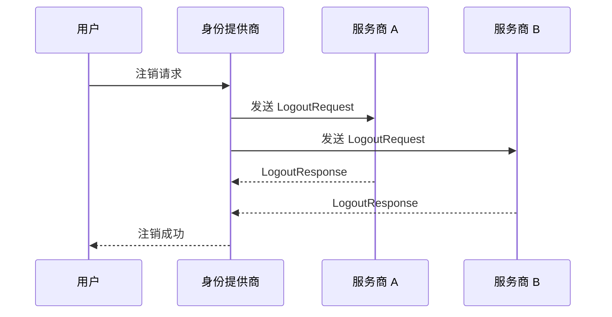
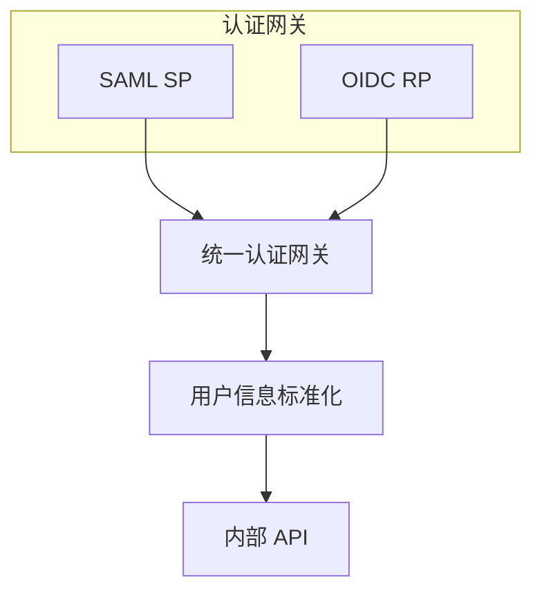

2010 年，某大型银行决定从传统 SSO 方案迁移到现代身份认证协议。团队花了三个月对比 SAML 和 OIDC，最终选择了 SAML——因为他们当时觉得 SAML 更成熟、更适合企业环境。五年后，他们发现新开发的移动 App 和 SPA 应用根本无法使用这套认证体系，不得不重新改造。

这个故事告诉我们：SAML 和 OIDC 的选择，不是选「更好的协议」，而是选「更适合业务场景的协议」。

## 一、协议架构对比

### SAML 的 XML 世界

SAML（Security Assertion Markup Language）诞生于 2001 年，采用 XML 作为数据格式。它的核心是**断言（Assertion）**——由身份提供商（IdP）签发的关于用户身份的 XML 文档。



SAML 的请求和响应都是 XML 文档，需要 XML 解析、签名验证、断言解析等复杂处理。

### OIDC 的 JSON 世界

OIDC（OpenID Connect）是 2014 年在 OAuth 2.0 基础上扩展的身份层协议，采用 JSON 作为数据格式。它本质上是一个带身份认证功能的 OAuth 2.0。



OIDC 的核心是 **ID Token**——一个带有用户身份信息的 JWT，以及用于获取用户信息的 **UserInfo Endpoint**。

### 核心架构差异

| 维度 | SAML 2.0 | OIDC |
|------|----------|------|
| 数据格式 | XML | JSON |
| 协议层次 | 独立协议 | OAuth 2.0 的扩展 |
| 身份断言 | SAML Assertion | ID Token（JWT） |
| 元数据 | XML Metadata | JWKS（JSON Web Key Set） |
| 签名算法 | XML Signature（HMAC/RSA） | JWT（HMAC/RSA/ECDSA） |

## 二、安全性对比

### SAML 的安全机制

SAML 的安全性建立在 XML 签名和 XML 加密之上：

**签名机制**：SAML Response 中的断言必须被 IdP 签名，SP 通过验证签名确认断言的真实性和完整性。支持的签名算法包括 HMAC-SHA、RSA-SHA、DSA-SHA 等。

**加密机制**：可选的 SAML 加密可以对整个断言或特定属性进行加密，防止中间人攻击窃取用户信息。

**时间戳与断言ID**：SAML 断言包含 `NotBefore` 和 `NotOnOrAfter` 时间限制，以及唯一 `AssertionID`，用于防止重放攻击。

### OIDC 的安全机制

OIDC 的安全性继承自 OAuth 2.0，并增加了 ID Token 的验证：

**ID Token 验证**：RP 必须验证 ID Token 的签名（使用 IdP 的公钥）、`iss`（签发者）、`aud`（受众）、`exp`（过期时间）、`iat`（签发时间）等 Claims。

**State 和 Nonce**：使用 `state` 参数防止 CSRF 攻��，`nonce` 参数防止重放攻击。

**PKCE**：OAuth 2.0 的 PKCE（Proof Key for Code Exchange）扩展可以防止授权码截获攻击。

### 安全特性对比

| 安全特性 | SAML | OIDC |
|----------|------|------|
| 签名验证 | XML Signature | JWT 签名 |
| 加密 | XML Encryption | JWE（可选） |
| 重放防护 | AssertionID + 时间戳 | Nonce + 时间戳 |
| CSRF 防护 | SAML Request/Response 绑定 | State 参数 |
| 中间人防护 | SOAP over TLS | Token via TLS |
| 密钥轮转 | 需要重新配置元数据 | JWKS 自动轮转 |

## 三、移动端和 SPA 的适用性

### SAML 的历史负担

SAML 设计于 2000 年代初期，当时的主要场景是企业 web 应用。它的 XML 格式和处理方式在现代应用中有明显劣势：

**包体问题**：XML 文档通常比 JSON 大 2-3 倍，在移动网络环境下增加延迟和流量消耗。

**解析复杂度**：移动端和浏览器环境解析 XML 需要额外的库，增加应用包体和初始化时间。

**重定向流程**：SAML 的 POST 绑定需要浏览器提交表单，SAML Redirect 绑定需要 URL 参数拼接，长 URL 可能在某些移动浏览器中出现问题。

### OIDC 的现代适配

OIDC 在设计时就考虑了移动端和 SPA 的需求：

**轻量级**：JSON 格式更小，JWT 解析可以直接用标准 base64 解码，不需要完整的 XML 解析器。

**Token 存储**：Access Token 可以存储在内存中或使用安全的存储机制，不需要维护会话 cookie。

**后端通道**：Authorization Code + PKCE 流程适合 SPA，code 在浏览器中交换 token，整个过程不需要暴露 client secret。



## 四、单点登出（SLO）的实现差异

### SAML 的 SLO

SAML 提供了完整的 SLO（Single Logout）机制，包括：

**SP-Initiated SLO**：用户从某个 SP 注销，请求被发送到 IdP，IdP 通知所有已认证的 SP 注销。

**IdP-Initiated SLO**：用户在 IdP 注销，IdP 向所有已会话的 SP 发送 LogoutRequest。



SAML SLO 的挑战：所有 SP 必须实现 SLO 端点并正确处理 LogoutRequest，任何一个 SP 不响应都会导致会话状态不一致。

### OIDC 的 SLO

OIDC 的 SLO 机制相对简单：

**Session 管理**：OIDC 没有定义标准的 SLO 协议，各 IdP 实现不一致。有的通过 `end_session_endpoint` 实现单点登出，有的则需要手动在各个 RP 登出。

**Token 撤销**：OIDC 提供 Token Revocation Endpoint（RFC 7009），可以撤销 Access Token 和 Refresh Token。

**Front-Channel Logout**：OIDC 1.0 规范定义了 Front-Channel Logout，通过 iframe 方式通知 RP 登出。

```java title="OIDC Session 管理示例"
@Configuration
public class SecurityConfig {
    @Bean
    public SecurityFilterChain filterChain(HttpSecurity http) throws Exception {
        http.oauth2Login(oauth2 -> oauth2
            .and()
            .logout(logout -> logout
                .logoutSuccessHandler(oidcLogoutSuccessHandler())
            )
        );
        return http.build();
    }
    
    @Bean
    public OidcClientInitiatedLogoutSuccessHandler oidcLogoutSuccessHandler() {
        OidcClientInitiatedLogoutSuccessHandler handler = 
            new OidcClientInitiatedLogoutSuccessHandler(clientRegistrationRepository);
        handler.setPostLogoutRedirectUri(URI.create("/"));
        return handler;
    }
}
```

### SLO 特性对比

| 维度 | SAML | OIDC |
|------|------|------|
| SLO 协议 | 标准化（POST/Redirect 绑定） | 非标准化，各 IdP 差异大 |
| 前端通道登出 | FrontChannelLogout | end_session_endpoint |
| 后端通道登出 | BackChannelLogout | Token Revocation |
| 会话状态同步 | 强一致性 | 依赖实现 |

## 五、选型决策矩阵

### 场景一：传统企业应用

**推荐方案**：SAML 2.0

**理由**：
- 大多数企业 SSO 产品（Okta、Azure AD、CA Siteminder）都支持 SAML
- 现有应用可能已经有 SAML 集成
- 企业 IdP 可能不支持 OIDC

**典型场景**：
- SAP、Salesforce、Workday 等企业 SaaS 集成
- 传统 ERP、CRM 系统
- 需要兼容历史 SSO 配置

### 场景二：现代 Web 应用和移动 App

**推荐方案**：OIDC

**理由**：
- JSON 更轻量，适合移动网络
- JWT 验证简单，无需 XML 解析器
- OAuth 2.0 生态系统丰富
- 移动端 SDK 支持完善

**典型场景**：
- React/Vue/Angular SPA
- iOS/Android 原生应用
- React Native/Flutter 跨平台应用
- 微服务架构的 API 认证

### 场景三：多协议共存

**推荐方案**：同时支持 SAML 和 OIDC

**理由**：
- 企业内部系统使用 SAML
- 合作伙伴使用 OIDC
- 移动 App 需要 OIDC

**实现方案**：使用支持多种协议的认证网关（如 Keycloak、Auth0），统一处理不同协议，将身份信息标准化后传递给后端服务。



## 六、从 SAML 迁移到 OIDC 的路径

### 迁移策略

**阶段一：并行运行**

在现有 SAML IdP 基础上，新增 OIDC 支持。用户认证入口保持不变，SP 根据用户来源选择协议。

**阶段二：新应用试点**

新开发的移动 App 和 SPA 应用使用 OIDC，企业 Web 应用保持 SAML。积累 OIDC 运营经验。

**阶段三：逐步迁移**

将企业 Web 应用分批从 SAML 迁移到 OIDC。每个应用迁移时确保与现有 SAML 应用的会话兼容性。

**阶段四：统一 IdP**

最终实现统一的 OIDC IdP，SAML 作为兼容层或完全废弃。

### 迁移注意事项

**用户标识统一**：确保 SAML 和 OIDC 使用相同的用户标识（sub claim 或 email），避免用户需要重新注册。

**会话映射**：设计会话映射机制，用户在 SAML 登出时自动在 OIDC 会话中登出，反之亦然。

**权限同步**：SAML 属性和 OIDC scope/claim 之间需要映射关系，确保权限一致。

**应用兼容性评估**：不是所有应用都能平滑迁移，评估每个应用的协议适配成本。

```java title="SAML 属性到 OIDC Claims 映射示例"
@Component
public class ClaimMapper {
    
    public Map<String, Object> mapSamlAttributesToClaims(
            Map<String, List<String>> samlAttributes) {
        
        Map<String, Object> claims = new HashMap<>();
        
        // SAML attribute -> OIDC claim 映射
        claims.put("sub", samlAttributes.get("urn:oid:0.9.2342.19200300.100.1.1").get(0));
        claims.put("name", samlAttributes.get("displayName").get(0));
        claims.put("email", samlAttributes.get("mail").get(0));
        
        // 角色映射
        List<String> groups = samlAttributes.get("memberOf");
        claims.put("groups", extractGroups(groups));
        
        return claims;
    }
    
    private List<String> extractGroups(List<String> memberOf) {
        // 从 DN 中提取组名
        return memberOf.stream()
            .map(dn -> dn.replaceAll(".*CN=([^,]+).*", "$1"))
            .collect(Collectors.toList());
    }
}
```

---

## 思考题

**问题 1**：为什么很多大型企业在迁移到 OIDC 后，反而遇到了更多的安全问题？请分析可能的原因。

<details>
<summary>参考答案</summary>

**可能的原因分析**：

1. **Token 存储不当**：开发者习惯将 Access Token 存储在 localStorage，而 localStorage 容易受到 XSS 攻击窃取。相比之下，SAML 的 POST 绑定天然要求 Session Cookie，更难被 JavaScript 访问。

2. **Scope 过度授权**：为了简化开发，开发者可能申请了过大的 OAuth Scope（如 `offline_access` 或过多的 `resource`），导致 Token 权限过大。

3. **状态参数验证缺失**：忘记验证 `state` 参数或 `nonce`，导致 CSRF 和重放攻击。

4. **Token 不过期**：Access Token 过期时间设置过长，或 Refresh Token 永不过期，增加了 Token 泄露的风险窗口。

5. **Client Secret 泄露**：SPA 应用中嵌入 Client Secret（应该使用 PKCE 而不是依赖 Client Secret）。

**解决方案**：严格遵循 OIDC 安全最佳实践，使用 HttpOnly Cookie 存储 Token，实施 Token 轮转机制。

</details>

**问题 2**：如果你的系统需要同时支持 SAML 和 OIDC 两种协议，认证网关应该如何设计？请描述核心组件和数据流。

<details>
<summary>参考答案</summary>

**认证网关设计**：

```
核心组件：
1. 协议适配层
   - SAML Handler：处理 SAML AuthnRequest/Response
   - OIDC Handler：处理 Authorization Code 交换、Token 验证
   
2. 身份标准化层
   - 用户信息抽象：从不同��议提取统一格式的用户信息
   - 属性映射：SAML Attribute -> OIDC Claim 映射表
   
3. 会话管理层
   - 统一会话存储：关联不同协议的会话
   - SLO 协调器：同步不同协议的登出事件
   
4. 信任链管理层
   - 元数据管理：IdP 元数据的获取和缓存
   - 密钥轮转：处理密钥更新
```

**数据流**：

```mermaid
sequenceDiagram
    participant User as 用户
    participant Gateway as 认证网关
    participant IdP1 as SAML IdP
    participant IdP2 as OIDC IdP
    participant Backend as 后端服务
    
    User->>Gateway: 认证请求
    Gateway->>Gateway: 确定协议类型
    alt SAML 请求
        Gateway->>IdP1: SAML AuthnRequest
        IdP1-->>Gateway: SAML Response
        Gateway->>Gateway: 验证断言
    else OIDC 请求
        Gateway->>IdP2: OIDC 授权请求
        IdP2-->>Gateway: Authorization Code
        Gateway->>IdP2: 交换 Token
        IdP2-->>Gateway: ID Token + Access Token
        Gateway->>Gateway: 验证 Token
    end
    Gateway->>Gateway: 标准化用户信息
    Gateway->>Backend: 统一 Token/Session
```



**关键设计点**：

1. 会话关联：同一个用户在 SAML 和 OIDC 下可能有不同标识符，需要建立映射表
2. SLO 一致性：当用户在任一协议下登出时，通知所有相关的会话
3. 协议协商：根据请求头或 URL 模式判断使用哪种协议

</details>
