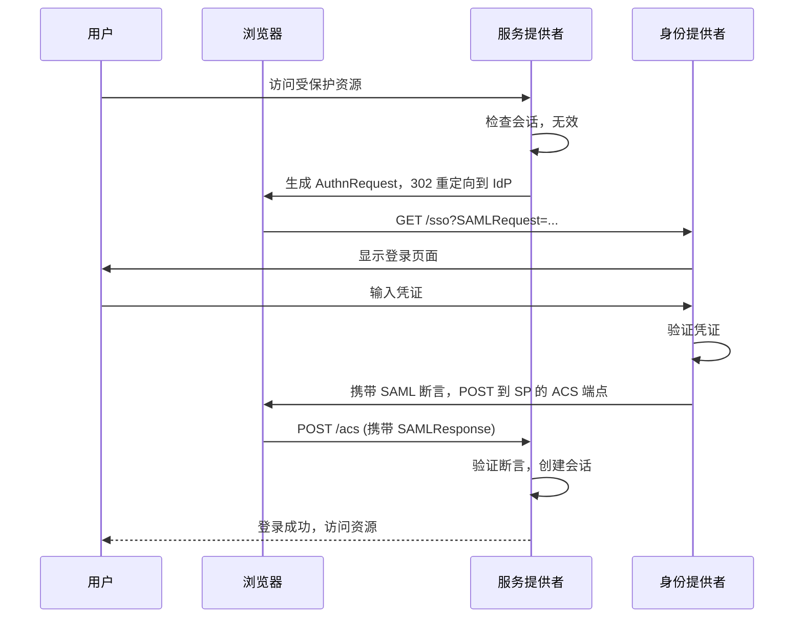

2005 年，美国军方部署了基于 SAML 2.0 的联合身份系统，让士兵可以使用统一凭证访问多个军事系统。这个系统运行了将近 20 年，直到云原生时代来临，才开始面临新的挑战。

SAML 2.0（Security Assertion Markup Language）在企业身份管理领域曾是不可撼动的标准。它支撑了无数大型组织的单点登录，让不同安全域的用户可以安全地互操作。但随着 Web 架构从服务器端渲染转向前后端分离，从大型单体应用转向微服务，SAML 2.0 的局限性开始显现。

**理解 SAML 2.0 的设计哲学和适用场景，对于构建企业级身份架构仍然至关重要。**

## 一、SAML 2.0 的历史背景

SAML 起源于 1990 年代末期的大型企业。当时，企业内部有多个独立的身份管理系统，员工在每个系统都有独立的账号。1999 年，IBM 和 Microsoft 联合开发了 SAML 的前身；2001 年，OASIS 组织开始标准化工作；2005 年，SAML 2.0 正式发布，成为跨域身份认证的事实标准。

SAML 的诞生是为了解决「企业间身份互信」问题。当公司 A 需要让公司 B 的员工访问自己的系统时，如何安全地建立信任？SAML 定义了一种标准化的断言格式，让 IdP 可以向 SP 证明「这个用户已经在我这里认证过了」。

SAML 2.0 由多个规范组成：Core 定义断言格式和协议；Profiles 定义如何使用 Bindings；Bindings 定义如何传输断言；Metadata 定义如何交换配置信息。

## 二、核心概念解析

**Assertion（断言）** 是 SAML 的核心。断言是 IdP 签发的 XML 文档，证明「关于某个用户的一组声明」。断言包含用户的身份信息、认证上下文、授权决策等。

断言的主体结构：

```xml title="SAML Assertion 示例"
<saml:Assertion Version="2.0">
  <saml:Issuer>https://idp.example.com</saml:Issuer>
  <ds:Signature>...</ds:Signature>
  <saml:Subject>
    <saml:NameID Format="urn:oasis:names:tc:SAML:1.1:nameid-format:emailAddress">
      user@example.com
    </saml:NameID>
    <saml:SubjectConfirmation Method="urn:oasis:names:tc:SAML:2.0:cm:bearer">
      <saml:SubjectConfirmationData NotOnOrAfter="2024-01-01T00:00:00Z"
        Recipient="https://sp.example.com/saml/sso"/>
    </saml:SubjectConfirmation>
  </saml:Subject>
  <saml:Conditions NotBefore="2023-12-01T00:00:00Z"
    NotOnOrAfter="2024-01-01T00:00:00Z">
    <saml:AudienceRestriction>
      <saml:Audience>https://sp.example.com</saml:Audience>
    </saml:AudienceRestriction>
  </saml:Conditions>
  <saml:AuthnStatement AuthnInstant="2023-12-01T10:00:00Z">
    <saml:AuthnContext>
      <saml:AuthnContextClassRef>
        urn:oasis:names:tc:SAML:2.0:ac:classes:PasswordProtectedTransport
      </saml:AuthnContextClassRef>
    </saml:AuthnContext>
  </saml:AuthnStatement>
  <saml:AttributeStatement>
    <saml:Attribute Name="email" NameFormat="urn:oasis:names:tc:SAML:2.0:attrname-format:basic">
      <saml:AttributeValue>user@example.com</saml:AttributeValue>
    </saml:Attribute>
    <saml:Attribute Name="role">
      <saml:AttributeValue>admin</saml:AttributeValue>
    </saml:Attribute>
  </saml:AttributeStatement>
</saml:Assertion>
```

**Subject** 是断言的主体，即被断言的用户。通过 `NameID` 标识用户身份，通过 `SubjectConfirmation` 定义如何验证断言的真实性。

**Conditions** 定义断言的有效条件，包括时间范围（NotBefore、NotOnOrAfter）和受众限制（AudienceRestriction）。受众限制确保断言只对特定 SP 有效，防止被滥用。

**AuthnStatement** 记录用户认证的事实，包括认证时间、认证方法（密码、智能卡等）。

**AttributeStatement** 包含用户属性，如邮箱、部门、角色。属性可以被 SP 用于授权决策。

## 三、SAML 元数据与信任关系

SAML 使用 XML 元数据进行配置交换。每个 IdP 和 SP 都有一个元数据文档，描述自己的端点、签名证书、支持的绑定等信息。

```xml title="SAML IdP 元数据片段"
<EntityDescriptor entityID="https://idp.example.com">
  <IDPSSODescriptor WantAuthnRequestsSigned="true"
    protocolSupportEnumeration="urn:oasis:names:tc:SAML:2.0:protocol">
    <KeyDescriptor use="signing">
      <ds:KeyInfo>
        <ds:X509Data>
          <ds:X509Certificate>MIIC...base64cert...</ds:X509Certificate>
        </ds:X509Data>
      </ds:KeyInfo>
    </KeyDescriptor>
    <SingleSignOnService Binding="urn:oasis:names:tc:SAML:2.0:bindings:HTTP-Redirect"
      Location="https://idp.example.com/sso"/>
    <SingleSignOnService Binding="urn:oasis:names:tc:SAML:2.0:bindings:HTTP-POST"
      Location="https://idp.example.com/sso"/>
  </IDPSSODescriptor>
</EntityDescriptor>
```

两个组织建立 SAML 信任关系，需���交换元数据并验证签名证书。信任关系的建立是手动的（管理员配置）而非自动的，这是 SAML 与后来协议的重要区别。

## 四、认证流程详解

**SP-Initiated SSO** 是最常见的流程，由服务提供者发起：



**AuthnRequest** 是 SP 发给 IdP 的认证请求，包含 `AssertionConsumerServiceURL`（断言消费端点）、`Issuer`（SP 标识）、`NameIDPolicy`（期望的用户标识格式）等。

**SAMLResponse** 是 IdP 返回的响应，包含签名的断言。响应通常通过 HTTP POST 提交（Form 伪装），而非 URL 参数，以避免信息泄露。

**Assertion Consumer Service（ACS）** 是 SP 上接收断言的端点。SP 收到断言后验证签名、验证条件、检查受众限制、提取用户信息、创建本地会话。

**IdP-Initiated SSO** 由 IdP 发起，用户在 IdP 门户中点击应用图标直接登录，跳过 SP 的初始请求。这种流程简化了用户体验，但安全性稍低。

## 五、SAML 与 OAuth2/OIDC 的架构差异

SAML 和 OAuth2/OIDC 的核心差异在于**消息格式**和**设计时代**。

**基于 XML vs 基于 JSON**：SAML 使用 XML 格式，OAuth2/OIDC 使用 JSON。XML 的优点是支持数字签名（XMLDsig）、结构化程度高；缺点是解析复杂、体积大、不适合移动端和微服务。JSON 的优点是轻量、易解析、广泛支持；缺点是没有原生签名机制（需要 JSON Web Signature）。

**同步重定向 vs API 风格**：SAML 基于 HTTP 重定向，断言通过 Form POST 传递，所有交互都在浏览器中完成。OAuth2/OIDC 可以完全后端到后端调用，不依赖浏览器的特殊行为（Cookie、Form 提交）。

**重量级 vs 轻量级**：SAML 断言通常包含完整的用户信息和属性，适合粗粒度的身份传递。OAuth2/OIDC 的令牌通常较小，补充通过 API 获取完整信息。

**企业 vs 消费者**：SAML 最初为企业内部和跨企业设计，强调强安全和复杂信任模型。OAuth2/OIDC 更多面向消费者应用（社交登录）和现代 Web 架构，在移动端和 SPA 中更友好。

---

## 思考题

**问题 1**：SAML 断言是通过 Form POST 提交的，表单中包含隐藏字段存储 Base64 编码的断言。这种设计有什么安全考虑？

<details>
<summary>参考答案</summary>

Form POST 方式的安全考虑包括：断言主体通过请求体传输，不会出现在 URL 中，避免泄露在浏览器历史记录、Referer 头、日志文件中；POST 方式要求浏览器主动提交表单，攻击者无法通过 img 标签等被动方式触发请求；断言需要数字签名验证，即使攻击者能构造表单也无法伪造有效的断言；断言通常设置短有效期（几分钟）和特定受众限制，限制了重放和滥用窗口。但这种方式不适合纯 API 场景（无浏览器介入），不适合需要跨域 iframe 的复杂前端架构。
</details>

**问题 2**：在微服务架构中，如果服务 A 需要验证调用者身份，而调用者是通过 SAML SSO 登录的，应该如何传递和验证身份？请分析可能遇到的挑战。

<details>
<summary>参考答案</summary>

主要挑战是 SAML 与微服务架构的不匹配。SAML 断言通常由前端应用消费，前端解析断言获取用户信息后，通过请求头（如 `X-User-Id`、`Authorization`）将身份传递给后端微服务。这个流程的问题：微服务无法独立验证断言的真实性，只能信任前端传递的信息，引入信任边界问题。解决方案：网关验证——所有请求经过 API 网关，网关统一验证 SAML 断言并转换为内部 JWT，微服务信任内部 JWT；令牌转换——应用将 SAML 断言转换为内部 OAuth2/OIDC Token，微服务使用标准 OAuth2/OIDC 验证；服务网格——Istio 等服务网格提供 mTLS 和身份传播，微服务间的调用通过证书验证而非 SAML。最佳实践是引入独立的身份服务层，统一处理外部身份协议和内部身份表示的转换。
</details>
