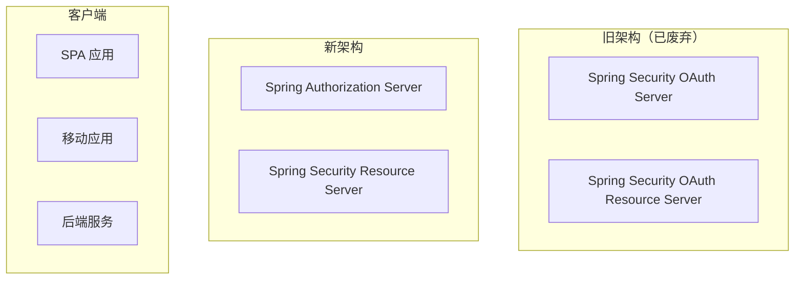
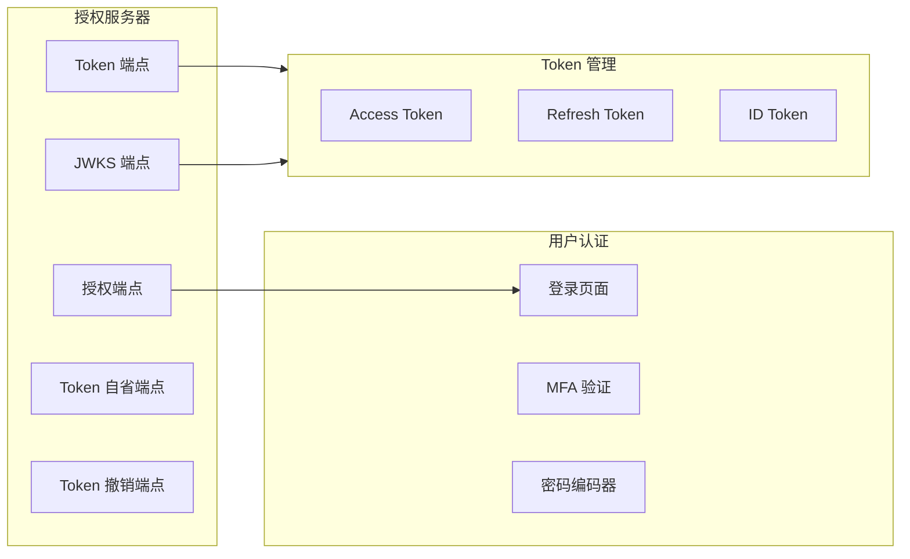

Spring Security OAuth 的历史，是一部「从放弃到重生」的框架演进史。

2009 年，Spring Security OAuth 诞生；2016 年，OAuth 1.0 被废弃；2019 年，Spring Security OAuth 宣布不再维护；2020 年，Spring Authorization Server 项目启动；2022 年，Spring Authorization Server 1.0 正式发布。每一代都解决了上一代的问题，也带来了新的复杂性。

本文从实战出发，讲解 Spring Security OAuth2 的当前最佳实践。

## 一、发展历史与版本演进

### 版本时间线

| 年份 | 项目 | 状态 |
|---|---|---|
| 2009 | Spring Security OAuth 1.0 | 废弃 |
| 2015 | Spring Security OAuth 2.0 | 废弃 |
| 2019 | Spring Security OAuth 宣布不再维护 | 废弃 |
| 2020 | Spring Authorization Server 项目启动 | 进行中 |
| 2022 | Spring Authorization Server 1.0 | 稳定 |

### 废弃原因

Spring Security OAuth 2.0 被废弃的原因：

1. **架构设计陈旧**：基于 Spring Framework 5.x，无法适配新技术栈
2. **OAuth 2.1 规范更新**：PKCE 成为标配、Client Secret 必选
3. **Spring 生态系统演进**：Spring WebFlux、RSocket 等新技术的适配需求
4. **安全标准提升**：需要支持 FAPI 2.0、PAR（推式授权）等新规范

### 当前推荐架构



## 二、Spring Authorization Server 架构

### 核心组件



### 项目结构

```
├── authorization-server/
│   ├── src/main/java/
│   │   ├── com.example.authorization/
│   │   │   ├── AuthorizationServerApplication.java
│   │   │   ├── config/
│   │   │   │   ├── SecurityConfig.java
│   │   │   │   ├── AuthorizationServerConfig.java
│   │   │   │   └── JWKConfig.java
│   │   │   ├── repository/
│   │   │   └── service/
│   │   └── resources/
│   │       └── application.yml
│   └── build.gradle
```

## 三、授权服务器配置

### 依赖配置

```groovy title="build.gradle"
plugins {
    id 'java'
    id 'org.springframework.boot' version '3.2.0'
    id 'io.spring.dependency-management' version '1.1.4'
}

dependencies {
    implementation 'org.springframework.boot:spring-boot-starter-web'
    implementation 'org.springframework.boot:spring-boot-starter-security'
    implementation 'org.springframework.boot:spring-boot-starter-oauth2-authorization-server'
    implementation 'org.springframework.boot:spring-boot-starter-data-jpa'

    // 数据库
    runtimeOnly 'org.postgresql:postgresql'

    // JWT
    implementation 'com.nimbusds:nimbus-jose-jwt:9.37.3'

    // 密码编码
    implementation 'org.springframework.security:spring-security-crypto'

    // 测试
    testImplementation 'org.springframework.security:spring-security-test'
}
```

### 安全配置

```java title="SecurityConfig.java"
@Configuration
@EnableWebSecurity
public class SecurityConfig {

    @Bean
    @Order(1)
    public SecurityFilterChain authorizationServerSecurityFilterChain(
            HttpSecurity http,
            RegisteredClientRepository registeredClientRepository,
            AuthorizationServerSettings authorizationServerSettings) throws Exception {

        OAuth2AuthorizationServerConfigurer authorizationServerConfigurer =
            OAuth2AuthorizationServerConfigurer.authorizationServer();

        http
            .securityMatcher("/oauth2/**", "/login/**", "/error/**")
            .authorizeHttpRequests(authorize ->
                authorize
                    .requestMatchers("/oauth2/jwks").permitAll()
                    .requestMatchers("/actuator/health").permitAll()
                    .anyRequest().authenticated()
            )
            .oauth2Login(Customizer.withDefaults())
            .oauth2AuthorizationServer(authorizationServerConfigurer.and().and())
            .csrf(csrf -> csrf
                .ignoringRequestMatchers("/oauth2/**")
            );

        return http.build();
    }

    @Bean
    @Order(2)
    public SecurityFilterChain defaultSecurityFilterChain(HttpSecurity http) throws Exception {
        http
            .authorizeHttpRequests(authorize ->
                authorize
                    .requestMatchers("/public/**").permitAll()
                    .anyRequest().authenticated()
            )
            .formLogin(Customizer.withDefaults());

        return http.build();
    }

    @Bean
    public PasswordEncoder passwordEncoder() {
        return new BCryptPasswordEncoder(12);
    }
}
```

### 授权服务器配置

```java title="AuthorizationServerConfig.java"
@Configuration
public class AuthorizationServerConfig {

    @Bean
    @RegisteredClientRegistration(
        issuerUri = "http://localhost:8080",
        clientId = "messaging-client",
        clientName = "Messaging Client",
        clientAuthenticationMethod = ClientAuthenticationMethod.CLIENT_SECRET_BASIC,
        authorizationGrantType = AuthorizationGrantType.AUTHORIZATION_CODE,
        authorizationGrantType = AuthorizationGrantType.CLIENT_CREDENTIALS,
        authorizationGrantType = AuthorizationGrantType.REFRESH_TOKEN,
        redirectUri = "http://127.0.0.1:8080/login/oauth2/code/messaging-client-oidc",
        postLogoutRedirectUri = "http://127.0.0.1:8080/",
        scopes = { OidcScopes.OPENID, OidcScopes.PROFILE, OidcScopes.EMAIL }
    )
    public RegisteredClientRepository registeredClientRepository() {
        // 使用 @RegisteredClientRegistration 简化配置
        // 或使用 RegisteredClientRepository Bean 自定义配置
        return new InMemoryRegisteredClientRepository();
    }

    @Bean
    public JWKSource<SecurityContext> jwkSource() {
        RSAKey rsaKey = generateRsaKey();
        JWKSet jwkSet = new JWKSet(rsaKey);

        return (jwkSelector, securityContext) -> jwkSelector.select(jwkSet);
    }

    @Bean
    public AuthorizationServerSettings authorizationServerSettings() {
        return AuthorizationServerSettings.builder()
            .issuer("http://localhost:8080")
            .authorizationEndpoint("/oauth2/authorize")
            .tokenEndpoint("/oauth2/token")
            .tokenIntrospectionEndpoint("/oauth2/introspect")
            .tokenRevocationEndpoint("/oauth2/revoke")
            .jwkSetEndpoint("/oauth2/jwks")
            .oidcUserInfoEndpoint("/userinfo")
            .build();
    }

    private RSAKey generateRsaKey() {
        KeyPairGenerator generator = KeyPairGenerator.getInstance("RSA");
        generator.initialize(2048);
        KeyPair keyPair = generator.generateKeyPair();
        return new RSAKey.Builder((RSAPublicKey) keyPair.getPublic())
            .privateKey(keyPair.getPrivate())
            .keyID("key-id")
            .build();
    }
}
```

### 动态客户端注册

```java title="DynamicClientRegistration.java"
@RestController
@RequestMapping("/api/clients")
public class ClientRegistrationController {

    @Autowired
    private RegisteredClientRepository registeredClientRepository;

    @PostMapping("/register")
    public RegisteredClient registerClient(@RequestBody ClientRegistrationRequest request) {
        RegisteredClient registeredClient = RegisteredClient
            .withId(UUID.randomUUID().toString())
            .clientId(request.getClientId())
            .clientName(request.getClientName())
            .clientAuthenticationMethod(ClientAuthenticationMethod.CLIENT_SECRET_POST)
            .authorizationGrantType(AuthorizationGrantType.AUTHORIZATION_CODE)
            .authorizationGrantType(AuthorizationGrantType.CLIENT_CREDENTIALS)
            .authorizationGrantType(AuthorizationGrantType.REFRESH_TOKEN)
            .redirectUri(request.getRedirectUri())
            .scope(OidcScopes.OPENID)
            .scope("message.read")
            .scope("message.write")
            .tokenSettings(TokenSettings.builder()
                .accessTokenTimeToLive(Duration.ofMinutes(15))
                .refreshTokenTimeToLive(Duration.ofHours(8))
                .reuseRefreshTokens(false)
                .build())
            .clientSettings(ClientSettings.builder()
                .requireAuthorizationConsent(true)
                .requireProofKey(true)
                .build())
            .build();

        registeredClientRepository.save(registeredClient);
        return registeredClient;
    }
}
```

## 四、资源服务器配置

### 依赖配置

```groovy title="resource-server/build.gradle"
dependencies {
    implementation 'org.springframework.boot:spring-boot-starter-web'
    implementation 'org.springframework.boot:spring-boot-starter-oauth2-resource-server'
    implementation 'org.springframework.boot:spring-boot-starter-security'

    // JWT 验证
    implementation 'org.springframework.security:spring-security-oauth2-jose'
}
```

### 资源服务器配置

```java title="ResourceServerConfig.java"
@Configuration
@EnableResourceServer
@EnableMethodSecurity(prePostEnabled = true)
public class ResourceServerConfig {

    @Bean
    public SecurityFilterChain resourceServerFilterChain(HttpSecurity http) throws Exception {
        http
            .authorizeHttpRequests(authorize ->
                authorize
                    .requestMatchers("/public/**").permitAll()
                    .requestMatchers("/actuator/health").permitAll()
                    .requestMatchers("/api/admin/**").hasAuthority("SCOPE_admin")
                    .requestMatchers("/api/user/**").hasAnyAuthority("SCOPE_openid", "SCOPE_profile")
                    .anyRequest().authenticated()
            )
            .oauth2ResourceServer(oauth2 ->
                oauth2.jwt(Customizer.withDefaults())
            );

        return http.build();
    }

    @Bean
    public JwtDecoder jwtDecoder() {
        return JwtDecoders.fromIssuerLocation("http://localhost:8080");
    }
}
```

### JWT 解析与权限映射

```java title="JwtPermissionExtractor.java"
@Component
public class JwtPermissionExtractor {

    public Collection<GrantedAuthority> extractAuthorities(Jwt jwt) {
        Set<GrantedAuthority> authorities = new HashSet<>();

        // 从 scope 声明提取权限
        List<String> scopes = jwt.getClaimAsStringList("scope");
        if (scopes != null) {
            scopes.forEach(scope ->
                authorities.add(new OAuth2Authority("SCOPE_" + scope))
            );
        }

        // 从 realm_access 提取角色（Keycloak 兼容）
        Map<String, Object> realmAccess = jwt.getClaim("realm_access");
        if (realmAccess != null) {
            @SuppressWarnings("unchecked")
            List<String> roles = (List<String>) realmAccess.get("roles");
            if (roles != null) {
                roles.forEach(role ->
                    authorities.add(new SimpleGrantedAuthority("ROLE_" + role))
                );
            }
        }

        // 从自定义声明提取权限
        List<String> permissions = jwt.getClaimAsStringList("permissions");
        if (permissions != null) {
            permissions.forEach(permission ->
                authorities.add(new SimpleGrantedAuthority(permission))
            );
        }

        return authorities;
    }
}
```

## 五、自定义 Claims 与用户信息

### 自定义 Access Token Claims

```java title="CustomizingTokenClaims.java"
@Component
public class CustomizingTokenClaimsService {

    @Autowired
    private JWKSource<SecurityContext> jwkSource;

    public OAuth2TokenContext buildCustomToken(OAuth2AuthorizationPrincipal principal,
                                                 RegisteredClient registeredClient) {
        // 构建自定义声明
        Map<String, Object> additionalClaims = new HashMap<>();
        additionalClaims.put("department", principal.getDepartment());
        additionalClaims.put("employee_id", principal.getEmployeeId());
        additionalClaims.put("tenant_id", principal.getTenantId());

        // 权限信息
        additionalClaims.put("permissions", principal.getPermissions());

        return OAuth2TokenContext.builder()
            .registeredClient(registeredClient)
            .principal(principal)
            .providerContext(ProviderContextHolder.getProviderContext())
            .authorizedScopes(principal.getAuthorities().stream()
                .map(GrantedAuthority::getAuthority)
                .collect(Collectors.toSet()))
            .additionalClaims(additionalClaims)
            .build();
    }
}
```

### OIDC UserInfo 端点自定义

```java title="OidcUserInfoController.java"
@RestController
@RequestMapping("/userinfo")
public class OidcUserInfoController {

    @Autowired
    private UserRepository userRepository;

    @GetMapping
    public Map<String, Object> getUserInfo(@AuthenticationPrincipal Jwt jwt) {
        String userId = jwt.getSubject();

        User user = userRepository.findById(userId)
            .orElseThrow(() -> new UserNotFoundException(userId));

        Map<String, Object> userInfo = new HashMap<>();
        userInfo.put("sub", userId);
        userInfo.put("name", user.getName());
        userInfo.put("email", user.getEmail());
        userInfo.put("email_verified", user.isEmailVerified());
        userInfo.put("department", user.getDepartment());
        userInfo.put("roles", user.getRoles());
        userInfo.put("custom_claim", "custom_value");

        return userInfo;
    }
}
```

## 六、与 Keycloak 集成

### Spring Security 作为 Keycloak 的 Client

```yaml title="application.yml"
spring:
  security:
    oauth2:
      resourceserver:
        jwt:
          issuer-uri: http://keycloak:8080/realms/myrealm
          # 或使用 JWKS 端点
          jwk-set-uri: http://keycloak:8080/realms/myrealm/protocol/openid-connect/certs

  datasource:
    url: jdbc:postgresql://keycloak:5432/keycloak
    username: keycloak
    password: ${DB_PASSWORD}

  jpa:
    hibernate:
      ddl-auto: validate
    properties:
      hibernate:
        dialect: org.hibernate.dialect.PostgreSQLDialect
```

```java title="KeycloakJwtDecoder.java"
@Configuration
public class KeycloakJwtDecoderConfig {

    @Bean
    public JwtDecoder jwtDecoder() {
        // Keycloak 默认使用 RS256
        // Spring Security 会自动从 issuer-uri 获取 JWKS
        return JwtDecoders.fromIssuerLocation("http://keycloak:8080/realms/myrealm");
    }

    @Bean
    public Converter<Jwt, Collection<GrantedAuthority>> jwtGrantedAuthoritiesConverter() {
        return jwt -> {
            Map<String, Object> realmAccess = jwt.getClaim("realm_access");
            if (realmAccess == null) {
                return Collections.emptyList();
            }

            @SuppressWarnings("unchecked")
            List<String> roles = (List<String>) realmAccess.get("roles");

            return roles.stream()
                .map(role -> new SimpleGrantedAuthority("ROLE_" + role))
                .collect(Collectors.toList());
        };
    }
}
```

### 完整安全配置

```java title="SecurityConfig.java"
@Configuration
@EnableWebSecurity
public class SecurityConfig {

    @Bean
    public SecurityFilterChain securityFilterChain(HttpSecurity http) throws Exception {
        http
            .authorizeHttpRequests(authorize ->
                authorize
                    .requestMatchers("/public/**").permitAll()
                    .requestMatchers("/api/admin/**").hasRole("ADMIN")
                    .requestMatchers("/api/**").authenticated()
                    .anyRequest().authenticated()
            )
            .oauth2ResourceServer(oauth2 ->
                oauth2.jwt(jwt ->
                    jwt.jwtAuthenticationConverter(jwtAuthenticationConverter())
                )
            )
            .csrf(csrf -> csrf
                .ignoringRequestMatchers("/api/**")
            );

        return http.build();
    }

    @Bean
    public Converter<Jwt, JwtAuthenticationToken> jwtAuthenticationConverter() {
        JwtGrantedAuthoritiesConverter grantedAuthoritiesConverter = new JwtGrantedAuthoritiesConverter();
        grantedAuthoritiesConverter.setAuthoritiesClaimName("realm_access");
        grantedAuthoritiesConverter.setAuthorityPrefix("ROLE_");

        JwtAuthenticationConverter jwtAuthenticationConverter = new JwtAuthenticationConverter();
        jwtAuthenticationConverter.setJwtGrantedAuthoritiesConverter(grantedAuthoritiesConverter);

        return jwtAuthenticationConverter;
    }
}
```

---

## 思考题

**问题 1**：Spring Authorization Server 的 `@RegisteredClientRegistration` 和传统的 `RegisteredClientRepository` Bean 配置方式有什么区别？在什么场景下应该选择哪种方式？

<details>
<summary>参考答案</summary>

**两种配置方式的区别**：

| 维度 | @RegisteredClientRegistration | RegisteredClientRepository Bean |
|---|---|---|
| 配置位置 | 注解在 Bean 方法上 | Java 代码中手动构建 Bean |
| 客户端数量 | 每个方法一个客户端 | 一个 Bean 可注册多个客户端 |
| 动态管理 | 不支持 | 支持（结合数据库） |
| 代码复杂度 | 简单 | 较复杂 |
| 适用场景 | 开发/测试、固定客户端 | 生产、动态客户端注册 |

**@RegisteredClientRegistration 示例**：

```java
@Configuration
public class ClientConfig {

    @Bean
    @RegisteredClientRegistration(
        issuerUri = "http://localhost:8080",
        clientId = "client-a",
        clientName = "Client A",
        clientAuthenticationMethod = ClientAuthenticationMethod.CLIENT_SECRET_BASIC,
        authorizationGrantType = AuthorizationGrantType.AUTHORIZATION_CODE,
        redirectUri = "http://localhost:3000/callback",
        scopes = { OidcScopes.OPENID, OidcScopes.PROFILE }
    )
    public RegisteredClient clientARegisteredClient() {
        // 简洁，配置即注册
        return null; // 注解自动处理
    }

    @Bean
    @RegisteredClientRegistration(
        issuerUri = "http://localhost:8080",
        clientId = "client-b",
        // ...
    )
    public RegisteredClient clientBRegisteredClient() {
        return null;
    }
}
```

**动态注册场景**：

```java
@Configuration
public class DynamicClientConfig {

    @Bean
    public RegisteredClientRepository registeredClientRepository(
            DataSource dataSource) {
        // 使用 JDBC 实现持久化
        JdbcRegisteredClientRepository repository =
            new JdbcRegisteredClientRepository(dataSource);

        // 初始化默认客户端
        initializeDefaultClients(repository);

        return repository;
    }

    private void initializeDefaultClients(RegisteredClientRepository repository) {
        if (repository.findByClientId("default-client") == null) {
            RegisteredClient client = RegisteredClient
                .withId(UUID.randomUUID().toString())
                .clientId("default-client")
                .clientAuthenticationMethod(ClientAuthenticationMethod.CLIENT_SECRET_POST)
                .authorizationGrantType(AuthorizationGrantType.CLIENT_CREDENTIALS)
                .scope("read")
                .scope("write")
                .tokenSettings(TokenSettings.builder()
                    .accessTokenTimeToLive(Duration.ofMinutes(30))
                    .build())
                .build();

            repository.save(client);
        }
    }
}
```

**选型建议**：

- **开发/测试**：使用 `@RegisteredClientRegistration`，简单直接
- **演示/固定客户端**：使用 `@RegisteredClientRegistration`
- **生产环境**：使用 `JdbcRegisteredClientRepository`，支持动态管理
- **SaaS 多租户**：使用 `JdbcRegisteredClientRepository` + 数据库

</details>

**问题 2**：在微服务架构中，资源服务器如何安全地获取授权服务器的公钥进行 Token 验证？有哪些常见的优化策略？

<details>
<summary>参考答案</summary>

**基础方式：直接调用 JWKS 端点**

```java
@Bean
public JwtDecoder jwtDecoder() {
    return JwtDecoders.fromIssuerLocation("http://auth-server:8080");
}
```

问题：每次验证 Token 都需要调用远程 JWKS 端点，性能差。

**优化策略一：缓存 JWKS**

```java
@Bean
public JwtDecoder jwtDecoder() {
    return NimbusJwtDecoder.withIssuerLocation("http://auth-server:8080")
        .cache()  // 启用默认缓存
        .jwkSetCacheDuration(Duration.ofHours(1))
        .build();
}
```

**优化策略二：本地 JWK 预加载**

```java
@Bean
public JwtDecoder jwtDecoder() {
    // 启动时预加载 JWK，运行时直接使用
    JWKSource<SecurityContext> jwkSource = new ClassPathJWKSource("classpath:jwk/public-key.json");

    return new NimbusJwtDecoder(jwkSource);
}
```

**优化策略三：Redis 共享 JWK 缓存**

```java
@Configuration
public class DistributedJwkConfig {

    @Bean
    public RedisTemplate<String, JWKSet> redisJwkSetTemplate(RedisConnectionFactory factory) {
        RedisTemplate<String, JWKSet> template = new RedisTemplate<>();
        template.setConnectionFactory(factory);
        template.setValueSerializer(new JwkSetSerializer());
        return template;
    }

    @Bean
    public JwtDecoder jwtDecoder(RedisTemplate<String, JWKSet> redisTemplate) {
        // 多实例共享同一个 JWK 缓存
        String jwksUri = "http://auth-server:8080/oauth2/jwks";

        return NimbusJwtDecoder.withJwkSetUri(jwksUri)
            .jwkSetJwsAlgorithm(RSA_jwt.S512)
            .cache()
            .jwkSetCacheDuration(Duration.ofHours(24))
            .jwkSetRefreshRateLimit(Duration.ofMinutes(5))  // 防止缓存击穿
            .jwkSetRefreshTimeBuffer(Duration.ofSeconds(30))
            .build();
    }
}
```

**优化策略四：签名密钥定期轮转**

```java
@Component
public class JwkKeyRotationService {

    private final Map<String, Key> activeKeys = new ConcurrentHashMap<>();
    private volatile String currentKid;

    @PostConstruct
    public void initialize() {
        // 启动时加载所有有效密钥
        loadAllKeys();
    }

    public void rotateKey() {
        // 1. 生成新密钥对
        RSAKey newKey = generateRsaKey();

        // 2. 将新密钥添加到授权服务器
        addKeyToAuthServer(newKey);

        // 3. 通知所有资源服务器
        clearJwkCache();

        // 4. 旧密钥保持一段时间（允许在用 Token 验证通过）
        scheduleKeyCleanup();
    }

    private void loadAllKeys() {
        // 从授权服务器加载所有有效密钥
        JWKSet jwkSet = fetchJwkSet();
        for (JWK jwk : jwkSet.getKeys()) {
            activeKeys.put(jwk.getKeyID(), jwk.toRSAKey().toPublicKey());
        }
    }
}
```

**生产环境推荐架构**：

```
┌─────────────────────────────────────────────────────────┐
│                    Authorization Server                  │
│  ┌─────────────────────────────────────────────────────┐ │
│  │ - 签发 Token（使用私钥）                             │ │
│  │ - 提供 JWKS 端点                                     │ │
│  │ - 定期轮转密钥（建议每 30 天）                        │ │
│  └─────────────────────────────────────────────────────┘ │
└─────────────────────────────────────────────────────────┘
                          │
                          │ 定期同步
                          ▼
┌─────────────────────────────────────────────────────────┐
│                    Redis（JWK 缓存）                     │
│  ┌─────────────────────────────────────────────────────┐ │
│  │ - 缓存 JWK Set                                        │ │
│  │ - 设置 TTL = 24 小时                                  │ │
│  │ - Key: jwk:auth-server                               │ │
│  └─────────────────────────────────────────────────────┘ │
└─────────────────────────────────────────────────────────┘
                          │
                          │ 读取
          ┌───────────────┼───────────────┐
          ▼               ▼               ▼
    ┌───────────┐   ┌───────────┐   ┌───────────┐
    │ Service A │   │ Service B │   │ Service C │
    └───────────┘   └───────────┘   └───────────┘
```

</details>
