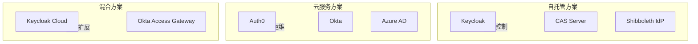
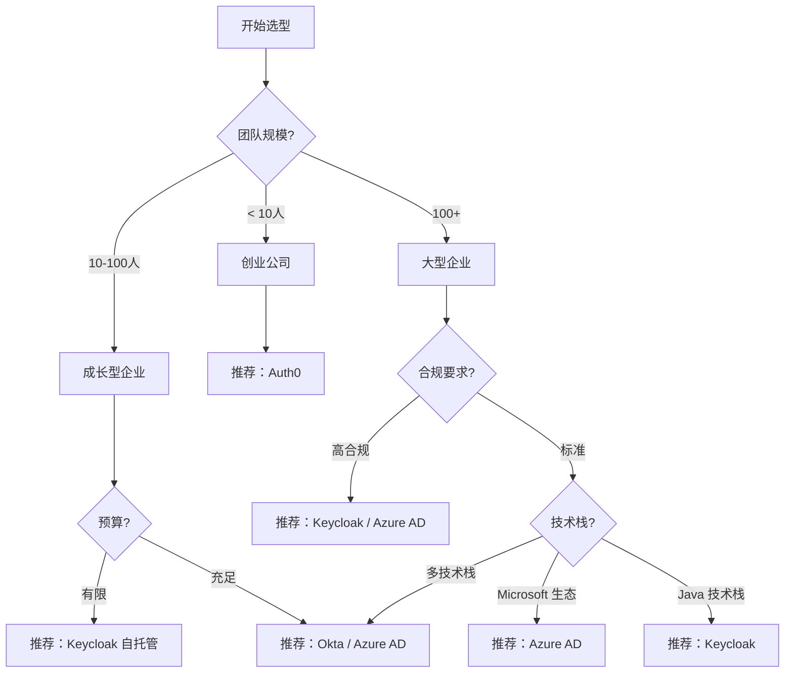

选 SSO 方案就像选数据库——没有银弹，只有适合不适合。创业公司可能只需要 Auth0 的几分钟快速接入；大型金融机构可能需要 Keycloak 的全功能自托管；学术圈可能离不开 Shibboleth 的联邦身份支持。

本文从协议支持、功能特性、部署模式、成本等维度，全面对比主流 SSO 方案。

## 一、主流方案概览

| 方案 | 类型 | 协议支持 | 部署模式 | 定位 |
|---|---|---|---|---|
| Keycloak | 开源 IdP | OIDC、SAML、CAS | 自托管、云 | 企业级全功能 |
| Auth0 | 云服务 IdP | OIDC、SAML | 仅云 | 开发者友好 |
| CAS | 开源 SSO | CAS、OIDC（插件） | 自托管 | 学术/图书馆场景 |
| Shibboleth | 开源 IdP/SP | SAML、SAML2 | 自托管 | 学术联邦 |
| Okta | 云服务 IdP | OIDC、SAML | 仅云/混合 | 企业级 |
| Azure AD | 云服务 IdP | OIDC、SAML | 仅云/混合 | Microsoft 生态 |

## 二、协议支持对比

### OIDC 支持

OIDC 是现代应用的首选协议，各方案支持程度：

| 方案 | OIDC 版本 | Authorization Code Flow | PKCE | Client Credentials | Device Flow |
|---|---|---|---|---|---|
| Keycloak | 1.0 | 支持 | 支持 | 支持 | 支持 |
| Auth0 | 1.0 | 支持 | 支持 | 支持 | 支持 |
| CAS | 3.x（插件） | 部分支持 | 不支持 | 不支持 | 不支持 |
| Shibboleth | - | 不支持 | 不支持 | 不支持 | 不支持 |
| Okta | 1.0 | 支持 | 支持 | 支持 | 支持 |
| Azure AD | 1.0 | 支持 | 支持 | 支持 | 支持 |

**结论**：现代 Web/Mobile 应用首选 OIDC，Keycloak、Auth0、Okta、Azure AD 都是一等公民。

### SAML 支持

SAML 仍是企业 SSO 的主流协议，尤其在传统 Web 应用中：

| 方案 | SAML 版本 | SP-Initiated | IdP-Initiated | 属性查询 |
|---|---|---|---|---|
| Keycloak | 2.0 | 支持 | 支持 | 支持 |
| Auth0 | 2.0 | 支持 | 支持 | 支持 |
| CAS | 2.x、3.0 | 支持 | 支持 | 支持 |
| Shibboleth | 2.0 | 支持 | 支持 | 支持 |
| Okta | 2.0 | 支持 | 支持 | 支持 |
| Azure AD | 2.0 | 支持 | 支持 | 支持 |

**结论**：SAML 2.0 已成为事实标准，所有主流方案都完整支持。

## 三、部署模式对比



### 自托管 vs 云服务

| 维度 | 自托管 | 云服务 |
|---|---|---|
| 初始成本 | 硬件/基础设施 | 订阅费用（按用户/应用计费） |
| 运维成本 | 需要专业运维团队 | 零运维 |
| 定制能力 | 完全控制，可深度定制 | 受限于服务商 API |
| 数据控制 | 数据完全自主 | 数据在第三方 |
| 合规认证 | 自己负责 SOC2/ISO27001 | 服务商提供合规证明 |
| 适用规模 | 大型企业、有合规要求 | 中小企业、快速上线 |

### 成本分析

| 方案 | 免费额度 | 企业定价（估算） |
|---|---|---|
| Keycloak | 完全免费开源 | 基础设施成本 |
| Auth0 | 7,000 MAU | $0.023/MAU 起 |
| Okta | 50 用户 + 5 应用 | $2/用户/月起 |
| Azure AD | 50,000 MAU（B2C） | $6/用户/月起（P1） |

## 四、功能特性对比

### 核心功能

| 功能 | Keycloak | Auth0 | CAS | Shibboleth |
|---|---|---|---|---|
| 用户注册/登录 | 支持 | 支持 | 需扩展 | 需扩展 |
| 社交登录 | 支持 | 支持 | 不支持 | 不支持 |
| MFA | 支持 | 支持 | 插件支持 | 插件支持 |
| 密码策略 | 支持 | 支持 | 有限 | 有限 |
| 用户联盟 | 支持 | 支持 | 有限 | 强（学术联邦） |
| 细粒度授权 | 支持 | 支持（Rules） | 不支持 | 不支持 |
| 账户管理 | 支持 | 支持 | 有限 | 有限 |
| 管理 UI | 完整 UI | 完整 UI | 基础 UI | 基础 UI |

### 用户联盟（Identity Brokering）

用户联盟指通过外部 IdP 登录：

| 方案 | Google | GitHub | SAML IdP | OIDC IdP |
|---|---|---|---|---|
| Keycloak | 支持 | 支持 | 支持 | 支持 |
| Auth0 | 支持 | 支持 | 支持 | 支持 |
| CAS | 插件 | 插件 | 支持 | 插件 |
| Shibboleth | 不支持 | 不支持 | 支持 | 不支持 |

### MFA 支持

| 方案 | OTP（TOTP） | SMS | Email | Push | WebAuthn |
|---|---|---|---|---|---|
| Keycloak | 支持 | 支持 | 支持 | 支持 | 支持 |
| Auth0 | 支持 | 支持 | 支持 | 支持 | 支持 |
| CAS | 插件 | 插件 | 插件 | 插件 | 插件 |
| Okta | 支持 | 支持 | 支持 | 支持 | 支持 |

## 五、Keycloak 深度分析

### 适用场景

- 需要完全数据主权的企业
- 已有 Kubernetes 基础设施的云原生团队
- 需要深度定制的复杂身份管理需求

### 优势

1. **功能完整**：开源方案中功能最全
2. **协议覆盖广**：OIDC、SAML、CAS 全部支持
3. **活跃社区**：Red Hat 背书，社区活跃
4. **Quarkus 版本**：现代化架构，性能优秀

### 劣势

1. **运维复杂度**：需要专业的 Keycloak 运维知识
2. **文档质量**：官方文档不够完善
3. **版本升级**：大版本升级有时需要特殊处理

## 六、Auth0 深度分析

### 适用场景

- 快速启动的创业公司
- 没有专职运维团队的中小企业
- 需要快速接入多个社交登录的应用

### 优势

1. **开发者体验**：SDK 完善，文档友好
2. **快速接入**：几分钟完成 SSO 集成
3. **托管部署**：零运维负担
4. **合规认证**：SOC2、ISO27001 等开箱即用

### 劣势

1. **成本**：随用户量增长成本上升
2. **定制限制**：深度定制受限于平台能力
3. **数据主权**：用户数据在第三方

## 七、选型决策矩阵



### 场景化推荐

| 场景 | 推荐方案 | 理由 |
|---|---|---|
| 快速 MVP | Auth0 | 几分钟接入 |
| SaaS 多租户 | Keycloak | 完全控制 + 功能完整 |
| Microsoft 生态 | Azure AD | 原生集成 Teams/Office365 |
| 学术/图书馆 | CAS/Shibboleth | 学术联邦标准 |
| 微服务 + API | Keycloak | OIDC + 细粒度授权 |
| 金融/医疗 | Keycloak（私有部署） | 数据主权 + 合规 |

## 八、迁移策略

如果现有 SSO 方案不满足需求，需要迁移：

### 从 Auth0/Okta 迁移到 Keycloak

1. **并行运行**：新旧 IdP 同时运行
2. **用户数据同步**：将用户数据导出并导入 Keycloak
3. **逐步切换应用**：按优先级逐个应用切换
4. **验证和监控**：监控迁移后的登录成功率

```bash
# Auth0 用户导出
auth0 export users --format json > users.json

# Keycloak 用户导入
kcadm.sh create users -r master -s username=xxx ...
```

### 从 CAS 迁移到 Keycloak

1. **分析现有配置**：梳理 CAS 所有 Service Registry
2. **创建 Keycloak Client**：配置对应的 OIDC/SAML Client
3. **用户数据迁移**：LDAP 同步或数据迁移
4. **测试验证**：在测试环境完整验证流程

---

## 思考题

**问题 1**：某中型企业（200人）计划从自建 CAS 迁移到现代化 SSO 方案。现有 15 个应用，其中 8 个是传统 JSP 应用，5 个是 REST API，2 个是 Vue SPA。用户主要使用企业微信作为入口。你会推荐什么方案？迁移路径是什么？

<details>
<summary>参考答案</summary>

**推荐方案**：Keycloak + 企业微信集成

**理由**：

1. 企业微信支持 OIDC 协议，可以与 Keycloak 集成作为身份源
2. Keycloak 同时支持 SAML（传统 JSP 应用）和 OIDC（SPA + API）
3. 200 人规模，完全可以自托管 Keycloak
4. 节省从 Auth0/Okta 的长期订阅费用

**部署架构**：

```
┌─────────────────────────────────────────────┐
│              企业微信                        │
│         （统一身份入口）                     │
└──────────────┬──────────────────────────────┘
               │ OIDC
               ▼
┌─────────────────────────────────────────────┐
│           Keycloak                          │
│  ┌─────────────┐  ┌───────────────────┐   │
│  │ 企业微信 IdP │  │ 本地用户（备选）   │   │
│  └─────────────┘  └───────────────────┘   │
│  ┌─────────────┐  ┌───────────────────┐   │
│  │ SAML Client │  │ OIDC Client       │   │
│  │ (JSP 应用)   │  │ (Vue SPA + API)   │   │
│  └─────────────┘  └───────────────────┘   │
└─────────────────────────────────────────────┘
```

**迁移路径**：

1. **第一阶段（1-2周）**：部署 Keycloak，配置企业微信 IdP
2. **第二阶段（2-3周）**：优先迁移 REST API（使用 OIDC）
3. **第三阶段（2-3周）**：迁移 SPA 应用
4. **第四阶段（3-4周）**：使用 Keycloak 的 SAML SP 功能，逐步迁移 JSP 应用
5. **并行运行**：新旧 CAS 并行 1 个月，确认无误后下线

</details>

**问题 2**：在评估 SSO 方案时，「供应商锁定」（Vendor Lock-in）是一个重要考量因素。如何在享受云服务便利的同时，降低供应商锁定风险？

<details>
<summary>参考答案</summary>

**供应商锁定的主要风险**：

1. 应用层直接使用厂商 SDK，难以切换
2. 用户数据格式与厂商强耦合
3. 自定义逻辑依赖厂商扩展机制
4. 成本上涨时迁移成本过高

**降低锁定的策略**：

**策略一：抽象层设计**

```
┌─────────────────────────────────────────────┐
│           应用层（无感知变化）                │
├─────────────────────────────────────────────┤
│         统一认证抽象层                        │
│    ┌─────────┐    ┌─────────┐              │
│    │Auth0    │    │Okta     │              │
│    │Adapter  │    │Adapter  │              │
│    └─────────┘    └─────────┘              │
├─────────────────────────────────────────────┤
│         标准协议层（OIDC/SAML）              │
└─────────────────────────────────────────────┘
```

**策略二：标准协议优先**

- 优先使用 OIDC/SAML，不使用厂商私有 API
- 避免使用厂商扩展机制
- Token 格式尽量通用，不依赖厂商私有 Claim

**策略三：数据可移植性**

- 定期导出用户数据（标准格式）
- 不依赖厂商的外部用户数据
- 保持密码重置、账号管理能力自主

**策略四：多云/混合策略**

- 核心 IdP 自托管（Keycloak）
- 云服务用于特定场景（如社交登录）
- 数据备份到自己的存储

**策略五：成本保护**

- 签合同时明确退出条款
- 评估迁移工具和成本
- 避免使用深度定制功能

</details>
