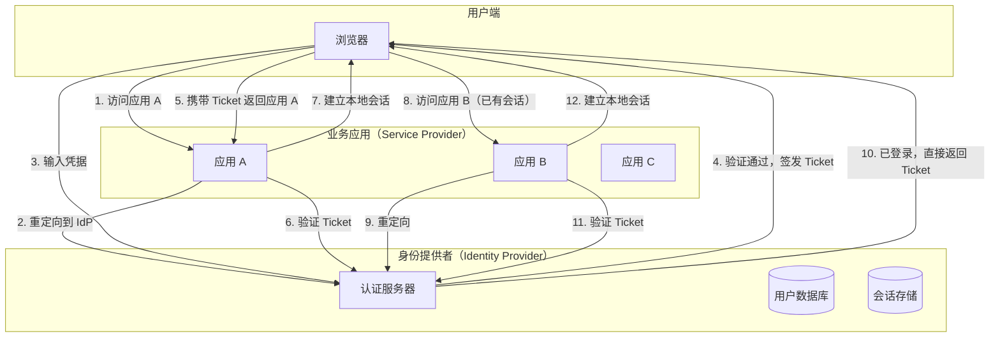
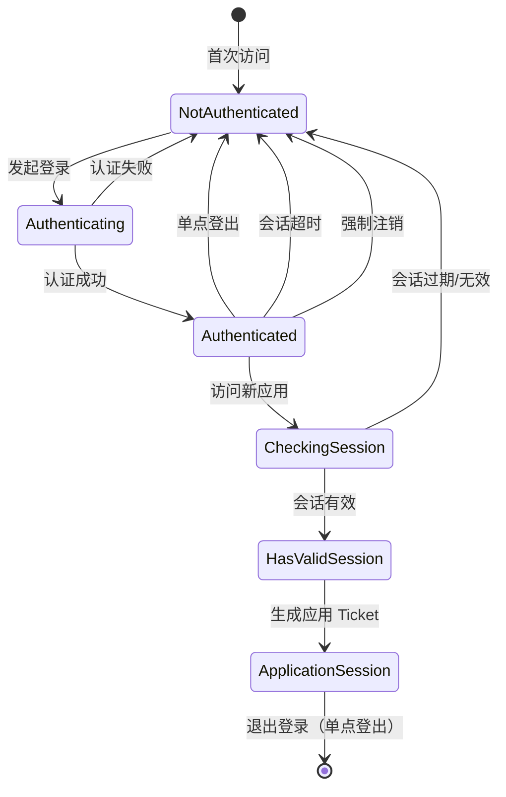
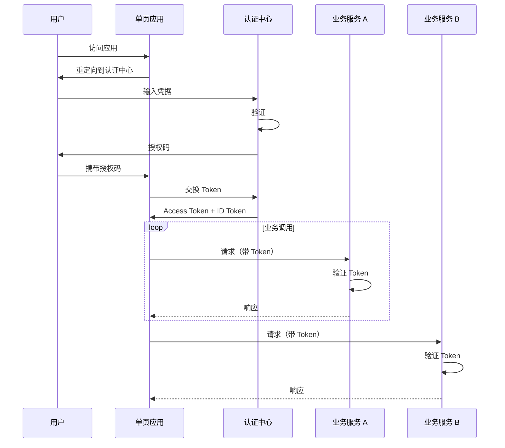

想象一个没有 SSO 的企业：员工每天上班需要登录 OA 系统、邮件系统、项目管理工具、代码仓库、云服务平台……如果每个系统都独立认证，一个新入职员工可能有十几个账号，离职时需要逐一关闭。管理员疲于处理密码重置，用户疲于记忆不同密码。更糟糕的是，每个系统都独立存储用户凭据，数据孤岛由此形成。

单点登录（Single Sign-On，SSO）就是为了解决这个问题而生。

## 一、SSO 的定义与价值

SSO 是一种身份认证机制，用户只需进行一次身份验证，即可访问多个相互信任的应用系统。

### 核心价值

**用户体验提升**。一次登录，多处访问。用户不再需要在不同系统间切换时反复输入凭据。

**安全性提升**。凭据只在一个地方输入，减少暴露面。同时可以强制实施更严格的安全策略（如强制 MFA）。

**运维效率提升**。用户生命周期管理集中化，入职/转岗/离职时的账号操作从 N 次变成 1 次。

**合规性支持**。集中审计所有应用的登录行为，满足 SOX、ISO27001 等合规要求。

### 典型 SSO 架构



## 二、SSO 的核心挑战

### 挑战一：跨域 Cookie

HTTP Cookie 的 `Domain` 属性决定了哪些域可以接收该 Cookie。默认情况下，Cookie 只发送给设置它的域名。

**问题**：如果 IdP 的域是 `auth.company.com`，业务应用的域是 `app1.company.com` 和 `app2.company.com`，Cookie 能否跨子域共享？

**解决方案**：设置 Cookie 的 `Domain` 为公共后缀。

```java
Cookie cookie = new Cookie("sso_session", sessionId);
cookie.setDomain("company.com"); // 允许所有 *.company.com 访问
cookie.setPath("/");
cookie.setHttpOnly(true);
cookie.setSecure(true);
```

**关键点**：
- `Domain` 设置为主域（`.company.com`），所有子域都可以读取
- 必须设置 `Secure`（HTTPS）和 `HttpOnly`（防 XSS）
- 需要统一考虑 CORS 策略

### 挑战二：会话管理

SSO 会话的生命周期比普通会话更复杂：



**会话存储策略**：

| 存储位置 | 优点 | 缺点 |
|---|---|---|
| Redis | 高性能、支持集群 | 依赖 Redis 可用性 |
| 数据库 | 可靠性高 | 性能相对较低 |
| JWT | 无状态、水平扩展 | 无法主动撤销 |

### 挑战三：安全威胁

**会话劫持（Session Hijacking）**。攻击者获取用户会话 ID，以合法用户身份访问系统。

**防御措施**：
- Session ID 使用加密安全的随机数生成器
- 传输过程强制 HTTPS
- 定期轮换 Session ID
- 登录后更换 Session ID（会话固定防护）

**CSRF 攻击**。攻击者诱导用户访问恶意页面，自动发起携带用户 Cookie 的请求。

**防御措施**：
- 使用 SameSite Cookie 属性
- 验证请求来源（Origin/Referer 头）
- CSRF Token 验证

**会话固定（Session Fixation）**。攻击者先获取一个有效 Session ID，然后诱骗用户使用该 ID 登录，登录后攻击者也可以使用这个 ID。

**防御措施**：
- 用户登录成功后生成新的 Session ID
- 设置合理的会话超时

## 三、基于 Cookie 的 SSO 架构

### 经典 Cookie 方案

```
┌─────────────┐     ┌─────────────┐     ┌─────────────┐
│   应用 A    │     │  SSO 服务器 │     │   应用 B    │
│ auth.a.com  │     │  sso.a.com  │     │ auth.b.com  │
└──────┬──────┘     └──────┬──────┘     └──────┬──────┘
       │                   │                   │
       │  1. 无Cookie      │                   │
       │──────────────────>│                   │
       │                   │                   │
       │  2. 重定向登录     │                   │
       │<──────────────────│                   │
       │                   │                   │
       │  3. 登录表单       │                   │
       │<───────────────────────────────────────│
       │                   │                   │
       │  4. POST凭据       │                   │
       │───────────────────────────────────────>│
       │                   │                   │
       │                   │  验证并设置Cookie   │
       │                   │<──────────────────│
       │                   │                   │
       │  5. 生成ServiceTicket│                │
       │<──────────────────│                   │
       │                   │                   │
       │  6. 携带ST验证     │                   │
       │──────────────────>│                   │
       │                   │                   │
       │  7. 验证通过       │                   │
       │<──────────────────│                   │
```

### Ticket 验证流程

```java title="SsoTicketValidator.java"
@Service
public class SsoTicketValidator {

    private final RestTemplate restTemplate;

    /**
     * 验证 Service Ticket 并获取用户信息
     * ST 只能使用一次，使用后立即失效
     */
    public UserInfo validateServiceTicket(String ticket, String serviceId) {
        // 检查 ST 是否已使用（防重放）
        if (ticketStore.isUsed(ticket)) {
            throw new SsoException("Ticket already used");
        }

        // 调用 SSO 服务器验证
        String ssoUrl = ssoServerUrl + "/validate"
            + "?ticket=" + ticket
            + "&service=" + serviceId;

        String response = restTemplate.getForObject(ssoUrl, String.class);

        if (!response.startsWith("yes")) {
            throw new SsoException("Invalid ticket");
        }

        // 标记 ST 为已使用
        ticketStore.markAsUsed(ticket);

        // 解析用户信息
        return parseUserInfo(response);
    }
}
```

## 四、基于 Token 的 SSO 架构

现代 Web 应用越来越多采用 SPA（单页应用）和微服务架构，Cookie 方案遇到了限制。

### Token 方案优势

1. **天然跨域**。Token 通过 Authorization 头部传递，不受 Cookie 跨域限制。
2. **API 友好**。符合 RESTful 设计，API 可被任意客户端调用。
3. **移动端支持**。移动端存储 Token 更容易控制。
4. **无状态扩展**。Token 本身包含认证信息，无需共享会话存储。

### 架构设计



### 多应用 Token 共享策略

```java title="TokenStorageStrategy.java"
public class TokenStorageStrategy {

    /**
     * 方案一：内存存储（最安全，推荐）
     * Token 不离开内存，只存放在 JavaScript 变量中
     * 页面刷新后需要重新获取
     */
    class MemoryStorage {
        private String accessToken;

        public void save(String token) {
            this.accessToken = token;
        }

        public String get() {
            return this.accessToken;
        }
    }

    /**
     * 方案二：Session Storage（页面级隔离）
     * 同源同窗口可共享，窗口关闭后自动清除
     */
    class SessionStorageStrategy {
        public void save(String accessToken, String refreshToken) {
            SessionStorage.setItem("access_token", accessToken);
            SessionStorage.setItem("refresh_token", refreshToken);
        }
    }

    /**
     * 方案三：Secure Cookie（后端代理）
     * 前端通过后端代理获取 Token，减少前端 XSS 风险
     */
}
```

## 五、SAML SSO vs OIDC SSO

| 维度 | SAML SSO | OIDC SSO |
|---|---|---|
| 协议基础 | XML | JSON/OAuth 2.0 |
| 复杂度 | 高 | 低 |
| 移动端支持 | 困难 | 原生支持 |
| 错误处理 | 复杂 | 标准化 |
| 适用场景 | 企业内部（Active Directory） | 互联网应用、API 开放 |

两种协议的详细对比和选型建议，将在 [SAML vs OIDC 选型对比](/security/iam/saml-vs-oidc) 中深入探讨。

## 六、SSO 安全最佳实践

**1. 强制 HTTPS**。所有 SSO 相关通信必须使用 HTTPS，防止中间人攻击。

**2. 合理的会话超时**。SSO 会话建议 4-8 小时，应用会话建议 15-30 分钟。

**3. 单点登出（Single Logout，SLO）**。在一个应用退出后，应该同步退出所有应用。

**4. 多因素认证（MFA）**。对 SSO 登录强制要求 MFA，防止凭据泄露导致全面沦陷。

**5. 敏感操作二次验证**。金融交易、管理员操作等敏感行为需要重新认证。

**6. 完整的审计日志**。记录所有登录事件，包括时间、IP、设备、应用、结果。

---

## 思考题

**问题 1**：某企业有 20 个内部系统需要接入 SSO，其中 15 个是传统 Web 应用（JSP/Freemarker 渲染型），5 个是现代 SPA 应用。如何设计 SSO 方案以兼顾两者的技术差异？

<details>
<summary>参考答案</summary>

推荐采用 **混合架构**：

**传统 Web 应用**：

- 使用 CAS（Central Authentication Service）协议
- 通过 Filter/Interceptor 在请求层拦截
- 应用服务器验证 Service Ticket
- 沿用传统的 Session 会话机制

**现代 SPA 应用**：

- 使用 OIDC 协议
- SPA 与 IdP 直接交互获取 Token
- Token 存放在内存或 Session Storage
- 通过 API 网关统一验证 Token

**统一认证中心**：

- 同时支持 CAS 和 OIDC 协议
- 使用 Keycloak 作为 IdP（支持两种协议）
- 统一的用户管理、认证策略、MFA

**关键集成点**：

```
┌─────────────────────────────────────────────────┐
│                 Keycloak（统一 IdP）            │
│  ┌─────────────┐      ┌─────────────────────┐  │
│  │ CAS Protocol│      │ OIDC Protocol        │  │
│  │ (传统应用)   │      │ (SPA + API)          │  │
│  └─────────────┘      └─────────────────────┘  │
└─────────────────────────────────────────────────┘
         │                        │
         ▼                        ▼
┌─────────────────┐      ┌─────────────────────┐
│ Filter/Interceptor│     │ API Gateway          │
│ (Session)        │      │ (Token Validation)  │
└─────────────────┘      └─────────────────────┘
```

</details>

**问题 2**：在 SSO 架构中，「单点登出」（SLO）比普通登出复杂得多。请分析 SLO 需要解决的核心问题，以及常见的实现方案。

<details>
<summary>参考答案</summary>

**SLO 的核心问题**：

1. **跨域问题**：用户在一个应用退出，如何通知其他域名的应用？
2. **状态同步**：所有应用需要清除本地会话
3. **后端资源**：数据库连接、缓存、第三方 Token 等需要清理
4. **会话追踪**：IdP 需要知道用户登录了哪些应用

**常见实现方案**：

**方案一：SAML SLO（Back Channel）**

```xml
<!-- 发起方发送 LogoutRequest -->
<samlp:LogoutRequest xmlns:samlp="urn:oasis:names:tc:SAML:2.0:protocol">
  <saml:NameID>user@company.com</saml:NameID>
  <samlp:SessionIndex>Session-123</samlp:SessionIndex>
</samlp:LogoutRequest>
```

IdP 通过后端调用（Back Channel）直接通知每个 SP 退出。

**方案二：OIDC RP-Initiated Logout**

```
https://idp.example.com/endsession
  ?id_token_hint={id_token}
  &post_logout_redirect_uri={client_uri}
  &client_id={client_id}
```

IdP 调用各 Client 的 `backchannel_logout_uri` 或等待 Client 的 `frontchannel_logout_uri` iframe 调用。

**方案三：定期轮询验证**

各应用定期向 IdP 验证会话有效性（如每分钟），IdP 发现会话已失效后主动拒绝。

**最佳实践**：

- IdP 维护「活跃会话列表」，登出时遍历所有会话
- Client 端监听 `message` 事件，接收 IdP 的登出通知
- 设置会话过期时间兜底，防止通知失败导致会话残留

</details>
