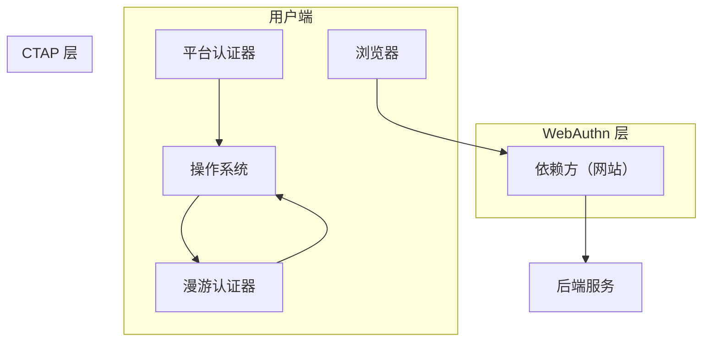
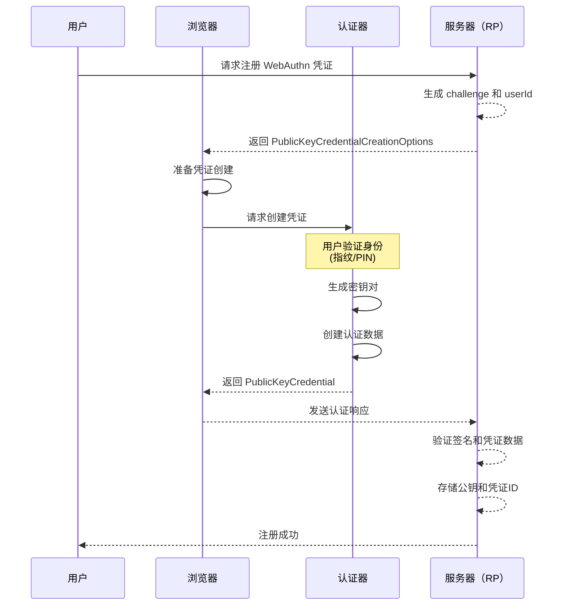
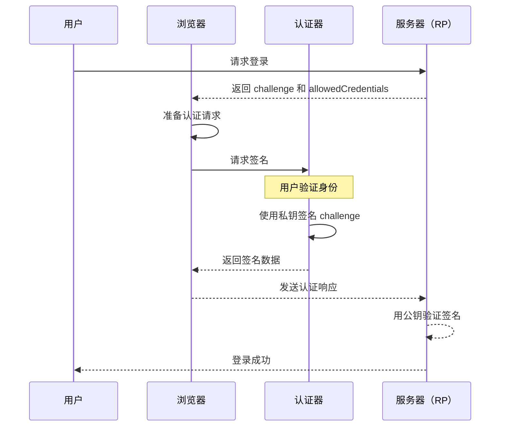

2022 年，Google 宣布所有员工强制使用硬件安全密钥登录，彻底废弃了密码作为主要认证手段。这一决定基于一个简单的事实：过去三年中，Google 内部没有发生一起因密码泄露导致的安全事故——因为根本没有密码可偷。

WebAuthn 是 FIDO2 标准的核心组成部分，它用公钥密码学彻底改变了身份认证的游戏规则。

## 一、FIDO2 架构概述

FIDO2（FIDO Universal 2nd Factor）是一套开放的认证标准，由 FIDO Alliance 开发，包含两个核心组件：

- **WebAuthn**（Web Authentication API）：定义浏览器和 Web 应用与认证器交互的 JavaScript API
- **CTAP**（Client to Authenticator Protocol）：定义终端设备（手机、电脑）与外部认证器（如安全密钥）通信的协议



### WebAuthn 与 CTAP 的关系

WebAuthn 是「前端标准」，定义了 Web 应用如何请求认证；CTAP 是「传输标准」，定义了认证请求如何从浏览器传递到物理认证器。

**CTAP 版本演进**：

| 版本 | 特性 | 典型设备 |
|------|------|----------|
| CTAP1 | U2F 兼容，仅支持第二因素 | 早期 YubiKey |
| CTAP2 | 支持平台认证器、无密码认证 | YubiKey 5 系列 |
| CTAP2.1 | 增强隐私、凭证管理 | 最新安全密钥 |

## 二、公钥凭证的创建流程

### 注册流程概述

当用户首次在网站注册 WebAuthn 认证时，整个流程如下：



### 服务器端准备

```java title="WebAuthnRegistrationService.java"
public class WebAuthnRegistrationService {
    
    @Autowired
    private RelyingParty relyingParty;
    
    /**
     * 生成注册选项
     * 这些选项由服务器生成并发送给浏览器
     */
    public PublicKeyCredentialCreationOptions generateRegistrationOptions(
            String username, 
            String displayName) {
        
        // 生成随机 challenge（至少 16 字节）
        byte[] challenge = generateSecureRandom(32);
        
        // 生成用户 ID（由服务器生成，不可预测）
        byte[] userId = UUID.randomUUID().toString().getBytes();
        
        // 保存 challenge 到会话或缓存
        sessionStore.saveChallenge(challenge);
        
        return PublicKeyCredentialCreationOptions.builder()
            .rp(PublicKeyCredentialRpEntity.builder()
                .id("example.com")
                .name("Example Application")
                .build())
            .user(PublicKeyCredentialUserEntity.builder()
                .id(userId)
                .name(username)
                .displayName(displayName)
                .build())
            .challenge(challenge)
            .pubKeyCredParams(List.of(
                // ECDSA with SHA-256（推荐）
                PublicKeyCredentialParameters.builder()
                    .type(PublicKeyCredentialType.PUBLIC_KEY)
                    .alg(COSEAlgorithmIdentifier.ES256)
                    .build(),
                // RSA with SHA-256（兼容性）
                PublicKeyCredentialParameters.builder()
                    .type(PublicKeyCredentialType.PUBLIC_KEY)
                    .alg(COSEAlgorithmIdentifier.RS256)
                    .build()
            ))
            .timeout(60000) // 60 秒超时
            .authenticatorSelection(AuthenticatorSelectionCriteria.builder()
                .authenticatorAttachment(AuthenticatorAttachment.PLATFORM)
                .requireResidentKey(false)
                .userVerification(UserVerificationRequirement.PREFERRED)
                .build())
            .attestation(AttestationConveyancePreference.DIRECT)
            .build();
    }
    
    /**
     * 验证注册响应
     */
    public RegistrationResult verifyRegistrationResponse(
            PublicKeyCredential<AuthenticatorAttestationResponse> credential) {
        
        // 从缓存中获取原始 challenge
        byte[] originalChallenge = sessionStore.getChallenge(credential.getId());
        
        RegistrationVerificationRequest request = RegistrationVerificationRequest.builder()
            .credential(credential)
            .expectedChallenge(originalChallenge)
            .expectedOrigin("https://example.com")
            .expectedRpId("example.com")
            .build();
        
        RegistrationResult result = relyingParty.verify(request);
        
        // 存储公钥到数据库
        storePublicKey(result);
        
        return result;
    }
}
```

### 浏览器端调用

```javascript title="webauthn-register.js"
// 获取注册选项
const options = await fetch('/webauthn/register-options').then(r => r.json());

// 将 ArrayBuffer 转换回来
options.challenge = Uint8Array.from(atob(options.challengeBase64), c => c.charCodeAt(0));
options.user.id = Uint8Array.from(atob(options.userIdBase64), c => c.charCodeAt(0));

// 创建凭证
const credential = await navigator.credentials.create({
    publicKey: options
});

// 发送到服务器验证
await fetch('/webauthn/register', {
    method: 'POST',
    headers: { 'Content-Type': 'application/json' },
    body: JSON.stringify({
        id: credential.id,
        rawId: arrayBufferToBase64(credential.rawId),
        response: {
            attestationObject: arrayBufferToBase64(credential.response.attestationObject),
            clientDataJSON: arrayBufferToBase64(credential.response.clientDataJSON)
        },
        type: credential.type
    })
});
```

## 三、公钥凭证的认证流程

### 认证（Assertion）流程

用户登录时，使用已注册的凭证进行认证：



### 服务器端认证

```java title="WebAuthnAuthenticationService.java"
public class WebAuthnAuthenticationService {
    
    @Autowired
    private RelyingParty relyingParty;
    
    /**
     * 生成认证请求选项
     */
    public PublicKeyCredentialRequestOptions generateAuthenticationOptions(
            String username) {
        
        // 获取用户的凭证 ID 列表
        List<CredentialRecord> credentials = userService.getCredentials(username);
        List<PublicKeyCredentialDescriptor> allowCredentials = credentials.stream()
            .map(c -> PublicKeyCredentialDescriptor.builder()
                .id(c.getCredentialId())
                .transports(transportsFromDb(c.getTransports()))
                .build())
            .collect(Collectors.toList());
        
        byte[] challenge = generateSecureRandom(32);
        sessionStore.saveChallengeForAuthentication(username, challenge);
        
        return PublicKeyCredentialRequestOptions.builder()
            .challenge(challenge)
            .timeout(60000)
            .rpId("example.com")
            .allowCredentials(allowCredentials)
            .userVerification(UserVerificationRequirement.PREFERRED)
            .build();
    }
    
    /**
     * 验证认证响应
     */
    public AuthenticationResult verifyAuthenticationResponse(
            String username,
            PublicKeyCredential<AuthenticatorAssertionResponse> credential) {
        
        byte[] originalChallenge = sessionStore.getChallengeForUser(username);
        
        AuthenticationVerificationRequest request = AuthenticationVerificationRequest.builder()
            .credential(credential)
            .expectedChallenge(originalChallenge)
            .expectedOrigin("https://example.com")
            .expectedRpId("example.com")
            .build();
        
        AuthenticationResult result = relyingParty.verify(request);
        
        // 更新签名计数器（防止克隆攻击）
        updateSignatureCounter(result);
        
        return result;
    }
}
```

## 四、认证器类型详解

### 平台认证器

平台认证器内置于用户设备中，不可移动：

| 类型 | 示例 | 特点 |
|------|------|------|
| **指纹传感器** | Touch ID（macOS/iOS） | 便捷，但依赖设备 |
| **面部识别** | Face ID（iOS） | 非接触，用户体验好 |
| **Windows Hello** | Windows 生物识别 | 支持指纹、面部、PIN |
| **Android Biometric** | Google Pixel | 指纹、面部识别 |

**平台认证器的优势**：
- 无需额外硬件
- 用户体验流畅（无需插入设备）
- 移动设备天然支持

**劣势**：
- 凭证与平台绑定，换设备需要重新注册
- 无法跨平台使用

### 漫游认证器

漫游认证器是可以随身携带的独立设备：

| 类型 | 示例 | 特点 |
|------|------|------|
| **安全密钥** | YubiKey、Google Titan | 最高安全性 |
| **手机作为密钥** | iPhone/Android | 便捷 + 安全性 |
| **智能卡** | CAC/PIV 卡 | 企业环境常用 |

**YubiKey 的传输协议支持**：

| 协议 | 支持设备 | 特性 |
|------|----------|------|
| FIDO U2F | 所有 FIDO 设备 | 第二因素认证 |
| FIDO2 CTAP2 | YubiKey 5 系列 | 无密码认证 |
| OTP | YubiKey 全部 | 时间同步 OTP |
| OpenPGP | YubiKey 5 系列 | 密钥存储 |
| PIV | YubiKey 5 系列 | 智能卡功能 |

## 五、WebAuthn 的安全属性

### 抗钓鱼

传统密码认证的最大风险是钓鱼网站。攻击者创建一个外观相同的网站，诱导用户输入密码。

WebAuthn 的抗钓鱼机制：

```
钓鱼网站无法伪造认证响应，因为：
1. challenge 由合法服务器生成，不可预测
2. 签名必须使用存储在认证器中的私钥
3. rpId（依赖方标识）必须匹配请求的网站域名
4. origin 必须匹配 rpId 对应的域名
```

攻击者即使搭建了钓鱼网站，也无法获取用户的私钥或生成有效的签名。

### 无共享密钥

与密码不同，WebAuthn 凭证：

- **服务器不存储用户的私钥**
- 服务器只存储公钥，私钥永远不离开认证器
- 即使服务器被攻陷，攻击者获得的公钥无法用于冒充用户

```
密码认证：服务器存储 password_hash
    ↓ 泄露后
攻击者可以用 hash 登录

WebAuthn：服务器存储 public_key
    ↓ 泄露后
攻击者无法伪造认证（需要私钥）
```

### 用户存在验证

用户必须物理接触认证器或使用生物特征验证，证明「确实是这个用户在操作，而不是远程攻击」。

| 验证方式 | 说明 |
|----------|------|
| **指纹** | 认证器本地验证，不上传指纹图像 |
| **面部识别** | 同上 |
| **PIN** | 用户设置的本地 PIN |
| **物理按键** | 按下安全密钥的按钮 |

## 六、凭证 ID 与用户标识设计

### 凭证管理策略

```java title="CredentialManager.java"
public class CredentialManager {
    
    /**
     * 凭证数据结构
     */
    @Entity
    public class CredentialRecord {
        @Id
        private String credentialId;  // 凭证 ID（由认证器生成）
        
        private String userId;         // 用户 ID（服务器生成）
        private byte[] publicKey;      // 公钥
        private long signCount;        // 签名计数器
        private String deviceType;     // 设备类型
        private String transports;     // 支持的传输方式 (USB/NFC/BLE)
        private Instant createdAt;
        private Instant lastUsedAt;
        private boolean active;
    }
    
    /**
     * 用户可能注册多个凭证
     * 例如：手机指纹 + 工作电脑 YubiKey + 家用电脑 Windows Hello
     */
    public List<CredentialRecord> getCredentialsForUser(String userId) {
        return credentialRepository.findByUserIdAndActiveTrue(userId);
    }
    
    /**
     * 凭证撤销
     */
    public void revokeCredential(String credentialId) {
        credentialRepository.findByCredentialId(credentialId)
            .ifPresent(c -> c.setActive(false));
    }
}
```

### 跨设备凭证迁移

用户换手机时，如何迁移 WebAuthn 凭证？

**现实情况**：WebAuthn 的私钥存储在设备的安全芯片中，无法导出（这是设计特性，保证安全性）。

**解决方案**：
1. **注册多个凭证**：在不同设备上分别注册，登录时使用任一设备
2. **保留旧设备**：作为恢复手段
3. **备用恢复机制**：使用备用码或联系客服

:::warning
**重要提示**：设计 WebAuthn 恢复机制时，不要引入比 WebAuthn 更弱的安全机制。例如，如果你的 WebAuthn 认证很强，但恢复时只需要输入邮箱验证码，那攻击者只需攻破邮箱即可。
:::

## 七、依赖方（RP）配置详解

### 域名与来源验证

WebAuthn 的安全性依赖于正确的域名验证：

```java title="RpConfiguration.java"
public class RpConfiguration {
    
    /**
     * rpId 必须满足以下条件之一：
     * 1. 精确匹配 origin 的有效域名
     * 2. 是 origin 域名的有效父域名（仅限 WebAuthn Level 2+）
     */
    public boolean validateRpId(String origin, String rpId) {
        URL originUrl = new URL(origin);
        String originHost = originUrl.getHost();
        
        // 精确匹配
        if (originHost.equals(rpId)) {
            return true;
        }
        
        // 父域名匹配（需要 rpId 以点开头）
        if (rpId.startsWith(".") && originHost.endsWith(rpId)) {
            return true;
        }
        
        return false;
    }
}
```

### 传输方式配置

```java
AuthenticatorSelectionCriteria.builder()
    .authenticatorAttachment(AuthenticatorAttachment.CROSS_PLATFORM)
    .requireResidentKey(false)
    .userVerification(UserVerificationRequirement.REQUIRED)
    .build();
// [!code highlight]
// CROSS_PLATFORM: 漫游认证器（YubiKey 等）
// PLATFORM: 平台认证器（Touch ID 等）
// REQUIRED: 必须验证用户生物特征/PIN
// PREFERRED: 优先验证，但不强制
```

## 八、实现最佳实践

### Java 实现依赖

```xml title="pom.xml"
<dependency>
    <groupId>com.yubico</groupId>
    <artifactId>webauthn-server-core</artifactId>
    <version>2.0.0</version>
</dependency>
```

### 完整的注册与认证流程

```java title="WebAuthnService.java"
@Service
@Slf4j
public class WebAuthnService {
    
    @Autowired
    private RelyingParty relyingParty;
    
    @Autowired
    private CredentialRepository credentialRepository;
    
    /**
     * 凭证注册
     */
    public void registerCredential(String userId, String username, 
            byte[] attestationResponse) throws Exception {
        
        // 解析凭证创建响应
        PublicKeyCredential<AuthenticatorAttestationResponse> credential =
            PublicKeyCredential.parseRegistrationResponseJson(
                new String(attestationResponse, StandardCharsets.UTF_8));
        
        // 验证并注册
        RegistrationResult result = relyingParty.verify(
            RegistrationVerificationRequest.builder()
                .credential(credential)
                .expectedChallenge(getChallenge(userId))
                .expectedOrigin("https://example.com")
                .expectedRpId("example.com")
                .build()
        );
        
        // 存储凭证
        CredentialRecord record = new CredentialRecord();
        record.setCredentialId(credential.getId());
        record.setUserId(userId);
        record.setPublicKey(result.getPublicKeyCose());
        record.setSignCount(result.getSignatureCounter());
        record.setTransports(credential.getResponse().getTransports().orElse(Collections.emptyList()));
        credentialRepository.save(record);
        
        log.info("WebAuthn credential registered for user: {}", username);
    }
    
    /**
     * 凭证认证
     */
    public boolean authenticate(String credentialId, byte[] assertionResponse) {
        
        CredentialRecord credential = credentialRepository.findByCredentialId(credentialId);
        if (credential == null) {
            return false;
        }
        
        PublicKeyCredential<AuthenticatorAssertionResponse> credential2 =
            PublicKeyCredential.parseAssertionResponseJson(
                new String(assertionResponse, StandardCharsets.UTF_8));
        
        AuthenticationResult result = relyingParty.verify(
            AuthenticationVerificationRequest.builder()
                .credential(credential2)
                .expectedChallenge(getChallenge(credential.getUserId()))
                .expectedOrigin("https://example.com")
                .expectedRpId("example.com")
                .expectedPublicKey(credential.getPublicKeyCose())
                .expectedSignatureCounter(credential.getSignCount())
                .build()
        );
        
        // 更新签名计数器
        credential.setSignCount(result.getSignatureCounter());
        credential.setLastUsedAt(Instant.now());
        credentialRepository.save(credential);
        
        return true;
    }
    
    /**
     * 检测克隆攻击
     * 如果签名计数器小于等于上次值，说明可能存在克隆
     */
    private void detectCloneAttack(CredentialRecord credential, long newCount) {
        if (newCount <= credential.getSignCount()) {
            log.error("Potential clone attack detected for credential: {}", 
                credential.getCredentialId());
            // 撤销凭证，发送安全告警
            credential.setActive(false);
            credentialRepository.save(credential);
            securityAlertService.sendAlert("WebAuthn clone attack", credential);
        }
    }
}
```

### 安全检查清单

| 检查项 | 说明 |
|--------|------|
| Challenge 长度 | 至少 16 字节，建议 32 字节 |
| Challenge 一次性 | 每个 challenge 只能用一次 |
| Challenge 有效期 | 设置合理的超时时间 |
| rpId 验证 | 必须与网站域名匹配 |
| 签名计数器 | 必须递增，检测克隆 |
| 凭证 ID 唯一性 | 不允许重复注册同一凭证 |
| 传输安全 | 全程使用 HTTPS |

---

## 思考题

**问题 1**：WebAuthn 的私钥存储在认证器中，如果用户丢失了 YubiKey，会发生什么？系统应该如何设计恢复机制？

<details>
<summary>参考答案</summary>

**问题分析**：

当用户丢失 YubiKey 时，他们无法使用 WebAuthn 登录。这是一个硬币的两面——安全性来自于「物理拥有」，但这也意味着丢失设备等于丢失凭证。

**恢复机制设计**：

1. **多凭证策略（推荐）**
   - 用户注册多个认证器（手机 + YubiKey + 备用 YubiKey）
   - 丢失任一设备仍可使用其他设备登录
   - 这需要系统支持多凭证管理

2. **备用恢复码**
   ```java
   public class BackupCodeManager {
       /**
        * 注册时生成一次性恢复码
        * 用户需要安全保存这些代码
        */
       public List<String> generateBackupCodes(String userId, int count) {
           List<String> codes = new ArrayList<>();
           for (int i = 0; i < count; i++) {
               String code = generateSecureRandomCode(10); // 10 位随机码
               codes.add(code);
           }
           // 存储哈希而非明文
           storeHashedCodes(userId, hashCodes(codes));
           return codes; // 返回明文给用户（仅显示一次）
       }
       
       /**
        * 验证恢复码
        */
       public boolean verifyBackupCode(String userId, String code) {
           String hashedCode = hashCode(code);
           BackupCode stored = repository.findByUserIdAndHashedCode(userId, hashedCode);
           if (stored != null && !stored.isUsed()) {
               stored.setUsed(true);
               repository.save(stored);
               return true;
           }
           return false;
       }
   }
   ```

3. **信任设备策略**
   - 标记「信任设备」，30 天内无需二次验证
   - 信任设备可发起凭证恢复请求
   - 通过信任设备验证 + 额外验证（如邮箱确认）

4. **客服人工验证**
   - 最后手段，需要多因素验证
   - 验证身份证明（身份证、护照）
   - 验证账户历史信息
   - 生成新的安全密钥并邮寄

**安全原则**：

```
恢复机制的安全性 <= 最弱的恢复路径

如果你的 WebAuthn 很强，但恢复时只需要一个邮箱验证码，
那攻击者只需要攻破邮箱就能绕过 WebAuthn。

最佳做法：
1. 优先使用多凭证策略
2. 恢复码的安全性应与 WebAuthn 相当
3. 降低对任何单一恢复方式的依赖
```

</details>

**问题 2**：解释 WebAuthn 如何防止以下攻击，并说明每种攻击的防护机制：

1. 钓鱼网站窃取凭证
2. 中间人攻击
3. 重放攻击
4. 凭证克隆

<details>
<summary>参考答案</summary>

**1. 钓鱼网站攻击**

**攻击场景**：攻击者搭建与银行网站外观相同的钓鱼网站，诱导用户输入密码或完成认证。

**WebAuthn 防护机制**：

```
1. rpId 绑定
   - WebAuthn 请求包含 rpId（依赖方标识），通常是域名
   - 认证器只允许在匹配的域名下完成认证
   - 钓鱼网站的域名与合法网站不同，认证将被拒绝

2. Origin 验证
   - 浏览器验证请求的 origin（协议+域名+端口）
   - 认证响应包含 origin 信息
   - 服务器验证响应中的 origin 是否与期望匹配

3. 私钥不可获取
   - 用户的私钥存储在认证器的安全芯片中
   - 钓鱼网站无法获取私钥
   - 无法伪造有效的认证响应
```

**2. 中间人攻击（MITM）**

**攻击场景**：攻击者位于用户与服务器之间，拦截和篡改通信。

**WebAuthn 防护机制**：

```
1. TLS 保护传输层
   - WebAuthn 整个流程必须在 HTTPS 下进行
   - 浏览器验证服务器证书

2. 认证响应的签名绑定
   - 认证响应包含 clientDataJSON
   - clientDataJSON 包含 origin、challenge、type
   - 这些数据被私钥签名
   - 中间人无法修改任何内容而不被检测

3. 不存在密码中转
   - 传统认证中，密码以明文或弱加密传输
   - WebAuthn 不传输任何共享密钥
   - 无密钥可窃取
```

**3. 重放攻击**

**攻击场景**：攻击者记录合法的认证响应，然后重放以冒充用户。

**WebAuthn 防护机制**：

```
1. Challenge 机制
   - 每次认证请求，服务器生成随机的 challenge（至少 16 字节）
   - challenge 必须包含在认证响应中
   - 服务器验证响应中的 challenge 必须与发送的一致
   - 旧响应中的 challenge 已失效，无法重放

2. 一次性
   - 每个 challenge 只能使用一次
   - 验证后立即失效
   - 存储在服务器内存或 Redis 中，验证后删除

3. 时间戳验证
   - clientDataJSON 包含时间戳
   - 验证时间戳在合理范围内（防止旧响应延迟重放）
```

**4. 凭证克隆攻击**

**攻击场景**：攻击者克隆认证器中的私钥到另一个设备，然后使用克隆的设备冒充用户。

**WebAuthn 防护机制**：

```
1. 签名计数器
   - 每个凭证维护一个签名计数器
   - 每次认证，计数器递增
   - 服务器记录上次验证的计数器值
   - 如果新响应中的计数器 <= 上次值，检测到克隆

2. 认证器安全芯片
   - 私钥存储在防篡改的安全芯片中
   - 无法导出私钥
   - 无法物理克隆

3. 平台绑定
   - 某些认证器支持绑定到特定平台
   - 尝试在不同设备使用会失败
```

**完整防护矩阵**：

| 攻击类型 | 防护机制 | 防护层 |
|----------|----------|--------|
| 钓鱼网站 | rpId + Origin 验证 | 协议层 |
| 中间人攻击 | TLS + 签名完整性 | 传输层 + 协议层 |
| 重放攻击 | Challenge + 时间戳 | 协议层 |
| 凭证克隆 | 签名计数器 + 安全芯片 | 认证器层 |

</details>
