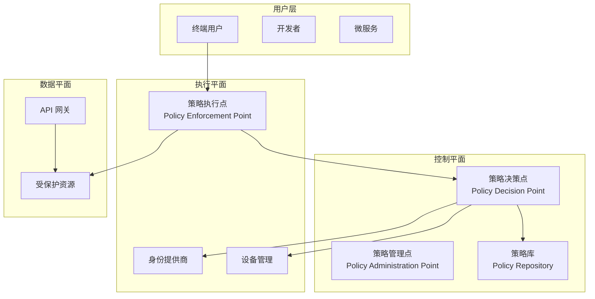
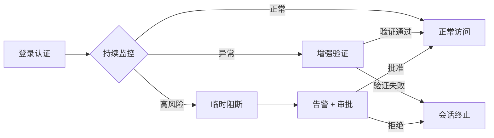
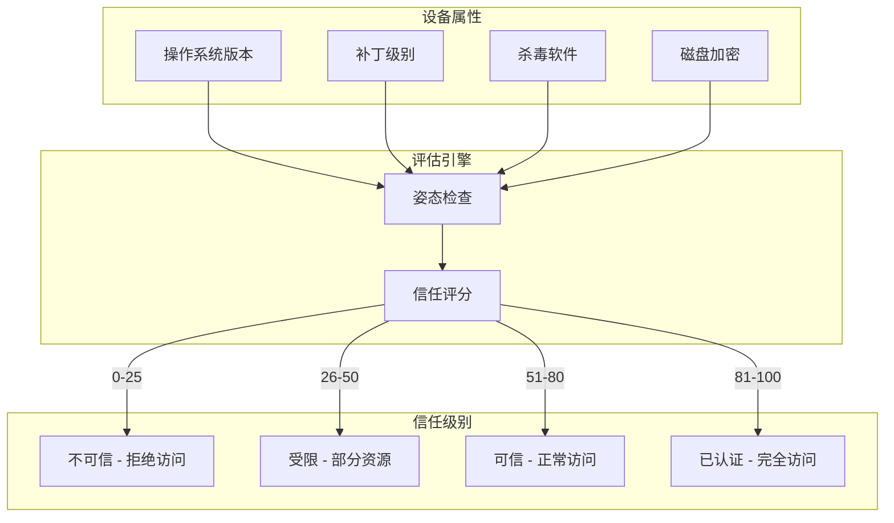
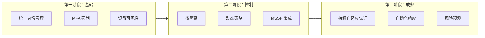

2014 年，Google 宣布其内部系统全面迁移到零信任架构 Zero Trust。在此之前，Google 员工可以通过公司网络访问大部分内部系统。2013 年的「棱镜门」事件让 Google 意识到一个关键问题：**内网并不等于安全**。

传统安全模型有一个根本性的假设：内网是可信的。但现实是，攻击者可以通过钓鱼、弱密码、内部威胁等多种方式进入内网。一旦进入内网，传统的边界安全就像纸糊的一样脆弱。

零信任（Zero Trust）正是对这一假设的根本性否定：**永不信任，始终验证**。

## 一、零信任身份的核心原则

### 三大核心原则

```
┌─────────────────────────────────────────────────────────────┐
│                     Zero Trust 三大原则                      │
├─────────────────────────────────────────────────────────────┤
│                                                             │
│   1. 永不信任，始终验证                                      │
│      → 每次访问都需要认证和授权                              │
│      → 不依赖网络位置判断信任                                │
│                                                             │
│   2. 最小权限访问                                           │
│      → 只授予完成任务所需的最低权限                          │
│      → 权限应该是临时的、有时间限制的                         │
│                                                             │
│   3. 假设已被攻破                                           │
│      → 设计系统时假设任何组件都可能被攻破                     │
│      → 限制攻击爆炸半径，快速检测和响应                       │
│                                                             │
└─────────────────────────────────────────────────────────────┘
```

### 与传统模型的对比

| 维度 | 传统边界安全 | 零信任安全 |
|------|--------------|------------|
| 信任基础 | 网络位置（内网可信） | 身份和设备 |
| 访问控制 | 静态规则 | 动态策略 |
| 认证时机 | 登录时一次认证 | 持续验证 |
| 权限粒度 | 粗粒度（基于网络） | 细粒度（基于资源） |
| 攻击面 | 内网服务暴露 | 隐藏服务 |
| 响应速度 | 被动响应 | 主动防御 |

## 二、传统边界安全模型的失效

### 边界安全的假设与现实

传统边界安全模型基于以下假设：

```
假设：
1. 防火墙内的网络是安全的
2. 员工不会故意或无意泄露凭证
3. 攻击者无法进入内网

现实：
1. VPN 漏洞导致内网暴露
2. 钓鱼攻击绕过边界防御
3. 内部威胁比外部攻击更常见
4. 云环境模糊了网络边界
```

### 真实攻击案例

**案例一：VPN 漏洞导致内网沦陷**

```
攻击路径：
1. 攻击者发现目标公司 VPN 存在漏洞（CVE-2021-22893）
2. 利用漏洞获取 VPN 服务器权限
3. 通过 VPN 进入内网
4. 发现内网服务没有二次认证
5. 直接访问敏感数据库
```

**案例二：供应链攻击**

```
攻击路径：
1. 攻击者入侵软件供应商
2. 通过供应商的 VPN 进入企业内网
3. 在内网横向移动
4. 获取域控制器权限
5. 部署勒索软件
```

**案例三：云环境下的边界模糊**

```
问题：
1. 开发者需要远程访问云环境
2. 传统的站点到站点 VPN 不够灵活
3. IAM 策略配置错误导致数据泄露
4. 临时凭证未及时回收
```

## 三、零信任身份的关键组件

### 核心组件架构



### 策略决策点（PDP）

PDP 是零信任的核心引擎，负责做出访问决策：

```java title="PolicyDecisionEngine.java"
@Service
@Slf4j
public class PolicyDecisionEngine {
    
    @Autowired
    private RiskAssessmentService riskService;
    
    @Autowired
    private DeviceTrustService deviceTrust;
    
    @Autowired
    private IdentityService identityService;
    
    /**
     * 访问决策
     * 结合用户身份、设备状态、风险评估做出决策
     */
    public AccessDecision evaluate(AccessRequest request) {
        
        // 1. 获取用户身份信息
        IdentityContext userContext = identityService.getContext(request.getUserId());
        
        // 2. 获取设备信任评估
        DeviceContext deviceContext = deviceTrust.evaluate(request.getDeviceId());
        
        // 3. 计算风险评分
        RiskScore riskScore = riskService.calculateScore(
            userContext, deviceContext, request);
        
        // 4. 获取资源策略
        ResourcePolicy policy = policyRepository.findByResource(request.getResource());
        
        // 5. 综合决策
        return makeDecision(userContext, deviceContext, riskScore, policy);
    }
    
    private AccessDecision makeDecision(
            IdentityContext user,
            DeviceContext device,
            RiskScore risk,
            ResourcePolicy policy) {
        
        // 检查设备信任级别
        if (device.getTrustLevel().ordinal() < policy.getMinDeviceTrust().ordinal()) {
            return AccessDecision.DENY.withReason("设备信任级别不足");
        }
        
        // 检查用户权限
        if (!user.hasPermission(policy.getRequiredPermission())) {
            return AccessDecision.DENY.withReason("用户权限不足");
        }
        
        // 检查风险评分
        if (risk.getScore() > policy.getMaxRiskScore()) {
            return AccessDecision.DENY.withReason("风险评分过高");
        }
        
        // 检查时间段
        if (!policy.isWithinAllowedTimeWindow(user)) {
            return AccessDecision.DENY.withReason("不在允许访问时间段内");
        }
        
        // 检查网络位置
        if (!policy.isAllowedNetworkLocation(device.getNetworkLocation())) {
            return AccessDecision.DENY.withReason("网络位置受限");
        }
        
        // 所有检查通过，授予临时访问权限
        return AccessDecision.PERMIT.withConditions(
            buildConditions(policy, risk));
    }
    
    private List<AccessCondition> buildConditions(ResourcePolicy policy, RiskScore risk) {
        List<AccessCondition> conditions = new ArrayList<>();
        
        // 高风险场景需要 MFA
        if (risk.getScore() > 50) {
            conditions.add(AccessCondition.REQUIRE_MFA);
        }
        
        // 敏感操作需要审批
        if (policy.requiresApproval()) {
            conditions.add(AccessCondition.REQUIRE_APPROVAL);
        }
        
        // 设置会话超时
        conditions.add(AccessCondition.setSessionTimeout(
            calculateTimeout(policy, risk)));
        
        return conditions;
    }
}
```

### 策略执行点（PEP）

PEP 部署在资源前面，负责执行 PDP 的决策：

```java title="PolicyEnforcementPoint.java"
@Component
@Slf4j
public class PolicyEnforcementPoint implements Filter {
    
    @Autowired
    private PolicyDecisionEngine pde;
    
    @Autowired
    private TokenService tokenService;
    
    @Override
    public void doFilter(ServletRequest servletRequest, 
                        ServletResponse servletResponse,
                        FilterChain chain) throws IOException, ServletException {
        
        HttpServletRequest request = (HttpServletRequest) servletRequest;
        HttpServletResponse response = (HttpServletResponse) servletResponse;
        
        // 构建访问请求
        AccessRequest accessRequest = buildAccessRequest(request);
        
        // 调用 PDP 获取决策
        AccessDecision decision = pde.evaluate(accessRequest);
        
        if (decision.getAction() == AccessAction.DENY) {
            log.warn("访问被拒绝: user={}, resource={}, reason={}",
                accessRequest.getUserId(), accessRequest.getResource(),
                decision.getReason());
            sendDenyResponse(response, decision);
            return;
        }
        
        // 执行决策条件
        executeConditions(decision.getConditions(), request, response);
        
        // 放行请求
        chain.doFilter(request, response);
    }
    
    private void executeConditions(List<AccessCondition> conditions,
                                   HttpServletRequest request,
                                   HttpServletResponse response) {
        for (AccessCondition condition : conditions) {
            switch (condition.getType()) {
                case REQUIRE_MFA:
                    enforceMFA(request, response);
                    break;
                case REQUIRE_APPROVAL:
                    requestApproval(condition, request, response);
                    break;
                case SESSION_TIMEOUT:
                    setSessionTimeout(response, condition.getTimeout());
                    break;
            }
        }
    }
}
```

## 四、持续自适应认证

### 持续认证的概念

传统认证是「一次性」的——用户登录后，后续请求不再验证。持续自适应认证（Continuous Adaptive Authentication）则在整个会话期间持续评估信任级别。



### 行为生物识别

通过分析用户的行为模式，持续验证用户身份：

| 行为特征 | 采集方式 | 用途 |
|----------|----------|------|
| 打字节奏 | 键盘事件 | 验证是本人操作 |
| 鼠标轨迹 | 鼠标移动事件 | 检测异常行为 |
| 触摸手势 | 触屏事件 | 移动端身份验证 |
| 常用位置 | IP 地理位置 | 检测异地登录 |
| 常用设备 | 设备指纹 | 检测新设备 |

```java title="BehavioralBiometricsService.java"
@Service
@Slf4j
public class BehavioralBiometricsService {
    
    @Autowired
    private BehaviorProfileRepository profileRepository;
    
    /**
     * 采集用户行为特征
     */
    public BehaviorFeatures extractFeatures(UserActivity activity) {
        BehaviorFeatures features = new BehaviorFeatures();
        
        // 打字节奏分析
        features.setTypingRhythm(analyzeTypingRhythm(activity.getKeystrokes()));
        
        // 鼠标移动特征
        features.setMouseDynamics(analyzeMouseDynamics(activity.getMouseMovements()));
        
        // 常用操作序列
        features.setActionSequence(extractSequence(activity.getActions()));
        
        return features;
    }
    
    /**
     * 计算与正常行为画像的相似度
     */
    public double calculateSimilarity(String userId, BehaviorFeatures current) {
        BehaviorProfile profile = profileRepository.findByUserId(userId)
            .orElseThrow(() -> new UserException("行为画像不存在"));
        
        double typingScore = cosineSimilarity(
            current.getTypingRhythm(), profile.getTypingRhythm());
        
        double mouseScore = cosineSimilarity(
            current.getMouseDynamics(), profile.getMouseDynamics());
        
        // 加权平均
        return 0.6 * typingScore + 0.4 * mouseScore;
    }
    
    /**
     * 检测异常行为
     */
    public List<AnomalySignal> detectAnomalies(String userId, 
            BehaviorFeatures current) {
        
        List<AnomalySignal> signals = new ArrayList<>();
        BehaviorProfile profile = profileRepository.findByUserId(userId).orElse(null);
        
        if (profile == null) {
            return signals;
        }
        
        double similarity = calculateSimilarity(userId, current);
        if (similarity < 0.7) {
            signals.add(AnomalySignal.builder()
                .type(AnomalyType.BEHAVIOR_DEVIATION)
                .severity(calculateSeverity(similarity))
                .description("行为特征偏离正常画像，相似度: " + similarity)
                .build());
        }
        
        return signals;
    }
}
```

### 风险信号聚合

```java title="RiskSignalAggregator.java"
@Service
@Slf4j
public class RiskSignalAggregator {
    
    /**
     * 多维度风险评分
     */
    public RiskScore aggregateSignals(List<RiskSignal> signals) {
        int totalScore = 0;
        Map<String, Integer> categoryScores = new HashMap<>();
        
        for (RiskSignal signal : signals) {
            totalScore += signal.getWeight();
            categoryScores.merge(
                signal.getCategory(), 
                signal.getWeight(), 
                Integer::sum);
        }
        
        // 严重类别有一票否决权
        if (categoryScores.getOrDefault("CRITICAL", 0) > 0) {
            return RiskScore.builder()
                .score(100)
                .categoryScores(categoryScores)
                .decision(RiskDecision.BLOCK)
                .build();
        }
        
        // 高风险类别加权
        if (categoryScores.getOrDefault("HIGH", 0) > 30) {
            totalScore = Math.min(100, totalScore + 20);
        }
        
        return RiskScore.builder()
            .score(totalScore)
            .categoryScores(categoryScores)
            .decision(mapScoreToDecision(totalScore))
            .build();
    }
    
    /**
     * 风险信号类型
     */
    public enum RiskSignalType {
        // 身份风险
        NEW_DEVICE("NEW_DEVICE", "新设备登录", 25, "IDENTITY"),
        UNUSUAL_LOCATION("UNUSUAL_LOCATION", "异常地理位置", 30, "IDENTITY"),
        IMPOSSIBLE_TRAVEL("IMPOSSIBLE_TRAVEL", "不可能的旅行", 50, "CRITICAL"),
        
        // 设备风险
        DEVICE_OUTDATED("DEVICE_OUTDATED", "设备系统过时", 15, "DEVICE"),
        DEVICE_ROOTED("DEVICE_ROOTED", "设备已越狱/Root", 40, "HIGH"),
        DEVICE_MISSING_SHIELD("DEVICE_MISSING_SHIELD", "缺少安全防护", 20, "DEVICE"),
        
        // 行为风险
        BEHAVIOR_DEVIATION("BEHAVIOR_DEVIATION", "行为偏离", 25, "BEHAVIOR"),
        RAPID_REQUESTS("RAPID_REQUESTS", "请求频率异常", 15, "BEHAVIOR"),
        
        // 威胁情报
        IP_BLACKLISTED("IP_BLACKLISTED", "IP 在黑名单", 60, "CRITICAL"),
        TOR_EXIT_NODE("TOR_EXIT_NODE", "使用 Tor 网络", 30, "HIGH");
        
        private final String code;
        private final String description;
        private final int weight;
        private final String category;
    }
}
```

## 五、设备信任与设备姿态评估

### 设备姿态评估模型

设备信任是零信任的关键维度：



### 设备信任评估实现

```java title="DeviceTrustEvaluator.java"
@Service
@Slf4j
public class DeviceTrustEvaluator {
    
    @Autowired
    private MDMService mdmService;
    
    @Autowired
    private VulnerabilityScanner vulnerabilityScanner;
    
    /**
     * 综合评估设备信任级别
     */
    public DeviceTrustLevel evaluate(DeviceContext context) {
        
        int totalScore = 0;
        List<String> findings = new ArrayList<>();
        
        // 1. 设备注册状态
        if (context.isRegistered()) {
            totalScore += 20;
            findings.add("设备已注册");
        } else {
            return DeviceTrustLevel.UNTRUSTED;
        }
        
        // 2. MDM 管理状态
        if (mdmService.isManaged(context.getDeviceId())) {
            totalScore += 15;
            findings.add("设备已纳入 MDM 管理");
        }
        
        // 3. 操作系统和补丁
        int patchScore = evaluatePatchLevel(context);
        totalScore += patchScore;
        
        // 4. 安全软件
        if (context.hasAntivirus() && context.isAntivirusUpToDate()) {
            totalScore += 15;
            findings.add("杀毒软件正常");
        }
        
        // 5. 磁盘加密
        if (context.isDiskEncrypted()) {
            totalScore += 15;
            findings.add("磁盘已加密");
        }
        
        // 6. 漏洞扫描
        int vulnScore = evaluateVulnerabilities(context);
        totalScore += vulnScore;
        
        // 7. 证书状态
        if (context.hasValidClientCertificate()) {
            totalScore += 10;
            findings.add("设备证书有效");
        }
        
        return DeviceTrustLevel.fromScore(totalScore);
    }
    
    private int evaluatePatchLevel(DeviceContext context) {
        int daysSinceLastUpdate = context.getDaysSinceLastSecurityUpdate();
        
        if (daysSinceLastUpdate <= 7) {
            return 15;
        } else if (daysSinceLastUpdate <= 30) {
            return 10;
        } else if (daysSinceLastUpdate <= 90) {
            return 5;
        } else {
            return 0;
        }
    }
}
```

## 六、最小权限访问与 Just-in-Time 访问

### 最小权限原则的实现

```java title="PrivilegeManager.java"
@Service
@Slf4j
public class PrivilegeManager {
    
    /**
     * 基于任务的权限授予
     */
    public JustInTimeAccess grantTaskPermission(String userId, 
            String taskId, 
            Duration duration) {
        
        // 1. 验证用户有权限申请此任务
        TaskPermission task = taskRepository.findById(taskId)
            .orElseThrow(() -> new TaskException("任务不存在"));
        
        if (!userHasTaskEligibleRole(userId, task)) {
            throw new SecurityException("用户无权申请此任务的权限");
        }
        
        // 2. 创建临时权限
        JustInTimeAccess access = JustInTimeAccess.builder()
            .id(UUID.randomUUID().toString())
            .userId(userId)
            .permissions(task.getPermissions())
            .resource(task.getResourceId())
            .validFrom(Instant.now())
            .validUntil(Instant.now().plus(duration))
            .reason(task.getDescription())
            .status(AccessStatus.PENDING_APPROVAL)
            .build();
        
        // 3. 如果需要审批
        if (task.requiresApproval()) {
            notifyApprovers(access);
        } else {
            activateAccess(access);
        }
        
        return access;
    }
    
    /**
     * 激活访问权限
     */
    private void activateAccess(JustInTimeAccess access) {
        access.setStatus(AccessStatus.ACTIVE);
        accessRepository.save(access);
        
        // 将权限添加到用户的有效权限集中
        permissionCache.invalidateUserPermissions(access.getUserId());
        
        // 设置自动回收任务
        scheduleRevocation(access);
        
        log.info("JIT 权限已激活: user={}, permissions={}, until={}",
            access.getUserId(), access.getPermissions(), access.getValidUntil());
    }
    
    /**
     * 自动回收权限
     */
    private void scheduleRevocation(JustInTimeAccess access) {
        scheduledExecutor.schedule(() -> {
            if (access.getStatus() == AccessStatus.ACTIVE) {
                revokeAccess(access.getId(), "自动过期");
            }
        }, access.getRemainingDuration().toMillis(), TimeUnit.MILLISECONDS);
    }
}
```

## 七、零信任身份的技术实现路径

### 实施路线图



### 技术栈选型

| 组件 | 开源选项 | 商业选项 |
|------|----------|----------|
| 身份提供商 | Keycloak, Dex | Okta, Azure AD, Google IAM |
| 策略引擎 | Open Policy Agent | Axiomatics, SailPoint |
| 微隔离 | Istio, Cilium | Illumio, Guardicore |
| SIEM | Wazuh, Elastic SIEM | Splunk, QRadar |
| UEBA | OpenDXL, Wazuh | Exabeam, Securonix |

## 八、零信任身份成熟度评估框架

### 成熟度等级

| 等级 | 名称 | 特征 | 组织占比（估计） |
|------|------|------|-----------------|
| L0 | 传统安全 | 边界防御，无内部分段 | 60% |
| L1 | 可见性增强 | 初步身份管理，部分 MFA | 25% |
| L2 | 策略执行 | 动态策略，设备评估 | 10% |
| L3 | 自适应 | 持续认证，风险评分 | 4% |
| L4 | 零信任成熟 | 全面自动化，预测分析 | 1% |

### 评估维度

```java title="ZeroTrustMaturityAssessment.java"
@Service
public class ZeroTrustMaturityAssessment {
    
    /**
     * 零信任成熟度评估
     */
    public MaturityReport assess(String organizationId) {
        MaturityReport report = new MaturityReport();
        report.setOrganizationId(organizationId);
        report.setAssessmentDate(Instant.now());
        
        // 各维度评估
        report.setIdentityMaturity(assessIdentityMaturity());
        report.setDeviceMaturity(assessDeviceMaturity());
        report.setNetworkMaturity(assessNetworkMaturity());
        report.setApplicationMaturity(assessApplicationMaturity());
        report.setDataMaturity(assessDataMaturity());
        
        // 综合评分
        report.setOverallScore(calculateOverallScore(report));
        
        // 改进建议
        report.setRecommendations(generateRecommendations(report));
        
        return report;
    }
    
    /**
     * 身份维度评估
     */
    private MaturityLevel assessIdentityMaturity() {
        int score = 0;
        List<String> findings = new ArrayList<>();
        
        // 检查因素
        if (hasCentralizedIdp()) score += 20;
        else findings.add("缺少集中身份提供商");
        
        if (hasMfaEnabled()) score += 20;
        else findings.add("MFA 覆盖率不足");
        
        if (hasPrivilegedAccessManagement()) score += 20;
        else findings.add("缺少特权访问管理");
        
        if (hasContinuousAuthentication()) score += 20;
        else findings.add("缺少持续认证机制");
        
        if (hasBehavioralAnalytics()) score += 20;
        else findings.add("缺少行为分析能力");
        
        return MaturityLevel.fromScore(score, findings);
    }
}
```

---

## 思考题

**问题 1**：零信任架构的核心假设是「假设已被攻破」。请分析：为什么这个假设比「假设内网可信」更合理？在实际实施中，如何将这一原则落实到具体的技术决策中？

<details>
<summary>参考答案</summary>

**为什么「假设已被攻破」更合理**：

1. **历史数据支持**
   - Verizon DBIR 报告显示，超过 80% 的数据泄露涉及内部资源
   - 很多攻击（如供应链攻击、钓鱼）能够绕过边界防御
   - 即使边界防御成功，横向移动仍是主要攻击路径

2. **现代 IT 环境特性**
   - 云环境模糊了网络边界
   - 远程办公成为常态，用户不在受保护的网络中
   - 微服务架构增加了内部通信的暴露面

3. **攻击成本的现实**
   - 攻击者的资源和技术能力在不断提升
   - 内部威胁（员工报复、疏忽）难以防御
   - 零日漏洞的存在意味着没有任何系统是绝对安全的

**在技术决策中的落实**：

```
1. 最小权限原则
   - 不授予「以防万一」的权限
   - 权限只在需要时授予，用完即回收
   - 敏感操作需要额外验证

2. 深度防御
   - 不依赖单一安全机制
   - 每层防御失效时还有后备防线
   - 攻击者需要突破多层才能达到目标

3. 快速检测与响应
   - 假设攻击已经发生
   - 目标是快速检测并限制损害范围
   - 爆炸半径应该尽可能小

4. 通信加密
   - 即使在内网，所有通信也应加密
   - 服务间通信使用 mTLS
   - 防止内网嗅探和中间人攻击

5. 持续验证
   - 不只是登录时验证
   - 整个会话期间持续评估信任级别
   - 异常时触发重新认证或阻断
```

</details>

**问题 2**：企业从传统边界安全迁移到零信任架构通常需要 2-3 年时间。在这个漫长的过程中，如何设计一个渐进式的迁移方案，使得业务连续性不受影响，同时能够逐步提升安全水平？请给出分阶段的实施计划。

<details>
<summary>参考答案</summary>

**渐进式迁移框架**：

```
┌─────────────────────────────────────────────────────────────────┐
│                      零信任迁移路线图                            │
├─────────────────────────────────────────────────────────────────┤
│                                                                 │
│  第1年：打基础                                                 │
│  ├── 统一身份平台                                              │
│  ├── 强制 MFA（高风险系统优先）                                │
│  ├── 设备可见性                                                │
│  └── 建立基准线                                                │
│                                                                 │
│  第2年：强控制                                                 │
│  ├── 微隔离（关键业务系统）                                    │
│  ├── 动态访问策略                                              │
│  ├── JIT 特权访问                                              │
│  └── 威胁检测能力                                              │
│                                                                 │
│  第3年：自适应                                                 │
│  ├── 持续自适应认证                                            │
│  ├── 自动化响应                                                │
│  ├── 风险预测                                                  │
│  └── 全面零信任                                               │
│                                                                 │
└─────────────────────────────────────────────────────────────────┘
```

**详细实施计划**：

**阶段 0：评估与规划（3-6 个月）**

```markdown
产出物：
1. 当前安全态势评估报告
2. 零信任成熟度基线
3. 关键资产清单
4. 实施路线图

关键里程碑：
- 完成所有系统分类（高/中/低风险）
- 确定试点系统（建议选择：邮件系统、VPN、内部协作平台）
- 建立度量指标
```

**阶段 1：身份统一与 MFA（6-12 个月）**

```
目标：建立统一的身份管理基础

关键技术：
1. 部署/升级 IdP（Keycloak、Okta、Azure AD）
2. 集成所有应用到 IdP
3. 强制 MFA（分批：
   - 第一批：管理员账号
   - 第二批：高敏感系统
   - 第三批：全员）
4. 建立设备注册和合规检查

风险控制：
- 保留传统认证作为回退
- 分时段灰度发布
- 建立快速回滚机制
```

**阶段 2：微隔离与动态策略（12-18 个月）**

```
目标：在身份之上建立网络层控制

关键技术：
1. 服务网格部署（Istio）
   - mTLS 强制
   - 服务级别策略
   
2. 微隔离实施
   - 识别关键业务流
   - 最小化允许列表
   - 异常流量告警
   
3. 动态访问策略
   - 基于风险评分调整访问权限
   - 基于设备信任级别决定资源访问
   
4. 特权访问管理（PAM）
   - 管理员账号纳入 PAM
   - JIT 权限提升
   - 会话录制和审计
```

**阶段 3：自适应与自动化（18-24 个月）**

```
目标：实现真正的零信任

关键技术：
1. 持续自适应认证
   - 行为生物识别
   - 异常检测
   - 实时风险评分
   
2. 自动化响应
   - 基于风险评分的自动化操作
   - 自动封锁可疑会话
   - 自动触发额外验证
   
3. 威胁预测
   - 威胁情报集成
   - 异常行为预测
   - 自动化威胁狩猎
```

**业务连续性保障措施**：

```
1. 双轨并行
   - 新旧认证方式共存
   - 灰度发布，逐步切换
   - 监控关键指标

2. 回退机制
   - 任何阶段可快速回退
   - 传统认证作为备份
   - 建立故障应急预案

3. 用户体验优先
   - 渐进式改变
   - 充分用户培训
   - 友好的异常处理界面

4. 监控与度量
   - 实时监控关键指标
   - 用户反馈快速响应
   - 持续优化体验
```

</details>
