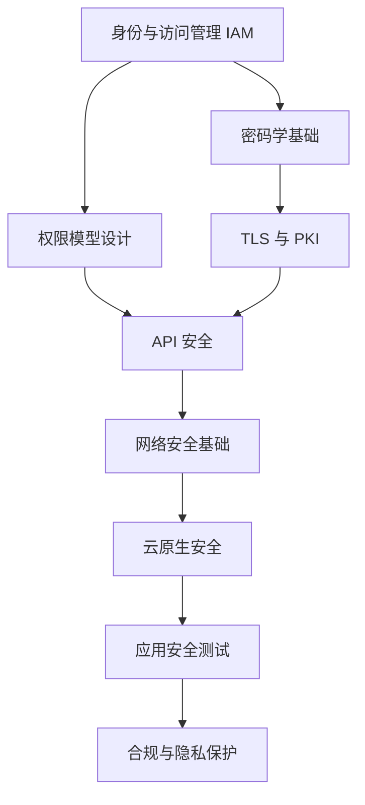

安全不是事后打补丁，而是从系统设计的第一天起就要考虑的事情。数据泄露、权限滥用、供应链攻击——这些事故的背后，往往不是攻击者的技术有多高明，而是防御体系存在结构性漏洞。

本模块覆盖安全架构的完整知识体系，从身份认证、权限控制、密码学基础，到 API 安全、网络防护、应用层防护，再到云原生环境下的特殊挑战，以及全球主要合规框架的应对策略。

## 模块结构

本模块分为八个专题：

| 专题 | 核心内容 | 适用角色 |
| --- | --- | --- |
| **身份与访问管理（IAM）** | OAuth2/OIDC/SAML/JWT/SSO/Keycloak/零信任身份 | 后端工程师、安全工程师 |
| **权限模型** | RBAC/ABAC/ReBAC/OPA/Casbin/分布式权限设计 | 架构师、后端工程师 |
| **密码学应用** | 对称/非对称加密/TLS/PKI/HSM/KMS/国密算法 | 安全工程师、基础设施工程师 |
| **API安全** | 认证/限流/防重放/签名/图灵盾/OWASP API Top 10 | 后端工程师、API设计师 |
| **网络安全** | 零信任/ZTNA/微分段/WAF/DDoS防护/BeyondCorp | 安全工程师、运维工程师 |
| **应用安全** | SDL/STRIDE/注入攻击/XSS/CSRF/SAST/DAST/RASP | 全栈工程师、安全工程师 |
| **云原生安全** | 容器镜像/K8s RBAC/运行时安全/供应链安全/SBOM | 云原生工程师、DevSecOps |
| **合规与隐私** | GDPR/等保/SOC2/ISO27001/PCI DSS/数据脱敏 | 安全合规工程师、法务 |

## 核心原则

### 最小权限原则（Principle of Least Privilege）

每个用户、进程、服务只被授予完成其任务所必需的最小权限。这一原则贯穿所有安全领域：身份认证中的 Scope 限制、权限模型中的 Role 分离、容器中的 Security Context 限制、网络中的最小化放行规则。

### 纵深防御（Defense in Depth）

没有任何单一的安全措施是万无一失的。真正的安全体系需要多层防御：网络层（WAF/防火墙）、应用层（输入验证/输出编码）、数据层（加密/脱敏）、身份层（强认证/MFA）。攻击者需要突破所有层级才能造成实质性破坏。

### 零信任（Zero Trust）

"永不信任，始终验证。" 无论是内部用户还是外部用户，无论是内部服务还是外部服务，每次访问请求都应该经过身份验证和授权检查。传统网络边界的「内网即安全」假设已经不再成立。

## 学习路径建议

对于初学者，建议从「身份与访问管理」→「密码学基础」→「API安全」这条主线入手，打好基础后再扩展到其他领域。有一定基础的工程师可以直接从「权限模型」或「API安全」切入，结合实际项目学习。

## 章节预览

### 身份与访问管理

- [IAM 概述与核心概念](/security/iam/overview) — 身份、凭证、认证、授权的基本定义
- [OAuth 2.0 协议深度解析](/security/iam/oauth2) — 授权框架的核心机制与演进
- [JWT 深度解析](/security/iam/jwt) — Token 结构、签名算法、安全考虑
- [OIDC 深度解析](/security/iam/oidc) — 在 OAuth2 基础上构建的身份层协议
- [SSO 架构设计](/security/iam/sso) — 单点登录的架构模式与会话管理
- [零信任身份架构](/security/iam/zero-trust-identity) — 永不信任、始终验证的身份体系

### 权限模型

- [授权模型概述](/security/authorization/overview) — RBAC/ABAC/ReBAC 的演进与适用场景
- [Google Zanzibar 论文解析](/security/authorization/zanzibar) — 大规模授权系统的工程实践
- [OPA 深度解析](/security/authorization/opa) — 策略即代码的理念与实现
- [Casbin 权限框架](/security/authorization/casbin) — 多模型支持的轻量级权限引擎

### 密码学应用

- [密码学基础概述](/security/cryptography/overview) — 对称、非对称、哈希、数字签名的基本原理
- [TLS/SSL 协议深度解析](/security/cryptography/tls) — 安全传输层的完整机制
- [证书与 PKI](/security/cryptography/pki) — 公钥基础设施的架构与证书链
- [密钥管理最佳实践](/security/cryptography/kms) — HSM/KMS 的选型与密钥生命周期管理

### API安全

- [API 安全概述](/security/api/overview) — API 安全的整体威胁模型
- [API 限流设计](/security/api/rate-limiting) — 令牌桶/滑动窗口算法的实现
- [防重放攻击](/security/api/anti-replay) — Nonce、Timestamp、数字签名方案
- [OWASP API Security Top 10](/security/api/owasp-top10) — API 特有的安全风险与防护

### 网络安全

- [零信任网络架构](/security/network/ztna) — ZTNA 的设计理念与实现路径
- [BeyondCorp 架构解析](/security/network/beyondcorp) — Google 内部零信任实践
- [微分段](/security/network/micro-segmentation) — 工作负载级别的精细化隔离
- [DDoS 防护策略](/security/network/ddos-protection) — 流量清洗、限速、黑洞路由

### 应用安全

- [STRIDE 威胁模型](/security/application/stride) — 微软的安全威胁分类方法论
- [SQL 注入原理与防护](/security/application/sql-injection) — 从原理到最佳实践
- [SAST/DAST/IAST/RASP](/security/application/sast) — 不同阶段的安全测试技术对比
- [OWASP Top 10 详解](/security/application/owasp-top10) — Web 应用安全风险的全景图

### 云原生安全

- [云原生安全概述](/security/cloud-native/overview) — 容器、K8s、服务网格带来的新挑战
- [容器镜像安全扫描](/security/cloud-native/image-scanning) — Trivy/Grype/Clair 的使用与集成
- [Kubernetes RBAC 深度解析](/security/cloud-native/k8s-rbac) — K8s 原生的权限控制机制
- [SBOM 软件物料清单](/security/cloud-native/sbom) — 供应链安全的基础

### 合规与隐私

- [GDPR 合规要点](/security/compliance/gdpr) — 欧盟数据保护条例的核心要求
- [中国等保 2.0](/security/compliance/djcp) — 等级保护制度的体系与测评流程
- [数据脱敏技术](/security/compliance/data-masking) — 动态脱敏与静态脱敏的实现
- [跨境数据传输合规](/security/compliance/cross-border) — 数据本地化与跨境评估

## 思考题

**问题 1**：在微服务架构中，如果每个服务都独立管理自己的 Token 验证逻辑，会遇到哪些一致性问题？统一的身份网关是否是唯一的解决方案？

参考答案

独立管理 Token 的主要问题包括：各服务对 Token 格式/验证规则理解不一致（可能导致安全漏洞）、黑名单/撤销列表难以跨服务同步、多语言/多框架实现质量参差不齐。

统一身份网关是常见方案，但不是唯一方案。其他方案包括：使用共享的 JWT 公钥（各服务本地验证）、使用 Sidecar 代理统一验证、使用服务网格的 mTLS + 授权策略（如 Istio 的 AuthorizationPolicy）。选择取决于团队规模、系统复杂度和安全要求。

**问题 2**：一个系统同时需要满足「中国等保 2.0三级」和「GDPR」的要求，这两个框架在数据保护方面有哪些交叉和冲突？

参考答案

交叉点：都强调数据分类分级、访问控制、审计日志、加密保护。

冲突点：等保 2.0 要求数据本地存储（特定等级需在境内），而 GDPR 允许数据自由流动；等保 2.0 的数据留存期限由系统等级决定，GDPR 要求在达成处理目的后删除；GDPR 有「数据可携带权」，等保 2.0 对数据出境有严格限制。

应对策略：在架构层面将数据按敏感度分级，高敏感数据严格遵循两者中更严格的要求；建立数据处理活动的完整记录，满足两者的文档化要求；使用「合规矩阵」对齐具体控制措施。

**问题 3**：在云原生环境中，为什么传统的「边界安全」模型会失效？

参考答案

三个根本原因：

1. **动态性**：Pod IP 不固定、服务实例随时扩缩容、容器生命周期以秒计，防火墙规则无法跟上这种变化节奏。

2. **扁平化网络**：K8s 默认的扁平网络让集群内任意 Pod 可以相互通信，任何被攻破的容器都可能成为横向移动的跳板。

3. **共享内核**：容器共享宿主机内核，一个容器内的内核漏洞可能影响整台主机，进而影响所有容器。

这就是零信任网络（ZTNA）和微分段（Micro-Segmentation）理念兴起的原因——不再依赖网络边界防护，而是对每个工作负载进行精细化的身份验证和访问控制。

