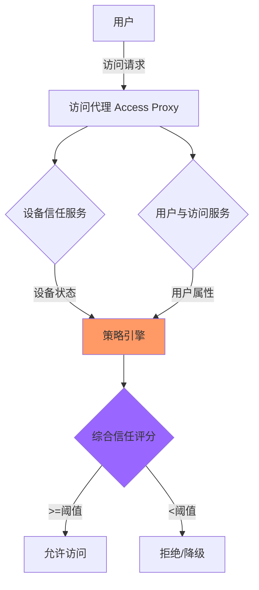

2011 年，Google 遭遇了著名的「 Aurora 」攻击。攻击者通过鱼叉式钓鱼邮件进入员工电脑，然后利用内网的信任关系逐步渗透，最终访问了 Gmail 的用户数据。这次攻击让 Google 意识到：**传统的「边界安全」模型无法保护一个拥有大量远程员工和复杂内网的组织**。

Google 没有选择加强边界防火墙，而是开启了为期多年的内部转型项目——**BeyondCorp**。这个项目的目标听起来简单：让员工无论身在何处，都能安全地访问公司资源，同时不再需要使用 VPN 或信任企业内网。

2014 年，Google 在官方博客上公开了 BeyondCorp 的核心设计，成为业界零信任架构的标杆案例。

## 传统企业安全模型的失效

传统企业安全模型建立在一个核心假设之上：**企业内网是可信的**。基于这个假设，安全控制集中在网络边界——防火墙、VPN、入侵检测——而内网中往往「畅通无阻」。

这个模型的失效源于几个根本性变化：

### 员工移动化

越来越多的员工在家中、咖啡馆、客户现场工作。传统的「在公司内网中才能访问内部系统」变得不切实际。VPN 成为刚需，但 VPN 本身成为了攻击面。

### 云服务的普及

企业的数据不再全部存放在本地数据中心。CRM、HR、代码仓库可能部署在 AWS、Salesforce、GitHub。企业网络边界变得模糊。

### 攻击者的进化

攻击者不再试图「正面突破」防火墙。他们通过钓鱼邮件、供应链攻击、漏洞利用等手段先进入内网，然后利用内网的「可信」属性横向移动。**边界防火墙对于已经进入内网的攻击者毫无作用**。

## BeyondCorp 的核心思想

BeyondCorp 的口号可以概括为：**「不在内网，等于不在公司」**（No more privileged internal networks）。

这意味着：无论员工身在何处，访问公司资源的信任评估方式都是一样的。位置（在家、在办公室、在咖啡馆）不再是信任的依据，取而代之的是：

- **你是谁**：身份验证
- **你的设备状态如何**：设备健康度
- **你想访问什么**：资源敏感度
- **你过去的行为是否正常**：持续监控



## BeyondCorp 的架构组件

### 1. 访问代理（Access Proxy）

访问代理是 BeyondCorp 的前门，所有访问请求都经过它。访问代理负责：

- **TLS 终止**：解密入站流量
- **协议强制**：只允许 HTTP/HTTPS，阻止直接 TCP 连接
- **身份注入**：将用户身份信息注入请求头
- **路由转发**：根据策略将请求转发到后端服务

访问代理不只是一个反向代理，它是一个智能网关。每个应用都应该在访问代理后面，不再直接暴露到网络。

### 2. 设备信任服务（Device Trust Service）

设备信任服务评估设备的安全状态：

- **清单管理**：跟踪每台企业设备（笔记本、手机、服务器）
- **状态检查**：验证设备是否满足安全基线
  - 操作系统版本和补丁级别
  - 防病毒软件状态
  - 磁盘加密状态
  - 是否有越狱/Root
- **证书管理**：为可信设备颁发证书
- **信任评分**：综合各项指标计算设备信任分数

设备证书存储在硬件 TPM（可信平台模块）或钥匙串中，防止被窃取和滥用。

### 3. 用户与访问服务（User & Access Service）

用户与访问服务管理身份和授权：

- **身份存储**：员工身份数据（姓名、部门、职位）
- **组管理**：动态组成员资格
- **角色定义**：定义不同角色的权限集合
- **访问策略**：将用户组、设备信任级别与资源对应

### 4. 策略引擎（Policy Engine）

策略引擎是 BeyondCorp 的大脑，决定每次访问是否被允许。决策输入包括：

| 因素 | 数据来源 |
|------|---------|
| 用户身份 | 用户与访问服务 |
| 用户组 | 用户与访问服务 |
| 设备证书 | 设备信任服务 |
| 设备状态 | 设备信任服务 |
| 资源敏感度 | 访问代理 |
| 时间 | 请求上下文 |
| 来源位置 | 访问代理 |

策略引擎输出是「访问级别」（Access Level）。

### 5. 访问级别（Access Level）

Access Level 是 BeyondCorp 的核心概念。它定义了一种「能力」，描述了满足什么条件的用户+设备可以访问什么资源：

```yaml
# 访问级别示例
access_levels:
  - name: "full-access"
    requires:
      user_groups: ["engineering"]
      device_trust: "high"
      mfa_verified: true
      
  - name: "limited-access"
    requires:
      user_groups: ["contractor"]
      device_trust: "medium"
      mfa_verified: true
      
  - name: "admin-access"
    requires:
      user_groups: ["system-admin"]
      device_trust: "high"
      managed_device: true
      source_ip: internal
```

应用声明自己需要的 Access Level，策略引擎根据用户和设备的实际状态决定是否满足。

## BeyondCorp 的实施效果

Google 报告了以下成果：

1. **VPN 使用率大幅下降**：员工不再需要 VPN 才能访问内部应用
2. **攻击面缩小**：所有应用都在访问代理后面，无法直接扫描和攻击
3. **权限管理精细化**：访问级别取代了粗粒度的网络访问权限
4. **安全可见性提升**：每次访问都有完整的审计日志

更重要的是：**即使攻击者窃取了某个员工的凭证，也无法访问敏感资源**，因为策略引擎会检查设备信任状态。凭证窃取的价值大大降低。

## BeyondCorp 的启示与局限性

### 核心启示

1. **安全不应该依赖网络位置**：无论在哪里工作，信任评估方式应该一致
2. **设备是新的边界**：在云时代，设备比网络更重要
3. **访问代理应该无处不在**：所有应用都应该通过统一的代理暴露
4. **策略应该集中**：分散的防火墙规则无法实现细粒度控制

### 局限性

1. **改造代价高**：BeyondCorp 需要改造几乎所有应用，添加认证层
2. **对遗留系统不友好**：老旧系统可能无法支持现代认证协议
3. **复杂性增加**：策略引擎成为关键依赖，需要高可用设计
4. **不完全公开**：Google 公开的是架构思想，核心实现细节并未公开

## 企业如何借鉴 BeyondCorp

### 渐进式实施路径

**第一阶段：可视化**

- 盘点所有应用，识别哪些暴露在公网
- 识别特权账户和服务账户
- 建立设备清单

**第二阶段：强身份**

- 强制实施 MFA
- 清理孤立的、服务共享的账户
- 实施最小权限

**第三阶段：代理化**

- 将应用迁移到访问代理后面
- 消除直接的网络访问（禁止 RDP、SSH 直接暴露）
- 实施基于角色的访问控制

**第四阶段：设备信任**

- 部署 MDM/EMM
- 建立设备安全基线
- 将设备状态纳入访问决策

**第五阶段：持续监控**

- 部署 SIEM
- 建立用户行为分析
- 实施动态策略

### 关键成功因素

1. **管理层支持**：这需要跨部门协作，没有高层支持难以推进
2. **足够的资源**：访问代理化需要大量开发和运维工作
3. **用户体验优先**：如果安全措施严重影响效率，员工会想办法绕过
4. **持续迭代**：BeyondCorp 不是一次性项目，而是持续演进

:::tip 关键洞察
BeyondCorp 的最大贡献不是技术方案，而是一种思维转变：安全应该围绕身份和设备，而不是网络边界。企业不需要完全复制 Google 的实现，但可以从中学到核心原则。
:::

## 思考题

**问题 1**：在 BeyondCorp 模型中，如果攻击者同时窃取了用户的凭证和其受信任设备（通过恶意软件控制设备），BeyondCorp 的防御是否会失效？应该如何应对这种场景？

<details>
<summary>参考答案</summary>

这种情况确实是 BeyondCorp 模型的一个潜在弱点。当攻击者同时控制凭证和设备时，传统的访问控制可能被绕过。

**应对策略**：

**动态风险评估**

BeyondCorp 应该引入持续的行为分析。如果攻击者使用设备的方式与正常用户不同（如登录时间异常、访问不常用的资源、批量下载数据），系统应该触发告警或要求额外验证。

**设备行为检测**

- EDR（终端检测与响应）检测设备的异常进程和流量
- 恶意软件检测识别设备上的恶意软件
- 即使攻击者有凭证，恶意软件的存在应该降低设备信任分数

**紧急响应机制**

- 检测到异常后，系统可以主动吊销设备证书
- 强制用户重新认证
- 触发安全响应流程

**根本缓解**

最好的防御是让攻击者难以同时获取凭证和设备：

- 硬件安全密钥（如 YubiKey）存储私钥，即使设备被控制，密钥也无法被窃取
- 设备上的证书存放在 TPM 中，恶意软件无法提取
- 关键操作需要重新输入 PIN 或生物识别

</details>

**问题 2**：BeyondCorp 的访问代理需要改造每个应用。在不改造遗留应用的情况下，如何实现类似的保护效果？

<details>
<summary>参考答案</summary>

遗留应用的改造确实是一个巨大挑战。以下是几种不需要改造应用的保护方案：

**方案一：网络层隔离**

- 将遗留应用放在完全隔离的网络区域
- 通过跳板机（如 Juiceshop）访问，用户先认证到跳板机
- 跳板机负责转发行为到应用，同时记录审计日志
- 缺点：用户体验差，无法保护应用本身的漏洞

**方案二：应用网关包装**

- 在应用前面部署 API 网关或 WAF
- 网关负责认证和授权
- 应用仍然接收真实用户请求，但无法直接被访问
- 缺点：只适用于 HTTP 服务

**方案三：隧道代理**

- 使用 Cloudflare Access、Zscaler 等商业产品
- 员工通过客户端连接代理，代理验证身份和设备
- 通过隧道访问应用时，真实 IP 被隐藏
- 应用仍然认为请求来自代理 IP

**方案四：渐进式改造**

- 短期：先用上述方案保护
- 中期：识别高频使用的遗留应用，优先改造
- 长期：将遗留应用迁移到新的 SaaS 方案或容器化

**推荐策略**：对于关键遗留系统，优先改造认证层（加入 SSO 和 MFA）；对于次要系统，使用商业 ZTNA 产品的隧道模式保护。

</details>
