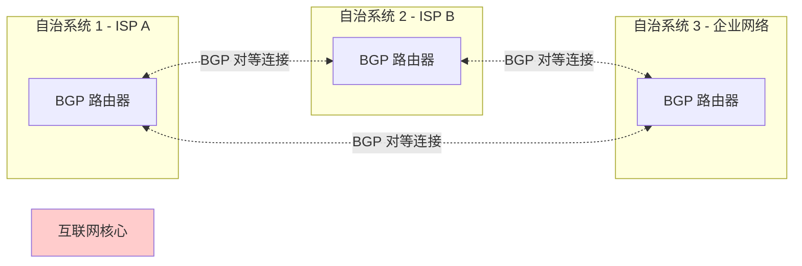
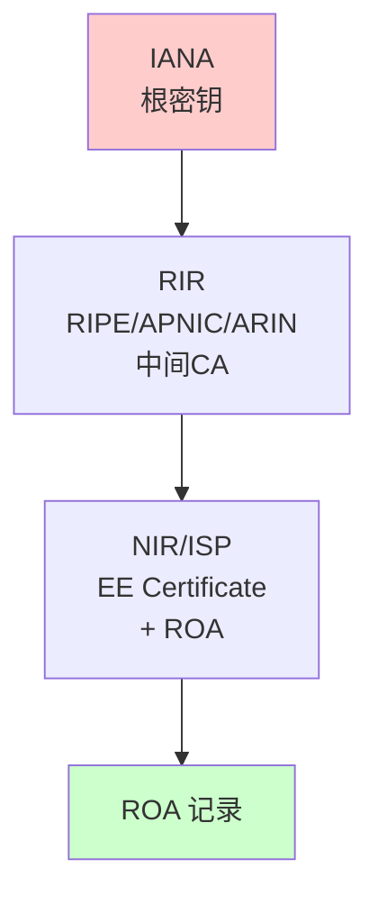
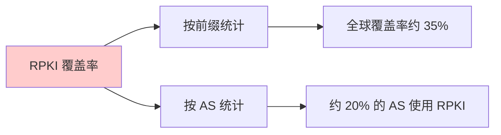
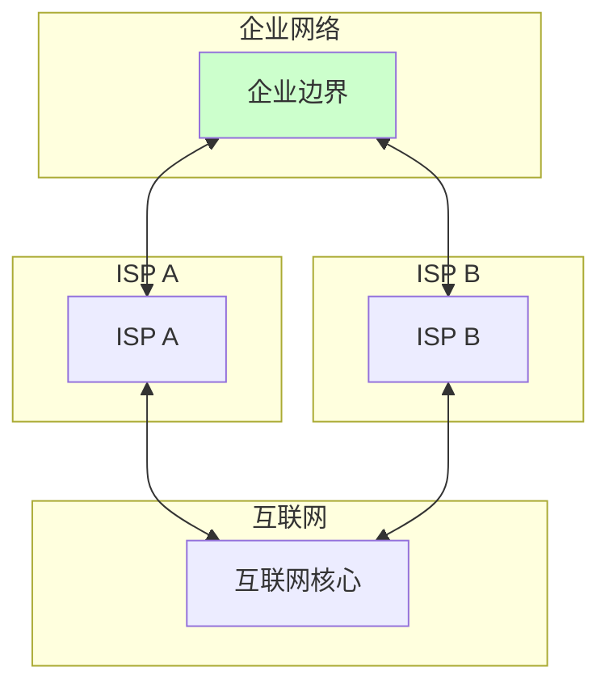

2018年4月，一场看似普通的网络故障却引发了轩然大波。亚马逊 Route 53 的 DNS 服务短暂中断，影响了包括 AWS 自身在内的数千个网站和服务。

但事后调查发现了更可怕的事实：这并非简单的故障，而是一次** BGP 劫持攻击**。攻击者通过伪造路由，短暂地将流向亚马逊 IP 地址的流量导向了自己的网络。虽然这次劫持只持续了约 15 分钟，但已经足够窃取加密货币或进行中间人攻击。

这个案例揭示了一个残酷的现实：**支撑互联网运行的 BGP 协议，诞生于 1989 年，几乎没有任何内置的安全机制**。直到今天，全球互联网的核心基础设施仍然脆弱不堪。

## 一、BGP 基础与安全风险

### 1.1 BGP 的工作原理

BGP（Border Gateway Protocol）是互联网的核心路由协议，负责在不同自治系统（AS）之间传递路由信息：



| 术语 | 说明 |
|------|------|
| AS（自治系统） | 同一管理下的网络集合，拥有唯一的 AS 号 |
| BGP 对等体 | 建立 BGP 连接的两个路由器 |
| 路由前缀 | IP 地址块（如 192.0.2.0/24） |
| AS-Path | 路由经过的 AS 序列 |
| NEXT_HOP | 到达目的网络的下一跳 IP |

### 1.2 BGP 的安全问题

| 问题类型 | 说明 | 严重性 |
|----------|------|--------|
| BGP 劫持 | 伪造路由宣告 | 极高 |
| BGP 泄密 | 意外泄露路由 | 高 |
| 路由震荡 | 路由频繁变化导致不稳定 | 中 |
| 中间人攻击 | 流量被导向攻击者网络 | 极高 |
| 拒绝服务 | 通过路由中断服务 | 高 |

### 1.3 BGP 安全风险的本质

BGP 的设计基于「信任」——它假设所有 AS 都会诚实地宣告自己的路由。但实际上：

1. **没有源验证**：无法验证一个 AS 是否真的拥有某个 IP 前缀
2. **没有完整性保护**：BGP 路由更新可以被篡改
3. **没有机密性**：路由信息是明文传输
4. **缺乏强制约束**：没有机制阻止恶意路由宣告

## 二、BGP 劫持攻击

### 2.1 攻击原理

BGP 劫持的核心是**宣告不属于自己 AS 的 IP 前缀**：

```mermaid
flowchart TD
    subgraph 正常情况
        A1[攻击者 AS] -.x|无法到达| A2[目标前缀 192.0.2.0/24]
        A3[用户] -->|路由| A4[合法 AS 64500]
        A4 --> A2
    end
    
    subgraph 劫持攻击
        B1[攻击者 AS 64499] -->|宣告 192.0.2.0/24| B3[ISP 64501]
        B3 --> B4[用户]
        B1 -->|真实路径| B2[目标前缀]
        B4 -->|被导向| B1
    end
```

### 2.2 BGP 劫持的类型

| 类型 | 说明 | 隐蔽性 |
|------|------|--------|
| 精确劫持 | 宣告完全相同的前缀 | 低 |
| 更精确劫持 | 宣告更长的前缀（更具体） | 高 |
| 路径中毒 | 修改 AS-Path 属性 | 中 |
| 子前缀劫持 | 宣告父前缀的部分范围 | 高 |

### 2.3 真实案例

> **2018年俄罗斯 BGP 劫持事件**
>
> 2018年4月，多个欧洲和亚洲的 ISP 收到了来自俄罗斯电信运营商的路由宣告，将大量 Google、Facebook、Apple 等公司的流量导向了俄罗斯网络。
>
> 事后分析认为，这可能是俄罗斯进行 DNS 拦截测试的一部分，用于创建「RuNet」——一个与全球互联网隔离的俄罗斯国内网络。
>
> 来源：Oracle Dyn Research

> **2022年 Discord BGP 劫持**
>
> 2022年8月，一次 BGP 劫持导致 Discord 的部分流量被导向乌克兰境内的一个 AS。虽然这次劫持可能是恶意的，但被劫持的流量主要用于监控而非进一步攻击。

## 三、RPKI 技术

### 3.1 RPKI 定义

RPKI（Resource Public Key Infrastructure）是一种为 BGP 路由提供来源验证的框架：

| 组件 | 说明 |
|------|------|
| RIR（区域互联网注册机构） | 管理 IP 地址分配（APNIC、ARIN、RIPE 等） |
| NIR（国家互联网注册机构） | 国家层面的 IP 地址管理 |
| ISP/企业 | 持有 IP 地址的组织 |
| ROA（路由起源授权） | 声明哪个 AS 允许宣告哪个前缀 |
| RPKI 信任链 | 从 IANA 到 RIR 到 Local Internet Registry |

### 3.2 RPKI 的信任链



### 3.3 ROA 的工作原理

```yaml title="ROA 结构"
# ROA 示例
# AS 64499 被授权宣告 192.0.2.0/24 前缀

roa_record:
  prefix: "192.0.2.0/24"
  max_length: 24      # 最长前缀长度（可宣告 192.0.2.0/24 - 192.0.2.0/24）
  asn: "AS64499"
  not_before: "2024-01-01T00:00:00Z"
  not_after: "2029-12-31T23:59:59Z"

# 验证逻辑
# 1. 查询前缀 192.0.2.0/24 的 ROA
# 2. 检查宣告该前缀的 AS 是否在 ROA 授权的 AS 列表中
# 3. 如果不在，则该路由无效（INVALID）
```

### 3.4 RPKI 验证结果

| 结果 | 含义 | 处理方式 |
|------|------|----------|
| VALID | 前缀被授权给宣告的 AS | 接受路由 |
| INVALID - Not Found | 前缀没有对应的 ROA | 取决于策略（通常接受） |
| INVALID - ASN Mismatch | AS 未被授权宣告该前缀 | 应该拒绝 |
| INVALID - Prefix Length | 前缀超出 ROA 允许的最大长度 | 应该拒绝 |

### 3.5 RPKI 部署步骤

**步骤 1：建立 RPKI 基础设施**

```bash
# 安装 RPKI 验证软件（使用 rpki-client）
pkg install rpki-client

# 或者使用 Routinator（更易用）
docker run -d --name routinator \
  -p 8080:8080 \
  -v routinator-data:/data \
  nlnetlabs/routinator \
  routinator daemon \
  --http 0.0.0.0:8080 \
  --export-sqlite /data/routinator.sqlite
```

**步骤 2：生成和发布 ROA**

```bash
# 通过 RIR/NIR 的管理门户创建 ROA
# 以下是通过 Bird 进行 RPKI 配置的示例

# /etc/bird/rpki.conf
rpki {
    # RPKI 验证服务器
    roa4 {
        table "rpki";
        remote "192.0.2.1" port 323;
    };
    roa6 {
        table "rpki";
        remote "2001:db8::1" port 323;
    };
}

# 启用 RPKI 验证
protocol rpki "rpki" {
    remote "rpki-validator.example.com" port 323;
    
    # 连接配置
    retry_interval 600;
    refresh_interval 3600;
    expire_interval 7200;
}
```

**步骤 3：配置路由策略**

```bash
# Bird 路由策略配置
# /etc/bird/bird.conf

filter rpki_filter {
    # 获取 ROA 验证结果
    if rpki_invalid() then {
        # 拒绝 RPKI 无效的路由
        # 或者降级处理
        # reject;
        
        # 降级：降低优先级但不拒绝
        bgp_path.prepend(65500);
    }
}

# 应用到 BGP 对等连接
protocol bgp Peering {
    neighbor as 64499;
    table master;
    
    import filter {
        # 应用 RPKI 过滤
        if ! rpki_valid() then {
            # 不接受 RPKI 验证失败的路由
            reject;
        }
        accept;
    };
    
    export where proto = "kernel";
}
```

### 3.6 RPKI 部署现状



| 地区 | RPKI 覆盖率 |
|------|-------------|
| 欧洲 | 约 45% |
| 北美 | 约 40% |
| 亚太 | 约 30% |
| 拉丁美洲 | 约 25% |
| 非洲 | 约 15% |

:::warning RPKI 不是银弹
RPKI 只解决了「起源验证」问题，无法防止 AS-Path 篡改、路径截断等攻击。要全面保护 BGP 安全，还需要 BGPSec 和其他技术的支持。
:::

## 四、BGP 过滤与验证

### 4.1 路由过滤原则

| 过滤类型 | 说明 | 重要性 |
|----------|------|--------|
| 前缀长度过滤 | 拒绝过长或过短的前缀 | 高 |
| 前缀列表 | 只接受特定前缀 | 高 |
| AS_PATH 过滤 | 拒绝包含特定 AS 的路径 | 中 |
| NEXT_HOP 验证 | 确保下一跳可达 | 高 |
| RPKI 验证 | 使用 RPKI 验证路由来源 | 高 |

### 4.2 基础 BGP 过滤配置

```yaml title="BGP 过滤配置示例（Juniper）"
# 前缀长度过滤
policy-options {
    policy-statement PREFIX-LENGTH-FILTER {
        term ALLOW_VALID {
            from {
                prefix-list {
                    # 允许 /8 到 /24 的前缀
                    valid-prefixes;
                }
            }
            then accept;
        }
        term REJECT_OVERSPECIFIC {
            # 拒绝 /25 及更长的前缀
            from {
                route-filter 0.0.0.0/0 prefix-length-range /25-/32;
            }
            then reject;
        }
        term REJECT_VERY_SPECIFIC {
            # 拒绝 /8 以下的前缀（可能是攻击）
            from {
                route-filter 0.0.0.0/0 prefix-length-range /0-/7;
            }
            then reject;
        }
    }
}

# RPKI 验证策略
protocols {
    bgp {
        group PEERS {
            neighbor 192.0.2.1 {
                authentication-key "xxxxx";
                import [ RPKI_VALIDATE PREFIX-LENGTH-FILTER ];
                export PREFIX-LENGTH-FILTER;
            }
        }
    }
}
```

### 4.3 IRR（互联网路由注册库）

IRR（Internet Routing Registry）提供了类似于 RPKI 的路由验证来源：

| IRR 数据库 | 运营者 | 覆盖范围 |
|-----------|--------|----------|
| RADB | Merit Network | 全球 |
| RIPE | RIPE NCC | 欧洲、中东 |
| ARIN | ARIN | 北美 |
| APNIC | APNIC | 亚太 |

```bash title="IRR 路由验证"
# 使用 bgpstream 或 peval 工具验证路由来源
peval --irr-check --asn 64499 192.0.2.0/24

# 输出示例
# ASN in Route:      64499
# ASN in IRR:        64499
# Prefix in IRR:     192.0.2.0/24
# Source:            RIPE
# Route Origin:      VALID
```

## 五、MANRS

### 5.1 MANRS 是什么

MANRS（Mutually Agreed Norms for Routing Security）是一套由互联网协会推动的路由安全倡议，包含四个核心行动：

| 行动 | 说明 | 编码 |
|------|------|------|
| 防止错误路由宣告 | 使用 RPKI 和 IRR 过滤 | 行动 1 |
| 防止路由泄漏 | 正确配置路由策略 | 行动 2 |
| 促进协调 | 与对等体保持联系 | 行动 3 |
| 促进过滤 | 过滤下游客户的路由 | 行动 4 |

### 5.2 MANRS 参与者

| 参与者类型 | 要求 | 好处 |
|-----------|------|------|
| 运营商 | 实施所有 4 个行动 | 减少路由事件 |
| 交换点 (IXP) | 实施行动 1、3、4 | 提供 RPKI 验证服务 |
| 成员网络 | 实施行动 1 | 验证上游宣告 |
| 学术/研究网络 | 实施行动 1 | 安全研究合作 |

### 5.3 MANRS 验证工具

```bash title="MANRS Compliance 检查"
# 使用 MANRS 提供的工具检查 AS 的合规性
curl -s "https://api.manifold0.com/manrs/v1/asn/AS64499" | jq .

# 输出示例
{
  "asn": "64499",
  "name": "Example Network",
  "type": "ISP",
  "compliance": {
    "action_1": {
      "name": "Preventing route leaks",
      "status": "IMPLEMENTED",
      "details": "RPKI ROA published for 90% of prefixes"
    },
    "action_2": {
      "name": "Preventing path deception",
      "status": "PARTIAL",
      "details": "IRR filters configured"
    },
    "action_3": {
      "name": "Promoting coordination",
      "status": "IMPLEMENTED",
      "details": "Contact info in PeeringDB"
    },
    "action_4": {
      "name": "Promoting filtering",
      "status": "NOT_IMPLEMENTED",
      "details": "Customer route filters not configured"
    }
  },
  "overall_score": 75
}
```

## 六、BGPSec 进展

### 6.1 BGPSec 的设计

BGPSec 是为 BGP 添加完整安全性的协议扩展，解决 RPKI 无法解决的问题：

| 问题 | RPKI 解决 | BGPSec 解决 |
|------|----------|-------------|
| 起源验证 | ✓ | ✓ |
| AS-Path 篡改 | ✗ | ✓ |
| 路径验证 | ✗ | ✓ |

### 6.2 BGPSec 的挑战

| 挑战 | 影响 |
|------|------|
| 部署复杂度 | 需要所有 AS 升级路由器 |
| 性能开销 | 签名验证增加 CPU 负载 |
| 密钥管理 | 整个 AS 路径的密钥管理 |
| 部署进度 | 需要全球协调 |

### 6.3 BGPSec vs RPKI

| 维度 | RPKI | BGPSec |
|------|------|--------|
| 部署范围 | 只需上游支持 | 需要整个路径支持 |
| 性能影响 | 低 | 中 |
| 覆盖攻击 | 仅起源 | 起源 + 路径 |
| 当前状态 | 生产可用 | 草案阶段 |

:::warning BGPSec 部署困难
截至目前，BGPSec 仍处于 IETF 草案阶段，主要原因是需要全球所有 AS 协调部署。在可预见的未来，RPKI 仍将是主要的 BGP 安全解决方案。
:::

## 七、企业如何应对 BGP 风险

### 7.1 企业的 BGP 风险

| 风险类型 | 对企业的影响 |
|----------|-------------|
| 上游 ISP 被劫持 | 流量被导向攻击者 |
| 合作方 AS 泄漏 | 意外路由泄露 |
| 对等连接劫持 | 部分流量被截获 |

### 7.2 企业应对措施

**措施 1：多 ISP 接入**



**措施 2：使用 Route Origin Authorization (ROA)**

```bash
# 企业需要向 RIR/NIR 申请并发布 ROA
# 1. 确定需要宣告的前缀
# 2. 确定宣告的 AS 号
# 3. 创建 ROA 记录

# ROA 示例：企业 AS64499 宣告 198.51.100.0/24
roa create --asn 64499 --prefix 198.51.100.0/24 --max-length 24
```

**措施 3：监控 BGP 路由变化**

```bash title="BGP 监控脚本"
#!/bin/bash
# bgp_monitor.sh

# 使用 BGPStream 监控特定前缀
bgpstream read \
    --filter "prefix more 192.0.2.0/24" \
    --collector route-views.linx \
    --collector route-views.eqix \
    --collector route-views.isc | \
while read line; do
    # 解析 BGP 消息
    TIMESTAMP=$(echo $line | jq -r '.timestamp')
    PREFIX=$(echo $line | jq -r '.prefix')
    AS_PATH=$(echo $line | jq -r '.as_path')
    
    # 检测异常
    if echo "$AS_PATH" | grep -q "64499"; then
        # 记录 ROA 验证失败的宣告
        echo "[$(date)] ALERT: Unexpected AS 64499 in path to $PREFIX"
        echo "AS_PATH: $AS_PATH"
        
        # 发送告警
        curl -X POST "https://alerting.example.com/webhook" \
            -d "message=BGP anomaly detected: $PREFIX via $AS_PATH"
    fi
done
```

**措施 4：部署 BGP 监控服务**

| 服务 | 提供商 | 功能 |
|------|--------|------|
| Route Origin Verification | RPKI Validator | 检查 ROA 状态 |
| BGPWatch | NTT | 实时监控 |
| ThousandEyes | Cisco | BGP + 网络监控 |
| BGPStream | CAIDA | 开源 BGP 分析 |

## 八、路由安全最佳实践

### 8.1 ISP 最佳实践

| 实践 | 说明 |
|------|------|
| 部署 RPKI | 发布 ROA，验证入站路由 |
| 前缀过滤 | 拒绝过短或过长的前缀 |
| AS_PATH 过滤 | 拒绝包含私有 AS 的路径 |
| IRR 验证 | 使用 IRR 数据验证路由 |
| 客户路由过滤 | 验证客户宣告的路由 |
| Route flap damping | 抑制不稳定的路由 |

### 8.2 企业最佳实践

| 实践 | 说明 |
|------|------|
| 发布 ROA | 确保自己前缀的 RPKI 状态为 VALID |
| 多 ISP 接入 | 减少单点故障 |
| 监控上游通告 | 监控自己 IP 前缀的路由变化 |
| PeeringDB 更新 | 保持联系信息最新 |
| 与 ISP 协调 | 了解 ISP 的安全策略 |

### 8.3 验证检查清单

- [ ] 是否已向 RIR/NIR 发布 ROA？
- [ ] ROA 是否覆盖所有宣告的前缀？
- [ ] 上游 ISP 是否启用了 RPKI 验证？
- [ ] 是否配置了前缀长度过滤？
- [ ] 是否监控自己前缀的 BGP 路由？
- [ ] 是否有多 ISP 接入？

:::tip 关键洞察
BGP 安全是一场持久战。RPKI 的部署仍在进行中，BGPSec 的普及更是遥遥无期。在过渡期间，企业需要：
1. 积极部署 RPKI（发布 ROA + 验证上游）
2. 建立 BGP 监控能力
3. 与 ISP 合作推动路由安全
4. 参与 MANRS 等行业倡议
:::

## 思考题

**问题 1**：某公司拥有自己的 IP 地址块，并通过上游 ISP 宣告到互联网。请分析该公司面临哪些 BGP 安全风险，以及应该如何部署 RPKI 来保护自己的 IP 前缀？

<details>
<summary>参考答案</summary>

**BGP 安全风险分析**：

**风险 1：BGP 劫持**
- 恶意 AS 宣告相同的 IP 前缀
- 流量被导向攻击者网络
- 可能导致服务中断或数据泄露

**风险 2：BGP 泄漏**
- 上游 ISP 意外泄露了客户的路由
- 其他 AS 可能接受了这条路由
- 流量可能走非预期路径

**风险 3：上游 ISP 被劫持**
- 如果上游 ISP 的 BGP 配置被攻击
- 通过上游 ISP 的所有路由都可能受影响

**RPKI 部署步骤**：

**步骤 1：确定 IP 地址所有权**
```bash
# 查询 IP 地址的注册信息
whois 192.0.2.0/24 | grep -E "origin|inetnum|netname|descr"

# 输出示例
# origin: AS64499
# netname: EXAMPLE-NET
```

**步骤 2：在 RIR/NIR 创建 ROA**

对于 APNIC/ARIN/RIPE 等：
- 登录 RIR 的管理门户
- 找到你的 IP 分配记录
- 创建 ROA，指定：
  - AS 号：你的 AS 号（如 64499）
  - 前缀：你拥有的 IP 前缀
  - 最大前缀长度：通常设为你的分配大小

**步骤 3：验证 ROA 状态**
```bash
# 使用 RPKI 验证工具
roa-check --asn 64499 192.0.2.0/24

# 或使用在线工具
# https://rpki-validator.arin.net/
```

**步骤 4：监控 RPKI 状态**
- 定期检查 ROA 状态是否为 VALID
- 设置告警，当状态变化时通知
- 确保证书续期不会中断

**步骤 5：要求上游 ISP 启用 RPKI 验证**
- 联系上游 ISP
- 要求他们对入站路由进行 RPKI 验证
- 确认他们会拒绝 RPKI INVALID 的路由
</details>

**问题 2**：BGP 安全问题的根本原因是缺乏全球协调和激励机制。为什么即使有 RPKI 这样成熟的技术，全球部署率仍然不高？请从技术和经济两个角度分析。

<details>
<summary>参考答案</summary>

**技术层面的障碍**：

**1. 路由器兼容性**
- 旧路由器可能不支持 RPKI
- 升级路由器成本高昂
- 运营商网络复杂，升级周期长

**2. 密钥管理复杂性**
- RPKI 需要公钥基础设施
- 证书管理、续期、吊销需要流程
- 密钥泄露风险需要应对

**3. 验证逻辑复杂性**
- RPKI INVALID 路由的处理策略不统一
- 有些运营商选择接受而非拒绝
- 可能影响正常路由

**经济层面的障碍**：

**1. 缺乏直接利益**
- RPKI 保护的是整个互联网
- 单个运营商部署的边际收益低
- 「搭便车」心态

**2. 部署成本**
- 软件/硬件升级
- 人员培训
- 运营维护

**3. 客户不感知**
- BGP 安全问题对普通用户透明
- 客户不会因为 RPKI 部署选择 ISP
- 缺乏市场激励机制

**解决方案建议**：

**短期**：
- 行业协会推动（RIPE、APNIC 等）
- 大型 ISP 带头部署
- 监管要求（某些国家可能立法）

**长期**：
- 互联网治理机构推动
- 开发更简单的 RPKI 工具
- 建立 RPKI 部署激励机制

**现实案例**：
Google Cloud 和 Amazon 已经要求上游 ISP 使用 RPKI 验证。这表明大客户可以推动整个生态向前发展。
</details>
