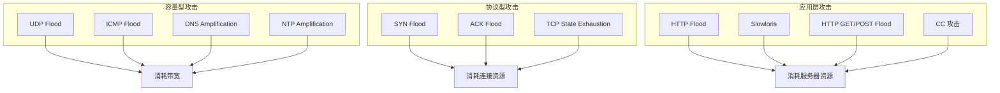
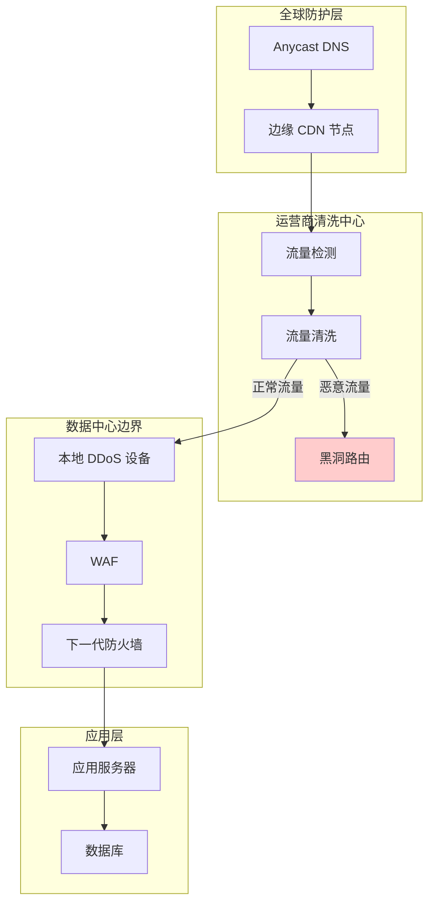
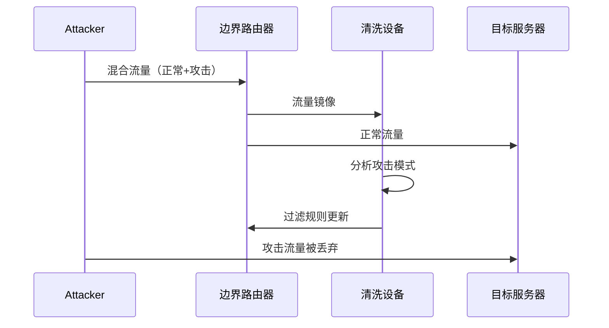
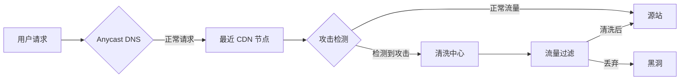
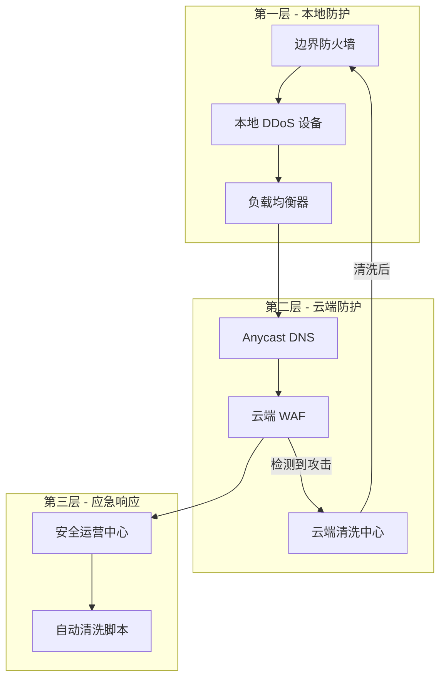
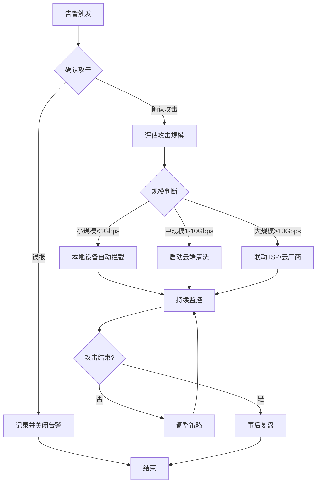

2016年10月21日，美国东海岸的互联网经历了一次前所未有的瘫痪。Twitter、GitHub、Netflix、Airbnb 等数十个知名网站无法访问，数亿用户受到影响。事后调查发现，攻击流量来自全球数千万被劫持的 IoT 设备（如摄像头、路由器），攻击峰值达到 1.2 Tbps。

这就是 **DDoS（分布式拒绝服务）攻击**的威力。与传统的 DoS（拒绝服务）攻击不同，DDoS 利用分布式的僵尸网络，从全球多个节点同时发起攻击，使得防御变得异常困难。一个有趣的事实是：**2016年 Mirai 僵尸网络源码被公开后，类似的攻击事件数量翻了三倍**。今天，任何一个「脚本小子」都可以用现成的工具发起Gbps级别的攻击。

## 一、DDoS 攻击的分类

理解防护策略之前，需要先了解攻击类型。



### 1.1 容量型攻击（Volumetric Attacks）

通过发送大量流量耗尽目标带宽。常见手法：

- **UDP Flood**：发送大量 UDP 数据包，刷新随机端口
- **ICMP Flood**：发送大量 ICMP Echo Request
- **放大攻击（Amplification）**：利用协议的响应放大特性，发送小请求获得大响应

:::warning 放大攻击的威力
NTP 放大攻击的放大比可达 200:1 以上。攻击者发送 100 Mbps 的请求，被放大后可能产生 20 Gbps 的攻击流量。这就是为什么看起来「小」的请求能造成「大」的攻击效果。
:::

### 1.2 协议型攻击（Protocol Attacks）

利用协议设计缺陷或状态处理机制消耗资源：

- **SYN Flood**：发送大量 SYN 包，但不完成三次握手，耗尽半开连接队列
- **TCP State Exhaustion**：消耗防火墙、负载均衡器的会话表

### 1.3 应用层攻击（Application Layer Attacks）

模拟正常用户行为，但以异常频率发起请求：

- **HTTP Flood**：大量 HTTP GET/POST 请求
- **Slowloris**：保持连接打开但缓慢发送数据，耗尽服务器连接数
- **CC 攻击**：针对特定 expensive endpoint（如搜索、报表）

## 二、DDoS 防护的整体架构

现代 DDoS 防护不是单一设备能解决的问题，而是多层防御体系的协同。



## 三、本地防护（On-Premise）

### 3.1 DDoS 防护设备

本地防护设备部署在数据中心入口，主要功能：

| 功能 | 说明 |
|------|------|
| 流量基线学习 | 正常流量模式，识别异常 |
| 速率限制 | 对源 IP、目标端口等维度限速 |
| 协议验证 | TCP 协议合法性检查 |
| 连接限制 | 单 IP 并发连接数限制 |
| 行为分析 | 检测异常访问模式 |

常见的本地 DDoS 设备厂商：

- Radware DefensePro
- Fortinet FortiDDoS
- Arbor Networks
- 华为 AntiDDoS

### 3.2 流量清洗的原理

流量清洗的核心是在攻击流量到达目标之前将其分离：

1. **流量镜像**：将入口流量镜像一份到清洗设备
2. **攻击检测**：通过签名匹配、行为分析识别攻击流量
3. **流量过滤**：丢弃攻击流量，正常流量放行
4. **流量回注**：将清洗后的流量送回目标



## 四、云端防护

### 4.1 Anycast 架构

Anycast 是云端 DDoS 防护的基础架构。它将同一 IP 地址发布到全球多个 POP 点，用户请求被路由到最近的节点。

**工作原理**：

- DNS 返回最近的清洗中心 IP
- 攻击流量被分散到多个清洗节点
- 每个节点只需处理部分流量

### 4.2 云端清洗的优势

| 维度 | 本地防护 | 云端防护 |
|------|---------|----------|
| 带宽容量 | 受限于自有带宽 | 接近无限 |
| 部署周期 | 数周 | 数小时 |
| 成本模型 | 一次性投入 | 按流量计费 |
| 维护复杂度 | 高 | 低 |
| 攻击溯源 | 困难 | 较易 |

### 4.3 流量清洗流程



清洗中心通常采用以下技术：

- **协议栈挑战**：发送 TCP SYN cookies 验证来源
- **行为分析**：识别僵尸网络特征
- **机器学习**：识别新型攻击模式
- **IP 信誉库**：标记已知恶意 IP 段

## 五、黑洞路由（Blackhole Routing）

黑洞路由是最简单也最粗暴的防护手段：将攻击流量路由到 `null0` 接口，直接丢弃。

```bash
# Cisco 路由器黑洞路由配置示例
ip route 192.0.2.0 255.255.255.0 null0

# BGP 黑洞路由：通过 BGP 宣告更长的黑名单路由
router bgp 65001
 network 192.0.2.0 mask 255.255.255.0
```

### 黑洞路由的代价

- **所有流量都会被丢弃**，包括正常用户请求
- 适用于攻击流量远超自身带宽的场景
- 通常作为最后手段使用

:::danger 业务中断风险
黑洞路由会导致整个服务不可用。2023年，Cloudflare 的一次误操作导致全球多个网站短暂不可访问。实施黑洞路由需要完善的告警机制和回滚预案。
:::

## 六、速率限制（Rate Limiting）

速率限制是最精细化的 DDoS 防护手段，针对不同维度设置阈值。

### 6.1 常见的限速维度

| 维度 | 说明 | 示例 |
|------|------|------|
| 源 IP | 单 IP 请求频率 | 每 IP 每秒最多 10 个请求 |
| 目标端口 | 特定端口的连接数 | 每端口每秒最多 1000 连接 |
| 连接数 | 并发连接数限制 | 单 IP 最多 100 并发 |
| 带宽 | 出入方向带宽限制 | 单 IP 带宽上限 10 Mbps |

### 6.2 限速算法

```java title="令牌桶限速实现"
public class TokenBucketRateLimiter {
    private final long capacity;          // 桶容量
    private final double refillRate;      // 每秒补充令牌数
    private double tokens;                // 当前令牌数
    private long lastRefillTimestamp;     // 上次补充时间
    
    public TokenBucketRateLimiter(long capacity, double refillRate) {
        this.capacity = capacity;
        this.refillRate = refillRate;
        this.tokens = capacity;
        this.lastRefillTimestamp = System.currentTimeMillis();
    }
    
    public synchronized boolean tryAcquire() {
        refill();
        if (tokens >= 1) {
            tokens -= 1;
            return true;
        }
        return false;
    }
    
    private void refill() {
        long now = System.currentTimeMillis();
        double elapsed = (now - lastRefillTimestamp) / 1000.0;
        tokens = Math.min(capacity, tokens + elapsed * refillRate);
        lastRefillTimestamp = now;
    }
}
```

### 6.3 限速的挑战

- **阈值设置困难**：太低影响正常用户，太高无法防护
- **误杀风险**：共享 IP 的正常用户可能被误限
- **攻击者适应**：智能攻击者会降低请求频率绕过检测

## 七、CDN 防护策略

CDN 不仅是加速工具，更是 DDoS 防护的第一道防线。

### 7.1 CDN 的防护机制

- **全球分布式节点吸收攻击流量**
- **边缘节点缓存静态内容，直接响应**
- **动态请求回源，但可设置限速规则**
- **提供 API 网关的流量管理**

### 7.2 CDN 防护配置要点

```yaml title="CDN DDoS 防护配置示例"
security:
  ddos_protection:
    enabled: true
    sensitivity: high  # low/medium/high/aggressive
    
  rate_limiting:
    enabled: true
    rules:
      - match: "/*"
        rate: 1000  # 每分钟最多 1000 请求/IP
        burst: 50   # 突发容忍
        
  bot_management:
    enabled: true
    challenge_types:
      - javascript_challenge
      - cookie_challenge
      - captcha
```

## 八、混合防护方案

单一防护手段无法应对复杂攻击。最佳实践是本地 + 云端的双层防护：



### 混合方案的优势

| 场景 | 流量来源 | 处理层级 |
|------|---------|----------|
| 小规模攻击 | 单一地区 | 本地设备直接拦截 |
| 中等规模攻击 | 多个地区 | 本地 + 云端协作清洗 |
| 超大规模攻击 | 全球范围 | 云端吸收全部攻击流量 |
| 应用层攻击 | 模拟正常请求 | WAF + 行为分析 |

## 九、DDoS 防护服务对比

| 特性 | Cloudflare | Akamai | AWS Shield |
|------|-----------|--------|------------|
| 基础防护 | 免费版 | 收费版 | AWS 客户免费 |
| DDoS 防护 | DDoS 缓解服务 | Kona DDoS Defender | AWS Shield Advanced |
| 带宽容量 | >100 Tbps | >50 Tbps | 按需扩展 |
| 延迟影响 | 低 | 低 | 取决于架构 |
| 24/7 SOC | 专业版 | 企业版 | 高级版 |
| SLA 保障 | 99.99% | 可定制 | 99.9% |
| 成本模型 | 按域名/带宽 | 按流量 | 按使用量 + 订阅费 |

### 选型建议

- **初创公司**：Cloudflare 免费版 + Pro 版
- **中型企业**：Cloudflare Business 或 Akamai
- **大型企业/金融**：Akamai 企业版 + 混合架构
- **AWS 原生架构**：AWS Shield Advanced

## 十、应急响应流程

面对 DDoS 攻击，快速响应是关键。



### 应急响应检查清单

- [ ] 告警确认：排除网络抖动、正常流量峰值
- [ ] 攻击类型识别：容量型/协议型/应用层
- [ ] 攻击规模评估：峰值流量、持续时间
- [ ] 启动应急预案：通知相关干系人
- [ ] 启用清洗服务：如需升级到云端防护
- [ ] 监控关键指标：带宽、延迟、错误率
- [ ] 攻击溯源：收集证据，配合执法机构
- [ ] 事后复盘：优化防护策略

:::tip 关键洞察
DDoS 防护的核心不是「完全阻止攻击」，而是「确保正常服务不中断」。在成本和效果之间找到平衡点，才是真正的工程智慧。
:::

## 思考题

**问题 1**：某电商网站平时流量稳定在 500 Mbps，峰值达到 2 Gbps。如果遭遇 20 Gbps 的 UDP Flood 攻击，应该采用什么样的防护策略？请给出具体的防护架构设计。

<details>
<summary>参考答案</summary>

**推荐防护架构**：

**第一层：DNS 层面**
- 将域名解析切换到 CDN（如 Cloudflare）
- CDN Anycast 会将流量分散到全球节点
- 静态资源由 CDN 直接响应，不回源

**第二层：运营商层**
- 联系 ISP 启用 BGP Blackhole 或流量清洗
- 将攻击流量引导到运营商的清洗中心
- 清洗后的正常流量通过专线回注

**第三层：云端清洗**
- 启用云端 DDoS 防护服务
- 配置自定义防护规则
- 设置合适的阈值，避免误杀正常用户

**第四层：本地设备**
- 本地 DDoS 设备作为最后防线
- 配置协议验证，过滤畸形包
- 设置黑洞路由阈值，自动触发

**关键原则**：
- 越靠近攻击源清洗越好
- 保留本地设备处理本地网络异常
- 永远准备一个「最坏情况」预案
</details>

**问题 2**：为什么说「应用层 DDoS 攻击比网络层更难防护」？应该如何应对 HTTP Flood 和 CC 攻击？

<details>
<summary>参考答案</summary>

**应用层攻击的挑战**：

1. **流量特征与正常用户相似**
   - 网络层攻击流量特征明显（如 UDP Flood）
   - 应用层攻击模拟正常用户行为（浏览器、正常请求头）
   - 难以通过简单的流量特征区分

2. **目标更精准**
   - 针对特定的 expensive endpoint
   - 如搜索功能、复杂报表、文件下载
   - 即使小流量也能造成大影响

3. **绕过机制多样**
   - 使用真实浏览器（Browser Bot）
   - 慢速攻击（Slowloris）
   - 分散来源 IP 降低单 IP 限速效果

**应对策略**：

1. **行为分析与机器学习**
   - 建立正常用户行为基线
   - 检测异常访问模式（如单一路径高频访问）
   - 使用无监督学习识别新型攻击

2. **挑战机制**
   - JavaScript Challenge：检测浏览器环境
   - CAPTCHA：人机验证
   - Cookie Challenge：验证客户端状态

3. **应用层限速**
   - 针对特定 API 端点限速
   - 基于会话的限速而非 IP
   - 识别「低价值」用户（如未登录）

4. **架构层面**
   - 减少 expensive endpoint 的依赖
   - 使用异步处理非关键请求
   - 增加缓存，减少数据库压力

5. **WAF + Bot Management**
   - 商业 WAF 的 Bot 识别能力
   - IP 信誉库
   - 指纹识别技术
</details>
