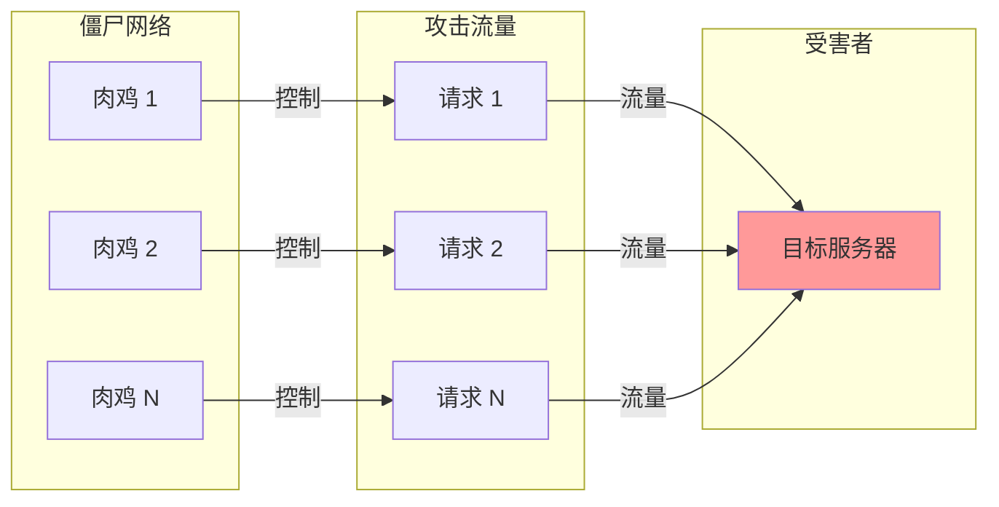
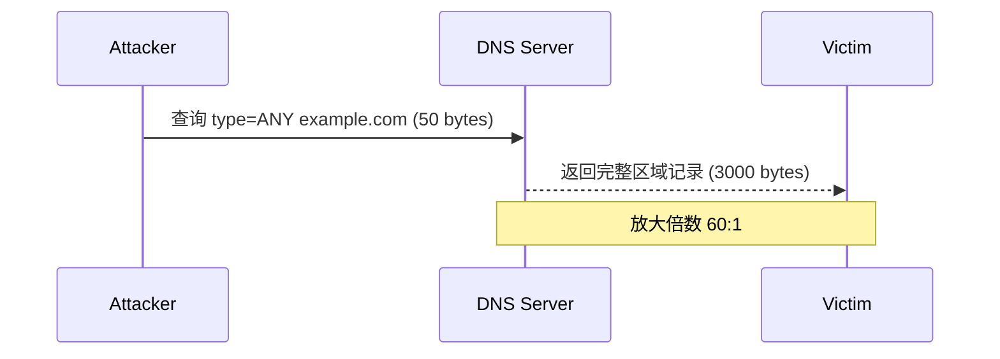

2021 年 2 月，全球最大的 CDN 提供商之一 Cloudflare 报告：其某个客户遭受了峰值 2 Tbps 的 DDoS 攻击。这是当时已知最大的 DDoS 攻击。更令人震惊的是：攻击来源是 15,000 台受感染的 MikroTik 路由器，而攻击者只是出租了这些「肉鸡」的计算能力。

**DDoS（分布式拒绝服务）攻击已经从黑客炫技演变为可购买的「网络武器」**。任何人只需支付几十美元，就能在暗网上租用数千台僵尸机器，对任意目标发动毁灭性攻击。理解 DDoS 攻击类型，是构建有效防护的第一步。

## DDoS 攻击的定义与原理

DDoS 的核心原理很简单：用大量请求撑爆目标的带宽、计算能力或系统资源，导致正常用户无法访问。

与 DoS（拒绝服务）攻击的区别在于「D」——Distributed（分布式）。单一来源的攻击很容易被封禁，攻击者通过控制大量「肉鸡」（受感染的计算机）形成僵尸网络，从全球各地发起攻击，使得防御方难以区分正常流量和攻击流量。



## DDoS 攻击分类

### 1. 容量型攻击（Volumetric Attacks）

目标是耗尽目标的带宽。通过发送大量流量（通常是被放大的）填满网络链路。

#### UDP Flood

向目标发送大量 UDP 数据包：

- 特点：简单粗暴，无需建立连接
- 变种：端口扫描模式、无连接模式
- 防御：速率限制、协议验证

```python
# 简化示例：UDP Flood 攻击原理
# 攻击者向大量随机 IP 发送 UDP 包
for target_ip in targets:
    for source_ip in spoofed_ips:
        packet = IP(src=source_ip, dst=target_ip) / UDP(sport=random_port, dport=80)
        send(packet)
```

#### ICMP Flood（Ping Flood）

发送大量 ICMP Echo Request：

- 特点：利用 ping 命令
- 变种：Smurf 攻击（放大版）

#### 反射攻击

攻击者伪造目标 IP，向公开服务发送请求，响应流量指向目标：

- DNS 放大：53 字节查询 → 3000+ 字节响应
- NTP 放大：请求 Monlist → 100+ 倍放大
- Memcached 放大：10-50KB 请求 → 1MB+ 响应

### 2. 协议攻击（Protocol Attacks）

目标是消耗目标的协议栈资源（连接表、会话状态）。

#### SYN Flood

发送大量 SYN 包，但不完成三次握手：

```python
# 简化示例：SYN Flood
for i in range(100000):
    # 伪造源 IP
    source_ip = random_ip()
    # 发送 SYN 包
    send_tcp_syn(target_ip, source_ip, dport=80)
    # 从不发送 ACK
```

服务器维护的半开连接（half-open connections）耗尽后，无法接受新连接。

**防御技术**：

- SYN Cookie：服务器不存储半开连接状态
- SYN Proxy：防火墙/负载均衡器代为处理握手
- 减小重试次数和超时时间

#### Ping of Death

发送超过 IP 最大包大小的 ICMP 包：

- 历史漏洞：部分系统无法正确处理分片重组
- 现代系统已修复，但仍是常见攻击向量

#### ACK Flood

发送大量 ACK 包，服务器需要查询连接表才能决定是否丢弃。

### 3. 应用层攻击（Application Layer Attacks）

目标是耗尽应用层资源，伪装成正常用户请求。

#### HTTP Flood

发送大量 HTTP 请求：

- GET Flood：请求大文件或动态页面
- POST Flood：提交大表单或 JSON

```python
# 简化示例：HTTP Flood
session = requests.Session()
while True:
    # 伪装成浏览器
    headers = {
        'User-Agent': random_browser_ua(),
        'Accept': 'text/html',
        'Accept-Language': 'en-US'
    }
    # 持续请求
    session.get('http://target.com/heavy-page', headers=headers)
```

#### Slowloris

保持连接打开但不发送完整请求：

```python
# 简化示例：Slowloris
import socket

def slowloris_attack(target, port, num_connections):
    sockets = []
    for _ in range(num_connections):
        s = socket.socket(socket.AF_INET, socket.SOCK_STREAM)
        s.connect((target, port))
        sockets.append(s)
    
    while True:
        for s in sockets:
            # 发送部分头部，保持连接
            s.send(b"X-a: b\r\n")
            time.sleep(15)  # 每 15 秒发送一个字节
```

#### HTTP/2 Rapid Reset

利用 HTTP/2 的 Stream Reset 特性：

- 客户端发送请求并立即 RST_STREAM
- 服务器为每个流分配资源，但流立即关闭
- 大量的流导致资源耗尽

## 反射放大攻击详解

### DNS 放大



攻击者向开放的 DNS 递归服务器发送小查询，DNS 服务器返回大响应到目标。

### NTP 放大

NTP 的 `monlist` 命令返回最近 600 个连接记录：

- 请求：23 字节
- 响应：~4800 字节（100+ 台主机的信息）
- 放大倍数：200:1

### Memcached 放大

- 请求：10-50 字节
- 响应：1MB+
- 放大倍数：10,000-50,000:1

2018 年 GitHub 遭受的攻击就使用了 Memcached 放大。

## 僵尸网络（Botnet）

### 传统僵尸网络

通过恶意软件感染大量计算机：

- **木马后门**：隐藏在正常软件中
- **漏洞利用**：利用已知漏洞批量入侵
- **弱口令扫描**：Telnet/SSH/RDP 弱密码

控制方式：

- **C&C 服务器**：中心化控制
- **P2P 网络**：去中心化，更难清除

### DDoS 即服务（DaaS）

不需要自己构建僵尸网络，可以租用：

| 服务类型 | 价格 | 持续时间 | 典型规模 |
|---------|------|---------|---------|
| Stresser/Booter | $20-100/天 | 几小时 | 数百 Gbps |
| 定制服务 | $100+/天 | 可协商 | Tbps 级 |

## 典型 DDoS 攻击案例

### 2016 Dyn DNS 攻击

- **攻击者**：Mirai 僵尸网络（数十万物联网设备）
- **攻击目标**：Dyn DNS
- **攻击方式**：DNS 放大 + 直接攻击
- **影响**：Twitter、Reddit、GitHub、Netflix 等网站无法访问
- **教训**：物联网设备成为新的攻击向量

### 2017 Google Cloud 攻击

- **攻击规模**：2.5 Tbps
- **攻击者**：中国境内发起的 BGP  hijacking + 反射攻击
- **持续时间**：约 6 个月
- **影响**：无直接业务影响，但证明了大流量攻击的可行性

### 2020 AWS Shield 攻击

- **攻击规模**：2.3 Tbps
- **持续时间**：3 天
- **攻击类型**：CLDAP 反射放大

## DDoS 攻击的识别

### 流量特征分析

| 攻击类型 | 流量特征 | 识别标志 |
|---------|---------|---------|
| UDP Flood | 单向大流量 | 大量 UDP 包到随机端口 |
| SYN Flood | 半开连接数飙升 | 连接数远超正常 |
| HTTP Flood | 请求数异常 | QPS 远超历史基线 |
| Slowloris | 连接数多，流量极低 | 长连接 + 低吞吐量 |

### 阈值设置

```yaml
# 流量阈值示例
thresholds:
  # 当入站带宽超过 1 Gbps 时触发告警
  bandwidth:
    warning: 800Mbps
    critical: 1Gbps
    
  # 当每秒 SYN 包超过 50000 时触发告警
  syn_rate:
    warning: 30000
    critical: 50000
    
  # 当 HTTP 500 响应超过 10% 时触发告警
  error_rate:
    warning: 0.05
    critical: 0.10
```

## DDoS 攻击的发展趋势

### 攻击规模持续增长

- 10 Gbps → 100 Gbps → 1 Tbps → 2 Tbps
- 物联网设备提供更多「肉鸡」

### 攻击复杂性增加

- 混合型攻击（多种攻击向量同时使用）
- 应用层攻击占比上升
- 持续低速率攻击（DDoS-Less Attack）

### DDoS 动机多样化

- 勒索（DDoS 勒索信）
- 竞争（打击竞争对手）
- 黑客行动主义
- 国家支持的网络战

:::tip 关键洞察
DDoS 防护的核心不是「阻止所有攻击」，而是「确保攻击发生时业务仍可用」。这需要多层次的防护策略：网络边缘清洗、CDN 加速、本地限流、以及应急预案。
:::

## 思考题

**问题 1**：某中型电商网站目前没有专门的 DDoS 防护，遇到的最大攻击流量约为 500 Mbps。作为安全负责人，你建议如何分阶段建立 DDoS 防护能力？

<details>
<summary>参考答案</summary>

分阶段建立 DDoS 防护能力的建议：

**阶段一：低成本基础防护（1-3 个月）**

1. **网络层面优化**
   - 与 ISP 协商提供基础流量清洗
   - 配置黑洞路由 ACL
   - 启用云提供商的 DDoS 基础防护（如 AWS Shield Standard）

2. **应用层面加固**
   - 限制单个 IP 的连接数和请求速率
   - 配置 Web 服务器的连接限制
   - 关闭不必要的服务和端口

3. **监控与告警**
   - 部署流量监控系统
   - 设置流量基线，超过阈值立即告警
   - 建立应急响应流程

**阶段二：中等投入（3-6 个月）**

1. **接入云 WAF + DDoS 防护**
   - Cloudflare、AWS Shield Advanced、阿里云 DDoS 高防
   - DNS 切换到防护服务
   - 配置自动清洗规则

2. **CDN 加速**
   - 静态资源 CDN 化
   - 减少直接到达源站的流量

3. **容量规划**
   - 按峰值流量的 3-5 倍规划带宽
   - 考虑多 CDN 冗余

**阶段三：深度防御（6-12 个月）**

1. **混合云防护架构**
   - 本地 DDoS 设备处理小流量
   - 大流量切换到云端清洗
   - 建立双活切换机制

2. **应用层防护**
   - 部署 WAF，识别应用层攻击
   - 实现行为分析和机器学习检测
   - API 速率限制和验证码

3. **红蓝对抗**
   - 定期进行 DDoS 演练
   - 测试应急预案有效性
   - 优化响应流程

</details>

**问题 2**：面对应用层 DDoS 攻击（如 HTTP Flood 和 Slowloris），传统的网络层防护往往无效。如何从应用层面识别和防御这类攻击？

<details>
<summary>参考答案</summary>

应用层 DDoS 的防护需要多个层面协同：

**识别层面**

```java
// HTTP Flood 检测
public class HttpFloodDetector {
    // 基于用户行为的检测
    public boolean isHttpFlood(String clientId, HttpRequest request) {
        // 检查请求频率
        if (rateLimiter.exceeds(clientId, 100, Duration.ofMinutes(1))) {
            return true;
        }
        
        // 检查请求模式
        UserBehavior behavior = behaviorAnalyzer.getBehavior(clientId);
        if (behavior.getUniqueUris().size() > 1000) {
            // 正常用户不会每秒访问 1000 个不同页面
            return true;
        }
        
        // 检查 User-Agent 有效性
        if (!isValidUserAgent(request.getHeader("User-Agent"))) {
            return true;
        }
        
        return false;
    }
}

// Slowloris 检测
public class SlowlorisDetector {
    public boolean isSlowloris(String clientId) {
        ConnectionStats stats = connectionManager.getStats(clientId);
        
        // 检查连接时长
        if (stats.getConnectionDuration() > Duration.ofMinutes(2)) {
            // 正常请求不会持续 2 分钟
            return true;
        }
        
        // 检查数据发送速度
        if (stats.getBytesPerSecond() < 10) {
            // 正常浏览器不会每秒只发几个字节
            return true;
        }
        
        // 检查头部完整性
        if (!stats.isHeadersComplete()) {
            return true;
        }
        
        return false;
    }
}
```

**防御层面**

1. **速率限制**
   ```yaml
   rate_limits:
     per_ip: 100/minute
     per_session: 500/minute
     global: 10000/second
   ```

2. **质询机制**
   - 识别可疑流量后，返回 JavaScript 质询
   - 通过质询后放行，失败则拒绝

3. **行为验证码**
   - 风险请求触发验证码
   - 使用无感验证码（如 Cloudflare Challenge）

4. **自适应限流**
   - 正常用户：宽松限制
   - 可疑用户：严格限制
   - 恶意用户：拒绝

5. **协议层加固**
   - 限制 HTTP 连接时间
   - 限制请求体大小
   - 配置 Web 服务器的 `timeout` 和 `keepalive` 参数

</details>
