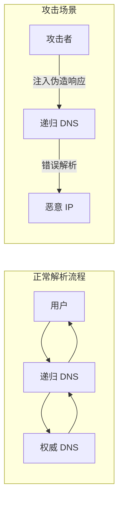
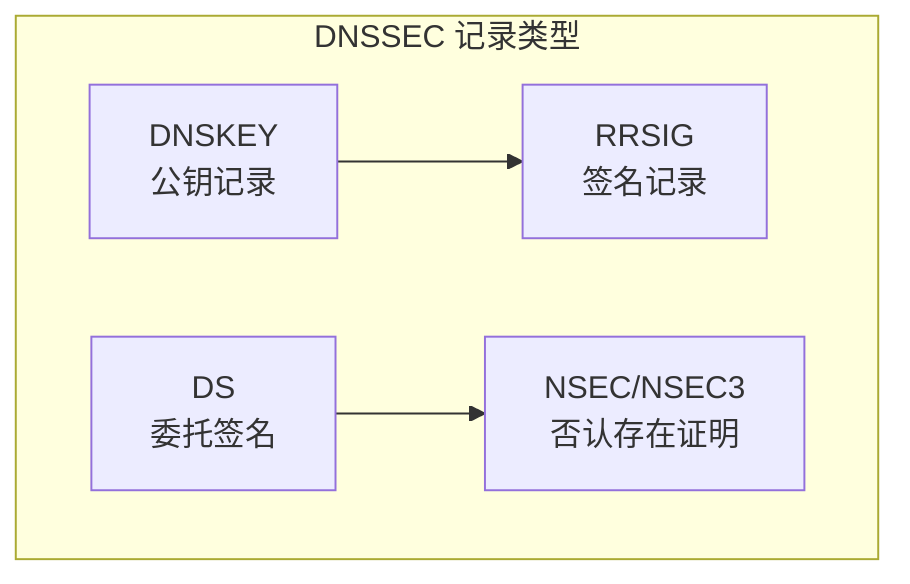
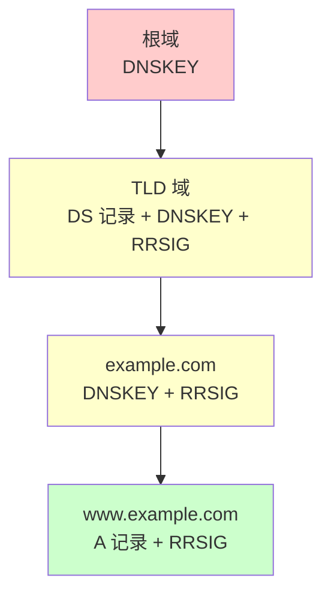
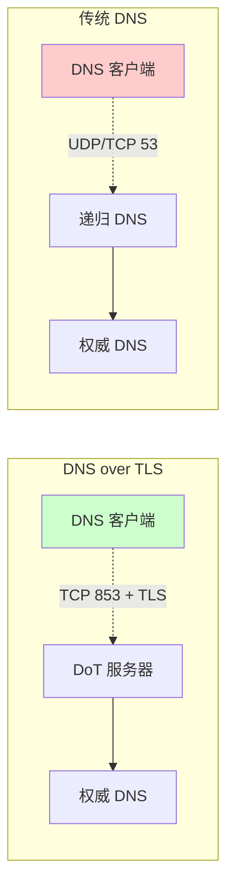
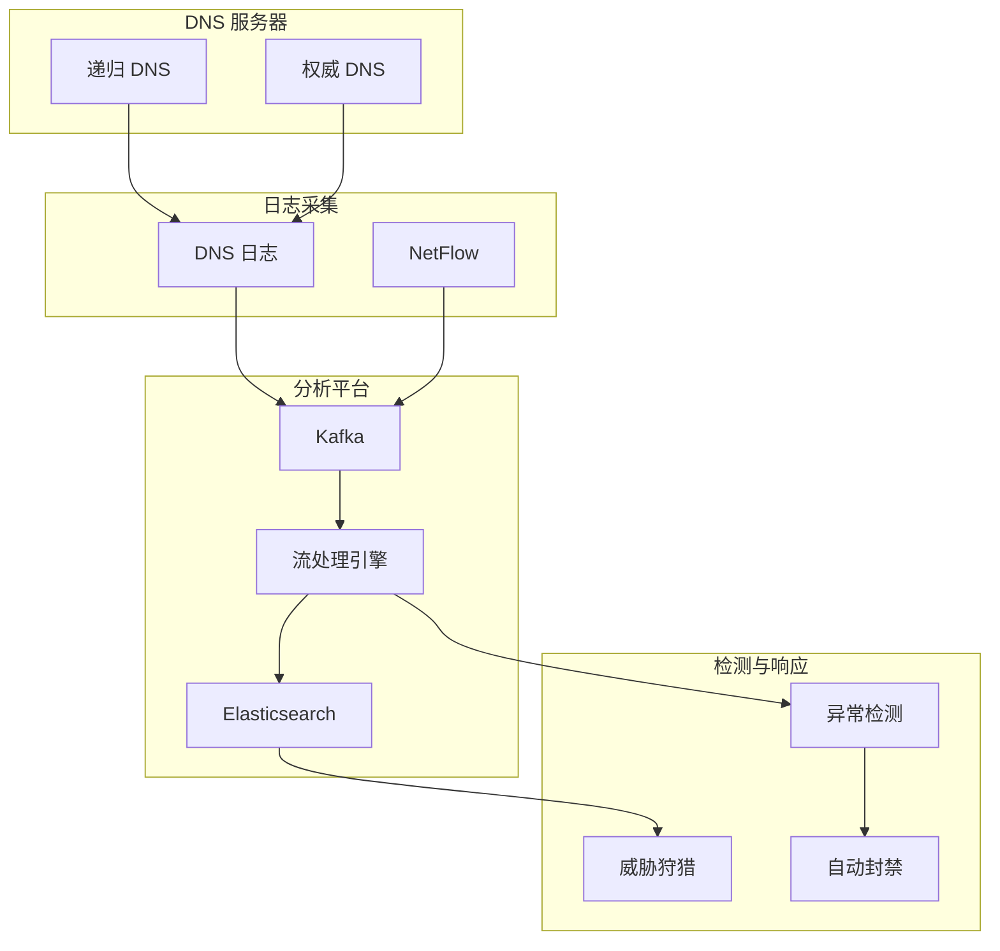

2019年3月，美国最大的垃圾邮件过滤服务提供商 Dyn 遭遇了一次大规模 DDoS 攻击。但更值得关注的是攻击手段：攻击者利用被控制的 IoT 设备向 Dyn 的 DNS 服务器发起查询，放大了攻击流量。

这次攻击让人们意识到：**DNS 不仅是互联网的「电话簿」，更是最容易被利用的攻击向量**。几乎所有网络攻击的第一步都需要 DNS——无论是恶意软件的 C2 通信、钓鱼网站的域名解析，还是数据泄露的 DNS 隧道。

## 一、DNS 的安全风险

### 1.1 传统 DNS 的脆弱性

DNS 协议诞生于 1983 年，设计时完全没有考虑安全性：



### 1.2 主要 DNS 攻击类型

| 攻击类型 | 原理 | 影响 |
|----------|------|------|
| 缓存投毒（Cache Poisoning） | 伪造 DNS 响应污染缓存 | 将用户导向恶意网站 |
| DNS 劫持（DNS Hijacking） | 篡改权威 DNS 配置 | 完全控制域名解析 |
| DNS 隧道（DNS Tunneling） | DNS 查询携带数据 | 数据泄露、C2 通信 |
| DNS DDoS | 利用 DNS 放大攻击 | 服务不可用 |
| 域名抢注（Typosquatting） | 注册近似域名 | 钓鱼、恶意软件分发 |

### 1.3 真实案例

> **2018年 DNSpionage 攻击**
>
> 攻击者入侵了多个中东域名注册商，篡改了 dns.com、trelliance.com 等域名的 DNS 配置。用户访问这些域名时被重定向到攻击者控制的服务器，窃取了用户名、密码等敏感信息。
>
> 来源：Cisco Talos

## 二、DNSSEC

### 2.1 DNSSEC 的设计目标

DNSSEC 通过**数字签名**确保 DNS 响应的** authenticity（真实性）**和** integrity（完整性）**：

| 目标 | 说明 |
|------|------|
| 起源认证 | 验证响应来自正确的权威 DNS |
| 完整性保护 | 确保响应未被篡改 |
| 不保证可用性 | 不解决 DDoS 问题 |
| 不保证隐私 | DNS 查询仍然是明文 |

### 2.2 DNSSEC 的核心概念



| 记录类型 | 说明 |
|----------|------|
| DNSKEY | 存储域名的公钥（KSK、ZSK） |
| RRSIG | 对 DNS 记录的签名 |
| DS（Delegation Signer） | 父域对子域 DNSKEY 的哈希 |
| NSEC | 证明某个记录不存在 |
| NSEC3 | NSEC 的哈希版本，防止zone walking |

### 2.3 DNSSEC 的信任链



DNSSEC 的信任链：
1. 根域的 DNSKEY 被预先配置在解析器中（信任锚点）
2. 根域对 TLD 的 DS 记录签名
3. TLD 对 example.com 的 DS 记录签名
4. example.com 对自己的记录签名

### 2.4 DNSSEC 部署步骤

**步骤 1：生成密钥对**

```bash
# 生成 KSK（Key Signing Key）
dnssec-keygen -a RSASHA256 -b 2048 -n ZSK -f KSK example.com

# 生成 ZSK（Zone Signing Key）
dnssec-keygen -a RSASHA256 -b 1024 -n ZSK example.com

# 查看生成的密钥
ls -la K*.*
# Kexample.com.+008+12345.key  (KSK)
# Kexample.com.+008+12346.key  (ZSK)
```

**步骤 2：签署 DNS 区域**

```bash
# 使用 ZSK 签署区域
dnssec-signzone -A -3 $(head -c 16 /dev/urandom | xxd -p) \
    -N INCREMENTAL \
    -o example.com \
    -t \
    db.example.com

# 参数说明
# -A: 所有记录都要签名
# -3: NSEC3 使用的盐
# -o: 原始区域文件名
# -t: 显示统计信息
```

**步骤 3：更新 DS 记录**

在域名注册商处添加 DS 记录：

```bash
# 查看 DS 记录
cat dsset-example.com.
# example.com.  IN DS 12345 8 2 ABC123...
```

**步骤 4：配置 DNSSEC 验证**

```yaml title="BIND DNSSEC 配置"
options {
    dnssec-enable yes;
    dnssec-validation yes;
    
    # 信任锚点（根域密钥）
    trusted-keys {
        # 根域 KSK（示例）
        ". 257 3 8 AwEAAagAIKgVZ...";
    };
};
```

### 2.5 DNSSEC 的局限性

| 局限 | 说明 |
|------|------|
| 不提供隐私 | DNS 查询和响应仍是明文 |
| 部署复杂 | 需要完整的信任链 |
| 缓存投毒风险 | 仍可能存在实现漏洞 |
| 验证失败处理 | 验证失败时很多解析器会 fallback 到不安全查询 |

:::warning DNSSEC 不是银弹
DNSSEC 只解决「我拿到的 DNS 响应是真实的」问题，但不解决：
- DNS 查询的隐私问题
- DNS 服务器的可用性问题
- DNS 劫持（如注册商被入侵）
:::

## 三、DNS over TLS (DoT)

### 3.1 DoT 的设计

DoT 将 DNS 查询封装在 TLS 连接中，防止中间人攻击和窃听：



### 3.2 DoT 配置示例

```yaml title="Systemd-resolved DoT 配置"
# /etc/systemd/resolved.conf
[Resolve]
DNS=1.1.1.1 8.8.8.8
DNSOverTLS=yes
DNSStubListener=yes

# 只信任指定的 DoT 服务器
DNSOverTLS=opportunistic  # 或 enforce（严格模式）
```

```bash title="使用 dig 测试 DoT"
# DoT 服务器测试
dig @1.1.1.1 +tls google.com

# 查看 TLS 握手信息
dig @1.1.1.1 +tls +tls-ca-file=/etc/ssl/certs/ca-certificates.crt google.com

# 输出显示 TLS 连接成功
# ;; TLS session ver: TLSv1.3/TLS_AES_256_GCM_SHA384
```

### 3.3 DoT 服务器端配置

```nginx title="nginx DoT 配置"
stream {
    # DNS over TLS 服务器
    server {
        listen 853 ssl;
        tcp_nodelay on;
        
        ssl_certificate /etc/ssl/certs/dns-cert.pem;
        ssl_certificate_key /etc/ssl/private/dns-key.pem;
        ssl_protocols TLSv1.2 TLSv1.3;
        ssl_ciphers ECDHE-ECDSA-AES128-GCM-SHA256:ECDHE-RSA-AES128-GCM-SHA256;
        
        # 代理到后端 DNS 解析器
        proxy_pass 127.0.0.1:53;
        proxy_responses 0;
    }
}
```

## 四、DNS over HTTPS (DoH)

### 4.1 DoH vs DoT

| 维度 | DoT | DoH |
|------|-----|-----|
| 端口 | 853（专用） | 443（HTTPS 端口） |
| 协议 | TCP + TLS | HTTP/2 + TLS over HTTPS |
| 防火墙友好 | 端口可能被拦截 | 伪装成普通 HTTPS 流量 |
| 隐私保护 | 中 | 高 |
| RFC | RFC 7858 | RFC 8484 |

### 4.2 DoH 请求示例

```http title="DoH HTTP 请求"
GET /dns-query?name=example.com&type=A HTTP/1.1
Host: cloudflare-dns.com
Accept: application/dns-json

HTTP/1.1 200 OK
Content-Type: application/dns-json

{
    "Status": 0,
    "TC": false,
    "RD": true,
    "RA": true,
    "AD": true,
    "CD": false,
    "Question": {
        "name": "example.com",
        "type": 1
    },
    "Answer": [{
        "name": "example.com",
        "type": 1,
        "TTL": 3600,
        "data": "93.184.216.34"
    }]
}
```

### 4.3 浏览器 DoH 配置

```yaml title="Firefox DoH 配置（about:config）"
# 启用 DoH
network.trr.mode: 2  # 0=关闭, 1=opportunistic, 2=strict, 3=automatic

# 指定 DoH 服务器
network.trr.uri: https://cloudflare-dns.com/dns-query
# 或使用其他 DoH 服务器
# network.trr.uri: https://dns.google/dns-query

# 排除的域名（不走 DoH）
network.trr.excluded-domains: company.internal, 10.0.0.0/8
```

### 4.4 企业环境中的 DoH 挑战

DoH 在企业环境中带来了新的安全挑战：

| 挑战 | 影响 | 应对策略 |
|------|------|----------|
| DNS 监控失效 | 安全设备无法看到 DNS 查询 | 企业 DoH 服务器 |
| 威胁检测绕过 | 恶意软件可用 DoH | DNS 安全网关 |
| 策略执行困难 | 无法按域名过滤 | SNI 过滤 + DNS 策略 |
| 合规审计 | DNS 日志缺失 | 集中化 DNS 服务 |

```yaml title="企业级 DoH 服务器配置（dnsdist）"
-- dnsdist 配置：企业内网 DoH 服务

-- 添加 DoH 前端
addDOHLocal("10.0.0.53:443", 
    "/etc/dnsdist/doh-cert.pem", 
    "/etc/dnsdist/doh-key.pem",
    {
        -- 自定义响应模板
        addAnyToHTTPSqueries=true,
        ipaddrParam=1
    })

-- 限制 DoH 访问（只允许内网）
addAction(
    NotRule(MaxQPSIPRule(10)),
    RCodeAction(2)  -- SERVFAIL
)

-- DNS 查询日志
addAction(
    RuleAboveRatio(0.1),  -- 10% 异常查询率
    LogAction("queries.log", true)
)

-- 配置后端递归 DNS
setRecursion()
```

## 五、私有 DNS 服务器部署

### 5.1 私有 DNS 的价值

| 场景 | 说明 |
|------|------|
| 内部域名解析 | 解析内部服务域名 |
| DNS 安全控制 | 完全掌控 DNS 流量 |
| 合规要求 | 金融、医疗等行业的数据本地化 |
| 性能优化 | 就近解析、缓存优化 |

### 5.2 CoreDNS 部署示例

```yaml title="Corefile 配置"
# /etc/coredns/Corefile
.:53 {
    # 缓存插件
    cache 30
    max_stale 5m
    
    # 转发到上游（DoT）
    forward . 1.1.1.1 8.8.8.8 {
        transport tls
        tls_servername cloudflare-dns.com
    }
    
    # hosts 插件（静态解析）
    hosts {
        10.0.0.10 api.internal
        10.0.0.11 db.internal
        fallthrough
    }
    
    # 日志
    log
    
    # 监控
    prometheus :9153
}

# 内部域名（从不转发）
internal:53 {
    file db.internal {
        reload 30s
    }
    forward . 10.0.0.1 10.0.0.2
}
```

```yaml title="Kubernetes DNS 配置"
# coredns-configmap.yaml
apiVersion: v1
kind: ConfigMap
metadata:
  name: coredns
  namespace: kube-system
data:
  Corefile: |
    .:53 {
        errors
        health :8080
        ready
        
        # 缓存
        cache 30
        
        # 上游 DNS（DoT）
        forward . tls://1.1.1.1 tls://8.8.8.8 {
           tls_servername cloudflare-dns.com
        }
        
        # 禁止上游解析
        deny . local
    }
```

## 六、DNS 安全监控

### 6.1 DNS 日志分析

```yaml title="DNS 日志格式"
# 关键字段
dns_log_fields:
  timestamp: 2024-01-15T10:30:00.123Z
  source_ip: 192.168.1.100
  query_name: malicious-domain.xyz
  query_type: A
  response_code: NOERROR
  response_ip: 185.234.219.47
  ttl: 300
  dns_server: 10.0.0.53
  
# 日志级别
levels:
  - suspicious: NXDOMAIN 率高、DGA 特征
  - malicious: 已知恶意域名
  - info: 正常查询
```

### 6.2 DNS 异常检测指标

| 指标 | 正常范围 | 告警阈值 |
|------|----------|----------|
| NXDOMAIN 率 | `< 5%` | `> 15%` |
| 查询频率/主机 | `< 100/min` | `> 500/min` |
| 异常域名率 | `< 1%` | `> 5%` |
| 单查询长度 | `< 50 bytes` | `> 200 bytes` |

```java title="DNS 安全监控实现"
public class DNSSecurityMonitor {
    
    private static final double NXDOMAIN_THRESHOLD = 0.15;
    private static final int QUERY_RATE_THRESHOLD = 500;
    private static final int QUERY_LENGTH_THRESHOLD = 200;
    
    private final Map<String, HostStatistics> hostStats = new ConcurrentHashMap<>();
    private final DGAClassifier dgaClassifier = new DGAClassifier();
    private final ThreatIntelClient threatIntel;
    
    public void processQuery(DNSQuery query) {
        // 1. 威胁情报匹配
        Optional<ThreatIntel.Match> intelMatch = threatIntel.check(query.getQueryName());
        if (intelMatch.isPresent()) {
            alert("THREAT_INTEL_MATCH", intelMatch.get());
        }
        
        // 2. DGA 检测
        double dgaScore = dgaClassifier.classify(query.getQueryName());
        if (dgaScore > 0.8) {
            alert("DGA_DETECTED", query.getQueryName(), dgaScore);
        }
        
        // 3. 查询频率检测
        HostStatistics stats = hostStats.computeIfAbsent(
            query.getSourceIP(), 
            k -> new HostStatistics()
        );
        stats.incrementQueryCount();
        
        if (stats.getQueryRate() > QUERY_RATE_THRESHOLD) {
            alert("HIGH_QUERY_RATE", query.getSourceIP(), stats.getQueryRate());
        }
        
        // 4. 查询长度检测
        if (query.getQueryName().length() > QUERY_LENGTH_THRESHOLD) {
            alert("LONG_DNS_QUERY", query.getQueryName());
        }
        
        // 5. NXDOMAIN 检测
        if (query.getResponseCode() == ResponseCode.NXDOMAIN) {
            stats.incrementNXDomainCount();
            double nxRatio = stats.getNXDomainRatio();
            if (nxRatio > NXDOMAIN_THRESHOLD) {
                alert("HIGH_NXDOMAIN_RATE", query.getSourceIP(), nxRatio);
            }
        }
    }
}
```

### 6.3 DNS 安全监控架构



:::tip 关键洞察
DNS 是网络安全的「金丝雀」——几乎所有攻击都会在 DNS 中留下痕迹。监控好 DNS，就等于拥有了发现早期攻击的能力。但 DNS 监控只是手段，发现异常后能否快速响应才是关键。
:::

## 思考题

**问题 1**：某公司计划全面部署 DNSSEC，请分析 DNSSEC 部署过程中的主要挑战，以及如何应对这些挑战？

<details>
<summary>参考答案</summary>

**主要挑战**：

**1. 信任链的复杂性**

DNSSEC 需要整个 DNS 链都签名，从根域到 TLD 再到你的域名。如果链中任何一个环节没有正确配置，验证就会失败。

**2. 密钥管理的复杂性**

- KSK（Key Signing Key）：长期有效，更换需要 DS 更新
- ZSK（Zone Signing Key）：短期有效，需要定期轮换
- 密钥泄露的风险

**3. DNSSEC 响应的体积增加**

签名会使 DNS 响应变大，可能导致：
- UDP 分片
- 超过 MTU
- 性能下降

**应对策略**：

**阶段 1：准备阶段**

1. 审计现有 DNS 配置
   ```bash
   # 检查域名注册商是否支持 DNSSEC
   whois example.com | grep -i dnss
   
   # 检查 DNS 服务器软件版本
   named -v
   dig +nocmd +noadfile +norecur +noquestion +nostat +noaa \
       +noedns +ednsopt=0 +notcp +besteffort .
   ```

2. 评估基础设施
   - DNS 服务器性能是否足够
   - 网络 MTU 是否支持大响应

**阶段 2：测试阶段**

1. 使用测试域名验证配置
2. 监控签名生成时间
3. 测试不同解析器的兼容性

**阶段 3：部署阶段**

1. 分批部署（先非关键域名）
2. 准备好回滚方案
3. 配置完善的监控和告警

**关键成功因素**：

- 自动化密钥管理
- 完整的测试流程
- 监控 DNSSEC 验证成功率
- 准备好紧急回滚预案
</details>

**问题 2**：DoH（DNS over HTTPS）在保护用户隐私的同时，也给企业安全监控带来了挑战。请分析 DoH 对企业安全的影响，以及企业应该如何应对？

<details>
<summary>参考答案</summary>

**DoH 对企业安全的影响**：

**负面影响**：

1. **DNS 监控完全失效**
   - 安全设备的 DNS 日志为空
   - 无法检测恶意域名
   - DNS 隧道攻击难以发现

2. **安全策略绕过**
   - 恶意软件可以使用 DoH 与 C2 通信
   - 无法按域名过滤访问
   - 绕过企业 DNS 过滤策略

3. **合规审计问题**
   - DNS 查询记录缺失
   - 不满足合规要求
   - 事故调查困难

**应对策略**：

**策略 1：强制企业 DNS（推荐）**

```yaml
# Firefox 企业配置
# 使用 policies.json 强制配置
{
    "policies": {
        "NetworkSettings": {
            "DNSOverHTTPS": {
                "Enabled": true,
                "Locked": true,
                "ProviderURL": "https://enterprise-dns.company.com/dns-query"
            }
        },
        "WebsiteFilter": {
            "Remove": true
        }
    }
}
```

**策略 2：在边界拦截 DoH**

```bash
# 防火墙规则（禁止 DoH）
# 阻止 TCP 853 (DoT)
iptables -A FORWARD -p tcp --dport 853 -j DROP

# 阻止已知的 DoH 服务器 IP
ipset create block-doh hash:ip
ipset add block-doh 1.1.1.1
ipset add block-doh 8.8.8.8

iptables -A FORWARD -m set --match-set block-doh dst -j DROP
```

**策略 3：部署企业 DoH 服务器**

- 部署企业内部 DoH 服务器
- 将企业内部 DoH 证书安装到终端
- 配置只信任企业 DoH

**策略 4：TLS 检查（深度防御）**

- 部署 TLS 检查设备
- 拦截 HTTPS 流量
- 配合 SSL 解密进行 DNS 监控

**平衡建议**：

| 场景 | 策略 |
|------|------|
| 高安全环境 | 强制企业 DNS，禁止 DoH |
| 研发环境 | 允许特定 DoH，监控异常 |
| 员工设备 | 最小干扰，提供安全 DoH |

最佳方案是**提供企业级安全 DoH 服务**，既保护员工隐私，又保留安全可见性。
</details>
