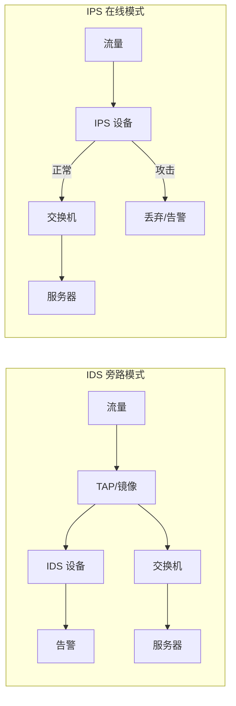
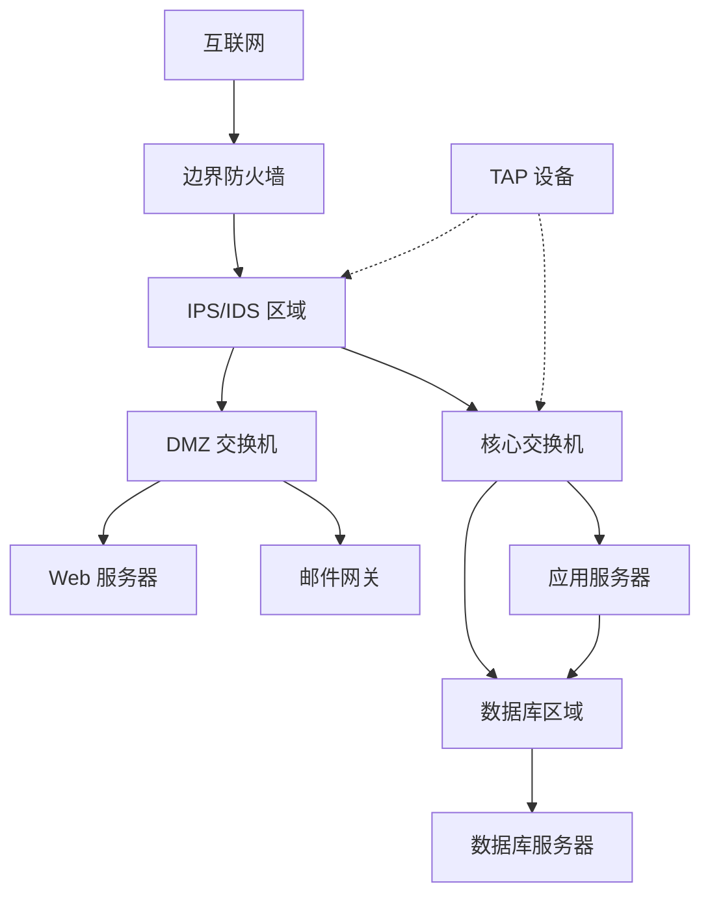
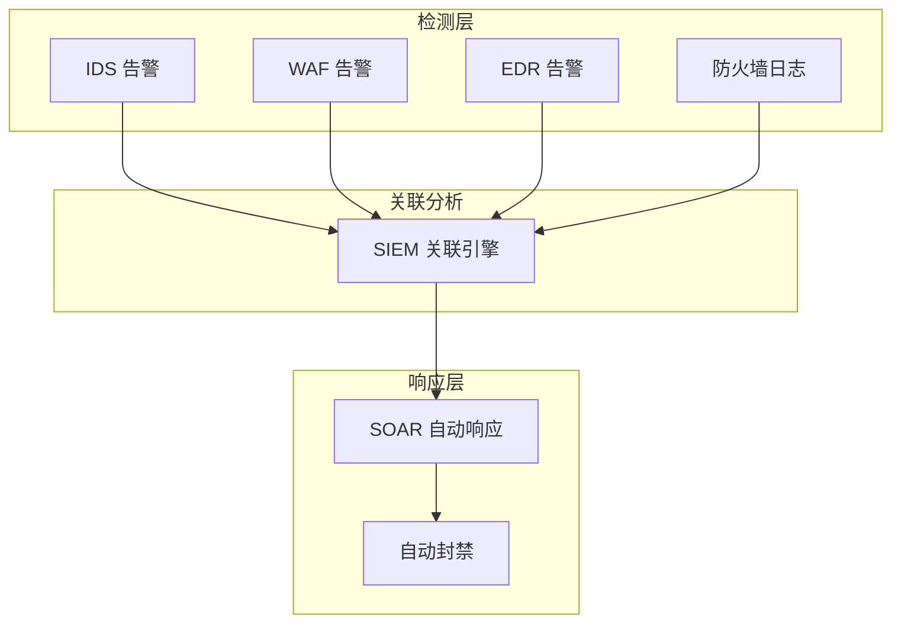

2019年3月，一起震惊安全圈的事件发生了：黑客组织 Shadowserver 声称成功入侵了多家防火墙厂商的设备固件，植入了后门程序。这些防火墙正是企业用来「保护」内网的 IDS/IPS 设备。

这揭示了一个讽刺的现实：**我们用来检测攻击的设备，本身可能已经被攻陷**。IDS/IPS 并不是万能的银弹——它们有盲区、会误报、也可能被绕过。但尽管如此，在纵深防御体系中，它们仍然是不可或缺的一环。

## 一、IDS 与 IPS 的区别

### 1.1 基本概念

| 系统 | 英文全称 | 工作模式 | 对流量影响 |
|------|----------|----------|------------|
| IDS | Intrusion Detection System（入侵检测系统） | 旁路监听 | 无影响（只检测） |
| IPS | Intrusion Prevention System（入侵防御系统） | 在线串联 | 阻断/放行 |



### 1.2 IDS vs IPS 的权衡

| 维度 | IDS | IPS |
|------|-----|-----|
| 部署复杂度 | 低（旁路） | 高（串联） |
| 对网络的影响 | 无 | 可能引入延迟 |
| 误报后果 | 告警过多 | 可能阻断正常流量 |
| 检测能力 | 更全面 | 受限于性能 |
| 适用场景 | 高度敏感环境 | 常规防护 |

:::warning IPS 的风险
IPS 串联在网络路径上，如果出现故障（硬件故障、软件 Bug、配置错误），可能导致网络中断。这被称为「fail-open」vs「fail-close」问题。建议在关键链路部署 HA（高可用）模式。
:::

## 二、检测方法

### 2.1 签名检测（Signature-based Detection）

基于已知攻击特征库进行匹配，类似于杀毒软件的病毒库：

```yaml title="Snort 签名示例"
# 检测 ICMP ping sweep
alert icmp any any -> $HOME_NET any (msg:"ICMP Ping Sweep"; 
    icos:9; content:"|08 00|"; depth:2; 
    detection_filter:track by_src, count 5, seconds 60;
    sid:1000001; rev:1;)

# 检测 SQL 注入
alert tcp $EXTERNAL_NET any -> $HOME_NET $HTTP_PORTS (
    msg:"SQL Injection Attempt";
    flow:to_server,established;
    pcre:"/(?i)(\%27)|(\')|((\%23)|(#))/;
    classtype:web-application-attack;
    sid:1000002; rev:1;)

# 检测 Nmap 扫描
alert tcp $EXTERNAL_NET any -> $HOME_NET any (
    msg:"Port Scan Detection";
    flags:S;
    threshold:type threshold, track by_src, count 5, seconds 10;
    sid:1000003; rev:1;)
```

**签名检测的优缺点**：

| 优点 | 缺点 |
|------|------|
| 准确率高（已知攻击） | 无法检测零日攻击 |
| 误报率低 | 需要维护签名库 |
| 资源消耗低 | 可能被变形攻击绕过 |

### 2.2 异常检测（Anomaly-based Detection）

建立正常行为基线，检测偏离基线的异常行为：

| 检测类型 | 说明 | 示例 |
|----------|------|------|
| 协议异常 | 协议使用不符合 RFC | 异常 TCP 标志位组合 |
| 流量异常 | 流量模式偏离正常 | 突然的大流量 |
| 行为异常 | 用户行为偏离历史 | 异常时间的登录 |
| 统计异常 | 统计指标异常 | CPU/内存使用率飙升 |

```java title="简化的流量异常检测逻辑"
public class AnomalyDetector {
    
    private final SlidingWindow window = new SlidingWindow(Duration.ofMinutes(5));
    private final double thresholdStdDev = 3.0;
    
    public boolean isAnomalous(FlowRecord record) {
        // 获取目标主机的历史流量
        List<Long> historicalBytes = window.getBytesForHost(record.getDestIP());
        
        if (historicalBytes.isEmpty()) {
            // 首次观测，进入学习模式
            return false;
        }
        
        // 计算均值和标准差
        double mean = calculateMean(historicalBytes);
        double stdDev = calculateStdDev(historicalBytes, mean);
        
        // 检测是否偏离正常范围
        double score = (record.getBytes() - mean) / stdDev;
        
        // 更新滑动窗口
        window.add(record.getDestIP(), record.getBytes());
        
        return Math.abs(score) > thresholdStdDev;
    }
    
    public AnomalyScore calculateScore(FlowRecord record) {
        // 计算异常分数（0-100）
        // 考虑多个维度：流量大小、连接数、协议分布等
        double trafficScore = calculateTrafficAnomalyScore(record);
        double connectionScore = calculateConnectionAnomalyScore(record);
        double protocolScore = calculateProtocolAnomalyScore(record);
        
        return new AnomalyScore(
            trafficScore * 0.4 + 
            connectionScore * 0.3 + 
            protocolScore * 0.3
        );
    }
}
```

**异常检测的优缺点**：

| 优点 | 缺点 |
|------|------|
| 可检测未知攻击 | 误报率较高 |
| 自适应能力 | 需要训练期 |
| 检测零日攻击潜力 | 难以确定正常行为边界 |

### 2.3 状态检测（Stateful Inspection）

跟踪连接状态，只允许符合协议状态的流量通过：

```yaml title="防火墙状态跟踪配置"
# 连接状态表
connection_tracking:
  timeout: 3600  # 连接超时 1 小时
  max_connections: 100000
  
  states:
    NEW:        # 新建连接
      - SYN
    ESTABLISHED: # 已建立连接
      - SYN-ACK
      - ACK
      - DATA
    RELATED:     # 关联连接（FTP 数据通道等）
    INVALID:     # 无效状态
```

## 三、NIDS vs HIDS

### 3.1 网络 IDS（NIDS）

部署在网络层面，监控网络流量：

| 部署位置 | 说明 | 优缺点 |
|----------|------|--------|
| 边界防火墙旁路 | 监控进出流量 | 可看到外部攻击，但看不到内部 |
| 核心交换机镜像 | 监控全网流量 | 全面，但数据量大 |
| 服务器区域入口 | 监控到服务器的流量 | 针对性强，覆盖有限 |

### 3.2 主机 IDS（HIDS）

部署在单个主机上，监控主机行为：

| 监控对象 | 说明 |
|----------|------|
| 系统调用 | 进程执行的操作 |
| 文件系统 | 文件读写、权限变更 |
| 注册表 | Windows 注册表变更 |
| 日志事件 | 系统日志、安全日志 |
| 网络连接 | 出站连接、端口监听 |

```bash title="osquery HIDS 示例"
-- 查看监听端口（检测异常监听）
SELECT * FROM listening_ports 
WHERE port NOT IN (80, 443, 22, 3306, 5432) 
AND protocol = 'tcp';

-- 查看最近登录
SELECT * FROM last 
WHERE username != 'root' 
AND time > (SELECTunixepoch() - 86400);

-- 查看可疑进程
SELECT p.name, p.pid, p.cwd, h.signed
FROM processes p
JOIN hash h ON p.pid = h.pid
WHERE h.signed = 0;
```

### 3.3 NIDS vs HIDS 对比

| 维度 | NIDS | HIDS |
|------|------|------|
| 检测视角 | 网络流量 | 主机行为 |
| 加密流量 | 无法检测加密内容 | 可以（端点可见明文） |
| 覆盖范围 | 一对多 | 一对一 |
| 部署影响 | 无（旁路） | 需安装代理 |
| 检测速度 | 实时 | 实时 |
| 抗绕过能力 | 较低 | 较高 |

## 四、Snort 规则编写

### 4.1 Snort 规则结构

```yaml title="Snort 规则格式"
<action> <protocol> <source_ip> <source_port> <direction> <dest_ip> <dest_port> (<options>)"
```

| 组件 | 说明 | 示例 |
|------|------|------|
| action | 对匹配流量的动作 | alert, log, pass, drop, reject |
| protocol | 协议类型 | tcp, udp, icmp, ip |
| direction | 流量方向 | `->` 单向, `<>` 双向 |
| options | 检测选项 | msg, content, sid, rev |

### 4.2 常用检测选项

| 选项 | 说明 | 示例 |
|------|------|------|
| msg | 规则描述 | msg:"SQL Injection Attack"; |
| content | 负载内容匹配 | content:"SELECT FROM"; |
| nocase | 不区分大小写 | nocase; |
| depth | 在负载前 N 字节匹配 | depth:20; |
| offset | 从负载偏移开始匹配 | offset:10; |
| pcre | 正则表达式 | pcre:"/cmd\.exe/i"; |
| sid | 规则唯一 ID | sid:1000001; |
| rev | 规则版本 | rev:1; |
| classtype | 攻击分类 | classtype:web-application-attack; |

### 4.3 高级规则示例

```yaml title="高级 Snort 规则"
# 规则 1：检测 CVE-2021-26855（Exchange SSRF）
alert tcp $EXTERNAL_NET any -> $HOME_NET $HTTP_PORTS (
    msg:"CVE-2021-26855 Exchange SSRF";
    flow:to_server,established;
    content:"GET /owa/auth/Current/themes/";
    content:"X-AnonResource=";
    content:"127.0.0.1";
    distance:0;
    pcre:"/X-AnonResource-Backend水管.*?127\.0\.0\.1/smi";
    sid:1000004; rev:1;
    classtype:web-application-attack;
    metadata:affected_product Exchange Server, cve CVE-2021-26855;)
```

```yaml title="变形攻击检测"
# 检测 Base64 编码的命令注入
alert tcp any any -> any any (
    msg:"Encoded Command Injection Detected";
    pcre:"/(?i)(?:base64|b64)[^a-z0-9+=\/]{0,20}[a-zA-Z0-9+=\/]{10,}/";
    content:"eval|28|";
    content:"system|28|";
    threshold:type limit, track by_src, count 5, seconds 60;
    sid:1000005; rev:1;)
```

## 五、Suricata 的优势

### 5.1 Suricata vs Snort

| 特性 | Suricata | Snort |
|------|----------|-------|
| 多线程 | 原生支持 | 需要 DAQ 模块 |
| 协议解析 | 自动学习+lua | 手动配置 |
| 文件提取 | 内置 | 需额外配置 |
| 侧重点 | 检测 | 检测 |
| 输出格式 | JSON（原生） | Unified2 |
| 社区活跃度 | 高 | 中 |

### 5.2 Suricata 配置示例

```yaml title="suricata.yaml 配置"
# 主机检测配置
host-config:
  - tcp:
      - detection-ips:
          - 192.168.1.0/24
        # 当此 IP 发送过多流量时触发
        thresholds:
          - type: detection_filter
            track: by_src
            count: 100
            seconds: 60

# 输出配置（EVE JSON 格式）
outputs:
  - eve-log:
      enabled: yes
      types:
        - alert:
            metadata: true
            xff: true
        - http:
            extended: yes
        - dns:
            query: yes
            answer: yes
        - tls:
            extended: yes
        - files:
            force-hash: [sha256, md5]
        - flow:
            stats: true

# 多线程配置
threading:
  set-cpu-affinity: yes
  cpu-affinity:
    - management-cpu-set:
        cpu: [ 0 ]
    - worker-cpu-set:
        cpu: [ 1, 2, 3, 4 ]
        mode: "exclusive"
        threads: 4
```

## 六、部署位置

### 6.1 典型部署架构



### 6.2 检测点选择

| 位置 | 可检测的攻击 | 盲区 |
|------|------------|------|
| 互联网边界 | 外部扫描、入侵尝试 | 内部攻击 |
| DMZ 入口 | Web 攻击、DDoS | 内网横向 |
| 核心交换 | 横向移动、异常通信 | 加密流量 |
| 服务器出口 | 数据泄露、C2 通信 | 需要 HIDS |

## 七、IDS/IPS 的局限性

### 7.1 加密流量检测的挑战

| 挑战 | 说明 | 应对措施 |
|------|------|----------|
| TLS 加密 | 无法看到明文内容 | SSL 解密（MITM） |
| 证书固定 | 无法解密 | 端点代理 |
| 端到端加密 | 完全盲区 | HIDS/网络行为分析 |
| 协议升级 | HTTP/2, HTTP/3 | 升级检测引擎 |

### 7.2 常见绕过技术

| 技术 | 说明 | 检测难度 |
|------|------|----------|
| 分片攻击 | IP/TCP 分片绕过检测 | 中 |
| 协议混淆 | 协议与签名不匹配 | 高 |
| 加密隧道 | VPN、TOR | 非常高 |
| 低慢攻击 | 小流量慢速攻击 | 高 |
| 跳变技术 | 快速切换源 IP/端口 | 中 |

### 7.3 告警疲劳问题

| 问题 | 影响 |
|------|------|
| 误报率高 | 安全分析师疲于应付 |
| 日志量大 | 存储成本高，分析困难 |
| 规则冲突 | 相互矛盾的告警 |
| 响应延迟 | 真实攻击被忽视 |

```yaml title="告警过滤规则示例"
# 高置信度规则（低误报，优先处理）
alert_rules:
  - name: "high-confidence-alerts"
    priority: 1
    filters:
      confidence: "> 0.9"
      attack_category: ["Ransomware", "C2", "Exploitation"]
    actions:
      - page_security_team
      - auto_block_ip

# 低优先级规则（可忽略）
  - name: "low-priority-scans"
    priority: 5
    filters:
      confidence: "< 0.5"
      attack_category: ["Reconnaissance"]
      count: "> 100"
    actions:
      - log_only
      - daily_summary
```

## 八、IDS/IPS 与其他安全设备的协同

### 8.1 联动架构



### 8.2 自动响应场景

| 场景 | 触发条件 | 响应动作 |
|------|----------|----------|
| 暴力破解 | 单 IP 1 分钟内失败 10+ 次 | 临时封禁 30 分钟 |
| 扫描行为 | 1 分钟内访问 50+ 不同端口 | 封禁 + 通知 |
| 恶意软件通信 | 检测到已知 C2 特征 | 隔离主机 + 告警 |
| 数据泄露 | 检测到敏感数据外传 | 阻断 + 取证 |

:::tip 关键洞察
IDS/IPS 的价值不在于「发现所有攻击」，而在于「发现攻击模式」和「提供网络可见性」。与其追求零漏报，不如优化告警质量，确保真实攻击能被及时发现和处理。
:::

## 思考题

**问题 1**：某公司部署了 IDS 系统，但安全运营团队发现每天产生上万条告警，其中 99% 都是误报。请分析告警疲劳的原因，并提出降低告警疲劳的具体措施。

<details>
<summary>参考答案</summary>

**告警疲劳的原因分析**：

1. **规则过于宽泛**
   - 检测规则缺乏精细化
   - 未针对环境定制阈值
   - 过多依赖异常检测（高误报）

2. **缺乏上下文**
   - 告警缺少业务背景
   - 无法判断是否是正常业务行为
   - IP 地址归属不明确

3. **规则维护不善**
   - 规则库未及时更新
   - 过时规则仍在运行
   - 规则与业务不匹配

4. **日志源问题**
   - 网络扫描触发的正常告警
   - 内部工具误触发
   - 测试流量未排除

**降低告警疲劳的措施**：

**短期（1-2周）**
1. **告警分级**
   - P0：需立即处理（严重攻击）
   - P1：当天处理（可疑行为）
   - P2：定期审查（低置信度）

2. **自动聚合**
   - 将同一攻击源的告警合并
   - 识别攻击链（单一事件多告警）
   - 减少重复告警

**中期（1-2月）**
3. **规则优化**
   - 白名单 IP 列表（内部监控工具）
   - 调整检测阈值
   - 删除过时/无效规则

4. **上下文增强**
   - IP 归属信息（谁在用）
   - 关联资产信息（什么系统）
   - 历史行为对比

**长期（持续）**
5. **行为基线建立**
   - 收集正常业务流量模式
   - 基于基线检测异常
   - 动态调整阈值

6. **威胁情报集成**
   - 已知恶意 IP 库
   - 提高已知威胁置信度
   - 降低误报率
</details>

**问题 2**：为什么加密流量的检测是 IDS/IPS 的重大挑战？有哪些技术手段可以在一定程度上解决这个挑战？各自的优缺点是什么？

<details>
<summary>参考答案</summary>

**加密流量检测的挑战**：

1. **TLS 加密原理**
   - 加密从客户端 Hello 开始
   - IDS 无法看到明文 HTTP 头部和内容
   - 证书验证在端点完成

2. **证书固定（Certificate Pinning）**
   - 应用硬编码服务器证书
   - 即使部署 MITM 也无法解密
   - 常见于移动应用

**技术解决方案**：

**方案 1：SSL/TLS 解密（MITM）**

原理：在 IDS 位置部署代理，完成 TLS 终止

| 优点 | 缺点 |
|------|------|
| 可看到完整明文 | 需要部署证书 |
| 检测能力强 | 隐私法律风险 |
| 兼容性好 | 性能开销 |

配置要点：
- 需要将企业根证书安装到终端
- 配置 SSL 检查规则
- 排除敏感应用（金融、医疗）

**方案 2：选择性解密**

原理：只解密可疑流量的 TLS

| 优点 | 缺点 |
|------|------|
| 降低性能开销 | 可能漏掉攻击 |
| 隐私风险可控 | 需要智能分类 |
| 可配置策略 | 配置复杂 |

**方案 3：网络行为分析（NBA）**

原理：不看内容，看流量模式

| 指标 | 正常特征 | 攻击特征 |
|------|----------|----------|
| 连接持续时间 | 较长 | 短暂 C2 |
| 数据传输量 | 稳定 | 突发大量 |
| 连接时序 | 规律 | 异常频繁 |
| 域名特征 | 已知域名 | DGA 算法生成 |

**方案 4：HIDS + EDR**

原理：在端点解密，提取元数据上报

| 优点 | 缺点 |
|------|------|
| 完整可见性 | 需要部署终端代理 |
| 不影响网络性能 | 隐私问题 |
| 可检测端到端加密 | 覆盖范围有限 |

**最佳实践**：
- 多层防御：结合多种方案
- 风险分级：高风险区域深度检测
- 隐私合规：遵守数据保护法规
- 用户感知：透明化检测政策
</details>
