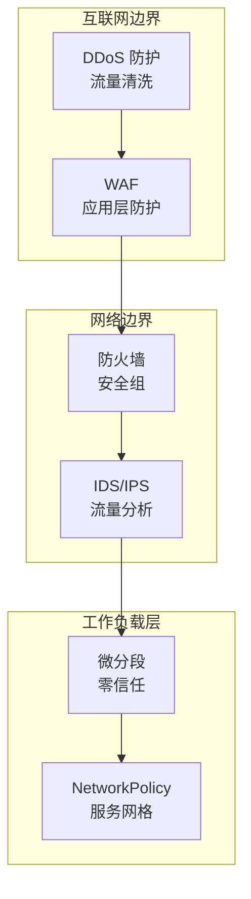

传统的网络安全模型建立在「内网等于安全」的假设上。但现代云原生环境中，容器 IP 动态变化、工作负载在多云之间迁移、内外部边界日益模糊——这个假设早已不再成立。一次内部员工的笔记本中毒，可能导致整个内网的横向渗透；一个被攻破的容器，可能成为攻击整个集群的跳板。

本专题覆盖网络安全的完整知识体系：从零信任网络架构的核心理念，到微分段的精细化隔离，再到 WAF、DDoS 防护、VPN 等传统安全设备的配置与优化，以及 DNS 安全、BGP 安全等底层协议的安全加固。

## 核心内容

### 零信任架构

- [网络安全概述](/security/network/overview) — 网络安全的威胁格局与防御层次
- [零信任网络架构](/security/network/ztna) — ZTNA 的设计理念与部署模式
- [零信任核心原则与实施](/security/network/zero-trust-principles) — 五大原则与成熟度评估
- [BeyondCorp 架构解析](/security/network/beyondcorp) — Google 的零信任实践

### 网络隔离

- [微分段](/security/network/micro-segmentation) — 工作负载级别的精细化隔离
- [微分段技术对比](/security/network/segmentation-comparison) — VLAN、NSX、Istio 的对比
- [网络隔离与分段](/security/network/isolation) — DMZ、业务区、数据区的分层设计

### 边界防护

- [WAF Web应用防火墙](/security/network/waf) — WAF 的检测技术与部署模式
- [WAF 规则配置与绕过防护](/security/network/waf-rules) — ModSecurity CRS 与绕过技术
- [DDoS 攻击类型与防护](/security/network/ddos) — 容量型、协议型、应用层攻击
- [DDoS 防护策略](/security/network/ddos-protection) — 流量清洗、黑洞路由、CDN 防护

### 通信安全

- [VPN 技术](/security/network/vpn) — IPsec、SSL VPN、WireGuard 的对比
- [IDS/IPS 入侵检测与防御](/security/network/ids-ips) — NIDS/HIDS 的部署与规则管理
- [网络流量分析](/security/network/nta) — NetFlow、机器学习、威胁狩猎

### 基础设施安全

- [DNS 安全](/security/network/dns-security) — DNSSEC、DoH/DoT 的部署与配置
- [安全组与网络 ACL](/security/network/security-group) — 云安全组与 K8s NetworkPolicy
- [BGP 路由安全](/security/network/bgp-security) — RPKI、MANRS 与 BGP 劫持防护

## 防御层次

## 思考题

**问题 1**：传统 VPN 和零信任 VPN（ZTNA）最核心的区别是什么？为什么说 VPN 是「边界安全」时代的产物？

参考答案

传统 VPN 将远程用户接入内网，用户获得内网级别的访问权限，本质上是「信任内网所有用户」。ZTNA 则只授予用户访问特定应用的权限，且每次访问都经过身份验证和授权检查。VPN 的问题在于：一旦用户连接成功，攻击者可以扫描整个内网进行横向移动；VPN 设备本身也是攻击面。ZTNA 替代方案是「永不信任，始终验证」——不依赖网络位置，而是依赖设备信任和身份信任来控制访问。

**问题 2**：WAF 的绕过技术有哪些？防御方应该如何应对？

参考答案

常见的 WAF 绕过技术包括：编码绕过（URL 编码、双重编码、Unicode）、大小写混合（大小写混淆）、注释注入（`/*comment*/` 分割关键词）、HTTP/2 协议混淆、分块传输（Chunked Encoding）。防御方的应对策略包括：多编码层解码后再检测、使用机器学习检测变种攻击、定期更新规则库、启用深度内容检测（不仅是参数还包括 Header 和 Body）。但最根本的防护还是输入验证的白名单策略，而不是依赖 WAF 的黑名单规则。

