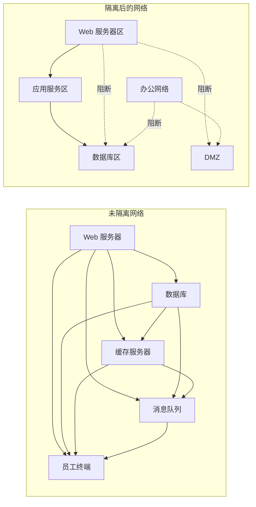
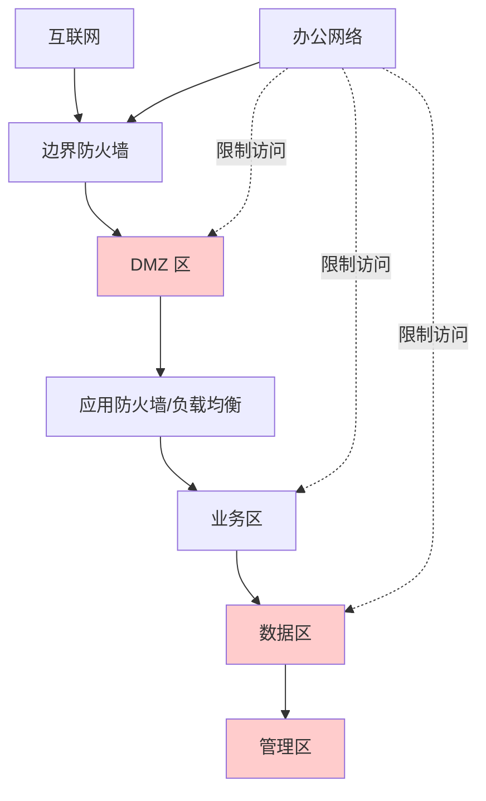
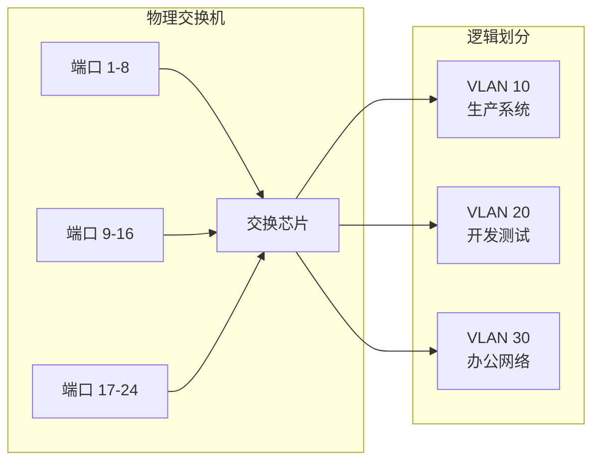
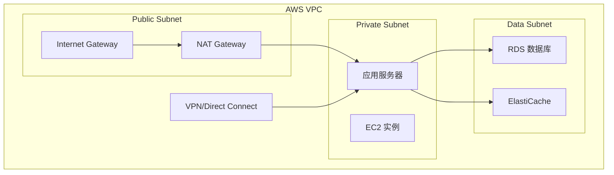
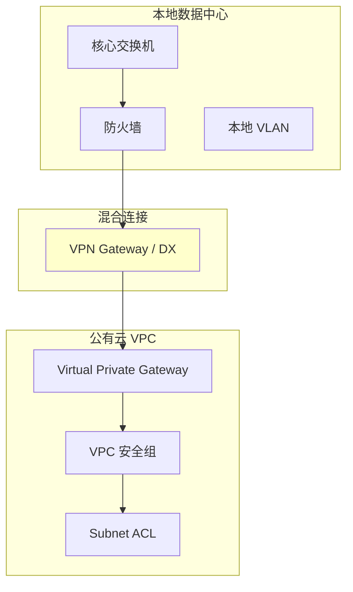
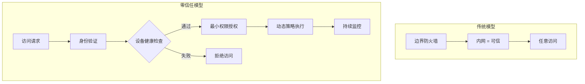

2017年，Equifax 数据泄露事件影响了 1.47 亿用户。事后调查发现，攻击者最初的入口只是一个 Web 应用漏洞。但真正造成灾难性后果的，是攻击者能够在内部网络中畅行无阻——从 Web 服务器跳到数据库，再跳到员工终端，最终窃取了大量敏感数据。

这个案例揭示了一个残酷的事实：**边界防御被突破后，网络隔离就是最后的防线**。如果 Equifax 的内部网络做了合理的分段，攻击者可能只能访问 Web 服务器，而无法触达存储个人信息的核心数据库。

## 一、网络隔离的目的

### 1.1 限制攻击面

网络隔离的核心思想是**最小权限原则在网络层面的应用**。每个网络区域只暴露必要的通信路径，阻断其他所有流量。

未做隔离的网络 vs 做了隔离的网络：



在未隔离网络中，任何一台服务器被攻破，攻击者理论上可以到达任何其他系统。隔离后，攻击者需要逐层突破。

### 1.2 合规要求

很多安全合规框架都明确要求网络隔离：

| 合规框架 | 相关要求 |
|----------|----------|
| PCI DSS | 必须隔离 cardholder data 环境（CDE） |
| HIPAA | PHI 系统必须与普通系统隔离 |
| SOC 2 | 敏感数据的访问必须被控制 |
| ISO 27001 | 网络分段控制 |
| 等保 2.0 | 三级系统要求强制访问控制 |

## 二、隔离层级设计

### 2.1 经典的多层架构

传统数据中心采用分层架构（Tiered Architecture）：



| 区域 | 说明 | 典型服务 |
|------|------|----------|
| 互联网区 | 公共网络，不可控 | - |
| DMZ | 对外服务区，暴露部分服务 | Web 服务器、邮件网关、DNS |
| 业务区 | 核心应用逻辑 | 应用服务器、微服务 |
| 数据区 | 敏感数据存储 | 数据库、文件存储 |
| 管理区 | 运维管理通道 | SSH、RDP跳板机 |

### 2.2 东西向流量 vs 南北向流量

理解这两种流量方向是设计隔离策略的基础：

| 流量方向 | 定义 | 传统防护重点 |
|----------|------|--------------|
| 南北向（North-South） | 网络边界进出的流量 | 边界防火墙、入侵检测 |
| 东西向（East-West） | 网络内部横向流动的流量 | 微分段、端点检测 |

:::tip 趋势变化
传统安全模型过度关注边界（南北向），对内部横向流量缺乏防护。但根据 Verizon 的报告，超过 70% 的数据泄露涉及内部横向移动。这意味着**东西向隔离同等重要**。
:::

## 三、防火墙规则设计原则

### 3.1 最小权限原则

防火墙规则应该「白名单优先」——默认拒绝，只放行明确需要的流量。

```bash
# 典型防火墙规则示例
# 默认策略：拒绝所有
iptables -P INPUT DROP
iptables -P FORWARD DROP
iptables -P OUTPUT ACCEPT

# 允许已建立连接的返回流量
iptables -A INPUT -m state --state ESTABLISHED,RELATED -j ACCEPT

# 允许管理 IP 访问 SSH
iptables -A INPUT -p tcp -s 10.0.0.0/8 --dport 22 -j ACCEPT

# 允许 DMZ 访问数据区的特定端口
iptables -A FORWARD -s 192.168.1.0/24 -d 192.168.2.0/24 -p tcp --dport 5432 -j ACCEPT
```

### 3.2 规则设计检查清单

- [ ] 规则是否基于业务需求而非「方便管理」？
- [ ] 是否有过于宽泛的规则（如 `0.0.0.0/0`）？
- [ ] 是否定期审查和清理过期规则？
- [ ] 规则变更是否有审批流程和变更记录？

### 3.3 常见的规则设计错误

```
错误1：允许任意出站
iptables -A FORWARD -s 192.168.1.0/24 -j ACCEPT

错误2：过于宽泛的管理端口
iptables -A FORWARD -p tcp --dport 22 -j ACCEPT

正确：限制源 IP
iptables -A FORWARD -p tcp -s 10.0.0.0/8 --dport 22 -j ACCEPT

错误3：允许 ICMP 任意转发
iptables -A FORWARD -p icmp -j ACCEPT

正确：只允许必要的 ICMP 类型
iptables -A FORWARD -p icmp --icmp-type echo-reply -j ACCEPT
iptables -A FORWARD -p icmp --icmp-type destination-unreachable -j ACCEPT
```

## 四、VLAN 的隔离作用与局限

### 4.1 VLAN 的工作原理

VLAN（Virtual LAN）通过在以太网帧中添加 VLAN Tag，实现同一交换机上的逻辑网络隔离。



### 4.2 VLAN 的隔离能力

同一 VLAN 内的设备可以自由通信，不同 VLAN 之间的通信必须经过三层设备（路由器或三层交换机），在三层设备上可以配置 ACL 进行控制。

```bash
# Cisco 交换机 VLAN 配置示例
# 创建 VLAN
vlan 10
 name production
vlan 20
 name development
vlan 30
 name office

# 将端口分配到 VLAN
interface fastEthernet0/1
 switchport mode access
 switchport access vlan 10

# 配置 VLAN 间路由（需要三层交换）
interface vlan 10
 ip address 192.168.10.1 255.255.255.0

interface vlan 20
 ip address 192.168.20.1 255.255.255.0

# 配置访问控制
ip access-list extended PROD_TO_DEV
 permit tcp 192.168.10.0 0.0.0.255 192.168.20.0 0.0.0.255 eq 8080
 permit tcp 192.168.10.0 0.0.0.255 192.168.20.0 0.0.0.255 eq 5432
 deny   ip any any
```

### 4.3 VLAN 的局限性

| 限制 | 说明 | 风险 |
|------|------|------|
| 二层广播域隔离 | VLAN 间流量必须经过路由器 | 路由器成为瓶颈或单点故障 |
| VLAN 跳跃攻击 | 攻击者可能伪造 VLAN Tag | 跨 VLAN 访问 |
| 规模限制 | 4096 个 VLAN 上限 | 大规模环境受限 |
| 硬件依赖 | 需要支持 VLAN 的交换机 | 老旧设备无法使用 |
| 精细度不足 | 只到网段级别 | 无法实现主机级隔离 |

:::warning VLAN 不是安全边界
VLAN 只是逻辑隔离，真正的隔离需要配合 ACL 或防火墙。攻击者可能通过 VLAN 跳跃（VLAN Hopping）技术绕过 VLAN 边界。
:::

## 五、公有云的网络隔离

### 5.1 VPC（Virtual Private Cloud）

VPC 是公有云中的虚拟网络，提供类似物理数据中心的网络隔离能力。



### 5.2 安全组 vs 网络 ACL

这是云安全的两个核心概念，经常被混淆：

| 特性 | 安全组（Security Group） | 网络 ACL（Network ACL） |
|------|-------------------------|------------------------|
| 层级 | 实例级别（stateful） | 子网级别（stateless） |
| 规则评估 | 所有规则都会被评估 | 按顺序逐条匹配（1-32766） |
| 默认行为 | 拒绝所有入站，放行所有出站 | 拒绝所有入站和出站 |
| 生效范围 | 附加到实例的规则 | 子网内所有实例 |
| 场景 | 实例级精细控制 | 子网级边界防护 |

```java title="AWS 安全组配置示例（CloudFormation）"
Resources:
  MySecurityGroup:
    Type: AWS::EC2::SecurityGroup
    Properties:
      GroupName: web-server-sg
      GroupDescription: Security group for web servers
      VpcId: !Ref MyVPC
      SecurityGroupIngress:
        # 允许 HTTP
        - IpProtocol: tcp
          FromPort: 80
          ToPort: 80
          CidrIp: 0.0.0.0/0
        # 允许 HTTPS
        - IpProtocol: tcp
          FromPort: 443
          ToPort: 443
          CidrIp: 0.0.0.0/0
        # 允许来自 ALB 的流量
        - IpProtocol: tcp
          FromPort: 8080
          ToPort: 8080
          SourceSecurityGroupId: !Ref ALBSecurityGroup
      
      SecurityGroupEgress:
        # 只允许访问特定目标
        - IpProtocol: tcp
          FromPort: 5432
          ToPort: 5432
          DestinationSecurityGroupId: !Ref DatabaseSecurityGroup
        # 允许 DNS 查询
        - IpProtocol: udp
          FromPort: 53
          ToPort: 53
          CidrIp: 10.0.0.0/16
```

### 5.3 云安全组的最佳实践

- **最小权限入站**：只开放业务必需端口
- **全部允许出站要警惕**：限制出站流量防止数据泄露
- **使用标签管理**：便于识别和管理大量安全组
- **禁止 0.0.0.0/0**：除非明确业务需要

```bash
# 危险配置示例
SecurityGroupIngress:
  # 永远不要这样配置！
  - IpProtocol: tcp
    FromPort: 22
    ToPort: 22
    CidrIp: 0.0.0.0/0  # 任何人可以 SSH

# 正确配置
SecurityGroupIngress:
  - IpProtocol: tcp
    FromPort: 22
    ToPort: 22
    CidrIp: 10.0.0.0/8  # 只允许内网 SSH
    # 或者通过 VPN/Direct Connect 访问
```

## 六、混合云的网络隔离

混合云环境需要同时管理本地网络和云端网络，隔离策略需要跨环境统一设计。

### 6.1 常见的混合连接方式

| 连接方式 | 带宽 | 延迟 | 安全性 | 成本 |
|----------|------|------|--------|------|
| VPN | 最高 10 Gbps | 较高（加密） | 高（加密隧道） | 中等 |
| Direct Connect | 最高 100 Gbps | 低 | 中（物理隔离） | 较高 |
| SD-WAN | 取决于链路 | 取决于链路 | 可控 | 较低 |

### 6.2 混合云的隔离策略



**关键原则**：
- 本地网络和云端网络保持独立的安全边界
- 通过专用连接（而非公网）传输敏感数据
- 在混合边界部署状态检测设备
- 统一身份认证和访问策略

## 七、隔离与性能的权衡

### 7.1 过度隔离的问题

- **网络延迟增加**：跨区域通信增加跳数
- **架构复杂度提升**：需要更多的网关和路由配置
- **故障排查困难**：流量路径不清晰
- **运维成本上升**：需要管理更多网络设备

### 7.2 平衡策略

| 场景 | 建议 | 说明 |
|------|------|------|
| 高性能要求 | 就近部署 | 计算密集型服务与数据源同区域 |
| 强隔离要求 | 多层分段 | 安全优先，适当牺牲性能 |
| 成本敏感 | 适度分段 | 核心数据隔离，非敏感数据合并 |
| 合规要求 | 按规分层 | 满足合规的前提下优化性能 |

## 八、零信任时代的隔离策略

### 8.1 从网络中心到身份中心

零信任的核心改变是：**不再依赖网络位置来决定信任，而是基于身份、设备状态、访问上下文进行持续验证**。



### 8.2 微分段的演进

零信任时代的微分段（Microsegmentation）比传统 VLAN 更精细：

| 维度 | VLAN 分段 | 微分段 |
|------|----------|--------|
| 粒度 | 网段级别 | 应用/工作负载级别 |
| 策略引擎 | 静态 ACL | 动态策略 |
| 可视化 | 端口/交换机视图 | 应用依赖关系图 |
| 自动响应 | 手动 | 可自动化 |

```yaml title="Kubernetes NetworkPolicy 示例"
apiVersion: networking.k8s.io/v1
kind: NetworkPolicy
metadata:
  name: api-network-policy
  namespace: production
spec:
  podSelector:
    matchLabels:
      app: api-server
  policyTypes:
    - Ingress
    - Egress
  ingress:
    # 只允许来自前端服务的流量
    - from:
        - podSelector:
            matchLabels:
              app: frontend
      ports:
        - protocol: TCP
          port: 8080
    # 允许健康检查
    - from:
        - namespaceSelector:
            matchLabels:
              name: monitoring
      ports:
        - protocol: TCP
          port: 8081
  egress:
    # 只允许访问数据库
    - to:
        - podSelector:
            matchLabels:
              app: mysql
      ports:
        - protocol: TCP
          port: 3306
    # 允许 DNS
    - to:
        - namespaceSelector: {}
      ports:
        - protocol: UDP
          port: 53
```

:::tip 关键洞察
网络隔离不是「设了就不用管」的一次性配置。它需要持续运营：定期审查规则、监控流量异常、更新安全策略。隔离的有效性取决于运营的持续性。
:::

## 思考题

**问题 1**：某金融公司计划将核心交易系统迁移到公有云，但监管要求核心数据必须物理隔离存储。请设计一个满足合规要求同时又能利用云端弹性的网络架构。

<details>
<summary>参考答案</summary>

**架构设计要点**：

**1. 合规分析**
- 核心数据存储区域必须独立（VPC 或专用区域）
- 数据不能与其他租户共享资源
- 访问日志需要留存一定年限

**2. 推荐架构**

```
┌─────────────────────────────────────────────────────────────┐
│                    公有云 - 专用区域                          │
├─────────────────────────────────────────────────────────────┤
│  ┌─────────────┐                                            │
│  │  隔离 VPC   │  ← 专用租户，物理隔离                        │
│  │  (Prod-DB)  │                                            │
│  └──────┬──────┘                                            │
│         │                                                    │
│         │ PrivateLink / VPC Endpoint                        │
│         ↓                                                    │
│  ┌─────────────┐                                            │
│  │  应用 VPC   │  ← 普通云资源，可弹性扩展                    │
│  │  (Prod-App) │                                            │
│  └─────────────┘                                            │
└─────────────────────────────────────────────────────────────┘
```

**3. 关键设计**
- 使用 AWS Outposts 或阿里云专有区域实现物理隔离
- 通过 PrivateLink 建立应用 VPC 到隔离 VPC 的安全通道
- 数据库只开放应用 VPC 的特定 IP 段
- 部署云原生安全服务（WAF、GuardDuty）

**4. 数据同步方案**
- 冷数据可以同步到成本更低的区域
- 热数据必须留在隔离区域
- 同步链路需要加密和审计
</details>

**问题 2**：在微服务架构中，如何实现服务间的安全隔离？假设你有 100 个微服务，应该如何设计网络策略来限制横向移动的风险？

<details>
<summary>参考答案</summary>

**分层隔离策略**：

**第一层：命名空间隔离**
- 按业务域划分命名空间（domain namespace）
- 命名空间之间默认 deny
- 通过显式策略允许必要的跨域调用

**第二层：服务身份认证**
- 每个服务启用 mTLS（双向 TLS）
- 使用服务网格（Istio/Linkerd）的自动证书管理
- Service Account 令牌最小化授权

**第三层：NetworkPolicy**
```yaml
# 默认拒绝所有跨命名空间流量
apiVersion: networking.k8s.io/v1
kind: NetworkPolicy
metadata:
  name: default-deny-all
  namespace: production
spec:
  podSelector: {}
  policyTypes:
    - Ingress
    - Egress
```

**第四层：API 网关统一鉴权**
- 所有外部流量必须经过 API 网关
- 网关负责 JWT 验证、限流、鉴权
- 后端服务不直接暴露

**第五层：零信任网络**
- 引入服务网格的细粒度授权策略
- 基于属性的访问控制（ABAC）
- 持续监控服务行为异常

**管理策略**：
- 使用 IaC（Terraform/CDK）管理网络策略
- 定期进行策略审计
- 建立服务依赖关系图
- 限制服务间调用的「跳数」
</details>
