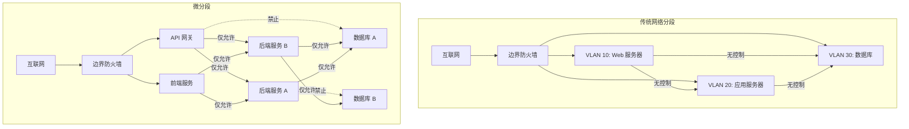

2019 年，某云服务商的一次配置错误导致大量客户的内部存储数据意外暴露。事后调查发现：如果不同客户之间有适当隔离，这次配置错误的影响范围会小得多。

这不是孤例。Equifax 数据泄露、Capital One 数据泄露、SolarWinds 供应链攻击——几乎所有大规模数据泄露事件中，攻击者都能在受害者网络中横向移动。为什么？因为大多数企业的内网像一间没有隔墙的大办公室：一旦进入，就可以随意走动。

**微分段（Micro-Segmentation）就是这堵「隔墙」。它的目标很简单：限制攻击者进入后的行动自由**。

## 微分段的定义与价值

微分段是一种安全技术，将网络划分为细粒度的安全区域，每个区域之间实施严格的访问控制。与传统的网络分段不同，微分段将边界从网络层面下沉到工作负载（Workload）层面。

**核心价值**：限制横向移动。即使攻击者突破了边界防线，也无法在内网中自由移动。

## 传统网络分段 vs 微分段

| 维度 | 传统网络分段 | 微分段 |
|------|-------------|--------|
| 边界位置 | 网络层（VLAN、子网） | 工作负载层（虚拟机、容器、Pod） |
| 粒度 | 粗粒度（部门、业务线） | 细粒度（单个应用、服务） |
| 策略对象 | IP 地址、端口 | 标签、属性、服务身份 |
| 实施难度 | 相对简单 | 复杂（需要全面可视） |
| 安全效果 | 限制初步入侵范围 | 限制入侵后的横向移动 |
| 动态适应 | 困难（IP 变化需重新配置） | 容易（标签自动跟随工作负载） |



## 工作负载级别的安全隔离

微分段的策略对象是「工作负载」，而不是 IP 地址。这意味着策略可以这样描述：

- 「Web 服务器可以访问 API 网关」
- 「后端服务只能访问对应的数据库」
- 「运维工具不能访问生产数据库」
- 「研发环境的服务不能访问测试环境的数据」

这种描述方式与应用的业务逻辑对齐，而不是与网络拓扑对齐。当应用迁移、扩容、或者 IP 地址变化时，策略保持有效。

### 标签与策略的映射

微分段依赖标签（Label）来识别工作负载并定义访问策略：

```yaml
# 标签示例
workload:
  name: backend-api
  environment: production
  tier: application
  team: payments
  sensitivity: high

# 微分段时间略
policy:
  - from:
      - tag:
          role: frontend
          environment: production
    to:
      - tag:
          name: backend-api
          environment: production
    ports: [8080]
    protocol: tcp
    action: allow
    
  - from:
      - tag:
          team: finance
    to:
      - tag:
          name: backend-api
          environment: production
    action: deny
```

标签可以从多个来源自动获取：

- **云平台元数据**：AWS 标签、GCP 标签
- **容器编排标签**：Kubernetes 标签、Docker Compose 标签
- **CMDB 同步**：从配置管理数据库同步应用信息
- **服务发现**：从 Consul、Eureka 等服务注册中心获取

## 微分段的安全效益

### 限制横向移动

这是微分段的核心价值。传统的网络分段下，攻击者进入 Web 服务器层后，可以扫描整个内网，尝试连接数据库、域控制器、备份服务器。微分段下，攻击者只能在「允许的路径」上移动。

### 减少攻击面

微分段可以将「所有服务都能被任何人访问」变为「每个服务只能被需要它的人/服务访问」。这大大减少了暴露给攻击者的入口点。

### 满足合规要求

PCI-DSS、HIPAA、SOC 2 等合规标准都要求数据隔离和访问控制。微分段提供了技术实现手段。

### 简化合规审计

通过微分段策略，可以证明「开发人员无法访问生产数据库」这类安全控制是有效的。

## 微分段的实施步骤

### 第一阶段：发现与可视化

在实施任何策略之前，需要全面了解：

- **有哪些工作负载**：服务器、虚拟机、容器、Pod
- **工作负载之间如何通信**：流量镜像和采集
- **应用的信任关系**：哪些服务需要访问哪些数据
- **当前的暴露面**：哪些服务可以直接从互联网访问

工具：网络流量分析（NTA）、云提供商的流量日志、Kubernetes Network Policy 审计

### 第二阶段：定义安全策略

基于业务需求定义访问策略：

1. **确定信任边界**：哪些服务属于同一个信任域
2. **识别数据流**：敏感数据的存储和使用位置
3. **定义允许的通信**：白名单方式，只允许必要的通信
4. **分类策略**：生产环境、开发环境、测试环境的不同策略

### 第三阶段：实施与测试

1. **先实施「全部允许」策略**：确保现有业务不受影响
2. **逐步收紧策略**：从宽到严，逐步添加「拒绝」规则
3. **监控异常**：观察被阻止的通信，分析是策略错误还是异常行为
4. **调整优化**：修复策略错误，处理异常流量

### 第四阶段：持续运营

- **定期审查策略**：移除不再需要的访问规则
- **自动化策略同步**：新部署的服务自动继承适当的策略
- **告警与响应**：检测到异常流量时自动告警
- **变更管理**：策略变更经过审批和测试

## 微分段的管理复杂度

微分段最大的挑战不是技术，而是管理复杂度：

### 策略爆炸

1000 个服务之间的全连接需要近百万条规则。即使使用标签简化，也需要大量策略定义。

**解决方案**：分层策略

```yaml
# 全局策略
environment_isolation:
  # 生产环境不能访问测试环境
  - from: { environment: production }
    to: { environment: staging }
    action: deny
    
# 应用级策略
app_specific:
  # 某个应用内部的通信规则
  - from: { app: payment, role: web }
    to: { app: payment, role: api }
    ports: [8080]
```

### 遗留应用的兼容

老旧系统可能无法识别现代标签机制。

**解决方案**：混合策略

- 使用 IP 地址作为遗留系统的标识
- 逐步改造遗留应用，添加标签支持

### 动态环境的挑战

容器和 Kubernetes 环境下，工作负载频繁创建和销毁。IP地址可能每天都在变化。

**解决方案**：使用工作负载身份而非 IP

- Kubernetes Service Account 令牌
- SPIFFE 证书
- 云平台的工作负载身份

## 微分段与零信任的关系

微分段是零信任架构的核心技术实现之一。它们的关系：

- **零信任**是一种安全理念/哲学
- **微分段**是实现零信任的技术手段

微分段直接体现了零信任的以下原则：

- **假设被攻破**：即使攻击者进入一个服务，也无法访问其他服务
- **最小权限**：服务只能访问它需要的资源
- **持续验证**：微分段策略引擎持续评估访问请求

## 微分段的性能影响

微分段引入的额外处理可能带来性能开销：

| 实施方式 | 性能影响 | 说明 |
|---------|---------|------|
| 基于内核的防火墙（iptables） | 中等 | 每个包都需要规则匹配 |
| eBPF | 低 | 高效的内核级处理 |
| 硬件 ASIC | 最低 | 专用芯片处理 |
| 服务网格 Sidecar | 中等 | 边车代理拦截流量 |

现代微分段方案（如 Illumio、Guardicore、NSX）针对性能进行了优化，在大多数场景下影响可忽略不计。

:::tip 关键洞察
微分段不是万能的。它解决的是「限制横向移动」这个问题，但无法防止初始入侵、无法检测恶意软件、无法加密传输。微分段需要与其他安全措施配合——身份验证、终端安全、日志监控——才能构建完整的安全体系。
:::

## 思考题

**问题 1**：微分段实施初期，业务团队抱怨访问被阻止影响了正常工作。作为安全团队，应该如何平衡安全性和可用性？

<details>
<summary>参考答案</summary>

这是一个常见的两难问题。以下是推荐的应对策略：

**第一步：区分「真阻断」和「假阻断」**

- 很多「影响工作」其实是开发/测试环境的不规范访问
- 真正的业务需求往往可以通过调整策略解决，而不是完全拒绝

**第二步：渐进式收紧**

- **阶段 1**：先以「全部允许」模式运行，仅监控和学习流量模式
- **阶段 2**：识别并阻止明显恶意的流量（如内部扫描、凭证猜测）
- **阶段 3**：基于发现的业务流量，逐步建立白名单策略
- **阶段 4**：所有非白名单流量默认拒绝

**第三步：建立变更流程**

- 业务团队需要访问新资源时，通过服务台或自助门户申请
- 申请需要业务负责人和安全团队双重审批
- 审批通过后，自动将规则添加到微分段策略
- 定期审查临时规则，移除不再需要的访问

**第四步：透明化安全价值**

- 向业务团队展示微分段如何保护他们的数据
- 用真实案例说明横向移动的危害
- 让业务团队参与策略制定，增加认同感

**关键原则**：不要让安全成为业务的阻碍，而要让安全成为业务的保障。通过良好的流程和工具，可以实现安全和效率的双赢。

</details>

**问题 2**：在 Kubernetes 环境中，如何利用 NetworkPolicy 实现类似微分段的安全隔离？有哪些最佳实践？

<details>
<summary>参考答案</summary>

Kubernetes NetworkPolicy 是实现微分段的核心工具。以下是最佳实践：

**基础隔离策略**

```yaml
# 默认拒绝所有入站流量
apiVersion: networking.k8s.io/v1
kind: NetworkPolicy
metadata:
  name: default-deny-ingress
  namespace: production
spec:
  podSelector: {}
  policyTypes:
    - Ingress
```

```yaml
# 默认拒绝所有出站流量
apiVersion: networking.k8s.io/v1
kind: NetworkPolicy
metadata:
  name: default-deny-egress
  namespace: production
spec:
  podSelector: {}
  policyTypes:
    - Egress
```

**按应用分层隔离**

```yaml
# 前端只允许来自 Ingress Controller 的流量
apiVersion: networking.k8s.io/v1
kind: NetworkPolicy
metadata:
  name: frontend-policy
  namespace: production
spec:
  podSelector:
    matchLabels:
      tier: frontend
  ingress:
    - from:
        - namespaceSelector:
            matchLabels:
              name: ingress-nginx
      ports:
        - port: 8080
  egress:
    - to:
        - podSelector:
            matchLabels:
              tier: backend
      ports:
        - port: 8080
```

**数据库特殊保护**

```yaml
# 数据库只允许来自对应后端服务的访问
apiVersion: networking.k8s.io/v1
kind: NetworkPolicy
metadata:
  name: database-policy
  namespace: production
spec:
  podSelector:
    matchLabels:
      tier: database
  ingress:
    - from:
        - podSelector:
            matchLabels:
              app: backend-api
              tier: backend
      ports:
        - port: 5432
    - from:
        - namespaceSelector:
            matchLabels:
              name: monitoring
      ports:
        - port: 9187  # PostgreSQL exporter
```

**最佳实践清单**：

1. 为每个命名空间创建默认拒绝策略
2. 使用命名空间标签来控制跨命名空间访问
3. 始终同时定义 Ingress 和 Egress 策略
4. 定期审计策略，确保没有过宽的规则
5. 使用工具（如 Cubbyhole、Calico Enterprise）可视化和分析策略

</details>
