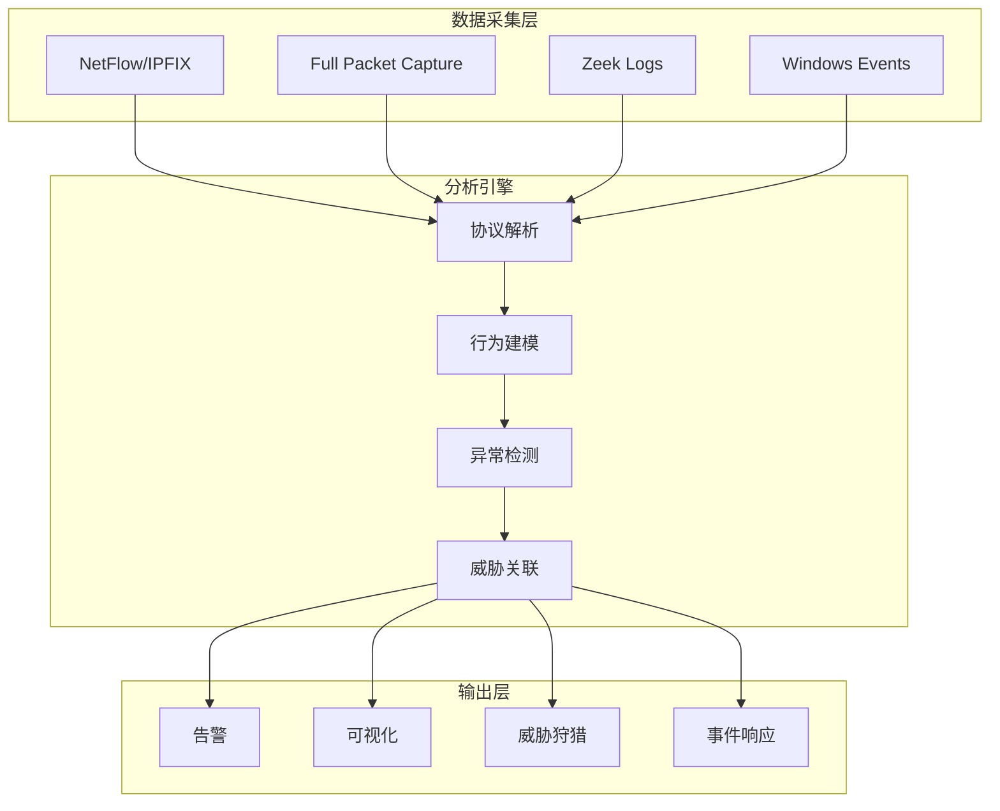
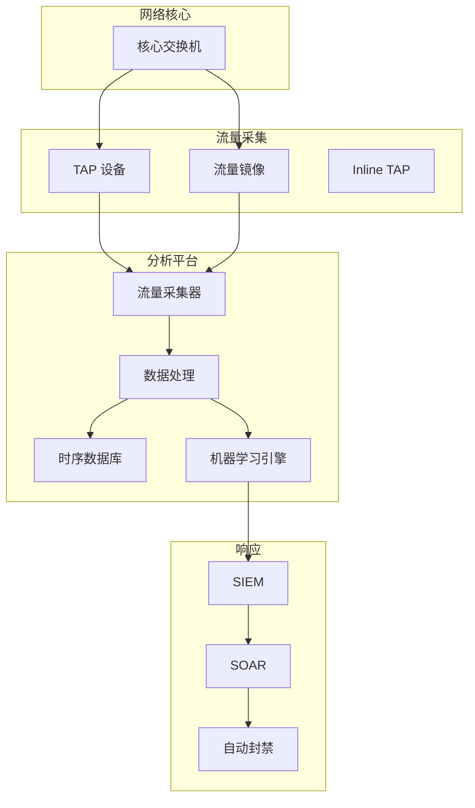
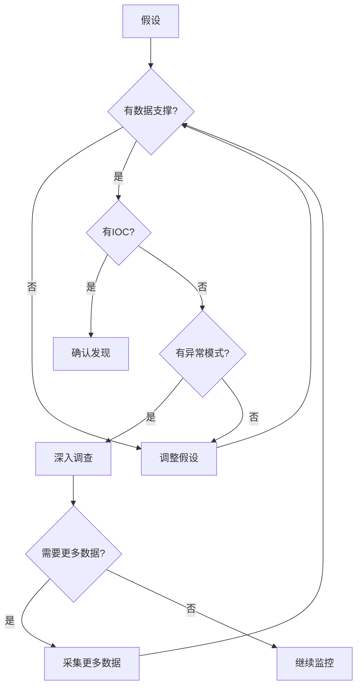

2019年12月，美国最大的电子烟制造商 JUUL Labs 遭遇了一次数据泄露事件。但真正引人关注的不是泄露本身，而是事后调查发现：攻击者在网络中已经活动了数周，却没有被任何传统安全设备发现。

安全团队后来复盘发现，攻击者的流量隐藏在正常的 HTTPS 流量中——所有入口和出口都「看起来合法」。这揭示了一个残酷的事实：**边界防火墙和 IDS 对这种「看起来正常」的高级攻击束手无策**。

这就是 **NTA（Network Traffic Analysis，网络流量分析）**的价值所在——它不只看单个数据包或连接，而是**理解整个网络的行为模式**，发现隐藏在正常流量中的异常。

## 一、NTA 的定义与价值

### 1.1 什么是 NTA

NTA 是一种通过**全流量采集、深度协议解析、行为分析**来检测网络威胁的安全技术。与传统的签名检测不同，NTA 更关注「流量为什么发生」，而不是「流量匹配了什么特征」。



### 1.2 NTA 与 IDS/IPS 的关系

| 维度 | IDS/IPS | NTA |
|------|---------|-----|
| 视角 | 单个数据包/连接 | 流量会话、行为模式 |
| 检测方式 | 签名匹配 | 行为分析、机器学习 |
| 响应能力 | 可阻断（IPS） | 主要检测 |
| 误报率 | 中 | 低（行为分析更精准） |
| 部署位置 | 网络路径或旁路 | 旁路采集 |
| 加密流量 | 有限检测能力 | 可分析元数据 |

:::tip 核心区别
IDS/IPS 告诉你「发生了什么攻击」；NTA 告诉你「谁在做什么，为什么可疑」。两者是互补关系，而非替代关系。
:::

## 二、NTA 的核心能力

### 2.1 全流量分析

NTA 能够对网络流量进行**完整的会话重建**，包括：

| 能力 | 说明 |
|------|------|
| 会话重建 | 将 TCP 流重组为完整通信 |
| 协议解码 | HTTP、DNS、SMTP、TLS 等 |
| 文件提取 | 从流量中还原传输的文件 |
| 日志生成 | 生成结构化的 Zeek 风格日志 |
| 元数据提取 | 统计各层协议的元数据 |

```bash title="Zeek 流量分析输出示例"
# 连接日志
$ zeek -r capture.pcap
$ cat conn.log | zeek-cut id.orig_h id.resp_h duration state
192.168.1.100    93.184.216.34    2.345   OTH
192.168.1.100    8.8.8.8          0.123   S0
192.168.1.100    10.0.0.50        15.678   S1

# HTTP 日志
$ cat http.log | zeek-cut id.orig_h method host uri status_code
192.168.1.100    GET     api.example.com    /v1/users       200
192.168.1.100    POST    api.example.com    /v1/auth        401

# DNS 日志
$ cat dns.log | zeek-cut id.orig_h query qtype answers
192.168.1.100    malicious-domain.com    A       185.234.219.47
192.168.1.100    c2.attacker.net         A       [no answers]
```

### 2.2 异常检测

NTA 的异常检测关注**偏离正常模式的行为**：

| 异常类型 | 正常特征 | 异常信号 |
|----------|----------|----------|
| 端口扫描 | 少量端口连接 | 短时间内大量不同端口 |
| 暴力破解 | 正常登录频率 | 单 IP 大量失败尝试 |
| 数据外传 | 稳定的数据量 | 突然大量上行流量 |
| C2 通信 | 已知域名解析 | 异常域名、DGA |
| 横向移动 | 有限的服务间通信 | 异常的服务间连接 |

```java title="简化的横向移动检测逻辑"
public class LateralMovementDetector {
    
    private final Map<String, List<ConnectionRecord>> connectionHistory = 
        new HashMap<>();
    
    public DetectionResult detect(ConnectionRecord conn) {
        String srcIp = conn.getSourceIP();
        String dstIp = conn.getDestIP();
        
        // 检测是否是新发现的主机间连接
        if (isNewInternalConnection(srcIp, dstIp)) {
            // 检查是否是异常的服务连接
            if (isAbnormalService(dstIp, conn.getDestPort())) {
                // 检查连接频率
                if (isHighFrequencyConnection(srcIp)) {
                    return DetectionResult.builder()
                        .type("LATERAL_MOVEMENT")
                        .confidence(0.85)
                        .srcIP(srcIp)
                        .dstIP(dstIp)
                        .description("Suspicious lateral movement detected")
                        .indicators(List.of(
                            "New internal connection",
                            "Access to admin ports",
                            "High connection frequency"
                        ))
                        .build();
                }
            }
        }
        
        return DetectionResult.none();
    }
    
    // 检测数据外传
    public DetectionResult detectExfiltration(HostStatistics stats) {
        // 正常：上行流量 < 下行流量
        // 异常：上行流量异常高
        double uploadRatio = stats.getUploadBytes() / stats.getTotalBytes();
        
        if (uploadRatio > 0.8 && stats.getUploadBytes() > 100 * 1024 * 1024) {
            return DetectionResult.builder()
                .type("DATA_EXFILTRATION")
                .confidence(0.9)
                .ip(stats.getIp())
                .uploadBytes(stats.getUploadBytes())
                .description("Potential data exfiltration detected")
                .build();
        }
        
        return DetectionResult.none();
    }
}
```

### 2.3 威胁狩猎

NTA 支持**主动威胁狩猎（Threat Hunting）**，即安全分析师基于假设进行主动搜寻：

| 狩猎假设 | 调查方向 | 检测指标 |
|----------|----------|----------|
| 网络中存在持久化后门 | 异常的长连接、Beacon 通信 | C2 Beacon 检测 |
| 存在横向移动 | 异常的服务间认证 | Pass-the-Hash 痕迹 |
| 存在数据窃取 | 异常的上行流量模式 | 数据外传指标 |
| 存在内部威胁 | 异常的访问模式 | 敏感数据访问 |

```bash title="威胁狩猎查询示例（Elasticsearch DSL）"
{
  "query": {
    "bool": {
      "must": [
        {
          // 检测与已知恶意 IP 的通信
          "terms": {
            "destination.ip": ["185.234.219.0/24", "185.234.218.0/24"]
          }
        },
        {
          // 检测非工作时间通信
          "script": {
            "script": {
              "source": "def hour = doc['timestamp'].value.getHour(); return hour < 7 || hour > 22;",
              "lang": "painless"
            }
          }
        },
        {
          // 检测大量数据传输
          "range": {
            "bytes_out": { "gt": 10000000 }
          }
        }
      ]
    }
  },
  "aggs": {
    "by_source": {
      "terms": { "field": "source.ip" },
      "aggs": {
        "total_bytes": { "sum": { "field": "bytes_out" } }
      }
    }
  }
}
```

## 三、元数据提取

### 3.1 NetFlow/IPFIX

NetFlow 是 Cisco 开发的流量统计协议，已成为网络流量元数据的事实标准：

| 版本 | 特点 |
|------|------|
| NetFlow v5 | 固定字段，IPv4 |
| NetFlow v9 | 模板化，支持 IPv6 |
| IPFIX | RFC 7011，基于 NetFlow v9 |

```yaml title="NetFlow/IPFIX 字段"
# 核心 NetFlow 字段
netflow_fields:
  # 流量元数据
  - flow_keys: srcIP, dstIP, srcPort, dstPort, protocol
  - bytes: packet_count, byte_count
  - timing: flow_start, flow_end, duration
  
  # 高级字段
  - tcp_flags: SYN, ACK, FIN, RST
  - tos: type_of_service
  - AS: srcAS, dstAS
  
  # 应用识别
  - app_id: protocol/app
  - app_name: HTTP, DNS, SMTP

# IPFIX 特有字段
ipfix_fields:
  - certificate: SSL/TLS 证书信息
  - http: HTTP 请求/响应头
  - dns: DNS 查询/响应
```

### 3.2 sFlow vs NetFlow

| 特性 | NetFlow | sFlow |
|------|---------|-------|
| 采集方式 | 完整流统计 | 采样包头 |
| 数据完整性 | 100% | 采样率决定 |
| 性能开销 | 较高 | 低 |
| 适用场景 | 精确分析 | 大流量环境 |

### 3.3 DNS 日志分析

DNS 是威胁检测的黄金数据源：

| 检测场景 | 指标 | 说明 |
|----------|------|------|
| DGA 检测 | 高熵域名 | 随机生成的域名 |
| DGA 检测 |  NXDOMAIN 率 | 解析失败率高 |
| C2 检测 | 长连接解析 | 指向可疑 IP |
| 数据泄露 | DNS 隧道 | 大量 DNS 查询携带数据 |

```java title="DNS 隧道检测"
public class DNSTunnelDetector {
    
    private static final int DNS_QUERY_MIN_LENGTH = 50; // 正常查询长度阈值
    private static final int DNS_QUERIES_PER_MINUTE = 100; // 异常频率
    
    public boolean isDNSTunnel(String query, String domain) {
        // 检测 1：查询长度异常
        if (query.length() > DNS_QUERY_MIN_LENGTH) {
            return true;
        }
        
        // 检测 2：子域名熵值高（DGA 特征）
        if (calculateEntropy(domain) > 4.5) {
            return true;
        }
        
        // 检测 3：编码特征（Base64 等）
        if (containsEncodedData(domain)) {
            return true;
        }
        
        return false;
    }
    
    private double calculateEntropy(String str) {
        // 计算字符串熵值
        Map<Character, Integer> freq = new HashMap<>();
        for (char c : str.toCharArray()) {
            freq.merge(c, 1, Integer::sum);
        }
        
        double entropy = 0.0;
        int len = str.length();
        for (Map.Entry<Character, Integer> entry : freq.entrySet()) {
            double p = (double) entry.getValue() / len;
            entropy -= p * Math.log(p) / Math.log(2);
        }
        return entropy;
    }
}
```

## 四、机器学习在 NTA 中的应用

### 4.1 聚类分析

使用无监督学习发现异常流量群组：

| 算法 | 应用场景 |
|------|----------|
| DBSCAN | 发现流量密度异常 |
| Isolation Forest | 隔离离群点 |
| K-Means | 流量类型聚类 |

```python title="流量聚类分析"
import pandas as pd
from sklearn.preprocessing import StandardScaler
from sklearn.cluster import DBSCAN
import numpy as np

def detect_anomalous_hosts(df_flow):
    """
    基于流量特征检测异常主机
    """
    # 特征工程
    features = df_flow.groupby('src_ip').agg({
        'bytes_sent': ['sum', 'mean', 'std'],
        'bytes_recv': ['sum', 'mean', 'std'],
        'connection_count': 'count',
        'unique_dest_ips': 'nunique',
        'unique_dest_ports': 'nunique',
        'avg_duration': 'mean'
    }).fillna(0)
    
    # 标准化
    scaler = StandardScaler()
    X_scaled = scaler.fit_transform(features)
    
    # DBSCAN 聚类
    clustering = DBSCAN(eps=0.5, min_samples=5).fit(X_scaled)
    
    # 标记异常
    features['cluster'] = clustering.labels_
    anomalies = features[features['cluster'] == -1]
    
    return anomalies

# 检测结果
anomalous_hosts = detect_anomalous_hosts(flow_data)
print(f"检测到 {len(anomalous_hosts)} 个异常主机")
```

### 4.2 时序异常检测

```python title="C2 Beacon 检测"
import pandas as pd
from scipy import stats

def detect_beacon_connections(df_dns):
    """
    检测 C2 Beacon 模式
    C2 通常具有规律性的 DNS 查询间隔
    """
    # 按域名分组
    for domain, group in df_dns.groupby('query'):
        timestamps = group['timestamp'].sort_values()
        
        if len(timestamps) < 10:
            continue
        
        # 计算时间间隔
        intervals = timestamps.diff().dropna()
        
        # 检测规律性（低标准差 = 规律）
        interval_std = intervals.std()
        interval_mean = intervals.mean()
        
        # Beacon 通常有规律的短间隔
        if interval_std < interval_mean * 0.3 and interval_mean < 3600:
            yield {
                'domain': domain,
                'mean_interval': interval_mean,
                'std_interval': interval_std,
                'query_count': len(timestamps),
                'confidence': 1 - (interval_std / interval_mean)
            }
```

## 五、加密流量分析方法

### 5.1 TLS 元数据分析

即使看不到加密内容，TLS 元数据仍然有价值：

| 元数据 | 威胁信号 |
|--------|----------|
| JA3/JA3S 指纹 | 恶意软件使用特定客户端 |
| 证书信息 | 自签名证书、恶意域名证书 |
| SNI 域名 | 访问的域名 |
| TLS 版本 | 过时版本可能漏洞 |
| 密码套件 | 弱加密套件 |

```java title="JA3 指纹检测"
public class JA3Detector {
    
    private static final Map<String, ThreatIntel> JA3_FINGERPRINTS = 
        Map.ofEntries(
            // Cobalt Strike 默认指纹
            Map.entry("4d7a28d6fca53091f07f3cf9a090c25c", 
                ThreatIntel.builder()
                    .threatType("C2")
                    .confidence(0.95)
                    .description("Cobalt Strike C2")
                    .build()),
            
            // Emotet 恶意软件
            Map.entry("a0e9d8c7b3f2a1e0d9c8b7a6f5e4d3c2",
                ThreatIntel.builder()
                    .threatType("Malware")
                    .confidence(0.90)
                    .description("Emotet Botnet")
                    .build())
        );
    
    public Optional<ThreatAlert> detectJA3(String ja3Hash) {
        ThreatIntel intel = JA3_FINGERPRINTS.get(ja3Hash);
        if (intel != null) {
            return Optional.of(ThreatAlert.builder()
                .type("JA3_MATCH")
                .threatType(intel.getThreatType())
                .confidence(intel.getConfidence())
                .description(intel.getDescription())
                .indicator(ja3Hash)
                .action(ThreatAction.BLOCK_OR_ALERT)
                .build());
        }
        return Optional.empty();
    }
}
```

### 5.2 DNS over HTTPS (DoH) 的挑战

DoH 将 DNS 查询加密并通过 HTTPS 传输，这给 NTA 带来了新挑战：

| 挑战 | 影响 | 应对策略 |
|------|------|----------|
| DNS 日志缺失 | 无法检测 DNS 隧道 | HTTPS 元数据分析 |
| 威胁情报失效 | 无法匹配恶意域名 | TLS 指纹、JA3 |
| 证书可见性 | HTTPS 检查更困难 | 企业 DNS 拦截 |

## 六、工具对比

### 6.1 开源方案

| 工具 | 特点 | 适用场景 |
|------|------|----------|
| Zeek | 全流量记录、协议分析 | 网络安全监控、取证 |
| Suricata | IDS/IPS + 部分 NTA | 边界检测 |
| Argus | NetFlow 分析 | 性能分析 |
| Moloch | 全流量捕获、检索 | 大规模数据 |
| Packetbeat | Elastic Stack 集成 | APM + 安全 |

```bash title="Zeek 部署示例"
# 安装 Zeek
sudo apt-get install zeek

# 配置 zeekctl
cat /etc/zeek/node.cfg
[zeek]
type=standalone
host=localhost
interface=eth0

# 自定义本地脚本
cat /opt/zeek/share/zeek/site/local.zeek
@load base/frameworks/intel/do_notice
@load protocols/http/detect-sqli

redef Intel::read_files += { "/opt/zeek/etc/intel.dat" };

# 启动
sudo zeekctl deploy

# 查看日志
ls /opt/zeek/logs/current/
# conn.log  dns.log  http.log  files.log  notice.log
```

### 6.2 商业方案

| 厂商 | 产品 | 特点 |
|------|------|------|
| Darktrace | Antigena | AI 驱动的自主响应 |
| ExtraHop | Reveal(x) | 云原生、全流量分析 |
| Vectra | Cognitive | AI 检测高级威胁 |
| Cisco | Secure Network Analytics | 完整的网络可视性 |
| Splunk | ES + Network Insights | SIEM 集成 |

## 七、部署架构

### 7.1 典型部署



### 7.2 数据流设计

```yaml title="流量采集配置"
# 网络配置
network:
  interface: eth0
  mode: af_packet  # 高性能抓包
  
  # 流量过滤（BPF）
  filter: "not port 22 and not port 12345"  # 排除管理端口
  
  # 采样策略
  sampling:
    type: deterministic
    rate: 1  # 1:1 采集全部

# 存储配置
storage:
  type: timeseries
  retention:
    raw_packets: 24h
    flow_records: 30d
    aggregated: 90d
    
  # 压缩
  compression: lz4

# 告警配置
alerts:
  destinations:
    - type: syslog
      endpoint: siem.company.com:514
    - type: webhook
      endpoint: https://soar.company.com/webhook
      
  # 告警去重
  deduplication:
    window: 5m
    key: [source_ip, destination_ip, alert_type]
```

## 八、性能与存储挑战

### 8.1 性能瓶颈

| 挑战 | 原因 | 缓解措施 |
|------|------|----------|
| 带宽峰值 | 大流量突发 | 增加采集点分散 |
| 计算密集 | 协议解析、加密分析 | 专用硬件 |
| 存储压力 | 全流量存储成本高 | 分级存储、采样 |
| 网络开销 | 元数据上报 | 本地预处理 |

### 8.2 存储优化策略

| 策略 | 适用数据 | 保留周期 |
|------|----------|----------|
| 全流量存储 | 事件相关流量 | 7 天 |
| NetFlow/IPFIX | 所有流量 | 30 天 |
| 告警相关 | 告警前后流量 | 90 天 |
| 聚合统计 | 长期趋势分析 | 1 年+ |

:::tip 关键洞察
NTA 的价值不在于「存储所有数据」，而在于「知道什么时候该存、存什么、存多久」。过度的数据存储是浪费，关键是要有足够的上下文来支撑威胁调查。
:::

## 思考题

**问题 1**：某公司部署了 Zeek 进行网络流量分析，安全团队发现能够检测到内部主机被植入木马后的 C2 通信，但对于木马通过 DNS 隧道窃取数据却无法发现。请分析 DNS 隧道检测的难点，以及如何构建有效的 DNS 隧道检测体系。

<details>
<summary>参考答案</summary>

**DNS 隧道检测的难点**：

1. **合法 DNS 使用量大**
   - 正常环境 DNS 查询量大
   - 难以设置简单阈值
   - 业务行为多样化

2. **隧道技术演进**
   - DNS-over-HTTPS (DoH)
   - DNS-over-TLS (DoT)
   - 隧道协议加密

3. **误报率高**
   - CDN 使用类似模式
   - 负载均衡器多域名
   - 恶意软件也用合法 DNS

**有效检测体系**：

**第一层：流量层分析**
- 记录所有 DNS 查询
- 检测异常查询模式：
  - 异常长的子域名
  - 高频查询
  - 异常大的响应

**第二层：响应分析**
- NXDOMAIN 率监控
- 异常 DNS 响应（如携带二进制数据）
- 异常 TTL 值

**第三层：关联分析**
- DNS 查询与后续流量关联
- 检测隧道数据外传
- 异常出站流量与 DNS 关联

**第四层：外部情报**
- 已知 DNS 隧道工具指纹
- 恶意域名情报
- DGA 算法检测

**关键指标**：
```
- 单主机 DNS 查询频率 > 500/分钟 = 可疑
- 单查询长度 > 200 字节 = 可疑
- 子域名熵值 > 4.5 = 可疑
- NXDOMAIN 率 > 60% = 可疑
```
</details>

**问题 2**：NTA 工具会产生大量告警，而且很多攻击（如零日漏洞利用、高级 APT）的流量可能「看起来正常」。请设计一个基于假设的威胁狩猎流程，从提出假设到验证再到迭代的过程。

<details>
<summary>参考答案</summary>

**威胁狩猎框架**：

**阶段 1：假设生成**

基于威胁情报和环境特点生成假设：

| 来源 | 示例假设 |
|------|----------|
| APT 情报 | 可能存在持久化后门，会定期回连 |
| 漏洞披露 | 内部是否存在未修补的 Exchange 服务器 |
| 异常检测 | 某个时间段内 DNS 查询量异常 |
| 业务变更 | 新上线的应用可能被攻击者发现 |

**阶段 2：假设验证**



**阶段 3：调查技术**

```bash
# 假设验证查询

# 1. 检查异常持久化连接
Zeek Query:
dest_port == 443 && duration > 86400 && bytes > 10000000

# 2. 检查可疑 DNS 模式
Zeek Query:
len(query) > 150 || 'xyz' in query

# 3. 检查横向移动
Zeek Query:
dest_port in {445, 3389} && inner_orig_bytes > 1000000

# 4. 检查数据外传
Zeek Query:
bytes_in < bytes_out * 10 && bytes_out > 50000000
```

**阶段 4：自动化狩猎**

```yaml title="自动化狩猎剧本"
hunt_playbooks:
  - name: beacon_detection
    interval: 1h
    steps:
      - collect:
          source: dns_logs
          time_range: 24h
      - analyze:
          method: interval_entropy
          threshold: 0.3
      - correlate:
          with: network_connections
      - if confidence > 0.8:
          create_alert
          enrich_with_threat_intel
```

**阶段 5：迭代优化**

- 将成功的狩猎转化为自动化规则
- 将失败的假设记录为经验
- 持续更新假设库
</details>
