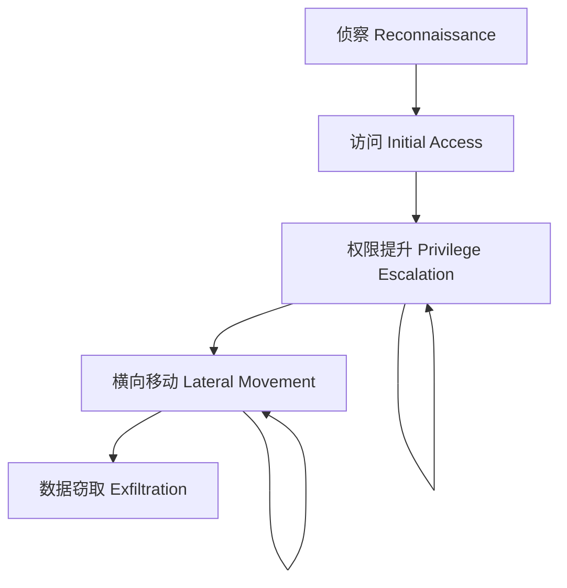
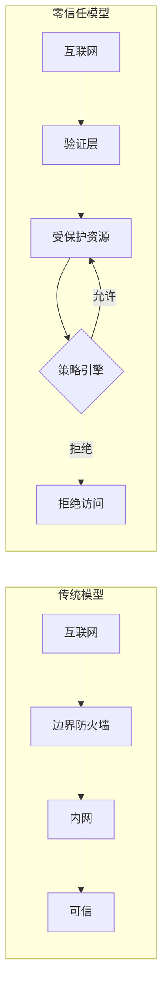

凌晨 2 点，某个金融系统的安全运营中心（SOC）收到告警：内部服务器之间出现异常的横向连接流量。攻击者早已通过钓鱼邮件突破了边界防线，正在小心翼翼地在内网中移动。从第一次入侵到被发现，已经过去了 72 小时。

这并非孤例。根据 Verizon 的《数据泄露调查报告》，**超过 70% 的数据泄露事件中，攻击者能够在目标网络中潜伏超过数天甚至数周**。传统的「边界防御」模型——在内网与外网之间筑起高墙——正在失效。

## 威胁格局：攻击者的进化之路

现代网络攻击不再是单点突破，而是精心策划的多阶段作战。典型的攻击链（Kill Chain）包括以下阶段：

### 1. 侦察阶段（Reconnaissance）

攻击者收集目标情报的过程。这个阶段可能是主动的（端口扫描、社会工程），也可能是被动的（公开数据挖掘）。防火墙日志中的异常扫描流量、安全组被频繁试探的记录，都是侦察阶段的信号。

### 2. 访问阶段（Initial Access）

突破边界防线的方式多种多样：

- **钓鱼邮件**：通过欺骗性邮件诱导员工泄露凭证或下载恶意软件
- **漏洞利用**：未修补的 VPN、邮件网关、Web 应用都是常见入口
- **供应链攻击**：通过第三方软件或服务的漏洞间接入侵
- **凭证泄露**：利用地下市场出售的泄露凭证登录

### 3. 权限提升（Privilege Escalation）

获取初始访问权限后，攻击者通常以普通用户身份落地。权限提升的目标是将普通用户提升为管理员或域管理员。常见的手段包括：利用本地漏洞、窃取凭据、Pass-the-Hash 攻击。

### 4. 横向移动（Lateral Movement）

**横向移动是现代攻击的核心特征**。攻击者在内网中从一个系统跳转到另一个系统，寻找高价值资产。这个阶段通常利用 WMI、PsExec、远程桌面、SSH 密钥等合法工具，使攻击流量看起来「正常」。

### 5. 数据窃取（Exfiltration）

最终目标是将敏感数据带出网络。数据可能通过加密通道、DNS 隧道、隐写在图片中等方式传输。这个阶段的速度和隐蔽性决定了攻击者能带走多少数据。

## 防御层次：从边界到深度防御

面对如此精密的攻击链，传统的单一防线已经不够。现代网络安全采用**纵深防御（Defense in Depth）**策略，在多个层次部署控制措施。

| 层次 | 控制措施 | 作用 |
|------|---------|------|
| 网络层 | 防火墙、WAF、IDS/IPS | 过滤恶意流量，检测异常行为 |
| 传输层 | TLS、IPsec | 加密通信，防止中间人攻击 |
| 应用层 | 安全编码、输入验证、会话管理 | 防止应用层攻击 |
| 身份层 | MFA、IAM、PAM | 验证身份，限制访问权限 |
| 数据层 | 加密、令牌化、DLP | 保护敏感数据 |
| 终端层 | EDR、防病毒、补丁管理 | 检测终端威胁 |

### 网络安全 vs 应用安全

很多人容易混淆网络安全与应用安全的边界。简单来说：

- **网络安全**：关注「数据怎么传输」，侧重网络协议、通信链路、访问控制
- **应用安全**：关注「应用怎么处理数据」，侧重代码漏洞、业务逻辑

两者的关系如同「门锁」与「金库」：网络安全是门锁，防止不怀好意的人进门；应用安全是金库，即使门被撬开，也要确保金库本身安全。

## 现代架构中的网络安全挑战

### 云计算的模糊边界

在传统数据中心，网络边界清晰可见。但在云环境中，虚拟网络、VPC、对等连接使得边界变得动态且模糊。一次错误的安全组配置，可能导致整个 VPC 暴露在公网之下。

### 容器与微服务的攻击面

Kubernetes、Docker 等容器技术引入了新的攻击面：

- **容器逃逸**：从容器突破到宿主机
- **镜像供应链**：恶意基础镜像
- **网络策略缺失**：Pod 之间的无限制通信
- **Service Account 滥用**：容器获得过高权限

### 无服务器（Serverless）的可见性挑战

函数即服务（FaaS）模式下，代码运行在云厂商的基础设施上，传统的网络监控手段难以发挥作用。攻击者可能利用函数之间的调用链逐步扩大影响范围。

## 整体策略：网络安全的新范式

面对这些挑战，现代网络安全策略正在从「边界防御」向「零信任」演进。核心思路是：

1. **永不信任**：不再假设内网是安全的，任何访问请求都需要验证
2. **始终验证**：持续验证身份、设备状态、访问上下文
3. **最小权限**：只授予完成任务所需的最低权限
4. **假设被攻破**：持续监控，快速检测，快速响应

### 网络安全的核心组成

本文档将从以下维度展开网络安全知识体系：

- **网络隔离与分段**：通过 VLAN、VPC、微分段等技术限制攻击面
- **访问控制**：VPN、ZTNA、安全组、网络 ACL
- **威胁检测**：IDS/IPS、NTA、WAF
- **应用层防护**：WAF 规则、DDoS 防护
- **基础设施安全**：DNS 安全、BGP 安全
- **协议级安全**：TLS、DNSSEC、IPsec

每项技术都不是银弹，只有组合使用、相互配合，才能构建真正有效的安全体系。

:::tip 关键洞察
边界防御并未死亡，但它已经不够了。真正的安全需要在每一个层次都部署控制措施，同时假设任何一层都可能被突破。零信任不是替换边界防御，而是为边界防御增加韧性。
:::

## 思考题

**问题 1**：为什么说「内网等于安全」的假设已经失效？请结合一个真实案例分析攻击者如何绕过边界防线进行横向移动。

参考答案

传统观念认为：只要防火墙保护了边界，内网流量就是可信的。但这个假设在以下几个场景中失效：

**场景一：VPN 被攻破**
2020 年 Twitter 的数据泄露事件中，攻击者通过社会工程获取了内部工具的访问权限。这些工具原本只对内网开放，但通过 VPN 访问即可使用。攻击者利用这一点完成了凭证重置和数据窃取。

**场景二：供应链攻击**
SolarWinds 攻击中，攻击者在软件更新包中植入了恶意代码，通过正规渠道分发到数万个企业客户。恶意代码在内网中横向移动，导致包括美国政府机构在内的大量目标被入侵。

**核心原因**：内网中运行着大量老旧系统、安全配置薄弱的服务器、以及权限过高的服务账户。一旦边界被突破（通过钓鱼、漏洞利用或供应链），攻击者可以利用这些弱点快速扩散。

**问题 2**：在微服务架构中，「东西向流量」（服务间通信）应该如何保护？有哪些技术手段可以防止服务间未经授权的访问？

参考答案

东西向流量的保护需要多层手段：

**第一层：网络层隔离**

- 使用 Kubernetes NetworkPolicy 限制 Pod 之间的通信
- 在服务网格（Istio、Linkerd）中配置 mTLS（双向 TLS）
- VPC 对等连接或服务网格的命名空间隔离

**第二层：服务身份**

- 为每个服务颁发证书，建立服务身份
- 使用 SPIFFE（Secure Production Identity Framework for Everyone）标准
- Service Account 令牌的安全管理

**第三层：应用层认证**

- 在服务间通信时验证 JWT 令牌
- API 网关统一鉴权
- 业务逻辑中的权限校验

**第四层：行为监控**

- 记录服务间调用的异常模式
- 使用 NTA（网络流量分析）检测异常连接
- 服务网格的自带遥测功能（如 Istio 的 Telemetry V2）

