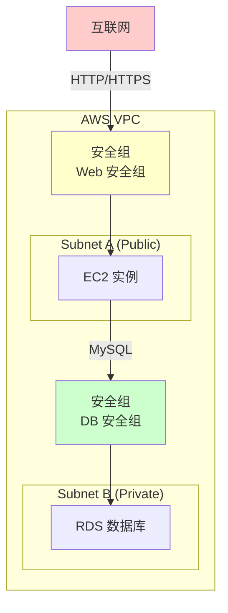
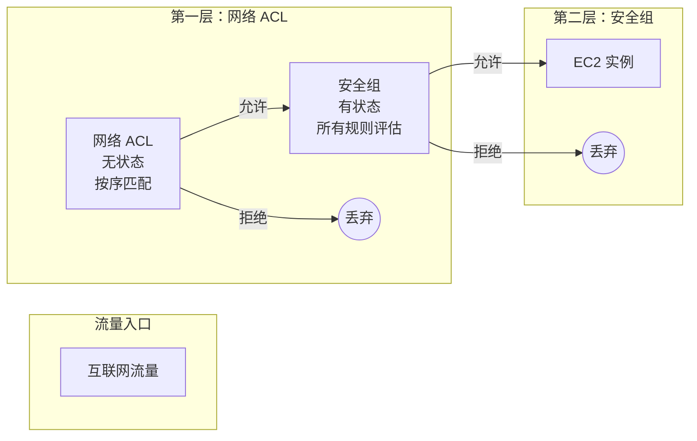
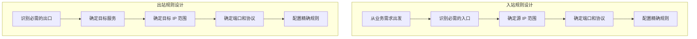
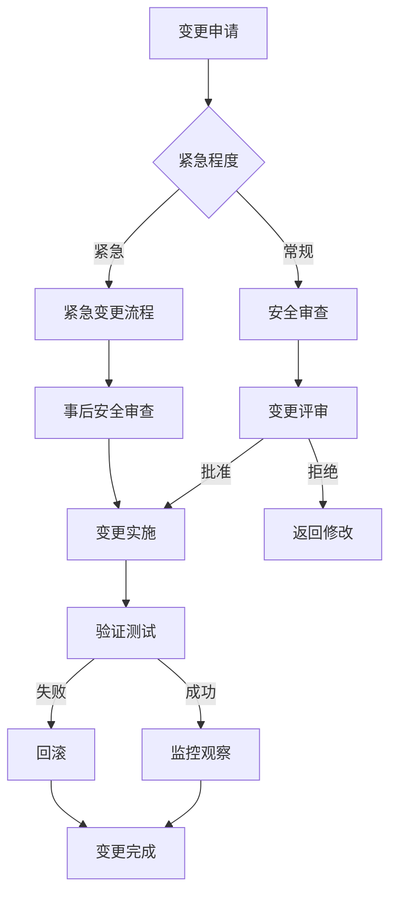

2019年2月，Capital One 银行发生了一次震惊金融业的数据泄露事件。超过 1 亿美国用户的个人信息被泄露，损失高达 3 亿美元。

事后调查发现，问题的根源是一个配置错误的安全组：Web 应用服务器的出站规则允许访问 AWS 元数据服务（169.254.169.254），而这个服务返回的凭证具有访问 S3 存储桶的权限。攻击者利用 SSRF 漏洞获取了元数据服务的凭证，进而窃取了存储桶中的数据。

这个案例揭示了一个残酷的事实：**云安全的最大威胁往往不是外部攻击，而是配置错误**。安全组作为云环境中的第一道防线，一次错误的配置就可能导致灾难性的后果。

## 一、安全组概述

### 1.1 什么是安全组

安全组（Security Group）是云环境中的**有状态虚拟防火墙**，用于控制 EC2/VMC 实例的入站和出站流量。



### 1.2 安全组的核心特性

| 特性 | 说明 |
|------|------|
| 有状态（Stateful） | 允许入站响应流量自动放行，无需单独配置出站 |
| 实例级别 | 安全组附加到具体实例，而非子网 |
| 允许模型 | 默认拒绝所有，只有明确允许的流量才放行 |
| 可叠加 | 一个实例可附加多个安全组 |
| 实时生效 | 规则变更即时生效，无需重启 |

## 二、安全组 vs 网络 ACL

### 2.1 核心区别

| 特性 | 安全组 | 网络 ACL |
|------|--------|----------|
| 层级 | 实例级别 | 子网级别 |
| 状态 | 有状态 | 无状态 |
| 规则评估 | 所有规则都会评估 | 按序号逐条匹配（第一个匹配生效） |
| 默认行为 | 拒绝所有入站，允许所有出站 | 拒绝所有入站和出站 |
| 适用范围 | 附加到实例的安全组 | 子网内所有实例 |
| 规则类型 | 只支持允许规则 | 支持允许和拒绝规则 |



### 2.2 评估顺序

```
入站流量评估顺序：
1. 安全组规则（实例级别）
2. 安全组内规则按优先级评估
3. 如果所有安全组都拒绝，则丢弃

出站流量评估顺序：
1. 安全组出站规则
2. 如果拒绝，则丢弃

注意：网络 ACL 在安全组之前或之后评估，取决于具体实现
```

:::tip 选择建议
- **网络 ACL**：子网级别的边界防护，控制整个子网的进出流量
- **安全组**：实例级别的精细控制，处理到单个实例的流量

两者配合使用，形成纵深防御。
:::

## 三、AWS 安全组配置最佳实践

### 3.1 基础配置模式

```yaml title="CloudFormation 安全组配置"
AWSTemplateFormatVersion: '2010-09-09'
Resources:
  # Web 服务器安全组
  WebServerSecurityGroup:
    Type: AWS::EC2::SecurityGroup
    Properties:
      GroupName: web-server-sg
      GroupDescription: Security group for web servers
      VpcId: !Ref VPC
      Tags:
        - Key: Environment
          Value: production
        - Key: Tier
          Value: web
      
      SecurityGroupIngress:
        # 允许 HTTP
        - IpProtocol: tcp
          FromPort: 80
          ToPort: 80
          CidrIp: 0.0.0.0/0
          Description: HTTP access
        
        # 允许 HTTPS
        - IpProtocol: tcp
          FromPort: 443
          ToPort: 443
          CidrIp: 0.0.0.0/0
          Description: HTTPS access
        
        # 允许来自负载均衡器的流量
        - IpProtocol: tcp
          FromPort: 8080
          ToPort: 8080
          SourceSecurityGroupId: !Ref ALBSecurityGroup
          Description: From ALB
      
      SecurityGroupEgress:
        # 只允许访问内网
        - IpProtocol: tcp
          ToPort: 5432
          DestinationSecurityGroupId: !Ref DatabaseSecurityGroup
          Description: To database
```

### 3.2 最小权限入站原则

**错误示例：**

```yaml
# 永远不要这样做！
SecurityGroupIngress:
  # 危险：开放 SSH 到公网
  - IpProtocol: tcp
    FromPort: 22
    ToPort: 22
    CidrIp: 0.0.0.0/0
  
  # 危险：MySQL 开放到公网
  - IpProtocol: tcp
    FromPort: 3306
    ToPort: 3306
    CidrIp: 0.0.0.0/0
```

**正确示例：**

```yaml
SecurityGroupIngress:
  # 只允许内网 SSH，通过 VPN 访问
  - IpProtocol: tcp
    FromPort: 22
    ToPort: 22
    CidrIp: 10.0.0.0/8  # 仅内网
    Description: SSH from internal network
  
  # 数据库只允许应用服务器访问
  - IpProtocol: tcp
    FromPort: 3306
    ToPort: 3306
    SourceSecurityGroupId: !Ref AppSecurityGroup
    Description: From application servers
```

### 3.3 安全组命名与标签规范

```yaml title="安全组命名规范"
# 命名格式：<环境>-<服务>-<用途>-sg
security_groups:
  - name: prod-web-alb-sg
    description: "Production Web ALB Security Group"
    tags:
      Environment: production
      Service: web
      Component: alb
      
  - name: prod-app-server-sg
    description: "Production Application Server Security Group"
    tags:
      Environment: production
      Service: application
      Component: server
      
  - name: prod-db-mysql-sg
    description: "Production MySQL Database Security Group"
    tags:
      Environment: production
      Service: database
      Component: mysql
      PCI-DSS: "true"
```

## 四、Azure NSG

### 4.1 Azure NSG 概念

Azure 网络安全组（NSG）类似 AWS 安全组，但有一些不同的特性：

| 特性 | AWS 安全组 | Azure NSG |
|------|------------|-----------|
| 默认入站 | 拒绝所有 | 允许所有 |
| 默认出站 | 允许所有 | 允许所有 |
| 规则优先级 | 无序，所有评估 | 有优先级（100-4096） |
| 应用范围 | 实例级别 | 子网或 NIC 级别 |

### 4.2 Azure NSG 配置示例

```yaml title="Azure ARM 模板 NSG 配置"
{
  "$schema": "https://schema.management.azure.com/schemas/2019-04-01/deploymentTemplate.json#",
  "resources": [
    {
      "type": "Microsoft.Network/networkSecurityGroups",
      "apiVersion": "2021-03-01",
      "name": "web-nsg",
      "location": "eastus",
      "properties": {
        "securityRules": [
          {
            "name": "allow-http",
            "properties": {
              "protocol": "Tcp",
              "sourcePortRange": "*",
              "destinationPortRange": "80",
              "sourceAddressPrefix": "Internet",
              "destinationAddressPrefix": "*",
              "access": "Allow",
              "priority": 100,
              "direction": "Inbound"
            }
          },
          {
            "name": "allow-https",
            "properties": {
              "protocol": "Tcp",
              "sourcePortRange": "*",
              "destinationPortRange": "443",
              "sourceAddressPrefix": "Internet",
              "destinationAddressPrefix": "*",
              "access": "Allow",
              "priority": 110,
              "direction": "Inbound"
            }
          },
          {
            "name": "deny-all-inbound",
            "properties": {
              "protocol": "*",
              "sourcePortRange": "*",
              "destinationPortRange": "*",
              "sourceAddressPrefix": "*",
              "destinationAddressPrefix": "*",
              "access": "Deny",
              "priority": 4096,
              "direction": "Inbound"
            }
          }
        ]
      }
    }
  ]
}
```

```bash title="Azure CLI 配置 NSG"
# 创建 NSG
az network nsg create \
  --resource-group myResourceGroup \
  --name web-nsg \
  --location eastus

# 添加安全规则
az network nsg rule create \
  --resource-group myResourceGroup \
  --nsg-name web-nsg \
  --name allow-http \
  --protocol tcp \
  --priority 100 \
  --destination-port-range 80 \
  --access allow

# 将 NSG 关联到子网
az network vnet subnet update \
  --resource-group myResourceGroup \
  --vnet-name myVnet \
  --name web-subnet \
  --network-security-group web-nsg
```

## 五、GCP 防火墙规则

### 5.1 GCP 防火墙特性

GCP 的防火墙规则有一些独特的设计：

| 特性 | 说明 |
|------|------|
| 隐式拒绝 | 所有入站都被隐式拒绝，需要显式允许 |
| 出站默认允许 | 出站流量默认允许 |
| 网络标签 | 通过标签将规则应用于实例 |
| 优先级 | 0-65535，数字越小优先级越高 |
| 方向 | 入站（INGRESS）和出站（EGRESS）分开配置 |

### 5.2 GCP 防火墙配置

```yaml title="GCP Firewall Rules Terraform 配置"
resource "google_compute_firewall" "web-server" {
  name    = "web-server-fw"
  network = google_compute_network.custom.name
  
  # 入站规则
  allow {
    protocol = "tcp"
    ports    = ["80", "443", "8080"]
  }
  
  source_tags = ["web-client"]  # 来自带有 web-client 标签的实例
  target_tags = ["web-server"]   # 应用到带有 web-server 标签的实例
  
  # 日志记录
  log_config {
    metadata = "INCLUDE_ALL_METADATA"
  }
}

resource "google_compute_firewall" "ssh-from-bastion" {
  name    = "ssh-from-bastion-fw"
  network = google_compute_network.custom.name
  
  allow {
    protocol = "tcp"
    ports    = ["22"]
  }
  
  # 只允许来自堡垒机的 SSH
  source_ranges = ["10.0.1.0/24"]  # 堡垒机子网
  
  target_tags = ["allow-ssh"]
  
  # 优先级更高
  priority = 100
}

# 拒绝所有入站（显式）
resource "google_compute_firewall" "deny-all-ingress" {
  name    = "deny-all-ingress"
  network = google_compute_network.custom.name
  
  # 没有 allow 块 = 拒绝
  priority = 65534
  
  # 应用到所有实例
  target_tags = ["protected"]
}
```

```bash title="gcloud CLI 配置"
# 创建防火墙规则
gcloud compute firewall-rules create web-server-fw \
    --network=custom-network \
    --allow tcp:80,tcp:443 \
    --target-tags=web-server \
    --source-tags=web-client \
    --description="Allow web traffic"

# 列出防火墙规则
gcloud compute firewall-rules list --filter="network:custom-network"

# 更新防火墙规则
gcloud compute firewall-rules update web-server-fw \
    --add-source-tags=api-client \
    --priority=100
```

## 六、Kubernetes NetworkPolicy

### 6.1 NetworkPolicy 概念

在 Kubernetes 中，Pod 默认可以自由通信，没有任何网络限制。NetworkPolicy 提供了类似安全组的 Pod 级别网络隔离：

```yaml title="NetworkPolicy 基本结构"
apiVersion: networking.k8s.io/v1
kind: NetworkPolicy
metadata:
  name: api-network-policy
  namespace: production
spec:
  podSelector:          # 目标 Pod 选择器
    matchLabels:
      app: api-server
  policyTypes:           # 策略类型
    - Ingress
    - Egress
  ingress:               # 入站规则
    - from:
        - podSelector:
            matchLabels:
              app: frontend
      ports:
        - protocol: TCP
          port: 8080
    - from:
        - namespaceSelector:
            matchLabels:
              name: monitoring
      ports:
        - protocol: TCP
          port: 8081
  egress:                # 出站规则
    - to:
        - podSelector:
            matchLabels:
              app: database
      ports:
        - protocol: TCP
          port: 5432
```

### 6.2 常见的 NetworkPolicy 场景

```yaml title="场景 1：默认拒绝所有入站"
apiVersion: networking.k8s.io/v1
kind: NetworkPolicy
metadata:
  name: default-deny-ingress
spec:
  podSelector: {}
  policyTypes:
    - Ingress
---
apiVersion: networking.k8s.io/v1
kind: NetworkPolicy
metadata:
  name: default-deny-egress
spec:
  podSelector: {}
  policyTypes:
    - Egress
```

```yaml title="场景 2：只允许前端访问 API"
apiVersion: networking.k8s.io/v1
kind: NetworkPolicy
metadata:
  name: api-allow-frontend
spec:
  podSelector:
    matchLabels:
      app: api
  policyTypes:
    - Ingress
  ingress:
    # 只允许来自前端服务的流量
    - from:
        - podSelector:
            matchLabels:
              app: frontend
      ports:
        - protocol: TCP
          port: 8080
```

```yaml title="场景 3：API 只允许访问数据库和 DNS"
apiVersion: networking.k8s.io/v1
kind: NetworkPolicy
metadata:
  name: api-egress-policy
spec:
  podSelector:
    matchLabels:
      app: api
  policyTypes:
    - Egress
  egress:
    # 允许访问数据库
    - to:
        - podSelector:
            matchLabels:
              app: database
      ports:
        - protocol: TCP
          port: 5432
    # 允许访问缓存
    - to:
        - podSelector:
            matchLabels:
              app: redis
      ports:
        - protocol: TCP
          port: 6379
    # 允许 DNS 查询
    - to:
        - namespaceSelector: {}
      ports:
        - protocol: UDP
          port: 53
        - protocol: TCP
          port: 53
```

### 6.3 CNI 对 NetworkPolicy 的支持

| CNI 插件 | NetworkPolicy 支持 |
|----------|-------------------|
| Calico | 完整支持，性能好 |
| Cilium | 完整支持，eBPF 加速 |
| Weave Net | 基础支持 |
| Flannel | 不支持（需要其他插件配合） |
| AWS VPC CNI | 不支持 |

## 七、安全组规则设计原则

### 7.1 最小权限原则



### 7.2 规则设计检查清单

- [ ] 是否有 `0.0.0.0/0` 的入站规则？是否必要？
- [ ] 是否开放了不必要的端口（如 SSH 22 到公网）？
- [ ] 出站规则是否过于宽松（允许所有出站）？
- [ ] 规则是否基于最小权限原则？
- [ ] 是否使用安全组引用而非 IP 白名单？
- [ ] 规则是否有适当的描述和标签？

### 7.3 常见的反模式

| 反模式 | 风险 | 正确做法 |
|--------|------|----------|
| 开放所有入站到公网 | 攻击面大 | 使用 ALB/WAF 作为唯一入口 |
| 开放 SSH 到 0.0.0.0/0 | 暴力破解风险 | 仅允许 VPN/堡垒机 IP |
| 允许所有出站 | 数据泄露风险 | 按服务限制出站目标 |
| 使用 IP 而非安全组引用 | IP 变化后忘记更新 | 使用安全组引用 |
| 过多安全组附加到实例 | 管理混乱 | 合并或简化 |

## 八、安全组的变更管理

### 8.1 变更流程



### 8.2 自动化 IaC 管理

```yaml title="Terraform 安全组模块化设计"
# modules/security-group/main.tf
variable "name" {}
variable "description" {}
variable "vpc_id" {}
variable "ingress_rules" { type = list }
variable "egress_rules" { type = list }
variable "tags" {}

resource "aws_security_group" "this" {
  name        = var.name
  description = var.description
  vpc_id      = var.vpc_id
  tags        = var.tags
  
  lifecycle {
    create_before_destroy = true
  }
}

resource "aws_vpc_security_group_ingress_rule" "this" {
  for_each = { for idx, rule in var.ingress_rules : idx => rule }
  
  security_group_id = aws_security_group.this.id
  description       = lookup(each.value, "description", null)
  ip_protocol       = each.value.protocol
  from_port         = lookup(each.value, "from_port", null)
  to_port           = lookup(each.value, "to_port", null)
  cidr_ipv4         = lookup(each.value, "cidr_ipv4", null)
  referenced_security_group_id = lookup(each.value, "security_group_id", null)
}

resource "aws_vpc_security_group_egress_rule" "this" {
  for_each = { for idx, rule in var.egress_rules : idx => rule }
  
  security_group_id = aws_security_group.this.id
  description       = lookup(each.value, "description", null)
  ip_protocol       = each.value.protocol
  from_port         = lookup(each.value, "from_port", null)
  to_port           = lookup(each.value, "to_port", null)
  cidr_ipv4         = lookup(each.value, "cidr_ipv4", null)
  referenced_security_group_id = lookup(each.value, "security_group_id", null)
}
```

```hcl title="使用模块"
# main.tf
module "web_security_group" {
  source = "./modules/security-group"
  
  name        = "web-server-sg"
  description = "Security group for web servers"
  vpc_id      = module.vpc.vpc_id
  
  ingress_rules = [
    {
      description = "HTTP"
      protocol    = "tcp"
      from_port   = 80
      to_port     = 80
      cidr_ipv4   = "0.0.0.0/0"
    },
    {
      description = "HTTPS"
      protocol    = "tcp"
      from_port   = 443
      to_port     = 443
      cidr_ipv4   = "0.0.0.0/0"
    },
    {
      description = "From ALB"
      protocol    = "tcp"
      from_port   = 8080
      to_port     = 8080
      security_group_id = module.alb_security_group.id
    }
  ]
  
  egress_rules = [
    {
      description = "To database"
      protocol    = "tcp"
      from_port   = 5432
      to_port     = 5432
      security_group_id = module.db_security_group.id
    }
  ]
  
  tags = {
    Environment = "production"
    ManagedBy   = "Terraform"
  }
}
```

### 8.3 安全组审计

```bash title="安全组审计脚本"
#!/bin/bash
# audit_security_groups.sh

echo "=== 安全组审计报告 ==="
echo "生成时间: $(date)"
echo ""

# 1. 找出危险配置
echo "【警告】开放 SSH 到公网的安全组:"
aws ec2 describe-security-groups \
  --query 'SecurityGroups[*].{
    Name: GroupName,
    SGId: GroupId,
    SSH: IpPermissions[?to_port==22 && length(IpRanges[?CidrIp=='"'"'0.0.0.0/0'"'"']) > `0`]
  }' \
  --output table \
  --filter "Name=ip-permission.to-port,Values=22"

# 2. 找出过于宽松的入站规则
echo ""
echo "【警告】允许所有入站（0.0.0.0/0）的安全组:"
aws ec2 describe-security-groups \
  --query 'SecurityGroups[*].{
    Name: GroupName,
    SGId: GroupId,
    OpenRules: IpPermissions[?length(IpRanges[?CidrIp=='"'"'0.0.0.0/0'"'"']) > `0`].[FromPort,ToPort,IpProtocol]
  }' \
  --output table

# 3. 统计安全组数量
echo ""
echo "【统计】安全组使用情况:"
TOTAL=$(aws ec2 describe-security-groups --query 'length(SecurityGroups)')
echo "总安全组数量: $TOTAL"

# 4. 查找未使用的安全组
echo ""
echo "【建议】未使用的安全组:"
aws ec2 describe-security-groups \
  --query 'SecurityGroups[?(length(IpPermissions) == `0` && length(IpPermissionsEgress) == `1`)]|[*].GroupName'
```

:::tip 关键洞察
云安全组是云安全的基础，但也是最容易出错的地方。建议：
1. 使用 IaC 管理所有安全组配置
2. 实施安全组变更审批流程
3. 定期进行安全组审计
4. 使用安全组引用而非 IP 白名单
5. 遵循最小权限原则，宁可少开不要多开
:::

## 思考题

**问题 1**：某公司计划将本地数据中心的应用迁移到 AWS。应用架构包含 Web 层（3 层负载均衡）、应用层（10 个 EC2 实例）和数据库层（RDS）。请设计完整的安全组架构，包括各层之间的访问关系和规则配置。

<details>
<summary>参考答案</summary>

**安全组架构设计**：

**架构概览**：

```
互联网 → ALB 安全组 → Web 服务器安全组 → App 服务器安全组 → RDS 安全组
```

**详细设计**：

**1. ALB 安全组（Internet-facing）**

```yaml
alb_security_group:
  name: prod-alb-sg
  ingress:
    - port: 80, protocol: tcp, source: 0.0.0.0/0  # HTTP
    - port: 443, protocol: tcp, source: 0.0.0.0/0  # HTTPS
  egress:
    - to: web_sg, port: 80  # 到 Web 服务器
```

**2. Web 服务器安全组**

```yaml
web_security_group:
  name: prod-web-sg
  ingress:
    - from: alb_sg, port: 80
    - from: bastion_sg, port: 22  # 管理 SSH
  egress:
    - to: app_sg, port: 8080  # 到应用服务器
```

**3. 应用服务器安全组**

```yaml
app_security_group:
  name: prod-app-sg
  ingress:
    - from: web_sg, port: 8080
  egress:
    - to: rds_sg, port: 5432  # MySQL
    - to: cache_sg, port: 6379  # Redis
    - to: 0.0.0.0/0, port: 443  # 外部 API（HTTPS）
```

**4. RDS 安全组**

```yaml
rds_security_group:
  name: prod-rds-sg
  ingress:
    - from: app_sg, port: 5432
  egress: []  # 数据库不主动发起连接
```

**关键原则**：
- 层与层之间使用安全组引用，而非 IP
- 每个层级独立的安全组
- 最小端口开放
- 管理端口（SSH/RDP）只能从堡垒机访问
</details>

**问题 2**：在 Kubernetes 环境中，默认情况下所有 Pod 之间可以自由通信。请分析这种设计的安全风险，以及如何通过 NetworkPolicy 实现零信任网络。

<details>
<summary>参考答案</summary>

**默认开放的网络带来的安全风险**：

1. **横向移动风险**
   - 一个 Pod 被攻破，攻击者可以访问所有其他 Pod
   - 攻击者可以探测集群内的所有服务

2. **服务间认证缺失**
   - 任何 Pod 都可以假装是合法服务
   - 无法区分正常请求和恶意请求

3. **数据泄露风险**
   - 受感染的 Pod 可以访问数据库 Pod
   - 可以窃取敏感数据

**零信任 NetworkPolicy 实现**：

**第一步：默认拒绝**

```yaml
# 默认拒绝所有入站流量
apiVersion: networking.k8s.io/v1
kind: NetworkPolicy
metadata:
  name: default-deny-ingress
spec:
  podSelector: {}
  policyTypes:
    - Ingress

# 默认拒绝所有出站流量
apiVersion: networking.k8s.io/v1
kind: NetworkPolicy
metadata:
  name: default-deny-egress
spec:
  podSelector: {}
  policyTypes:
    - Egress
```

**第二步：显式允许必要流量**

```yaml
# 允许前端访问后端 API
apiVersion: networking.k8s.io/v1
kind: NetworkPolicy
metadata:
  name: api-allow-from-frontend
spec:
  podSelector:
    matchLabels:
      app: api
  policyTypes:
    - Ingress
  ingress:
    - from:
        - podSelector:
            matchLabels:
              app: frontend
      ports:
        - port: 8080

# API 只能访问数据库和 DNS
apiVersion: networking.k8s.io/v1
kind: NetworkPolicy
metadata:
  name: api-egress-restrictions
spec:
  podSelector:
    matchLabels:
      app: api
  policyTypes:
    - Egress
  egress:
    - to:
        - podSelector:
            matchLabels:
              app: database
      ports:
        - port: 5432
    - to: {}  # DNS（所有 namespace）
      ports:
        - port: 53
        - protocol: UDP
```

**第三步：配合服务网格增强安全**

- 启用 mTLS 确保服务身份
- 使用 Sidecar 代理实现细粒度控制
- 实施零信任策略

**管理建议**：
- 使用 OPA/Gatekeeper 强制 NetworkPolicy
- 定期审计策略覆盖度
- 监控未授权的连接尝试
</details>
