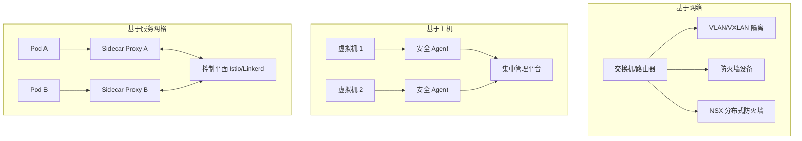

某金融企业在进行安全架构升级时，安全团队面临一个关键决策：选择哪种微分段方案？VMware NSX 听起来功能强大但价格昂贵；基于主机的方案便宜但管理复杂；服务网格方案适合云原生但需要改造现有应用。

这不是一个技术对错的问题，而是多个因素的综合权衡：**现有的基础设施、团队能力、安全需求、预算限制**。理解各种方案的特点，才能做出适合的选择。

## 微分段技术方案分类

### 基于网络的微分段

通过物理或虚拟网络设备实现微分段，包括 VLAN、VXLAN、网络设备商的内置安全功能。

### 基于主机的微分段

在每个服务器/虚拟机上安装代理（Agent），通过代理执行安全策略。代理通常以内核模块、虚拟化层或用户态进程运行。

### 基于服务网格的微分段

在云原生环境中，通过 Sidecar 代理或 Service Mesh 控制平面实现服务间通信的安全策略。



## 各方案详细对比

### 1. 基于 VLAN/VXLAN 的微分段

**技术原理**

- VLAN：通过 802.1Q 标签在 Layer 2 网络上划分广播域
- VXLAN：在 Layer 3 之上封装 Layer 2，实现大规模租户隔离

**优点**

- 网络设备原生支持，无需额外软件
- 性能影响小，硬件加速
- 运维团队熟悉度高

**缺点**

- 粒度粗，无法实现应用级隔离
- 策略随 IP 地址变化，维护成本高
- 无法感知应用层上下文
- VLAN 数量有限（4096），VXLAN VNI 有 1600 万但管理复杂

**适用场景**

- 大规模租户隔离（公有云 VPC）
- 数据中心的东西向流量粗隔离
- 传统 IT 环境

### 2. VMware NSX

**技术原理**

NSX 是 VMware 的网络虚拟化平台，提供分布式防火墙功能。策略定义在 vCenter/NSX Manager，分布式执行在每个 ESXi 主机的 hypervisor 层。

**优点**

- 覆盖虚拟机、容器、物理服务器
- 细粒度的应用感知策略
- 与 vSphere 深度集成
- 分布式执行，性能优异

**缺点**

- 绑定 VMware 生态
- 价格昂贵（许可费用高）
- 学习曲线陡峭
- 对非 VMware 环境支持有限

**适用场景**

- 已大规模使用 VMware 的企业
- 需要统一管理虚拟化和容器环境的场景

### 3. 基于主机的安全 Agent（Illumio、Guardicore、Twistlock）

**技术原理**

在每台服务器上安装轻量级 Agent，Agent 拦截网络流量并执行安全策略。策略定义在集中管理平台，下发到各个 Agent。

**优点**

- 跨云、跨环境统一管理
- 支持物理服务器和虚拟机
- 策略与 IP 解耦（基于标签）
- 可视化流量关系

**缺点**

- Agent 占用资源（CPU、内存）
- 需要在每台服务器上安装，维护成本
- 某些环境可能不允许安装 Agent
- Agent 本身可能成为攻击目标

**适用场景**

- 多云或混合云环境
- 需要保护物理服务器的场景
- 不想绑定特定虚拟化平台的组织

### 4. Kubernetes NetworkPolicy

**技术原理**

Kubernetes 原生的网络策略资源，定义 Pod 之间的访问规则。实际执行依赖网络插件（CNI），如 Calico、Cilium。

**优点**

- Kubernetes 原生，无需额外软件
- 与 Kubernetes 标签系统集成
- 策略即代码，可版本控制
- 云原生友好

**缺点**

- 仅适用于 Kubernetes 环境
- 不同 CNI 实现能力差异大
- 无法跨集群、跨云统一管理
- 默认拒绝策略需要手动配置

**适用场景**

- 纯 Kubernetes 环境
- 云原生应用的微隔离
- DevSecOps 流程

### 5. 服务网格（Istio、Linkerd、Consul Connect）

**技术原理**

服务网格通过 Sidecar 代理（Envoy）拦截服务间所有流量，提供 mTLS 双向认证、细粒度访问策略、流量监控。

**优点**

- 零信任服务间通信
- mTLS 自动证书管理
- 丰富的可观测性
- 动态策略调整

**缺点**

- 资源开销显著（Sidecar 占用）
- 延迟增加（虽然很小）
- 学习和运维成本高
- 需要改造应用或添加注解

**适用场景**

- 云原生微服务架构
- 需要服务间强认证和加密的场景
- 已采用 Kubernetes 的组织

## 部署复杂度对比

| 方案 | 初始部署 | 日常运维 | 扩展性 |
|------|---------|---------|--------|
| VLAN/VXLAN | 低 | 中 | 受限于网络设备 |
| VMware NSX | 中 | 中 | 取决于 NSX 规模 |
| 主机 Agent | 中 | 高 | 好 |
| K8s NetworkPolicy | 低 | 低 | 取决于 CNI |
| Service Mesh | 高 | 高 | 取决于集群规模 |

## 可扩展性对比

| 方案 | 100 服务器 | 1000 服务器 | 10000 服务器 |
|------|-----------|-------------|--------------|
| VLAN/VXLAN | 可行 | 困难 | 不推荐 |
| VMware NSX | 优秀 | 优秀 | 良好 |
| 主机 Agent | 优秀 | 良好 | 良好 |
| K8s NetworkPolicy | 优秀 | 良好 | 良好 |
| Service Mesh | 优秀 | 良好 | 良好 |

## 管理平面对比

| 维度 | VLAN/VXLAN | NSX | 主机 Agent | NetworkPolicy | Service Mesh |
|------|-----------|-----|-----------|---------------|--------------|
| 策略定义 | CLI/网络设备 | GUI/API | GUI/API | YAML/API | YAML/API |
| 可视化 | 有限 | 优秀 | 优秀 | 一般 | 优秀 |
| 变更审批 | 手动 | 内置 | 内置 | GitOps | GitOps |
| 多云支持 | 困难 | 仅 VMware | 优秀 | 困难 | 困难 |
| 合规报告 | 手动 | 自动 | 自动 | 手动 | 手动 |

## 选型建议

### 根据基础设施选型

| 现有环境 | 推荐方案 |
|---------|---------|
| 全 VMware | NSX + 主机 Agent |
| 全 Kubernetes | NetworkPolicy + Service Mesh |
| 混合（VMware + K8s） | 主机 Agent（统一管理） |
| 多云 + 混合 | 主机 Agent 或 NSX |
| 传统 + 云原生 | 分层方案（网络分段 + 应用层微分段） |

### 根据团队能力选型

| 团队能力 | 推荐方案 | 说明 |
|---------|---------|------|
| 网络团队强，安全团队弱 | VLAN/VXLAN + 防火墙 | 现有能力复用 |
| DevOps 能力强 | NetworkPolicy + Service Mesh | GitOps 管理 |
| 安全团队专业 | 主机 Agent | 充分利用可视化 |
| 混合团队 | 分层方案 | 各司其职 |

### 实际案例分析

**案例一：大型金融机构**

- 环境：VMware + Kubernetes + 物理服务器 + 多云
- 选择：Illumio（主机 Agent）作为统一微分段平台
- 理由：统一管理所有环境，避免方案碎片化

**案例二：互联网公司**

- 环境：Kubernetes 全家桶
- 选择：Calico NetworkPolicy + Istio
- 理由：云原生方案，与 CI/CD 流程集成

**案例三：传统制造业**

- 环境：VMware + 少量物理服务器
- 选择：NSX 分布式防火墙
- 理由：团队熟悉 VMware，NSX 覆盖现有需求

## 综合建议

1. **不要追求一步到位**：微分段是旅程，先覆盖高价值资产
2. **选择与现有能力匹配**：团队能运维才是好方案
3. **考虑长期演进**：选择支持多云/混合的方案
4. **分层防护**：网络层 + 应用层协同，而非单一方案
5. **先可视化后策略**：不要急于定义策略，先看清楚流量

:::tip 关键洞察
没有完美的微分段方案，只有适合当前情况的方案。选择时应该综合考虑：基础设施现状、团队能力、安全需求、预算约束、长期演进方向。最复杂的方案不一定是最好的，能解决实际问题的才是最合适的。
:::

## 思考题

**问题 1**：某企业有 80% 的工作负载已经迁移到 Kubernetes，但仍有 20% 的遗留应用运行在物理服务器和 VMware 虚拟机上。如何设计一个统一的微分段策略？

<details>
<summary>参考答案</summary>

这是一个典型的混合环境微分段挑战。推荐的分层方案：

**分层策略架构**

**Layer 1：网络层隔离（边界）**

- 使用传统 VLAN/子网分离不同安全域：DMZ、应用、数据
- 生产环境和开发环境网络完全隔离
- 目的：粗粒度隔离，快速阻断明显恶意的跨域流量

**Layer 2：Kubernetes 内部微分段**

- Calico NetworkPolicy 定义命名空间级别隔离
- 命名空间内的默认拒绝策略
- 核心应用（数据库）只允许来自指定命名空间的访问

**Layer 3：遗留系统微分段**

- 主机 Agent（如 Illumio）保护物理服务器和 VMware 虚拟机
- 定义基于标签的策略，与 Kubernetes 策略对齐
- 打通标签体系（如通过 CMDB 同步标签）

**Layer 4：跨环境通信控制**

- 关键场景：Kubernetes Pod 需要访问遗留数据库
- 通过服务网格的 Ingress Controller 代理访问
- Ingress Controller 本身也受主机 Agent 保护

**标签统一**

```yaml
# 统一标签示例
# Kubernetes
metadata:
  labels:
    env: production
    tier: database
    app: payment
    sensitivity: high

# 虚拟机/物理机（通过 CMDB 同步）
metadata:
  labels:
    env: production
    tier: database
    app: payment
    sensitivity: high
```

**统一策略示例**

```yaml
# 统一的「生产环境数据库」访问策略
- name: "production-database-access"
  description: "Only production workloads can access production databases"
  source:
    - tags: { env: production, tier: application }
  destination:
    - tags: { env: production, tier: database, sensitivity: high }
  ports: [5432, 3306, 1433]
  action: allow
```

**关键成功因素**：

1. 建立统一的标签体系，跨环境对齐
2. 选择支持混合环境的主机 Agent 方案
3. 逐步迁移，先从高价值资产开始
4. 建立跨团队协作机制（网络、VMware、K8s）

</details>

**问题 2**：服务网格的 Sidecar 模式带来了显著的资源开销和延迟。如果想在不完全采用服务网格的情况下，实现类似的服务间安全控制，有哪些替代方案？

<details>
<summary>参考答案</summary>

服务网格的 Sidecar 确实带来了额外的资源开销和复杂度。以下是几种轻量级替代方案：

**方案一：Cilium eBPF（推荐）**

Cilium 使用 eBPF 在内核层面实现网络策略和 mTLS，不依赖 Sidecar：

- 资源开销极低（内核级处理）
- 延迟几乎为零
- 自动服务发现和负载均衡
- 支持 Kubernetes 原生 NetworkPolicy

```yaml
# CiliumNetworkPolicy 示例
apiVersion: cilium.io/v2
kind: CiliumNetworkPolicy
metadata:
  name: backend-policy
spec:
  endpointSelector:
    matchLabels:
      app: backend
  ingress:
    - fromEndpoints:
        - matchLabels:
            app: frontend
      toPorts:
        - ports:
            - port: "8080"
              protocol: TCP
```

**方案二：基于服务身份的 mTLS**

使用 SPIFFE/SPIRE 作为服务身份颁发者，在应用层面或网络代理层面实现 mTLS：

- 服务网格控制平面（如 Istio）可以只启用 mTLS，关闭其他功能
- 使用 nginx/HAProxy 作为轻量级代理，终止 TLS

**方案三：应用层网关**

在应用边界部署 API 网关（如 Kong、Ambassador）：

- 网关负责认证和访问控制
- 应用内部通信可以用简单的服务发现
- 适合 HTTP/REST 服务

**方案四：轻量级 Sidecar（不带完整服务网格）**

只部署 Envoy 代理作为 Sidecar，不部署完整的 Istio 控制平面：

- 使用手动配置的 Envoy 静态资源
- 或者使用更轻量的代理（如 Envoy Mobile）

**方案五：演进路径**

```
第一阶段：Cilium eBPF（无 Sidecar，性能优先）
         ↓
第二阶段：添加 mTLS（通过 Cilium + SPIRE）
         ↓
第三阶段：如果需要更高级功能（如流量镜像、渐进式发布），添加 Istio 控制平面
```

**推荐选择**：

- **性能敏感**：Cilium eBPF
- **过渡期**：轻量级 Sidecar + 外部控制平面
- **API 保护为主**：API 网关
- **未来可能上服务网格**：现在先做好标签体系，为将来迁移做准备

</details>
