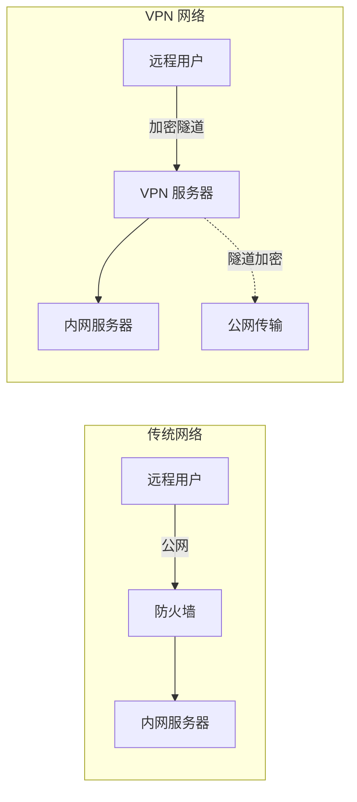
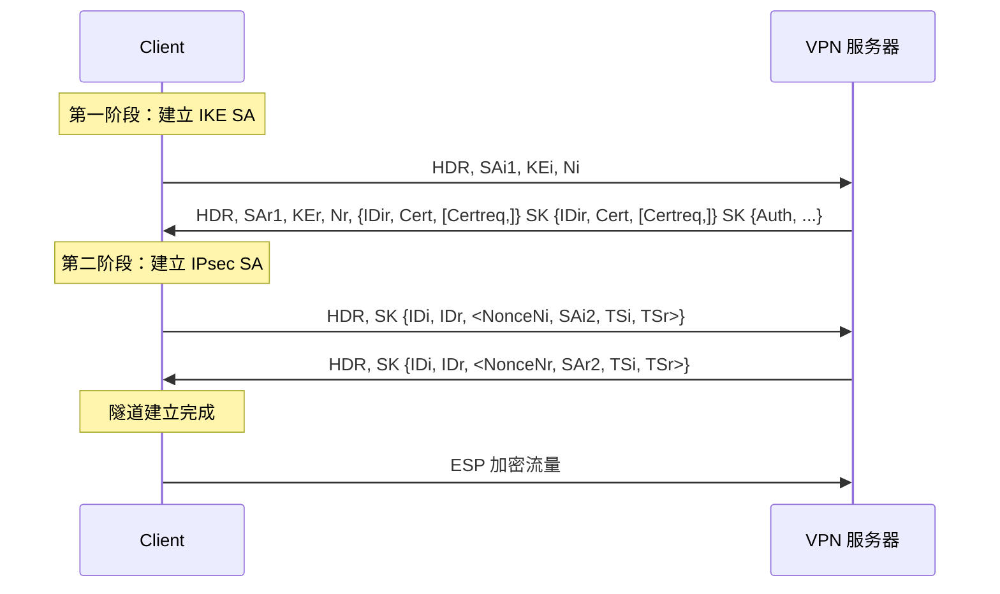
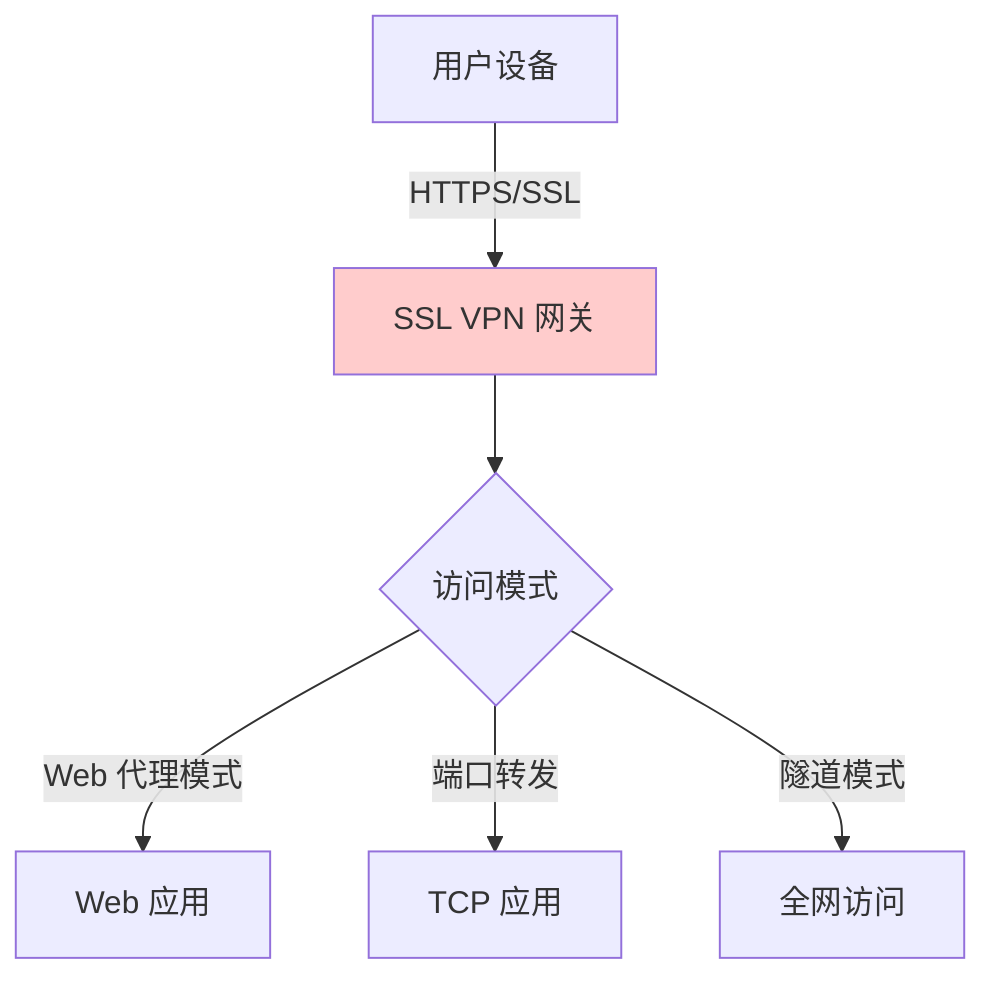
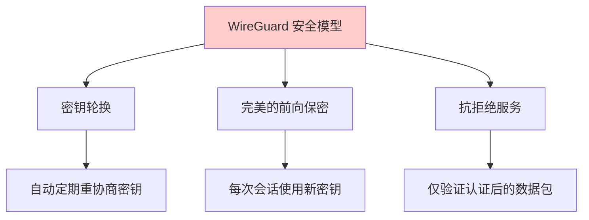
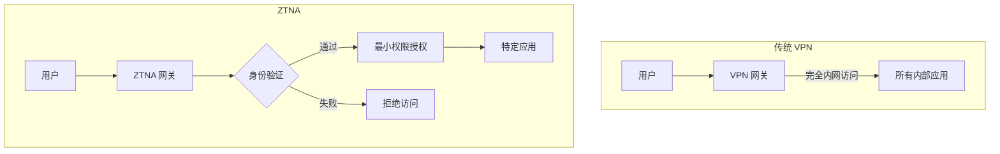

2021年3月，美国最大的燃油管道运营商 Colonial Pipeline 遭遇勒索软件攻击，导致美国东海岸燃油供应中断 6 天。调查发现，攻击者通过一个 VPN 账号远程访问了公司网络——这个账号的密码后来被发现出现在一次数据泄露的密码列表中。

这个案例揭示了一个讽刺的事实：**VPN 本应是安全访问的入口，却常常成为攻击者的跳板**。传统 VPN 的设计理念是「建立虚拟专用网络」，一旦连接成功，用户就成为内网的「完全成员」，可以访问几乎所有资源。这种「边界内 = 可信」的模型，正是现代安全的软肋。

## 一、VPN 的定义与类型

### 1.1 什么是 VPN

VPN（Virtual Private Network，虚拟专用网络）通过公网建立加密隧道，让远程用户或站点能够安全地访问内部资源。



### 1.2 VPN 的分类

| 类型 | 典型协议 | 适用场景 |
|------|----------|----------|
| 站点间 VPN | IPsec | 连接不同地点的办公室 |
| 远程访问 VPN | SSL VPN、IPsec | 远程员工访问内网 |
| 客户端 VPN | OpenVPN、WireGuard | 个人用户或移动办公 |
| SD-WAN VPN | 多种协议 | 分布式企业网络 |

## 二、IPsec VPN

### 2.1 IPsec 的协议栈

IPsec 是一套协议标准，核心包含两个协议：

| 协议 | 功能 | 头位置 |
|------|------|--------|
| AH（Authentication Header） | 认证，数据完整性校验 | IP 头之后 |
| ESP（Encapsulating Security Payload） | 加密，认证，完整性 | IP 头之后，替换 AH |

### 2.2 隧道模式 vs 传输模式

IPsec 有两种工作模式：

```mermaid
flowchart TD
    subgraph "原始数据包"
        IP1[IP 头] --> H1[TCP 头] --> D[数据]
    end
    
    subgraph "隧道模式"
        IP2_1[新 IP 头] --> ESP_H[ESP 头]
        ESP_H --> IP1_T[原 IP 头]
        IP1_T --> H1_T[TCP 头]
        H1_T --> D_T[数据]
        D_T --> ESP_T[ESP Trailer]
        ESP_T --> ESP_A[ESP Auth]
        style ESP_H fill:#ffcccc
        style ESP_A fill:#ffcccc
    end
    
    subgraph "传输模式"
        IP1_O[原 IP 头] --> ESP_H_O[ESP 头]
        ESP_H_O --> H1_O[TCP 头]
        H1_O --> D_O[数据]
        D_O --> ESP_T_O[ESP Trailer]
        ESP_T_O --> ESP_A_O[ESP Auth]
    end
```



| 模式 | 特点 | 适用场景 |
|------|------|----------|
| 隧道模式 | 整个原始数据包加密/封装 | 站点间 VPN、网关到网关 |
| 传输模式 | 只加密载荷，保留原始 IP | 主机到主机、端点加密 |

### 2.3 IKEv2 协议

IKEv2（Internet Key Exchange version 2）是建立 IPsec 安全关联的协商协议：



### 2.4 IPsec 的优势与局限

| 优势 | 局限 |
|------|------|
| 操作系统内核支持 | 配置复杂（证书、策略、路由） |
| 网络层加密，透明于应用 | NAT 穿透问题 |
| 工业标准，广泛兼容 | 移动网络切换不稳定 |
| 高安全性 | 防火墙可能拦截 |

## 三、SSL VPN

### 3.1 SSL VPN 的工作原理

SSL VPN 基于 TLS 协议，利用浏览器或专用客户端建立安全通道：



### 3.2 全隧道 vs 分割隧道

| 模式 | 说明 | 适用场景 |
|------|------|----------|
| 全隧道（Full Tunnel） | 所有流量都经过 VPN | 高安全要求 |
| 分割隧道（Split Tunnel） | 只有指定流量走 VPN | 性能敏感、信任本地网络 |

```yaml title="Cisco SSL VPN 分割隧道配置示例"
# 只允许内网流量走 VPN
split-tunnel-network-list value SPLIT_TUNNEL_ACL

# 全隧道模式（默认）
no split-tunnel-policy tunnelall

# 基于域名的分割隧道
split-tunnel-policy tunnelspecified
split-tunnel-network-list value DOMAIN_BASED_ACL
```

:::warning 分割隧道的安全风险
分割隧道允许部分流量不经过 VPN，直接访问公网。这意味着：
- 用户本地网络可能不安全
- 难以监控非 VPN 流量的安全合规
- 可能绕过安全策略
:::

## 四、WireGuard

### 4.1 WireGuard 的设计哲学

WireGuard 是 2019 年发布的现代 VPN 协议，设计目标是**简洁、高效、安全**。

**核心优势**：

| 维度 | OpenVPN | IPsec | WireGuard |
|------|---------|-------|-----------|
| 代码行数 | ~100,000 | ~500,000 | ~4,000 |
| 安全审计难度 | 高 | 极高 | 低 |
| 握手速度 | 慢（1-3 RTT） | 慢（1-3 RTT） | 快（1 RTT） |
| 移动网络切换 | 不稳定 | 不稳定 | 稳定 |
| 内核支持 | 用户态 | 内核态 | 内核态 |
| 配置复杂度 | 高 | 高 | 低 |

### 4.2 WireGuard 的加密算法

WireGuard 只使用了现代的、经过验证的加密算法：

| 功能 | 算法 | 原因 |
|------|------|------|
| 密钥交换 | Curve25519 | 高效、安全 |
| 对称加密 | ChaCha20 | 优于 AES（在移动设备上更快） |
| 认证 | Poly1305 | 高效 MAC |
| 哈希 | BLAKE2s | 更安全、更快 |
| DH | Noise Protocol framework | 完善的密钥协商框架 |

### 4.3 WireGuard 配置示例

```bash title="WireGuard 服务器配置"
# /etc/wireguard/wg0.conf

[Interface]
# 服务器私钥
PrivateKey = <server-private-key>

# 监听端口
ListenPort = 51820

# 服务器隧道 IP
Address = 10.0.0.1/24

# NAT 配置
PostUp = iptables -A FORWARD -i wg0 -j ACCEPT
PostUp = iptables -t nat -A POSTROUTING -o eth0 -j MASQUERADE
PostDown = iptables -D FORWARD -i wg0 -j ACCEPT
PostDown = iptables -t nat -D POSTROUTING -o eth0 -j MASQUERADE

# 客户端公钥和分配 IP
[Peer]
# 客户端 A
PublicKey = <client-a-public-key>
AllowedIPs = 10.0.0.2/32

[Peer]
# 客户端 B
PublicKey = <client-b-public-key>
AllowedIPs = 10.0.0.3/32
```

```bash title="WireGuard 客户端配置"
# 客户端配置
[Interface]
# 客户端私钥
PrivateKey = <client-private-key>

# 分配的隧道 IP
Address = 10.0.0.2/32

# DNS 服务器
DNS = 10.0.0.1

# 服务器公钥
[Peer]
PublicKey = <server-public-key>

# 服务器地址和端口
Endpoint = vpn.example.com:51820

# 允许访问的网段
AllowedIPs = 10.0.0.0/24

# 持久保持连接（穿越 NAT）
PersistentKeepalive = 25
```

### 4.4 WireGuard 的安全特性



**密钥轮换机制**：

WireGuard 会自动定期（默认每 2 分钟）重新协商密钥，即使当前密钥未被攻破也会轮换。这意味着即使攻击者获得了某个时间点的密钥，也无法解密之前或之后的通信。

## 五、技术对比与选型

| 特性 | IPsec | SSL VPN | WireGuard |
|------|-------|---------|-----------|
| 适用场景 | 站点间、大规模 | 远程访问、B/S 应用 | 轻量级、移动优先 |
| 穿透性 | 中（NAT 问题） | 高（基于 HTTPS） | 高 |
| 性能 | 高 | 中 | 高 |
| 兼容性 | 好 | 非常好 | 较好（内核5.6+） |
| 管理复杂度 | 高 | 中 | 低 |
| 安全审计 | 困难 | 中等 | 容易 |
| 移动网络支持 | 差 | 中 | 好 |
| 开源 | 部分 | OpenVPN | 完整开源 |

### 选型建议

- **小型团队、个人用户**：WireGuard（简洁、快速）
- **企业远程访问**：SSL VPN（浏览器可用性好）
- **站点间大规模连接**：IPsec（性能好、兼容性好）
- **高度安全环境**：IPsec + 双因素认证

## 六、零信任 VPN（ZTNA）与传统 VPN

### 6.1 传统 VPN 的问题

| 问题 | 说明 | 风险 |
|------|------|------|
| 过度授权 | 登录后可以访问内网大部分资源 | 横向移动风险 |
| 静态策略 | 策略不随用户状态变化 | 不适应现代威胁 |
| 全员暴露 | 所有 VPN 用户共享同一安全边界 | 单点突破 |
| 性能瓶颈 | 所有流量集中通过 VPN 网关 | 访问延迟高 |

### 6.2 ZTNA 的核心思想

ZTNA（Zero Trust Network Access）基于零信任原则：

1. **永不信任**：每次访问都需要验证
2. **最小权限**：只授予特定应用的访问权限
3. **持续监控**：实时评估设备状态和用户行为
4. **应用级访问**：不是网络级访问，而是应用级代理



### 6.3 ZTNA vs 传统 VPN

| 维度 | 传统 VPN | ZTNA |
|------|----------|------|
| 信任模型 | 网络位置 = 信任 | 永不信任，始终验证 |
| 访问粒度 | 网络级（全内网） | 应用级（单一应用） |
| 可见性 | 网络层 | 应用层 |
| 性能 | 集中转发瓶颈 | 分布式直连 |
| 用户体验 | 需要全局客户端 | 无客户端或轻量代理 |
| 适用场景 | 员工需要访问多种内部系统 | 开发者/SaaS 优先 |

### 6.4 ZTNA 产品示例

| 产品 | 厂商 | 特点 |
|------|------|------|
| BeyondCorp | Google | 最早的 ZTNA 实践 |
| Cloudflare Access | Cloudflare | 基于 SASE |
| Twingate | Twingate | 开源选项 |
| Okta Verify | Okta | 身份优先 |
| 阿里云 VPN | 阿里云 | 国内云集成 |

## 七、VPN 的安全配置

### 7.1 身份认证强化

```yaml title="VPN 双因素认证配置示例"
# OpenVPN + Duo Security 集成
plugin /usr/local/lib/openvpn/plugins/openvpn-plugin-auth-pam.so login
auth-gen-token
tmp-dir /dev/shm

# 强制 2FA
verify-client-cert none
auth-user-pass-verify /etc/openvpn/verify-2fa.sh via-file

# 证书 + 密码双重认证
auth-user-pass-verify /etc/openvpn/dual-auth.sh via-env
```

### 7.2 访问策略配置

```java title="ZTNA 策略引擎配置示例"
{
  "access_policies": [
    {
      "name": "finance-app-policy",
      "priority": 1,
      "conditions": {
        "user": {
          "groups": ["finance-team"]
        },
        "device": {
          "os": ["macOS", "Windows"],
          "security_posture": ["antivirus_active", "disk_encrypted"]
        },
        "request": {
          "application": ["sap-finance"]
        },
        "risk_score": "<= 30"
      },
      "action": "allow",
      "require_re_authentication": false
    },
    {
      "name": "default-deny",
      "priority": 9999,
      "conditions": {},
      "action": "deny",
      "reason": "No matching policy"
    }
  ]
}
```

### 7.3 监控与审计

- 记录所有 VPN 连接事件（时间、用户、IP、时长）
- 监控异常登录模式（如异地登录、异常时间）
- 定期审查 VPN 用户权限
- 禁用长期不活跃的账号

## 八、VPN 的性能问题与优化

### 8.1 性能瓶颈

| 瓶颈 | 原因 | 影响 |
|------|------|------|
| 加密计算 | CPU 密集型 | 吞吐量受限 |
| 隧道开销 | 封装额外头部 | 带宽利用率下降 |
| 集中转发 | 所有流量经过网关 | 延迟增加 |
| NAT 转换 | 地址转换开销 | 性能下降 |

### 8.2 优化策略

- **硬件加速**：使用支持 AES-NI 的 CPU
- **协议优化**：选择加密效率更高的协议（如 WireGuard）
- **架构优化**：部署多个 VPN 网关实现负载均衡
- **分割隧道**：减少不必要的 VPN 流量

:::tip 关键洞察
VPN 正在从「安全工具」向「过渡技术」演进。随着 ZTNA 的成熟，企业会逐渐用 ZTNA 替代传统 VPN。但这不意味着 VPN 会完全消失——站点间的 IPsec 连接仍然是高效的选择。
:::

## 思考题

**问题 1**：某公司计划将远程办公从传统 VPN 迁移到 ZTNA。请分析迁移过程中可能面临的主要挑战，以及如何分阶段平滑迁移？

<details>
<summary>参考答案</summary>

**主要挑战**：

1. **应用发现与目录化**：ZTNA 需要知道有哪些应用需要保护
2. **遗留应用**：老旧系统可能不支持现代认证协议
3. **用户习惯改变**：从「连接后自由访问」到「每次访问单独授权」
4. **混合环境过渡**：部分应用在 ZTNA、部分在 VPN

**分阶段迁移方案**：

**阶段 1：ZTNA 试点（1-2 个月）**
- 选择低风险用户群体（如 IT 部门）
- 选择支持 SSO 的现代应用
- 双轨运行：ZTNA + VPN 并行

**阶段 2：扩展 ZTNA（3-4 个月）**
- 将更多应用纳入 ZTNA
- 对遗留应用评估改造或替代方案
- 收集反馈，优化策略

**阶段 3：VPN 退役（6 个月后）**
- 减少 VPN 用户权限
- 对 VPN 访问实施监控和告警
- 最终关闭 VPN 服务

**关键技术措施**：
- 应用映射：建立完整的企业应用清单
- 策略迁移：从 VPN ACL 转换为 ZTNA 策略
- 身份集成：确保 ZTNA 与 IdP（Okta/Azure AD）集成
- 监控完善：建立 ZTNA 可观测性
</details>

**问题 2**：WireGuard 号称「代码只有 4000 行，比 IPsec 简单 100 倍」。但简单是否意味着不安全？请从密码学角度分析 WireGuard 的安全性。

<details>
<summary>参考答案</summary>

**WireGuard 的安全性分析**：

**1. 密码学算法的选择**

WireGuard 没有「选择」——它只实现了经过验证的现代算法：

| 组件 | WireGuard 选择 | 评价 |
|------|----------------|------|
| 密钥交换 | Curve25519 | NIST 曲线之外的可靠选择 |
| 对称加密 | ChaCha20-Poly1305 | IETF 标准，无专利问题 |
| 哈希 | BLAKE2s | SHA-3 候选，更快 |

**2. 简洁性的安全优势**

代码量少的好处：
- **易于审计**：安全研究人员可以在较短时间内完整审查
- **更少 bug**：代码越少，潜在的漏洞越少
- **更快修复**：问题发现后修复更快速

**3. Noise Protocol 的安全性**

WireGuard 使用 Noise Protocol 框架，这是一个经过多年验证的协议框架：
- 提供了完善的密钥协商流程
- 内置了完美的前向保密（PFS）
- 支持密钥轮换

**4. 争议与缓解**

争议点：ChaCha20 不是美国 NIST 推荐的算法

缓解措施：
- 大多数现代 CPU 都有 AES 硬件加速
- ChaCha20 在没有 AES 硬件（如某些移动设备）的设备上反而更快
- NSA 推荐的算法并非「更安全」，只是「更保守」

**结论**：WireGuard 的简单性是设计优势，不是安全弱点。
</details>
