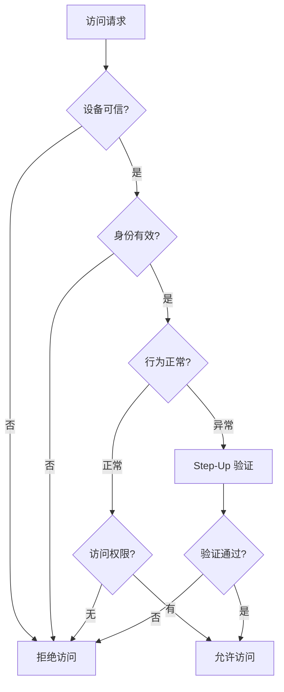

2017 年，某个能源公司的 OT（运营技术）网络遭遇勒索软件攻击。攻击者通过鱼叉式钓鱼邮件进入 IT 网络，然后利用 IT/OT 之间缺乏隔离的问题，横向移动到了 SCADA 控制系统。工厂被迫停工三天，直接损失超过千万。

事后的调查发现：攻击者进入网络的手段并不高明，只是利用了一个未打补丁的 VPN。如果当时部署了微分段，攻击者根本无法从 IT 网络跳转到 OT 网络。如果执行最小权限原则，IT 管理员就不会拥有 OT 系统的访问权限。

**这个案例揭示了零信任原则的重要性：不是「如何防止攻击者进入」，而是「如何限制攻击者进来之后的行动」**。

## 零信任的五大原则

### 原则一：持续验证（Continuous Verification）

传统安全模型在用户登录时验证一次，然后假设后续操作都是合法的。这相当于「机场安检只检查一次机票，之后在整个飞行过程中不再核验身份」。

持续验证要求在以下场景重新评估信任：

- **访问新资源时**：即使刚通过了身份验证，访问不同敏感级别的资源需要重新评估
- **上下文变化时**：用户位置从办公室变为咖啡馆，从工作时间变为深夜
- **行为异常时**：用户突然开始访问平时不使用的系统
- **会话超时后**：任何静默期后的活动都需要重新验证



### 原则二：最小权限访问（Least Privilege Access）

最小权限原则最早由 Saltzer 和 Schroeder 在 1975 年提出：**每个用户和程序应该只被授予完成其任务所必需的最小权限集合**。

这个原则听起来简单，但实际执行中困难重重：

- **权限蔓延（Privilege Creep）**：员工岗位调动时，原有权限未及时撤销，导致权限累积
- **共享账户**：多人共用一个账户，无法追踪个人行为
- **过度授权的默认值**：管理员为了省事，给所有用户授予完全访问权限

**最小权限的实施要点**：

1. 基于角色的权限（RBAC）：根据岗位职责定义权限
2. 基于属性的权限（ABAC）：根据用户、设备、资源属性动态授权
3. 即时权限（JIT）：只在需要时临时授予权限，使用后自动回收
4. 权限审查（PAM）：定期审查和清理权限

### 原则三：假设被攻破（Assume Breach）

这是零信任最重要的心态转变。传统安全思维是「努力不让攻击者进来」，零信任思维是「假设攻击者已经进来，我们的目标是限制破坏范围和快速发现」。

**Assume Breach 思维下的安全措施**：

- **网络分段**：即使攻击者进入内网，也要阻止横向移动
- **日志与监控**：假设攻击者会尝试窃取数据，建立完善的检测机制
- **数据加密**：假设攻击者可能访问数据库，对敏感数据加密
- **事件响应演练**：假设会发生安全事件，定期演练响应流程
- **红蓝对抗**：主动寻找系统弱点，而不是等攻击者发现

### 原则四：微分段（Micro-Segmentation）

微分段是「假设被攻破」原则的技术实现。传统网络像一栋没有隔墙的办公楼：一旦攻击者进入大厅，他可以随意进入任何房间。微分段则像一栋每个房间都有独立门禁的建筑，即使攻击者进入了一个房间，也无法进入其他房间。

### 原则五：永不信任（Never Trust, Always Verify）

这是零信任的口号式原则。它的完整含义包括：

- **不信任网络位置**：内网不等于可信，远程不等于不可信
- **不信任设备**：即使设备在企业网络中，也要验证其状态
- **不信任用户**：即使用户通过了认证，也要持续评估其行为
- **不信任服务**：服务间通信也需要相互认证
- **不信任供应商**：供应链也是攻击面

## 从零信任理念到技术实现

| 零信任原则 | 技术实现 |
|-----------|---------|
| 持续验证 | MFA、UEBA、动态风险评分 |
| 最小权限 | RBAC/ABAC、JIT PAM、零管理权限 |
| 假设被攻破 | 微分段、日志全量采集、加密 |
| 微分段 | 防火墙策略、NetworkPolicy、Service Mesh |
| 永不信任 | 设备信任评估、mTLS、ZTA |

### 身份层实现

**多因素认证（MFA）**：结合知识（密码）、持有（手机）、特征（指纹）三种因素。

```java
// 简化示例：基于 Spring Security 的 MFA 验证流程
public class MfaAuthenticationProvider implements AuthenticationProvider {

    private final TotpService totpService;
    private final UserRepository userRepository;

    @Override
    public Authentication authenticate(Authentication authentication) {
        String username = authentication.getName();
        String totpCode = authentication.getCredentials().toString();

        User user = userRepository.findByUsername(username)
            .orElseThrow(() -> new BadCredentialsException("用户不存在"));

        // 第一因素：密码已在过滤器中验证
        // 第二因素：验证 TOTP
        if (!totpService.validateCode(user.getSecret(), totpCode)) {
            throw new BadCredentialsException("MFA 验证码无效");
        }

        // 可选：第三因素 - 设备指纹
        String deviceFingerprint = extractDeviceFingerprint(authentication);
        if (!user.isTrustedDevice(deviceFingerprint)) {
            // 触发额外验证或拒绝访问
            log.warn("不受信任的设备尝试登录: user={}, device={}", username, deviceFingerprint);
        }

        return new UsernamePasswordAuthenticationToken(
            user, null, user.getAuthorities()
        );
    }
}
```

### 设备信任实现

设备信任评估需要一个评估引擎，综合多项指标计算信任分数：

| 指标 | 高风险（0分） | 低风险（100分） |
|------|-------------|----------------|
| 系统补丁 | 超过 30 天未更新 | 7 天内更新 |
| 防病毒 | 未安装或已过期 | 运行中且最新 |
| 磁盘加密 | 未加密 | 已加密 |
| 越狱/Root | 检测到 | 未检测到 |
| VPN 连接 | 否 | 是 |
| MDM 托管 | 否 | 是 |

最终信任分数 = 各指标加权平均，可设定阈值（如 `< 70` 需要额外验证）。

### 网络层实现

微分段的实现需要精细的策略引擎：

```yaml
# Kubernetes NetworkPolicy 示例：限制前端只能访问后端服务
apiVersion: networking.k8s.io/v1
kind: NetworkPolicy
metadata:
  name: frontend-network-policy
  namespace: production
spec:
  podSelector:
    matchLabels:
      app: frontend
      tier: web
  policyTypes:
    - Ingress
    - Egress
  ingress:
    - from:
        - namespaceSelector:
            matchLabels:
              name: ingress-nginx
      ports:
        - port: 8080
  egress:
    - to:
        - podSelector:
            matchLabels:
              app: backend
              tier: api
      ports:
        - port: 8080
    - to:
        - namespaceSelector: {}
          pods:
            selector:
              k8s-app: kube-dns
      ports:
        - port: 53
          protocol: UDP
```

## 零信任成熟度评估框架

企业零信任建设可以分为以下五个成熟度级别：

| 级别 | 名称 | 特征 |
|------|------|------|
| L1 | 传统边界 | 依赖防火墙和 VPN，内网完全信任 |
| L2 | 增强边界 | 增加 MFA，但内网访问控制粗粒度 |
| L3 | 身份为中心 | 实施 MFA+设备信任，细粒度 RBAC |
| L4 | 初步零信任 | 微隔离试点，引入持续监控 |
| L5 | 成熟零信任 | 全面微分段，动态策略，自动化响应 |

## 实施零信任的关键成功因素

### 1. 高层支持

零信任不是安全团队能单独完成的项目。它需要：

- CEO/CISO 的战略支持
- 业务部门的配合（可能影响用户体验）
- IT 运维部门的执行能力
- 充足的预算支持

### 2. 完整资产清单

不知道拥有什么，就无法保护什么。需要：

- 应用清单（内部应用、SaaS、云服务）
- 数据清单（敏感数据分布）
- 身份清单（用户账户、服务账户、特权账户）
- 设备清单（终端、服务器、IoT 设备）

### 3. 渐进式实施

不要试图一步到位。推荐路径：

1. **先保护最高价值资产**：确定最需要保护的应用和数据
2. **先从不敏感区域试点**：积累经验后再推广
3. **先身份后网络**：先强化身份验证，再优化网络分段

### 4. 用户体验优先

安全措施不应严重影响工作效率。如果员工为了绕过安全控制而使用个人设备或不安全的工具，反而增加风险。

## 常见误区

### 误区一：零信任是一个产品

零信任不是某个产品，而是安全架构的重新设计。市面上标榜「零信任」的产品很多，但单个产品无法实现零信任。

### 误区二：零信任可以一步到位

零信任是旅程，不是终点。成熟的零信任安全需要数年时间逐步建设。

### 误区三：零信任等于不用 VPN

VPN 是零信任旅程中的过渡技术，而不是要被完全抛弃。对于某些场景（如运维人员访问服务器），VPN 仍然有其价值。

### 误区四：内网可以完全消除

完全消除「内网」概念在当前阶段不现实。零信任的目标是减少内网的信任假设，而不是完全消灭网络边界。

:::tip 关键洞察
零信任的五大原则相互关联、相互支撑。持续验证是方法，最小权限是目标，假设被攻破是心态，微分段是技术实现，永不信任是价值观。它们共同构成了现代安全架构的哲学基础。
:::

## 思考题

**问题 1**：在实施最小权限原则时，「管理员需要 admin 权限来管理系统」这个经典悖论应该如何解决？

<details>
<summary>参考答案</summary>

这个悖论的本质是：**权限管理的 chicken-and-egg 问题**——需要权限来管理权限。

**解决方案一：即时权限（JIT）**

平时给管理员分配普通账户，需要执行特权操作时，通过审批流程临时获取 admin 权限。例如：

- 管理员登录时使用普通账户
- 需要 root 权限时，向 PAM（特权访问管理）系统申请
- 系统记录完整的操作审计日志
- 操作完成后自动回收权限

**解决方案二：分层权限模型**

- L0：完全不受限制的管理员（极少人，如 CISO）
- L1：系统级管理员（如 DBA 管理数据库）
- L2：应用级管理员（如开发负责人管理应用配置）
- L3：普通用户

不同级别的权限授予不同的职责范围，互相隔离。

**解决方案三：Break-Glass 机制**

紧急情况下，管理员可以通过紧急流程获取权限，同时触发安全告警。这种「打破玻璃」的机制确保紧急情况能处理，但事后必须复盘。

**技术工具**：CyberArk、Vault、PAMaaS 平台

</details>

**问题 2**：假设攻击者已经成功渗透到企业内网，如何通过「假设被攻破」的思维来限制其造成的损害？

<details>
<summary>参考答案</summary>

「假设被攻破」思维下的防御策略应该从以下几个维度展开：

**网络隔离层**

- 实施微分段，确保攻击者无法从一个子网跳转到另一个子网
- IT/OT 网络严格隔离，禁止直接路由
- 关闭不必要的横向通信端口（445、3389、22）
- 对特权账户实施跳跃式认证（先登录跳板机，再登录目标系统）

**身份隔离层**

- 特权账户不使用常规 AD 账户，使用独立身份系统
- 管理员凭证不缓存，使用硬件密钥或智能卡
- 服务账户凭证存放在集中式密码保险库

**数据保护层**

- 对敏感数据加密，即使数据库被攻破也需要密钥解密
- 实施 DLP（数据泄露防护），监控敏感数据的异常外传
- 数据库操作需要审批，并记录所有查询

**检测与响应层**

- 部署 EDR 监控终端异常行为
- 部署 NDR/NTA 检测网络横向移动
- 建立 SIEM 关联分析，快速发现攻击链
- 定期红蓝对抗演练，检验防御有效性

**关键原则**：让攻击者的每一步移动都需要付出代价，同时让防御者能够及时发现。

</details>
