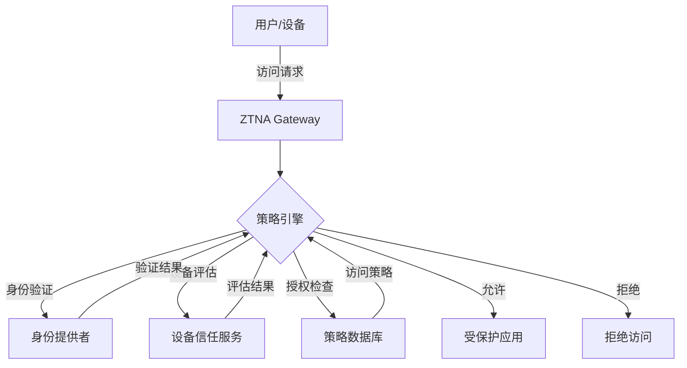

2019 年，某大型科技公司宣布其 VPN 使用量在远程办公政策下暴涨 300%，但安全团队却发现：一旦 VPN 被攻破，攻击者可以访问几乎所有内部系统。更糟糕的是，他们无法准确判断哪些用户在什么时间访问了什么资源。

这不是个例。**传统的 VPN 模型本质上假设「连接发起者可信」，这个假设在云时代和远程办公普及的背景下已经千疮百孔**。零信任网络架构（Zero Trust Network Access，ZTNA）应运而生。

## 零信任网络架构的定义

ZTNA 的核心理念可以浓缩为一句话：**「永不信任，始终验证」**（Never Trust, Always Verify）。

与传统的边界安全模型不同，零信任不区分「内网」和「外网」。无论用户从哪里发起访问，无论请求来自本地网络还是互联网，每个访问请求都必须经过身份验证、设备评估和授权检查。



## 零信任 vs 传统 VPN

理解 ZTNA 的价值，先要理解传统 VPN 的局限：

| 维度 | 传统 VPN | ZTNA |
|------|----------|------|
| 信任模型 | 网络位置信任（内网可信） | 身份与设备信任 |
| 访问范围 | 全量网络访问（隧道内） | 最小化应用访问 |
| 连接方式 | 全隧道或半隧道 | 按需建立连接 |
| 性能影响 | 显著（加密/解密开销） | 最小化 |
| 可视性 | 粗粒度 | 细粒度会话级 |
| 攻击面 | 大（VPN 网关是单一故障点） | 小（应用级代理） |
| 横向移动 | 容易（进入内网后畅行无阻） | 困难（每访问一个应用都需验证） |

**VPN 的核心问题**：一旦用户通过 VPN 认证并进入隧道，他在逻辑上就拥有了内网中所有资源的访问能力。攻击者如果获取了 VPN 凭据或发现了 VPN 漏洞，就能以「合法用户」身份在内网中自由移动。

## ZTNA 的关键组件

一个完整的 ZTNA 方案需要以下核心组件的协作：

### 1. 身份识别与认证（Identity Provider）

用户的身份是零信任的基石。身份提供者负责：

- 多因素认证（MFA）的验证
- 用户属性的管理与发放（部门、角色、项目组）
- 联合身份的支持（支持 SAML、OAuth、OIDC）

常见方案：Okta、Azure AD、Keycloak、Auth0

### 2. 设备信任评估（Device Trust）

设备的状态直接影响访问风险。设备信任评估需要检查：

- 设备是否加入了域或 MDM 管理
- 操作系统是否打过最新补丁
- 防病毒软件是否运行正常
- 是否存在越狱/root
- 证书是否有效

常见方案：CrowdStrike、Jamf、Microsoft Intune、VMware Workspace ONE

### 3. 策略引擎（Policy Engine）

策略引擎是 ZTNA 的大脑，负责决定「是否允许这次访问」。决策因素包括：

- 用户身份与组属性
- 设备状态与信任分数
- 访问时间与地理位置
- 目标应用的敏感等级
- 请求的应用层上下文

策略可以用类似「如果用户属于研发组，且设备补丁完整，且访问时间是工作时间，则允许访问代码仓库」的方式表达。

### 4. 策略执行点（Policy Enforcement Point）

执行点通常部署为应用代理，位于用户和应用之间。它负责：

- 拦截访问请求
- 向策略引擎查询授权
- 根据决策放行或拒绝
- 终止会话

执行点可以是硬件设备、软件网关，或者云服务。

### 5. 持续监控与日志（Continuous Monitoring）

零信任不是「一次验证就完事」。持续监控包括：

- 实时会话行为分析
- 异常检测与告警
- 访问日志的完整记录
- 用户与实体行为分析（UEBA）

## ZTNA 的部署模式

### 客户端代理模式（Client-Based Agent）

用户设备上安装专用客户端，客户端负责：

- 建立到 ZTNA 网关的加密隧道
- 执行设备状态检查
- 推送客户端证书

优点：安全性高，对应用透明
缺点：需要部署客户端，部分场景不支持

代表产品：Cloudflare Access（客户端模式）、Zscaler Private Access

### 无客户端模式（Clientless）

用户通过浏览器或专用门户访问应用，不需要安装客户端。认证和授权在网关层完成。

优点：无需客户端部署，用户体验好
缺点：仅限 Web 应用，无法保护非 Web 协议

代表产品：Cloudflare Access（浏览器模式）、Akamai Enterprise Application Access

### 服务网格模式（Service Mesh）

在微服务架构中，ZTNA 思想体现在服务网格层面：

- Sidecar 代理处理服务间通信
- mTLS 双向认证
- 基于标签的访问策略

代表方案：Istio、Linkerd、Consul Connect

## ZTNA 的实施路径

零信任不是一蹴而就的项目，而是分阶段的演进过程：

### 第一阶段：身份与访问控制

1. 实施多因素认证（MFA）
2. 清理特权账户，实施 PAM
3. 建立基于角色的访问控制（RBAC）
4. 禁用网络层直接访问（如 RDP、SSH 直接暴露）

### 第二阶段：设备信任

1. 部署 MDM/EMM 解决方案
2. 建立设备信任评估策略
3. 将设备状态纳入访问决策
4. 实施终端检测与响应（EDR）

### 第三阶段：网络分段

1. 识别关键应用资产
2. 实施微隔离策略
3. 建立应用级别的访问代理
4. 逐步淘汰传统 VPN

### 第四阶段：持续自适应

1. 部署用户与实体行为分析（UEBA）
2. 建立动态访问策略
3. 实施持续监控与响应
4. 自动化策略调整

## 主流 ZTNA 产品对比

| 产品 | 厂商 | 模式 | 优势 | 劣势 |
|------|------|------|------|------|
| Zscaler Private Access | Zscaler | 云原生 | 全球化节点、低延迟 | 配置复杂 |
| Cloudflare Access | Cloudflare | 混合 | 易于使用、免费版可用 | 企业功能需付费 |
| Azure VPN Gateway + Conditional Access | Microsoft | 混合 | 与 Azure AD 深度集成 | 绑定 Azure 生态 |
| Google BeyondCorp Enterprise | Google | 云原生 | 原生实践、高安全性 | 价格较高 |
| Twingate | Twingate | 混合 | 易于部署、开源选项 | 相对年轻 |

## ZTNA 的局限性与挑战

### 实施复杂性

零信任需要对身份、设备、网络、应用有全面的可见性。对于基础设施老旧的企业，这可能需要数年时间逐步迁移。

### 用户体验

额外的验证步骤可能影响用户体验。如何在安全性和便利性之间取得平衡，是持续面临的挑战。

### 应用兼容性

客户端模式下，非 Web 应用的保护需要额外的配置。一些遗留系统可能无法支持现代认证协议。

### 性能开销

每次访问请求都需要经过策略评估，对于延迟敏感的应用可能带来额外开销。

### 可见性与隐私

持续的设备状态检查和会话监控可能引发隐私争议，需要在员工知情同意的框架下进行。

:::tip 关键洞察
ZTNA 不是 VPN 的简单替代品。它代表了一种全新的安全思维方式：将信任从「网络位置」转移到「身份与设备」。但 ZTNA 也不是银弹——它需要与网络隔离、终端安全、应用安全等其他控制措施配合使用。
:::

## 思考题

**问题 1**：如果一个用户通过了 ZTNA 的所有验证（包括 MFA、设备信任评估），但他的访问行为突然出现异常（比如在凌晨 3 点访问敏感系统），ZTNA 系统应该如何响应？

<details>
<summary>参考答案</summary>

ZTNA 的「持续验证」理念要求系统不能仅在连接建立时验证，而应该在会话期间持续监控。可能的响应包括：

**分级响应策略**：

1. **风险提升（Step-Up Authentication）**：要求用户进行额外的身份验证，如再次输入 MFA 码或使用硬件密钥

2. **临时降权**：将用户限制在较低权限级别，只允许访问非敏感操作

3. **会话暂停**：挂起当前会话，要求用户重新认证

4. **告警通知**：向安全运营团队发送告警，记录事件供后续分析

**技术实现**：

- UEBA 系统实时分析用户行为，与基线对比
- 策略引擎支持动态策略调整（基于实时风险评分）
- 执行点支持会话级别的策略变更

关键在于：不要一刀切地拒绝访问，而是根据风险级别采取对应对策，平衡用户体验与安全要求。

</details>

**问题 2**：在混合云架构中，如何将 ZTNA 的理念扩展到本地数据中心和多个云环境？

<details>
<summary>参考答案</summary>

多云和混合云环境下的 ZTNA 实施需要统一策略层和分布式执行点：

**统一身份与策略层**：

- 部署统一的身份提供者（如 Okta、Azure AD），管理所有环境中的用户身份
- 建立集中化的策略引擎，定义跨环境的访问策略
- 使用标签或组来抽象应用的业务属性，与底层基础设施解耦

**分布式执行点**：

- 在每个云环境部署 ZTNA 网关或代理
- 在本地数据中心部署相应的连接器
- 通过 API 或代理与中央策略引擎通信

**网络连接**：

- 使用专线或 VPN 将各环境连接到中央策略服务
- 考虑使用云提供商的私有点对点连接（如 AWS Direct Connect、Azure ExpressRoute）
- 确保连接本身的安全（IPsec 或 WireGuard）

**数据流示例**：

```
用户 -> ZTNA 客户端 -> 中央策略引擎（验证身份和设备）
                         ↓
              策略引擎返回授权结果 + 目标地址
                         ↓
              客户端建立到对应环境 ZTNA 网关的隧道
                         ↓
                         应用
```

</details>
