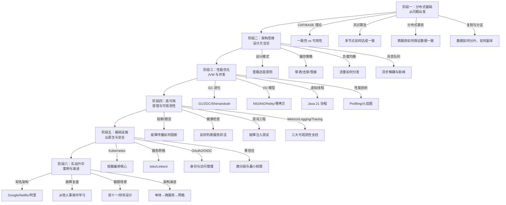

# 知识导览

五年经验的 Java 工程师老张最近很困惑：CRUD 写得飞起，框架用得熟练，但每次面试被问到「如何设计一个秒杀系统」「Redis 缓存和数据库一致性怎么做」「分布式锁有哪些坑」，总觉得似懂非懂。看完博客文章，当时觉得理解了，换个问法又答不上来。

这不是他的问题。这是大多数开发者的共同困境：**会写代码，但不懂架构**。

区别在于：写代码是在解决「怎么做」，架构是在解决「为什么这样做、什么时候不该这样做、出了问题该怎么排查」。这两件事需要的知识体系完全不同。

ArchNexus 就是为解决这个差距而生的。

## 学习路径

架构知识不是零散的知识点，而是一张有内在逻辑的网络。下面的路径按照「问题驱动」而非「技术分类」来组织——每个阶段都从真实问题出发，再延伸到支撑这个问题的理论基础和具体技术。

## 核心模块详解

### 分布式理论

这是整个知识体系的基石。很多人跳过理论直接学技术，结果在实践中反复踩坑——因为他们不知道坑为什么存在。

这一模块聚焦四个核心问题：

**一致性与可用性如何取舍？** CAP 定理不是让你「三选二」，而是告诉你：网络分区必然发生，此时你必须在一致性和可用性之间二选一。BASE 理论是 CAP 的工程妥协——接受最终一致性，换取更好的可用性。真实系统没有绝对的 CAP 选择，而是根据业务场景在一致性和可用性之间找到平衡点。

**多节点如何达成共识？** Raft 算法通过 Leader 选举和日志复制，在多数节点存活时保证一致性。ZAB 是 ZooKeeper 用的协议，Raft 和 ZAB 解决的问题相似，但细节不同。理解共识算法，才能理解 etcd、Redis Cluster、Kafka 是如何在分布式环境下正常工作的。

**跨服务如何保证数据一致？** 2PC 有协调者单点故障问题，3PC 缓解但仍有局限。TCC 把补偿逻辑交给业务方，Saga 通过正向和逆向操作链实现长事务。AT 模式（如 Seata）是更实用的折中方案。选哪种，取决于你愿意付出多少复杂度。

**数据如何分片和复制？** 一致性哈希解决扩缩容时的数据迁移问题，但引入了负载不均的代价。Quorum 机制（NWR）平衡了读写一致性和可用性。Gossip 协议在大规模集群中实现去中心化的故障检测。

| 子模块 | 核心问题 | 典型场景 |
| --- | --- | --- |
| CAP 与 BASE 理论 | 一致性和可用性如何取舍 | ZooKeeper 选 CP，Eureka 选 AP |
| 一致性模型 | 线性/顺序/因果/最终的区别 | 跨机房同步、业务数据一致性 |
| 共识算法 | 多节点如何达成一致 | etcd、Kafka、Redis Cluster |
| 分布式事务 | 跨服务数据一致性 | 订单+支付+库存原子操作 |
| 副本与分区 | 数据分片与复制策略 | 一致性哈希、Quorum 机制 |
| Gossip 协议 | 去中心化故障检测 | Cassandra、DynamoDB |
| 逻辑时钟 | 无中心环境下的因果追踪 | 跨服务事件排序 |

### 架构与设计模式

设计模式不是背代码模板，而是理解**问题-解决方案-权衡**的思维方式。很多人学完 23 种模式，面试还是答不好——因为他们只记住了「什么时候用」，没理解「什么时候不用」。

这一模块的核心价值：**不只是告诉你怎么用，而是告诉你什么场景不该用**。

**GoF 设计模式**：创建型模式解决对象创建复杂度，结构型模式解决类/对象组合问题，行为型模式解决对象间通信问题。但更重要的是理解模式背后的原则：开闭、单一职责、里氏替换、接口隔离、依赖倒置。原则是模式之父，模式是原则之子。

**并发设计模式**：生产者-消费者模式解决任务队列问题，读写锁模式解决读多写少场景，Future 模式解决异步调用问题，线程池模式解决线程创建开销问题。这些模式在高并发系统中无处不在。

**分布式模式**：Sidecar 把通用功能（日志、监控、安全）从业务逻辑中抽离。Ambassador 把客户端侧的网络逻辑封装起来。Saga 把长事务拆成一系列本地事务 + 补偿操作。CQRS 把读写分离做到极致。

**架构风格**：分层架构是最朴素的起点，六边形架构强调端口与适配器的分离，洋葱架构把业务逻辑放在核心，CQRS/EDA 则是针对特定问题域的专项架构。没有银弹，只有「这个问题域最合适的方案」。

:::tip 学习设计模式的正确姿势

不要问「这个场景应该用哪个模式」，而要问「这个模式解决了什么问题、代价是什么、什么情况下不该用」。

例如单例模式解决了全局唯一实例的问题，但引入了隐式依赖和测试困难。如果你不需要全局唯一，完全没必要用。

:::

### 系统设计核心

这一模块是理论到实践的桥梁。每个知识点都从「解决什么问题」出发，再深入到原理和权衡。

**缓存策略**：缓存是性能优化的利器，但用不好也是生产事故的高发区。穿透（查询不存在的数据）用布隆过滤器拦截；击穿（热点 key 过期）用互斥锁或逻辑过期解决；雪崩（大量 key 同时过期）用随机 TTL 或多级缓存预防。缓存一致性问题（先删缓存还是先更新数据库）没有标准答案，取决于你能接受多长时间的脏数据。

**负载均衡**：四层负载均衡（LVS）基于 TCP/UDP 转发，性能高但功能有限；七层负载均衡（Nginx）可以基于 HTTP 内容做路由，功能更丰富但性能略低。一致性哈希解决普通哈希的缓存失效问题，但引入了虚拟节点的运维复杂度。

**消息与流系统**：Kafka 的高吞吐量来自顺序写和零拷贝，Pulsar 的计算存储分离带来了更好的弹性，RabbitMQ 的灵活路由适合复杂的消息场景。选型不看绝对的好坏，而看「这个场景的核心需求是什么」。

**存储引擎**：LSM Tree（RocksDB、HBase）写性能好，适合写多读少场景；B+ Tree（InnoDB）读性能好，适合读多写少场景。WAL 保证数据不丢，SSTable 是 compaction 后的存储格式。理解底层原理，调优时才不会靠猜。

### 性能与 JVM

性能问题是最考验架构师功力的场景。很多人遇到性能瓶颈，第一反应是「加机器」或「换框架」，而不是「找到真正的瓶颈点」。

**GC 进化史**：Serial GC 单线程收集，停顿时间长；Parallel GC 多线程并行收集，吞吐量高但停顿依然明显；CMS 和 G1 通过并发收集减少停顿；ZGC 和 Shenandoah 实现了亚毫秒级停顿。选 GC 不是选最新的，而是选最适合你场景的——低延迟敏感选 ZGC，大内存高吞吐选 G1，服务偶尔长停顿能接受选 Parallel。

**I/O 模型**：BIO 是同步阻塞，NIO 是同步非阻塞（多路复用），AIO 是真正的异步 I/O。但实际上 AIO 在 Linux 上还是用的 epoll，只是 API 层面封装成了异步。Netty 的线程模型（Boss Group + Worker Group）是高性能网络编程的标准范式。零拷贝（mmap、sendfile）把内核空间和用户空间的数据拷贝降到最少。

**虚拟线程**：Java 21 正式发布。虚拟线程解决了传统线程「1:1 映射 OS 线程」导致的 C10K 问题，实现了 M:N 映射。结构化并发（Structured Concurrency）让并发代码的异常处理和取消传播变得更自然。但虚拟线程不是银弹：synchronized 依然会 pinning 虚拟线程，某些场景下反而比平台线程更慢。

**性能剖析**：Profiling 找到热点函数，火焰图直观展示调用栈耗时，异步日志解决高并发下的日志 IO 开销。性能优化是「测量-分析-优化」的循环，而不是「猜测-尝试-碰运气」。

### 高可用与容错

故障是常态，不是例外。设计系统时，必须假设故障必然发生，然后设计如何在故障发生时保持服务可用。

**可用性理论**：SLO 是你承诺的可用性目标（如 99.9%），SLA 是你和客户的合同（达不到要赔钱），错误预算是「还能承受多少故障时间」。MTBF 是平均故障间隔时间，MTTR 是平均恢复时间。高可用不是追求 100%，而是把故障控制在可接受的范围内。

**容错模式**：熔断器在下游故障时快速失败，防止故障蔓延；限流在流量超过系统承载能力时丢弃请求；降级在核心功能受损时提供兜底方案；重试在临时故障时自动恢复；超时是最简单也最容易被忽视的容错手段。这些手段不是越多越好，而是要根据业务场景选择和组合。

**健康检查**：存活探针（livenessProbe）判断进程是否存活，失败会重启；就绪探针（readinessProbe）判断是否准备好接收流量，失败会从负载均衡中摘除。健康检查设计不好，要么把假死的实例一直挂着，要么把正在启动的实例直接踢走。

**混沌工程**：故障注入测试不是搞破坏，而是在受控环境下验证系统的容错能力。爆炸半径（blast radius）控制故障影响范围，稳态假设（steady-state hypothesis）定义什么是「系统正常运行」。Netflix 的 Chaos Monkey 是这个领域的先驱。

### 可观测性

可观测性不是「有了监控就行」，而是「出了问题能快速定位根因」。这三个支柱缺一不可：

**Metrics**：Prometheus 的拉模型适合云原生环境，StatsD 的推模型适合传统应用。黄金指标（延迟、流量、错误率、饱和度）是定义 SLO 的基础。告警规则设计不好，要么告警风暴让人麻木，要么重要故障漏报。

**Logging**：结构化日志（JSON 格式）比文本日志更利于检索和聚合。日志级别（DEBUG/INFO/WARN/ERROR）不只是给人看的，更是给自动化系统看的。日志采样在高 QPS 场景下是必要的，但要保证关键路径不漏。

**Tracing**：OpenTelemetry 统一了 Metrics/Logging/Tracing 的埋点规范。TraceID 贯穿整个请求链路，把分散在各个服务的日志串联起来。采样策略（头部采样 vs 尾部采样）影响数据完整性和存储成本。

:::tip 可观测性建设的正确顺序

不要一上来就上全量链路追踪。先把 Metrics（尤其是黄金指标）做好，因为这是最能反映系统健康状态的信号。再逐步建设 Logging 和 Tracing，作为定位问题的辅助工具。

:::

### 云原生与基础设施

云原生不是「把应用跑在 Kubernetes 上」，而是「充分利用云的能力构建系统」。

**Kubernetes**：Pod 是调度的最小单位，Service 提供稳定的网络入口，Ingress 处理 HTTP 路由，ConfigMap/Secret 管理配置，CRD/Operator 扩展 Kubernetes 的能力。控制循环（Reconcile Loop）是 Kubernetes 的核心设计哲学：声明期望状态，持续向期望状态收敛。

**服务网格**：Sidecar 代理（Envoy/Istiod）透明拦截所有进出 Pod 的流量，实现了网络层和安全层的逻辑分离。VirtualService 定义路由规则，DestinationRule 定义目标规则，AuthorizationPolicy 定义授权策略。服务网格解决了微服务治理的问题，但也带来了延迟开销和运维复杂度。

**不可变基础设施**：不要登录服务器改配置，而是重新构建镜像并部署。Terraform 和 Pulumi 把基础设施写成代码，版本控制、代码审查、自动化部署。Immutable infrastructure 让「环境不一致」这个问题从根源上消失。

**GitOps**：Git 是唯一的真相来源（single source of truth）。声明式的配置存储在 Git 中，自动化工具（如 ArgoCD）持续监听 Git 变化并同步到集群。GitOps 让部署变得可审计、可回滚。

### 安全架构

安全不是「最后加上去的东西」，而是「从第一天就要考虑的东西」。

**身份与访问管理**：OAuth 2.0 的四种授权模式解决了「第三方应用访问用户资源」的问题，OIDC 在此基础上加了身份认证。JWT 的结构（Header/Payload/Signature）让无状态认证成为可能。SSO（单点登录）在多个应用间共享身份认证状态。

**权限模型**：RBAC 通过角色分配权限，适合权限层次清晰的场景；ABAC 根据属性（时间、地点、风险等级）动态判断，灵活但复杂；ReBAC（如 Google Zanzibar）通过关系图描述权限，表达能力最强但实现也最复杂。OPA（Open Policy Agent）把策略决策和策略执行分离，策略用 Rego 语言描述。

**密码学应用**：对称加密（AES）用于数据加密，非对称加密（RSA/ECC）用于密钥交换和数字签名，TLS 组合两者实现安全通信。HSM（硬件安全模块）提供密钥的安全存储和密码学运算。密钥管理（KMS）解决了密钥的创建、轮换、销毁问题。

**零信任**：传统边界防御假设「内网等于安全」，零信任假设「网络随时可能被攻破」。微分段（microsegmentation）把网络切成最小的信任单元，身份感知代理（IAP）在每个请求前验证身份。零信任的核心理念：永不信任，始终验证。

### 演进与实战

理论需要结合实战才能真正掌握。这个模块通过真实案例，帮助你把散落的知识点串联成体系。

**架构演进路径**：从单体到 SOA 到微服务到服务网格到 Serverless，每一代架构都有它的适用场景和局限性。演进不是替换，而是叠加——每代架构都在最适合它的场景里继续存在。理解演进的驱动力，才能判断什么时候该演进、什么时候该坚持。

**服务拆分与数据迁移**：绞杀者模式（Strangler Pattern）是最稳妥的迁移策略：让新旧系统共存，通过路由逐步把流量从旧系统切到新系统。数据迁移的坑比代码迁移多得多：双写的一致性、空窗期的数据同步、回滚的可行性，都是必须提前想清楚的问题。

**知名架构解析**：Google 的 Spanner 是如何用原子钟实现外部一致性的？Netflix 的微服务治理是怎么做的？阿里的中台战略为什么能成功？这些案例的价值不在于「它做了什么」，而在于「它为什么这样做、代价是什么」。

**故障案例复盘**：GitLab 删库事件、阿里云光缆故障、腾讯服务雪崩——每一次故障都是一次学习的机会。好的复盘不是追责，而是找到系统层面的改进点，防止同类故障再次发生。

**极限场景设计**：双十一的库存扣减、春晚红包的瞬时流量、秒杀系统的热点探测——这些场景把架构逼到极限，每一个设计决策都会被放大。理解极限场景的挑战，才能在日常设计中更有分寸。

## 学习方法建议

### 从问题出发，不要从技术出发

错误的学习路径：先学 Redis、再学 Kafka、再学 Elasticsearch……

正确的学习路径：遇到了缓存问题 → 深入学习 Redis → 发现 Redis Cluster 的局限 → 理解一致性哈希 → 理解 Quorum 机制。

问题驱动的好处是：你知道学这个知识是为了解决什么问题，印象更深刻，迁移能力更强。

### 理解 trade-off，不要只记结论

每个技术方案都有它的代价。只记结论的人，在面对新场景时无法做出判断；理解 trade-off 的人，才能灵活运用。

例如：分布式事务解决了数据一致性问题，但引入了复杂性（补偿逻辑、幂等处理）和性能开销（多轮网络通信）。如果业务能接受短时间的数据不一致，用消息队列 + 本地事务 + 定时对账可能是更好的选择。

### 多问「什么时候不用」

真正理解一个技术的标志，是你能说出「这个技术的局限性是什么、什么场景下不该用」。

例如：消息队列适合解耦和削峰，但如果你的场景是同步调用、需要即时响应，引入 MQ 只会增加复杂性和延迟。

### 动手验证，不要只看理论

纸上得来终觉浅。理解 Raft 算法的原理后，可以尝试用代码实现一个简化版本；理解 Redis 的数据结构后，可以用 `redis-cli` 实际跑一遍各种操作。

动手验证的好处是：你会在过程中发现理论没覆盖到的边界情况，这些边界情况往往是最有价值的。

## 常见困惑

**Q：我有 X 年经验，该从哪个模块开始？**

A：这取决于你当前最缺什么。如果连 CAP 都没系统学过，从分布式理论开始；如果懂理论但不知道如何落地，从系统设计核心开始；如果理论基础扎实但性能优化总靠猜测，从性能与 JVM 开始。

**Q：内容这么多，全部学完要多久？**

A：不要想着「全部学完」。选择一个当前最需要解决的问题，深挖下去。在解决这个问题的过程中，你会发现新的问题，然后继续深挖。这是一个持续的过程，不是冲刺。

**Q：看了很多，还是记不住怎么办？**

A：记不住是正常的，说明你还没真正理解。真正的理解来自于实践：解决了一个真实问题，写了一篇博客，向别人解释清楚了一个概念。这些经历会让你记住，而不只是看一遍。

**Q：有些文章太深了，看不懂怎么办？**

A：先跳过，等基础打好了再回来。随着你解决的问题越来越多，之前看不懂的内容会慢慢变得清晰。这不是智商问题，是经验问题。

## 开始学习

现在你已经了解了 ArchNexus 的知识体系和结构。选择一个你最感兴趣或最需要补充的模块，开始吧。

如果你不确定从哪里开始，建议从 [CAP 与 BASE 理论](/distributed-theory/cap-base/) 开始——这是分布式系统最重要的理论基础，也是理解后续所有内容的起点。

如果你已经有一定基础，想要提升某个具体领域的深度，可以直接跳到对应模块。模块之间有依赖关系，但不必严格按顺序学习——带着问题学习，往往比按顺序学习更高效。
