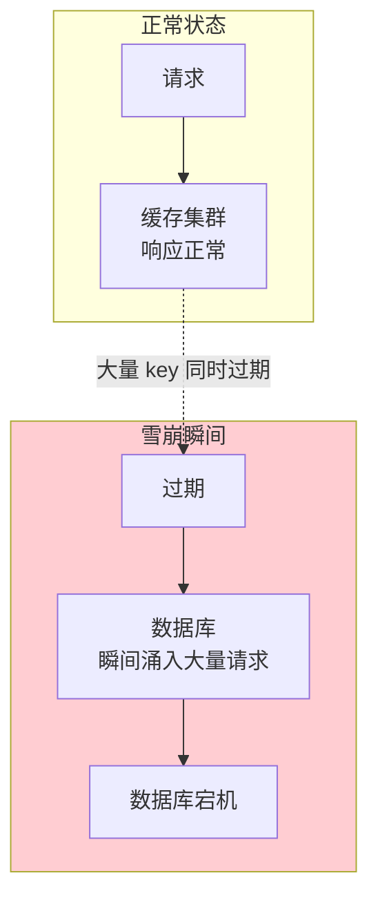
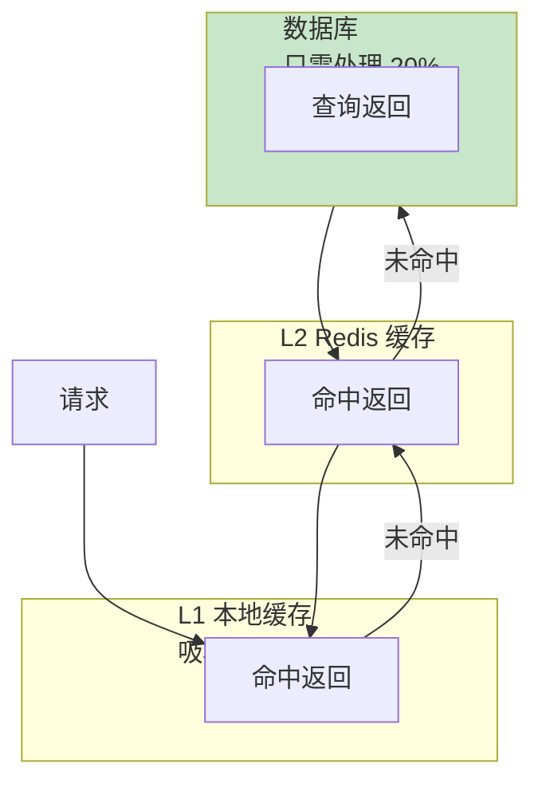
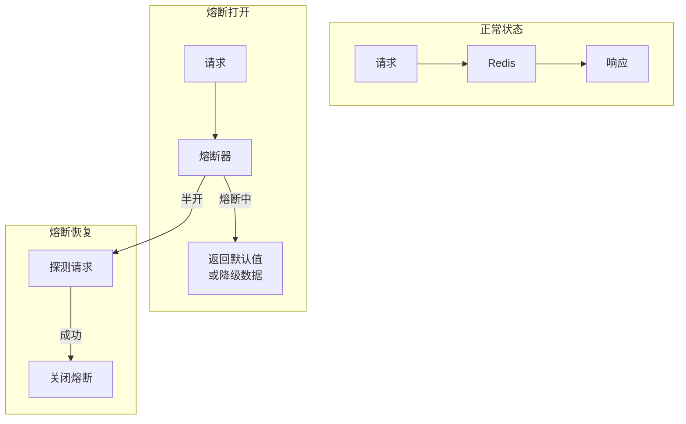

# 缓存雪崩详解与解决方案

如果说穿透是「恶意攻击」，击穿是「单点热点」，那雪崩就是「全面崩溃」。缓存雪崩的后果往往是灾难性的——整个系统的数据库层同时被打满，系统级联宕机。

## 雪崩定义：大量 key 同时过期或缓存服务宕机

缓存雪崩有两种触发方式：

**方式一：大量 key 同时过期**



**方式二：缓存服务宕机**

```mermaid
flowchart TB
    subgraph Normal["正常状态"]
        App1["应用"] --> R1["Redis 集群\n健康"]
        App2["应用"] --> R1
        App3["应用"] --> R1
    end

    subgraph Failure["Redis 宕机"]
        R1 -.x|"宕机"| Down["Redis 不可用"]
        App1 --> DB1["数据库\n请求暴涨"]
        App2 --> DB1
        App3 --> DB1
    end

    style Failure fill:#ffcdd2
```

### 雪崩与击穿的区别

| 维度 | 击穿 | 雪崩 |
| --- | --- | --- |
| 范围 | 单个或少量热点 key | 大量 key（通常是同一批） |
| 原因 | 热点 key 过期 | 批量过期 或 缓存服务宕机 |
| 表现 | 单个接口变慢 | 整个系统级联故障 |
| 防护重点 | 保护单个热点 key | 保护整个缓存层 |

### 雪崩的危害

雪崩的危害是系统级的，可能导致整个系统不可用：

```
雪崩发生时的典型时间线：

T+0s:   大量 key 同时过期（或 Redis 宕机）
T+0s:   所有请求同时穿透到数据库
T+1s:   数据库 CPU 使用率达到 100%
T+2s:   数据库开始拒绝连接
T+3s:   应用层开始出现超时
T+5s:   大量请求积压，线程池耗尽
T+10s:  应用开始 OOM 或被 K8s 重启
T+30s:  整个系统不可用
```

## 随机过期时间

雪崩最常见的场景是**大量 key 设置了相同的过期时间**。例如：
- 系统初始化时批量写入缓存，统一设置 1 小时过期
- 凌晨 2 点缓存预热，1 小时后全部过期
- 运维手动清空缓存，所有数据重新加载

解决方案很简单：**给过期时间加上随机偏移量**。

### 实现方式

```java
public void setCache(String key, String value, Duration baseExpire) {
    // 基础过期时间 + 随机偏移量（0~30%）
    long randomOffset = (long) (baseExpire.toMillis() * 0.3 * Math.random());
    Duration actualExpire = baseExpire.plus(Duration.ofMillis(randomOffset));

    redisTemplate.opsForValue().set(key, value, actualExpire);
}
```

```java
// 批量写入时使用随机过期时间
public void batchSetProducts(List<Product> products) {
    for (Product product : products) {
        String cacheKey = "product:detail:" + product.getId();
        String json = JSON.toJSONString(product);

        // 基础 10 分钟 + 随机 0~3 分钟
        Duration expire = Duration.ofMinutes(10)
            .plus(Duration.ofSeconds((long) (180 * Math.random())));

        redisTemplate.opsForValue().set(cacheKey, json, expire);
    }
}
```

### 随机 TTL 的配置建议

| 基础 TTL | 随机偏移范围 | 实际 TTL 范围 |
| --- | --- | --- |
| 1 小时 | 0~18 分钟 | 60~78 分钟 |
| 30 分钟 | 0~9 分钟 | 30~39 分钟 |
| 10 分钟 | 0~3 分钟 | 10~13 分钟 |

**注意**：随机 TTL 会导致缓存命中率的轻微波动，这是可接受的代价。

## 多级缓存

多级缓存可以在单层缓存失效时提供保护：



即使 Redis 层的 key 批量过期，本地缓存（L1）仍然能提供保护。上一节我们已经详细介绍过多级缓存架构，这里不再赘述。

## 熔断降级

当缓存服务完全不可用时（如 Redis Cluster 宕机），需要启动熔断降级机制：



### 熔断降级实现

```java
@Service
public class CacheWithCircuitBreaker {

    private static final Logger log = LoggerFactory.getLogger(CacheWithCircuitBreaker.class);

    @Autowired
    private StringRedisTemplate redisTemplate;

    // 熔断器状态
    private volatile boolean circuitOpen = false;
    private volatile long lastFailureTime = 0;
    private static final long CIRCUIT_TIMEOUT_MS = 30_000;  // 30 秒后尝试恢复
    private static final int FAILURE_THRESHOLD = 5;          // 连续失败 5 次打开熔断

    private AtomicInteger failureCount = new AtomicInteger(0);

    public String get(String key) {
        // 检查熔断器状态
        if (circuitOpen) {
            if (System.currentTimeMillis() - lastFailureTime > CIRCUIT_TIMEOUT_MS) {
                // 尝试恢复
                if (tryRecovery()) {
                    return getFromRedis(key);
                }
            }
            // 熔断中，降级到数据库
            return getFromDatabaseDirectly(key);
        }

        try {
            String result = getFromRedis(key);
            // 成功后重置计数
            failureCount.set(0);
            return result;
        } catch (Exception e) {
            // 记录失败
            int count = failureCount.incrementAndGet();
            lastFailureTime = System.currentTimeMillis();

            if (count >= FAILURE_THRESHOLD) {
                circuitOpen = true;
                log.error("熔断器打开，连续失败次数: {}", count);
            }

            // 降级到数据库
            return getFromDatabaseDirectly(key);
        }
    }

    private String getFromRedis(String key) {
        return redisTemplate.opsForValue().get(key);
    }

    private String getFromDatabaseDirectly(String key) {
        log.warn("Redis 不可用，降级到数据库: key={}", key);
        // 从数据库直接查询
        return loadFromDatabase(key);
    }

    private boolean tryRecovery() {
        try {
            redisTemplate.opsForValue().get("health_check");
            circuitOpen = false;
            failureCount.set(0);
            log.info("熔断器恢复关闭");
            return true;
        } catch (Exception e) {
            return false;
        }
    }
}
```

### 使用 Resilience4j 实现熔断

生产环境推荐使用成熟的熔断库：

```java
@Configuration
public class Resilience4jConfig {

    @Bean
    public CircuitBreaker cacheCircuitBreaker() {
        CircuitBreakerConfig config = CircuitBreakerConfig.custom()
            .failureRateThreshold(50)               // 失败率 50% 时打开
            .slowCallRateThreshold(80)             // 慢调用率 80% 时打开
            .slowCallDurationThreshold(Duration.ofSeconds(2))  // 超过 2 秒算慢调用
            .waitDurationInOpenState(Duration.ofSeconds(30))  // 30 秒后尝试恢复
            .slidingWindowType(SlidingWindowType.COUNT_BASED)  // 基于计数
            .slidingWindowSize(10)                 // 滑动窗口大小
            .minimumNumberOfCalls(10)             // 至少 10 次调用才计算
            .build();

        return CircuitBreakerRegistry.of(config)
            .circuitBreaker("cache");
    }
}

@Service
public class CacheWithResilience4j {

    @Autowired
    private CircuitBreaker cacheCircuitBreaker;

    @Autowired
    private StringRedisTemplate redisTemplate;

    public String get(String key) {
        return CircuitBreaker.decorateSupplier(cacheCircuitBreaker, () -> {
            return redisTemplate.opsForValue().get(key);
        }).get();
    }
}
```

## 预热 + 错峰过期

除了随机 TTL，还可以通过**预热 + 错峰过期**策略主动控制 key 的过期时间分布：

```java
@Service
public class CacheWarmupService {

    @Autowired
    private StringRedisTemplate redisTemplate;

    @Autowired
    private ProductRepository productRepository;

    /**
     * 系统启动时预热缓存，并错开过期时间
     */
    @PostConstruct
    public void warmupCache() {
        List<Product> products = productRepository.findAll();

        for (int i = 0; i < products.size(); i++) {
            Product product = products.get(i);
            String cacheKey = "product:detail:" + product.getId();
            String json = JSON.toJSONString(product);

            // 计算过期时间：基础 1 小时 + 序号 * 1 秒
            // 这样 10000 个 key 会分布在 1 小时到 1 小时 + 2.7 小时内错开过期
            Duration expire = Duration.ofHours(1)
                .plus(Duration.ofSeconds(i));

            redisTemplate.opsForValue().set(cacheKey, json, expire);
        }
    }
}
```

## 总结

缓存雪崩是缓存层级的灾难，可能由**批量 key 过期**或**缓存服务宕机**引发。防护方案包括：

- **随机 TTL**：避免批量 key 同时过期
- **多级缓存**：L1 本地缓存提供最后保护
- **熔断降级**：缓存不可用时降级到数据库
- **预热 + 错峰过期**：主动控制过期时间分布

雪崩的防护核心是**分层防御**：任何一层出问题，都有下一层兜底。下一节我们将深入讲解布隆过滤器的原理，这是缓存穿透防护的核心工具。
