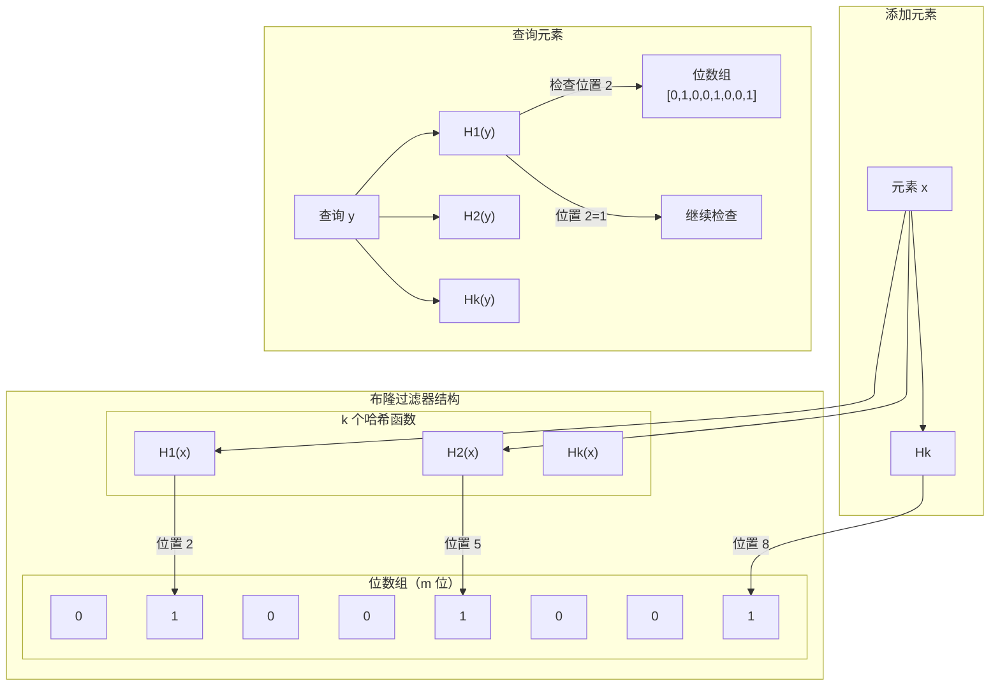
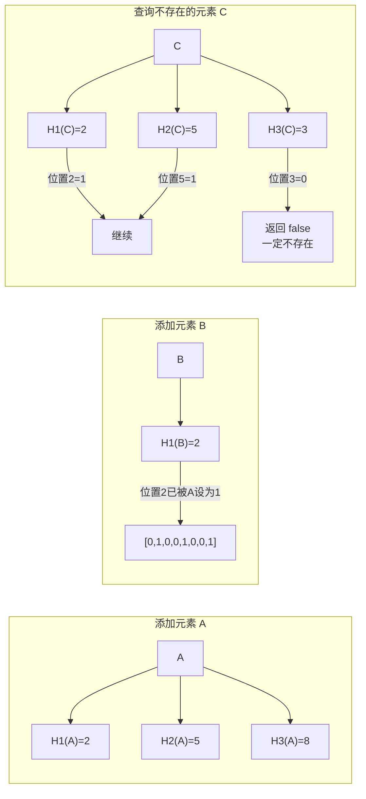

# 布隆过滤器原理与应用

布隆过滤器（Bloom Filter）是缓存穿透防护的核心工具。它能在极低的空间开销下，快速判断一个元素「一定不存在」或「可能存在」。本节深入讲解布隆过滤器的原理、误判率计算，以及在缓存场景中的应用。

## 布隆过滤器原理：多重哈希

布隆过滤器的核心数据结构是一个**位数组**和**多个哈希函数**：



### 添加元素

将一个元素添加到布隆过滤器时：
1. 使用 k 个哈希函数计算 k 个哈希值：`h1(x), h2(x), ..., hk(x)`
2. 将位数组中对应位置的 bit 设为 1

```java
public void put(String key) {
    int[] positions = new int[k];
    for (int i = 0; i < k; i++) {
        positions[i] = hash(key, i) % m;
        bitArray[positions[i]] = 1;
    }
}
```

### 查询元素

查询一个元素是否存在时：
1. 使用 k 个哈希函数计算 k 个哈希值
2. 检查位数组中对应位置的 bit 是否**全为 1**
3. 如果任何一个位置是 0，元素**一定不存在**
4. 如果所有位置都是 1，元素**可能存在**（可能是误判）

```java
public boolean mightContain(String key) {
    for (int i = 0; i < k; i++) {
        int position = hash(key, i) % m;
        if (bitArray[position] == 0) {
            return false;  // 一定不存在
        }
    }
    return true;  // 可能存在（存在误判）
}
```

### 为什么会有误判？

误判发生在以下情况：
- 元素 A 和元素 B 使用不同的哈希函数，但恰好将同一位设置为 1
- 当查询一个不存在的元素 C 时，它的 k 个哈希位置恰好都被其他元素设置为 1



## 误判率计算

布隆过滤器的误判率（False Positive Rate）由以下公式决定：

```
fpr = (1 - e^(-kn/m))^k

其中：
- fpr：误判率（false positive rate）
- k：哈希函数数量
- n：已添加的元素数量
- m：位数组长度
```

### 最优哈希函数数量

对于给定的 `n` 和 `m`，存在一个最优的 `k` 值使误判率最小：

```
k_opt = (m/n) * ln(2)

即：最优哈希数 ≈ (位数组长度/元素数) × 0.693
```

### 不同参数下的误判率

| m/n（每位存储元素数） | 最优 k | 误判率 fpr |
| --- | --- | --- |
| 5 | 3 | ~3% |
| 8 | 6 | ~0.8% |
| 10 | 7 | ~0.8% |
| 15 | 10 | ~0.1% |
| 20 | 14 | ~0.0001% |

### 内存占用估算

假设需要存储 1 亿个商品 ID，要求误判率 `<1%`：

```
n = 100,000,000
fpr = 0.01

根据公式推导：
m/n ≈ 10
m ≈ 1,000,000,000 bits ≈ 119 MB

如果误判率要求更低（0.1%）：
m/n ≈ 15
m ≈ 1,500,000,000 bits ≈ 179 MB
```

## Guava BloomFilter 实现

Guava 提供了开箱即用的 BloomFilter 实现：

```java
import com.github.benmanes.caffeine.cache.Cache;
import com.github.benmanes.caffeine.cache.Caffeine;
import com.google.common.hash.BloomFilter;
import com.google.common.hash.Funnels;

public class BloomFilterExample {

    // 创建布隆过滤器：预计 1000 万个元素，误判率 1%
    private static final BloomFilter<Long> bloomFilter = BloomFilter.create(
        Funnels.longFunnel(),           // 数据类型
        10_000_000,                     // 预计元素数量
        0.01                             // 误判率 1%
    );

    public static void main(String[] args) {
        // 1. 初始化：添加所有合法商品 ID
        initBloomFilter();

        // 2. 查询时先检查布隆过滤器
        Long productId = 123456L;
        if (bloomFilter.mightContain(productId)) {
            // 布隆过滤器说可能存在，继续查缓存/数据库
            System.out.println("可能存在，继续查询");
        } else {
            // 布隆过滤器说一定不存在，直接返回
            System.out.println("一定不存在，直接返回");
        }
    }

    private static void initBloomFilter() {
        // 从数据库加载所有合法 ID
        List<Long> validProductIds = productRepository.findAllIds();
        for (Long id : validProductIds) {
            bloomFilter.put(id);
        }
    }
}
```

### BloomFilter 配置参数

| 参数 | 说明 | 建议值 |
| --- | --- | --- |
| `expectedInsertions` | 预计插入的元素数量 | 设置稍大一些，预留增长空间 |
| `fpp`（false positive probability） | 期望的误判率 | 0.01（1%）或 0.001（0.1%） |

```java
// 配置示例
BloomFilter<Long> filter1 = BloomFilter.create(
    Funnels.longFunnel(),
    10_000_000,    // 预计 1000 万
    0.01           // 1% 误判率
);

BloomFilter<Long> filter2 = BloomFilter.create(
    Funnels.longFunnel(),
    10_000_000,
    0.001          // 0.1% 误判率，内存增加约 50%
);
```

## 布隆过滤器的应用场景

### 场景一：缓存穿透防护

在请求进入缓存层之前，先用布隆过滤器判断：

```java
@Service
public class ProductCache {

    private static final BloomFilter<Long> bloomFilter = BloomFilter.create(
        Funnels.longFunnel(),
        10_000_000,
        0.01
    );

    @Autowired
    private StringRedisTemplate redisTemplate;

    public ProductDetail getProduct(Long productId) {
        // 第一层：布隆过滤器
        if (!bloomFilter.mightContain(productId)) {
            return null;  // 一定不存在，直接返回
        }

        // 第二层：Redis 缓存
        String cached = redisTemplate.opsForValue().get("product:" + productId);
        if (cached != null) {
            return JSON.parseObject(cached, ProductDetail.class);
        }

        // 第三层：数据库
        Product product = productRepository.findById(productId).orElse(null);
        if (product == null) {
            return null;
        }

        // 回填缓存
        redisTemplate.opsForValue().set("product:" + productId, JSON.toJSONString(product));
        return ProductDetail.fromEntity(product);
    }
}
```

### 场景二：用户黑名单

判断一个用户 ID 是否在黑名单中：

```java
private static final BloomFilter<String> blacklistFilter = BloomFilter.create(
    Funnels.stringFunnel(StandardCharsets.UTF_8),
    1_000_000,    // 100 万黑名单用户
    0.001          // 0.1% 误判率
);

public boolean isBlacklisted(String userId) {
    return blacklistFilter.mightContain(userId);
}
```

### 场景三：URL 去重

爬虫系统中判断 URL 是否已爬取：

```java
private static final BloomFilter<String> visitedFilter = BloomFilter.create(
    Funnels.stringFunnel(StandardCharsets.UTF_8),
    100_000_000,  // 1 亿 URL
    0.001
);

public boolean isVisited(String url) {
    return visitedFilter.mightContain(url);
}

public void markVisited(String url) {
    visitedFilter.put(url);
}
```

## 布隆过滤器的局限性

### 局限性一：不能删除元素

标准的布隆过滤器不支持删除操作。因为删除一个元素需要将对应的 k 个 bit 设为 0，但这可能会影响其他元素（如果它们共享了这些 bit）。

解决方案：**Counting Bloom Filter**

```java
// Counting Bloom Filter：使用计数器代替 bit
private int[] counterArray;  // 每个位置存储计数，而不是单个 bit

public void put(String key) {
    for (int i = 0; i < k; i++) {
        int position = hash(key, i) % m;
        counterArray[position]++;  // 计数器 +1
    }
}

public void remove(String key) {
    for (int i = 0; i < k; i++) {
        int position = hash(key, i) % m;
        counterArray[position]--;  // 计数器 -1
    }
}
```

### 局限性二：有误判率

布隆过滤器只能保证「不存在」是准确的，「存在」可能有误判。

如果业务对「不存在」的准确性要求极高（如金融场景），需要考虑其他方案：
- **布隆过滤器 + 空值缓存**：布隆过滤器说「不存在」，直接返回
- **Cuckoo Filter**：支持删除操作，误判率相近
- **Redis Set**：精确判断，但内存开销大

### 局限性三：无法获取元素

布隆过滤器只能判断「可能存在」，无法获取元素本身。如果需要获取元素，需要额外的存储（如 Redis Hash）。

## Redis BloomFilter

对于分布式场景，可以使用 Redis 的布隆过滤器模块（RedisBloom）：

```java
@Service
public class RedisBloomFilterService {

    @Autowired
    private RedisTemplate<String, String> redisTemplate;

    private static final String BLOOM_KEY = "bloom:product:ids";

    /**
     * 添加元素到布隆过滤器
     */
    public void add(Long productId) {
        // 使用 Redis 客户端执行 BF.ADD 命令
        // 示例：redisTemplate.execute(new RedisCallback<Object>() {
        //     @Override
        //     public Object doInRedis(RedisConnection connection) throws DataAccessException {
        //         return connection.commands().bloomFilterCommands().bfAdd(
        //             BLOOM_KEY.getBytes(),
        //             String.valueOf(productId).getBytes()
        //         );
        //     }
        // });
    }

    /**
     * 判断元素是否存在
     */
    public boolean mightContain(Long productId) {
        // 使用 Redis 客户端执行 BF.EXISTS 命令
        // 返回 true 表示可能存在，false 表示一定不存在
        return true;  // 实际调用 RedisBloom
    }
}
```

## 总结

布隆过滤器是解决缓存穿透的利器，它的核心特性：
- **空间效率高**：位数组存储，占用内存极小
- **查询速度快**：O(k) 哈希计算，常数时间
- **不存在一定准确**：说「不存在」就一定不存在
- **存在可能有误判**：说「可能存在」可能有误判

使用布隆过滤器时需要注意：
- **合理设置参数**：预估元素数量和误判率
- **不能删除**：如果需要删除，使用 Counting Bloom Filter
- **结合其他方案**：布隆过滤器 + 空值缓存是最常见的组合

下一节我们将讲解缓存淘汰策略——LRU、LFU、FIFO 等算法如何决定哪些数据应该被淘汰。
