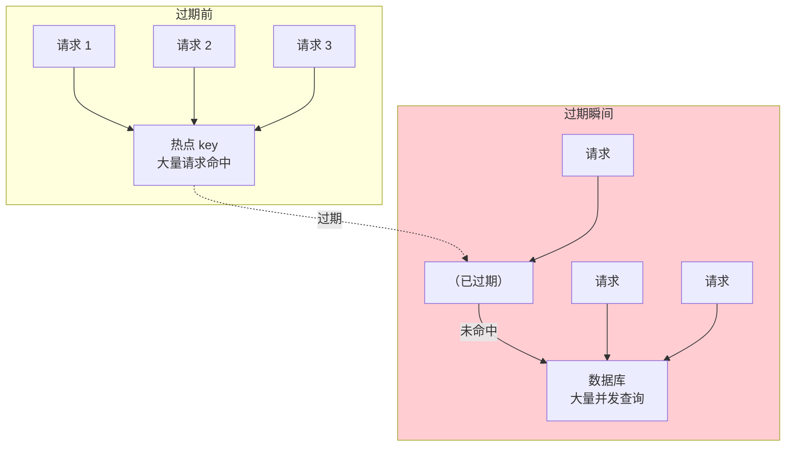
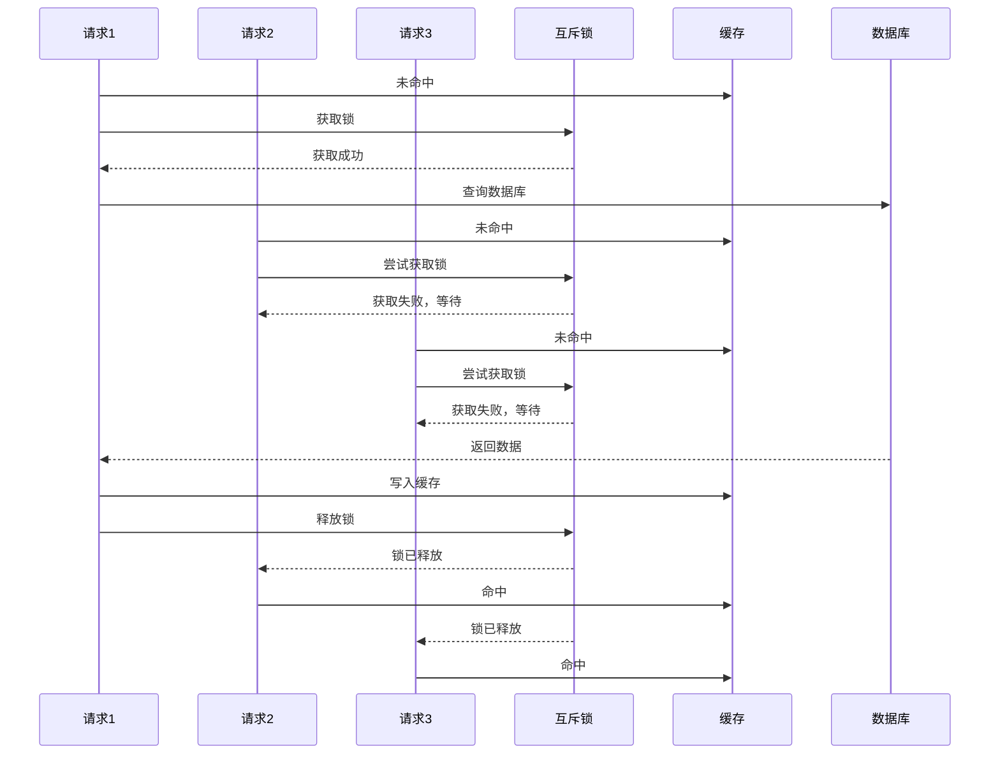
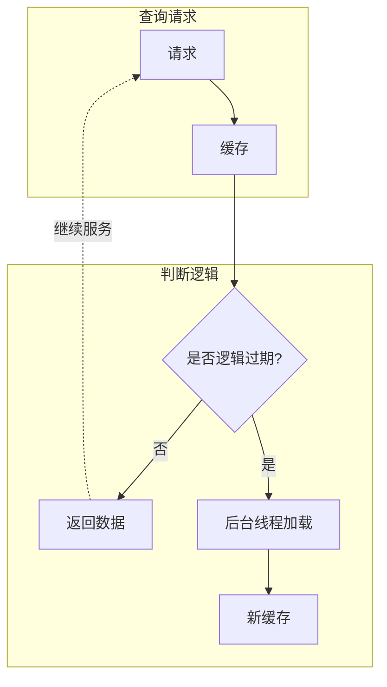

# 缓存击穿详解与解决方案

缓存击穿是缓存领域的另一个经典问题。与穿透不同，击穿不是「查询不存在的数据」，而是**热点 key 过期瞬间，大量请求同时涌入数据库**。

## 击穿定义：热点 key 过期瞬间大量请求

击穿的发生需要两个条件：
1. **存在热点 key**：某个 key 被高频访问
2. **这个 key 刚好过期**：大量请求同时到来



### 击穿与穿透的区别

| 维度 | 穿透 | 击穿 |
| --- | --- | --- |
| 查询的数据 | 不存在 | 存在（但缓存过期） |
| 数据库是否有数据 | 无 | 有 |
| 原因 | 恶意攻击、业务漏洞 | 热点数据过期 |
| 防护重点 | 拦截无效请求 | 保护数据库不被击垮 |

### 击穿的危害

击穿的危害与穿透类似，但因为是「真正的热点数据」，所以危害可能更大：

```
场景：热点商品详情页缓存过期

假设：
- 缓存命中时延迟：1ms
- 数据库查询延迟：50ms
- 并发请求数：1000
- 热点 key 有效期：10 分钟

正常情况（缓存有效）：
- 所有 1000 请求命中缓存
- 数据库 QPS：0
- 平均延迟：1ms

击穿瞬间（缓存过期）：
- 所有 1000 请求同时查询数据库
- 数据库 QPS：1000
- 数据库 CPU 打满，响应超时
```

## 互斥锁方案

互斥锁（Mutex）的核心思想是：**只有一个线程去加载数据，其他线程等待。**



### Redis 分布式锁实现

```java
@Service
public class ProductCacheWithLock {

    @Autowired
    private StringRedisTemplate redisTemplate;

    @Autowired
    private ProductRepository productRepository;

    private static final String LOCK_KEY_PREFIX = "lock:product:detail:";
    private static final Duration LOCK_TIMEOUT = Duration.ofSeconds(5);

    public String getProductDetail(Long productId) {
        String cacheKey = "product:detail:" + productId;

        // 1. 查缓存
        String cached = redisTemplate.opsForValue().get(cacheKey);
        if (cached != null) {
            return cached;
        }

        // 2. 缓存未命中，获取互斥锁
        String lockKey = LOCK_KEY_PREFIX + productId;
        String lockValue = UUID.randomUUID().toString();

        Boolean acquired = redisTemplate.opsForValue()
            .setIfAbsent(lockKey, lockValue, LOCK_TIMEOUT);

        if (Boolean.TRUE.equals(acquired)) {
            try {
                // 3. 获取锁成功，再次检查缓存（可能有其他线程已加载）
                cached = redisTemplate.opsForValue().get(cacheKey);
                if (cached != null) {
                    return cached;
                }

                // 4. 查数据库
                String result = loadFromDatabase(productId);

                // 5. 写入缓存
                if (result != null) {
                    redisTemplate.opsForValue().set(cacheKey, result, 10, TimeUnit.MINUTES);
                }

                return result;
            } finally {
                // 6. 释放锁（只释放自己持有的锁）
                if (lockValue.equals(redisTemplate.opsForValue().get(lockKey))) {
                    redisTemplate.delete(lockKey);
                }
            }
        } else {
            // 7. 获取锁失败，短暂等待后重试
            try {
                Thread.sleep(50);
            } catch (InterruptedException e) {
                Thread.currentThread().interrupt();
            }
            // 重试查缓存
            return getProductDetail(productId);
        }
    }

    private String loadFromDatabase(Long productId) {
        return productRepository.findById(productId)
            .map(Product::toJson)
            .orElse(null);
    }
}
```

### 互斥锁的 trade-off

| 优点 | 缺点 |
| --- | --- |
| 保证数据库不被击垮 | 所有请求都要等待，只有 1 个请求查库 |
| 实现简单 | 可能导致第一个请求之后的请求都有延迟 |
| 强一致性保证 | 如果第一个请求失败，所有请求都会失败 |

## 逻辑过期方案

互斥锁的缺点是「只有一个请求查库，其他请求都在等待」。逻辑过期方案可以解决这个问题：**缓存不过期，但数据中携带一个「逻辑过期时间」。**

### 核心思想

```java
@Data
public class CacheData<T> {
    private T data;           // 真实数据
    private Long expireTime;  // 逻辑过期时间（时间戳）
}
```

请求到来时：
1. 查缓存，获取 `CacheData`
2. 判断 `expireTime` 是否已过期
3. **未过期**：直接返回数据（正常流程）
4. **已过期**：开启异步线程重新加载数据，同时返回旧数据（不阻塞）



### 逻辑过期实现

```java
@Service
public class ProductCacheWithLogicalExpire {

    private static final Logger log = LoggerFactory.getLogger(ProductCacheWithLogicalExpire.class);

    @Autowired
    private StringRedisTemplate redisTemplate;

    @Autowired
    private ProductRepository productRepository;

    private static final Duration LOGICAL_EXPIRE = Duration.ofMinutes(10);

    public ProductDetail getProductDetail(Long productId) {
        String cacheKey = "product:detail:" + productId;

        // 1. 查缓存
        String cached = redisTemplate.opsForValue().get(cacheKey);
        if (cached == null) {
            return loadAndCache(productId);
        }

        // 2. 反序列化并判断逻辑过期
        CacheData<ProductDetail> cacheData = JSON.parseObject(cached, new TypeReference<CacheData<ProductDetail>>() {});
        if (cacheData == null) {
            return loadAndCache(productId);
        }

        // 3. 判断是否逻辑过期
        if (System.currentTimeMillis() < cacheData.getExpireTime()) {
            // 未过期，直接返回
            return cacheData.getData();
        }

        // 4. 已过期，开启后台线程重建缓存
        String lockKey = "lock:rebuild:" + productId;
        String lockValue = UUID.randomUUID().toString();

        Boolean acquired = redisTemplate.opsForValue()
            .setIfAbsent(lockKey, lockValue, Duration.ofSeconds(10));

        if (Boolean.TRUE.equals(acquired)) {
            // 成功获取锁，开启后台线程重建
            CompletableFuture.runAsync(() -> {
                try {
                    rebuildCache(productId);
                } finally {
                    redisTemplate.delete(lockKey);
                }
            });
        }

        // 5. 返回旧数据（不阻塞）
        return cacheData.getData();
    }

    private ProductDetail loadAndCache(Long productId) {
        String cacheKey = "product:detail:" + productId;
        String cached = redisTemplate.opsForValue().get(cacheKey);

        if (cached != null) {
            return JSON.parseObject(cached, ProductDetail.class);
        }

        Product product = productRepository.findById(productId).orElse(null);
        if (product == null) {
            return null;
        }

        ProductDetail detail = ProductDetail.fromEntity(product);
        redisTemplate.opsForValue().set(cacheKey, JSON.toJSONString(detail), LOGICAL_EXPIRE);
        return detail;
    }

    private void rebuildCache(Long productId) {
        log.info("重建缓存: productId={}", productId);
        Product product = productRepository.findById(productId).orElse(null);
        if (product == null) {
            redisTemplate.delete("product:detail:" + productId);
            return;
        }

        ProductDetail detail = ProductDetail.fromEntity(product);
        CacheData<ProductDetail> cacheData = new CacheData<>(detail, System.currentTimeMillis() + LOGICAL_EXPIRE.toMillis());
        redisTemplate.opsForValue().set("product:detail:" + productId, JSON.toJSONString(cacheData));
    }
}
```

### 逻辑过期的 trade-off

| 优点 | 缺点 |
| --- | --- |
| 所有请求都能获取数据（即使过期了也能返回旧数据） | 返回的是旧数据，不适合对一致性要求高的场景 |
| 不阻塞请求 | 实现复杂，需要额外的数据结构 |
| 性能更好 | 缓存重建线程数需要控制，避免资源耗尽 |

## 热点 key 永不过期 + 异步更新

这是最简单的方案：**热点 key 设置很长的过期时间，后台定时刷新。**

```java
@Service
public class ProductCacheWithRefresh {

    @Autowired
    private StringRedisTemplate redisTemplate;

    @Autowired
    private ProductRepository productRepository;

    private static final Duration CACHE_TTL = Duration.ofHours(24);

    public ProductDetail getProductDetail(Long productId) {
        String cacheKey = "product:detail:" + productId;

        String cached = redisTemplate.opsForValue().get(cacheKey);
        if (cached != null) {
            return JSON.parseObject(cached, ProductDetail.class);
        }

        // 懒加载
        Product product = productRepository.findById(productId).orElse(null);
        if (product == null) {
            return null;
        }

        ProductDetail detail = ProductDetail.fromEntity(product);
        redisTemplate.opsForValue().set(cacheKey, JSON.toJSONString(detail), CACHE_TTL);
        return detail;
    }

    /**
     * 后台定时刷新（每 5 分钟刷新一次热点数据）
     */
    @Scheduled(fixedRate = 300_000)
    public void refreshHotProducts() {
        List<Long> hotProductIds = getHotProductIds();  // 从监控或排行榜获取热点 ID
        for (Long productId : hotProductIds) {
            try {
                Product product = productRepository.findById(productId).orElse(null);
                if (product != null) {
                    ProductDetail detail = ProductDetail.fromEntity(product);
                    redisTemplate.opsForValue().set(
                        "product:detail:" + productId,
                        JSON.toJSONString(detail),
                        CACHE_TTL
                    );
                }
            } catch (Exception e) {
                log.error("刷新缓存失败: productId={}", productId, e);
            }
        }
    }
}
```

## 方案对比

| 方案 | 原理 | 一致性 | 复杂度 | 适用场景 |
| --- | --- | --- | --- | --- |
| 互斥锁 | 只有 1 个请求查库，其他等待 | 强一致 | 低 | 对数据一致性要求高的场景 |
| 逻辑过期 | 返回旧数据，后台重建 | 弱一致 | 高 | 对延迟敏感，允许短暂旧数据 |
| 永不过期 + 异步刷新 | 后台定时刷新，缓存不失效 | 弱一致 | 中 | 热点数据，数据更新不频繁 |

## 总结

缓存击穿是热点 key 过期瞬间的流量风暴，核心问题是「大量请求同时查库」。

三种主流解决方案：
- **互斥锁**：简单可靠，但有请求等待
- **逻辑过期**：不阻塞，但返回旧数据
- **永不过期 + 异步刷新**：最适合热点数据，但实现定时任务

实际生产中，如果数据更新不频繁，推荐使用「永不过期 + 异步刷新」；如果数据一致性要求高，使用「互斥锁」。

下一节我们将讲解第三个经典问题——缓存雪崩：大量 key 同时过期的灾难场景。
