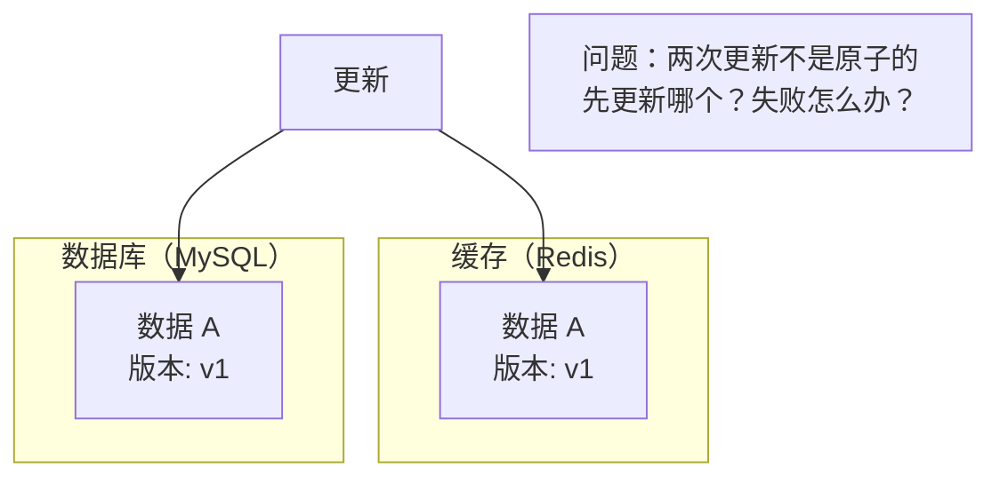
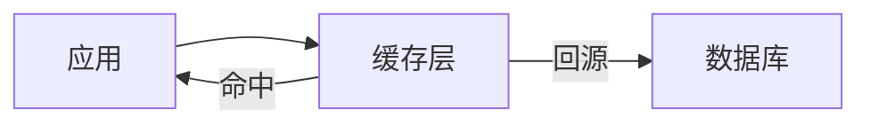
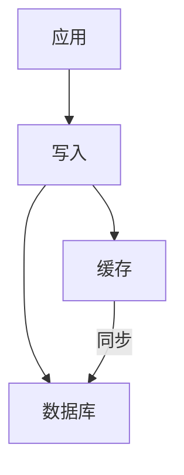
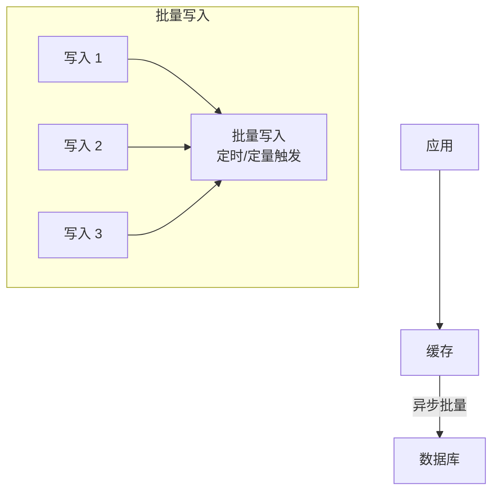

# 缓存一致性

缓存一致性是缓存系统最核心也最复杂的问题之一。当数据同时存在于缓存和数据库时，如何保证它们的一致性？这不是简单的「先更新哪个」的问题，而是涉及到业务场景、数据特性、一致性要求等多方面因素。

## 为什么缓存一致性是难题

缓存和数据库是两种不同的存储系统，它们的一致性保证机制完全不同：
- **数据库**：支持事务，可以保证 ACID
- **缓存**：无事务概念，只是一个 KV 存储



如果缓存和数据库的更新不是原子的，就可能出现以下情况：
1. 数据库更新成功，缓存更新失败 → 数据不一致
2. 缓存删除成功，数据库更新前有请求进来 → 读到旧数据

## Cache Aside 模式

Cache Aside（旁路缓存）是最常用的缓存模式，核心原则是：
- **读操作**：缓存优先，未命中时查库并回填
- **写操作**：先更新数据库，再删除缓存

### 读写流程

```mermaid
sequenceDiagram
    participant App as 应用
    participant Cache as 缓存
    participant DB as 数据库

    subgraph Read["读操作"]
        App->>Cache: 查询 key
        Cache-->>App: 命中返回
        alt 缓存未命中
            App->>DB: 查询数据库
            DB-->>App: 返回数据
            App->>Cache: 写入缓存
        end
    end

    subgraph Write["写操作"]
        App->>DB: 更新数据库
        App->>Cache: 删除缓存（非更新）
        Note over Cache: 删除而非更新，因为：
        Note over Cache: 1. 删除比更新更简单
        Note over Cache: 2. 更新可能导致脏读
    end
```

### Cache Aside 实现

```java
@Service
public class ProductService {

    @Autowired
    private StringRedisTemplate redisTemplate;

    @Autowired
    private ProductRepository productRepository;

    private static final String CACHE_KEY_PREFIX = "product:";

    /**
     * 读操作：Cache Aside
     */
    public Product getProduct(Long productId) {
        String cacheKey = CACHE_KEY_PREFIX + productId;

        // 1. 查缓存
        String cached = redisTemplate.opsForValue().get(cacheKey);
        if (cached != null) {
            return JSON.parseObject(cached, Product.class);
        }

        // 2. 缓存未命中，查数据库
        Product product = productRepository.findById(productId).orElse(null);
        if (product == null) {
            return null;
        }

        // 3. 回填缓存
        redisTemplate.opsForValue().set(cacheKey, JSON.toJSONString(product), Duration.ofMinutes(10));

        return product;
    }

    /**
     * 写操作：先更新数据库，再删除缓存
     */
    public void updateProduct(Long productId, Product product) {
        // 1. 更新数据库
        product.setId(productId);
        productRepository.save(product);

        // 2. 删除缓存（不是更新！）
        redisTemplate.delete(CACHE_KEY_PREFIX + productId);
    }
}
```

### Cache Aside 的 trade-off

| 优点 | 缺点 |
| --- | --- |
| 实现简单，逻辑清晰 | 可能出现短暂的不一致 |
| 读写分离，性能好 | 并发场景下可能出现缓存不一致 |
| 数据库是数据源，可靠性高 | 删除缓存失败需要补偿机制 |

## Read Through 模式

Read Through（读穿透）将缓存加载逻辑封装在缓存层，应用代码只与缓存交互：



### Read Through 实现

```java
@Service
public class ReadThroughCacheService {

    @Autowired
    private StringRedisTemplate redisTemplate;

    @Autowired
    private ProductRepository productRepository;

    private static final String CACHE_KEY_PREFIX = "product:";

    public Product getProduct(Long productId) {
        String cacheKey = CACHE_KEY_PREFIX + productId;

        // 1. 查缓存
        String cached = redisTemplate.opsForValue().get(cacheKey);
        if (cached != null) {
            return JSON.parseObject(cached, Product.class);
        }

        // 2. 缓存未命中，由缓存层自动加载
        Product product = productRepository.findById(productId).orElse(null);
        if (product != null) {
            redisTemplate.opsForValue().set(cacheKey, JSON.toJSONString(product), Duration.ofMinutes(10));
        }

        return product;
    }
}
```

**Read Through 的特点是缓存层负责回源**，应用代码不需要关心数据从哪来。适合希望简化应用逻辑的场景。

## Write Through 模式

Write Through（写穿透）将写操作同步到缓存和数据库：



### Write Through 实现

```java
@Service
public class WriteThroughCacheService {

    @Autowired
    private StringRedisTemplate redisTemplate;

    @Autowired
    private ProductRepository productRepository;

    public void updateProduct(Product product) {
        String cacheKey = "product:" + product.getId();

        // 1. 先更新缓存
        redisTemplate.opsForValue().set(cacheKey, JSON.toJSONString(product));

        // 2. 再更新数据库（保持顺序）
        productRepository.save(product);
    }
}
```

### Write Through 的 trade-off

| 优点 | 缺点 |
| --- | --- |
| 缓存和数据库强一致 | 写操作延迟增加（需要写两次） |
| 读取总是能命中最新数据 | 缓存写入失败需要回滚 |
| 不会出现缓存miss（写后会更新缓存） | 实现复杂 |

## Write Behind 模式

Write Behind（写回）将写操作先缓存起来，异步批量写入数据库：



### Write Behind 实现

```java
@Service
public class WriteBehindCacheService {

    @Autowired
    private StringRedisTemplate redisTemplate;

    @Autowired
    private ProductRepository productRepository;

    private ConcurrentLinkedQueue<Product> writeQueue = new ConcurrentLinkedQueue<>();

    /**
     * 写操作：先写缓存，加入写队列
     */
    public void updateProduct(Product product) {
        String cacheKey = "product:" + product.getId();

        // 1. 先更新缓存
        redisTemplate.opsForValue().set(cacheKey, JSON.toJSONString(product));

        // 2. 加入写队列
        writeQueue.offer(product);
    }

    /**
     * 后台线程批量写入数据库
     */
    @Scheduled(fixedDelay = 1000)
    public void flushToDatabase() {
        List<Product> batch = new ArrayList<>();
        Product product;

        // 批量取出，最多 100 条
        while ((product = writeQueue.poll()) != null && batch.size() < 100) {
            batch.add(product);
        }

        if (!batch.isEmpty()) {
            productRepository.saveAll(batch);
        }
    }
}
```

### Write Behind 的 trade-off

| 优点 | 缺点 |
| --- | --- |
| 写入性能极高（异步批量） | 可能有数据丢失（缓存写入后、数据库写入前宕机） |
| 减少数据库压力 | 实现复杂，需要幂等设计 |
| 支持高并发写入 | 不适合强一致性要求的场景 |

## 一致性强度对比

| 模式 | 一致性强度 | 写延迟 | 复杂度 | 适用场景 |
| --- | --- | --- | --- | --- |
| Cache Aside | 弱一致 | 低 | 低 | 大多数场景 |
| Read Through | 弱一致 | 低 | 中 | 读多写少 |
| Write Through | 强一致 | 高 | 中 | 对一致性要求高 |
| Write Behind | 最终一致 | 低 | 高 | 高并发写入 |

## Cache Aside 的并发问题

Cache Aside 在并发场景下可能出现以下问题：

### 问题一：先删缓存再更新数据库

```
线程 A：删除缓存
线程 B：查询缓存，未命中，查数据库
线程 A：更新数据库
线程 B：写入缓存（此时数据库已是新值，但写入的是旧值）
```

**结果**：缓存中是旧数据，数据库是新数据。

### 问题二：先更新数据库再删缓存

```
线程 A：更新数据库
线程 B：查询缓存，命中（返回旧值）
线程 A：删除缓存
```

**结果**：短时间内，缓存中是旧数据。但因为删除了缓存，后续请求会从数据库加载新数据。

**结论**：先更新数据库再删缓存更安全，因为「删缓存失败」比「旧数据被回填」更容易处理。

### 问题三：删缓存失败

```
线程 A：更新数据库（成功）
线程 A：删除缓存（失败）
```

**结果**：缓存中是旧数据，一直被使用。

**解决方案**：使用消息队列重试，或者延迟双删。

## 总结

缓存一致性是缓存系统的核心问题，主要有四种模式：

- **Cache Aside**：读优先，未命中查库；写优先，更新库后删缓存。最常用但一致性最弱。
- **Read Through**：缓存负责回源，应用代码简化。
- **Write Through**：同步写缓存和数据库，强一致但性能差。
- **Write Behind**：异步批量写数据库，性能高但可能有数据丢失。

实际生产中，**Cache Aside 是最常用的模式**，配合延迟双删和重试机制，可以满足大多数业务的一致性需求。

下一节我们将详细讲解写策略——Write Through、Write Behind、Write Around 的选择。
