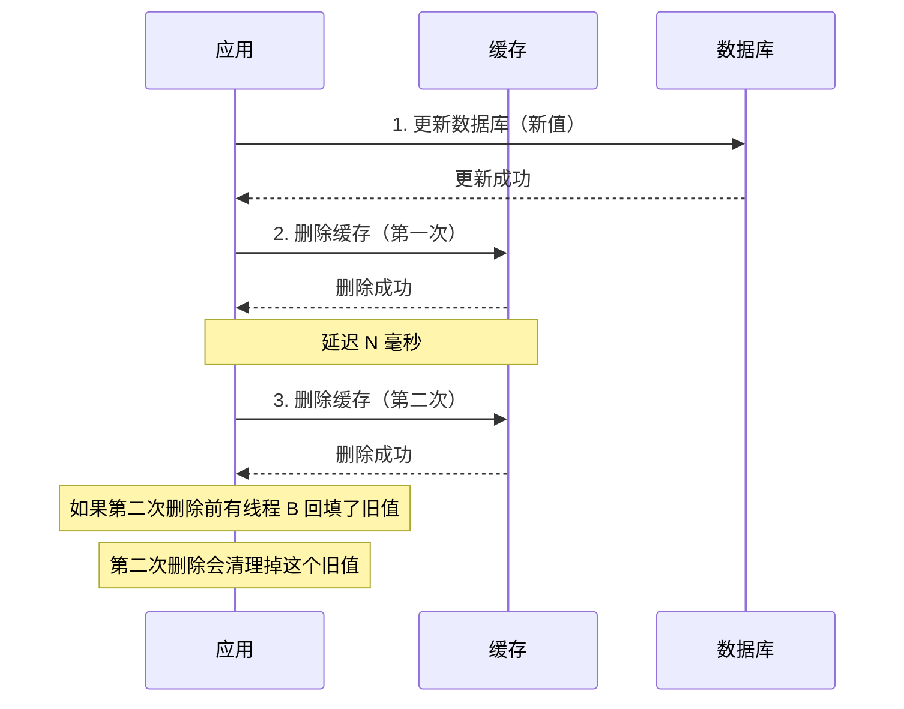

# 延迟双删详解

延迟双删（Delayed Double Delete）是 Cache Aside 模式在并发场景下的一种优化，用于解决「先更新数据库再删缓存」可能导致的缓存不一致问题。

## 问题分析：并发场景下的缓存不一致

### 场景还原

```
时间线：

T1: 线程 A 需要更新 product:100 的价格为 99.9 元
T2: 线程 A 开始执行：更新数据库（product:100.price = 99.9）✅
T3: 线程 A 准备删除缓存 product:100

    【此时】
    线程 B 恰好需要读取 product:100
    线程 B 查询缓存，未命中
    线程 B 查询数据库（此时 price 已经是 99.9）

T4: 线程 B 从数据库读到 price = 99.9
T5: 线程 B 准备写入缓存

T6: 线程 A 删除缓存 ✅
T7: 线程 B 写入缓存（price = 99.9）✅

    【问题不大，线程 B 写入的是新值】

但是，如果顺序是：

T1: 线程 A 需要更新 product:100
T2: 线程 A 更新数据库（product:100.price = 99.9）✅
T3: 线程 A 删除缓存 ✅（但删除失败了！）
T4: 线程 B 查询缓存，未命中
T5: 线程 B 查询数据库（旧值 price = 59.9）
T6: 线程 B 写入缓存（旧值 price = 59.9）
T7: 后续请求一直读到旧值 price = 59.9

    【灾难：缓存永远是旧值】
```

### 并发问题的本质

Cache Aside 在并发场景下的核心问题是：**数据库和缓存的更新不是原子的**。

如果「更新数据库」和「删除缓存」之间的间隔内有请求进来，就可能出现：
1. 读到数据库中的新值，但写入旧缓存（新值被覆盖）
2. 删除缓存失败，导致缓存永远是旧值

## 延迟双删原理

延迟双删的核心思想是：**在第一次删除缓存后，延迟一段时间，再次删除缓存。**



### 为什么第二次删除能解决问题？

```
时间线（延迟双删）：

T1: 线程 A 更新数据库（新值）✅
T2: 线程 A 删除缓存（第一次）✅
T3: 线程 B 查询缓存，未命中
T4: 线程 B 查询数据库，读到新值
T5: 线程 B 准备写入缓存

    【延迟期间，线程 B 已经拿到了新值】
    【所以即使 B 写入了，也不会有旧值问题】

T6: 延迟时间到期（假设 500ms）
T7: 线程 A 再次删除缓存（第二次）

    【但实际上，这个第二次删除可能没太大意义】
    【因为 T5 已经写入了新值】
```

**等等，这样分析好像延迟双删没解决任何问题？** 让我们重新分析：

### 真正的问题场景

```
场景：删除缓存失败 + 并发请求

T1: 线程 A 更新数据库（新值）✅
T2: 线程 A 删除缓存（失败！）❌
T3: 线程 B 查询缓存，未命中
T4: 线程 B 查询数据库（旧值）
T5: 线程 B 写入缓存（旧值）✅
T6: 后续所有请求都读到旧值

    【灾难发生】
```

延迟双删的真正价值在于：**解决删除缓存失败的场景**。

```
场景：延迟双删处理删除失败

T1: 线程 A 更新数据库（新值）✅
T2: 线程 A 删除缓存（失败！）❌
T3: 线程 B 查询缓存，未命中
T4: 线程 B 查询数据库（旧值）
T5: 线程 B 写入缓存（旧值）✅

    【延迟 500ms 期间】
    
T6: 延迟到期，线程 A 再次删除缓存 ✅
T7: 此时缓存被删除，后续请求会重新加载新值

    【问题被修复】
```

## 延迟双删实现

```java
@Service
public class ProductServiceWithDelayedDelete {

    private static final Logger log = LoggerFactory.getLogger(ProductServiceWithDelayedDelete.class);

    @Autowired
    private StringRedisTemplate redisTemplate;

    @Autowired
    private ProductRepository productRepository;

    private static final long DELAY_MILLIS = 500;  // 延迟时间

    /**
     * 更新商品：延迟双删
     */
    public void updateProduct(Long productId, ProductUpdateRequest request) {
        String cacheKey = "product:" + productId;

        // 1. 更新数据库
        Product product = productRepository.findById(productId).orElseThrow();
        product.setName(request.getName());
        product.setPrice(request.getPrice());
        productRepository.save(product);

        // 2. 删除缓存（第一次）
        redisTemplate.delete(cacheKey);
        log.info("删除缓存: {}", cacheKey);

        // 3. 延迟删除（第二次）
        CompletableFuture.runAsync(() -> {
            try {
                Thread.sleep(DELAY_MILLIS);
                redisTemplate.delete(cacheKey);
                log.info("延迟删除缓存: {}", cacheKey);
            } catch (InterruptedException e) {
                Thread.currentThread().interrupt();
                log.error("延迟删除被中断: {}", cacheKey);
            }
        });
    }
}
```

### 延迟时间的设置

延迟时间的设置是延迟双删的关键：

| 延迟时间 | 优点 | 缺点 |
| --- | --- | --- |
| 太短（< 100ms） | 快速完成 | 可能无法覆盖所有并发请求 |
| 适中（300~500ms） | 平衡速度和覆盖 | 需要评估最大请求延迟 |
| 太长（> 1s） | 充分覆盖 | 用户感知到不一致的时间长 |

**建议**：设置为业务请求延迟的 P99 值。例如，如果请求平均延迟是 50ms，P99 是 300ms，建议设置为 300~500ms。

## 延迟双删的局限性

延迟双删并非银弹，它有以下局限性：

### 局限性一：无法保证强一致

延迟双删只能保证**最终一致**，无法保证强一致。如果业务对数据一致性有严格要求，延迟双删不适用。

```
场景：两次删除都失败

T1: 线程 A 更新数据库（新值）✅
T2: 线程 A 删除缓存（失败）❌
T3: 延迟 N ms
T4: 线程 A 再次删除缓存（失败）❌

    【灾难：缓存永远是旧值】
```

### 局限性二：延迟时间难以确定

最大并发延迟是动态变化的，固定的延迟时间可能不够：

- 系统负载高时，请求延迟可能从 50ms 增加到 500ms
- 业务逻辑变化时，可能引入新的延迟点
- GC 暂停（Stop-The-World）可能导致延迟超出预期

### 局限性三：增加系统复杂度

延迟双删引入了异步操作和延迟，增加了系统的复杂度：

1. **异步操作管理**：需要处理线程池、异常处理
2. **日志追踪**：延迟操作的结果需要记录
3. **测试困难**：异步操作的行为难以测试

## 延迟双删的替代方案

### 方案一：消息队列重试

将删除操作发送到消息队列，通过重试机制保证删除成功：

```java
@Service
public class ProductServiceWithMQRetry {

    @Autowired
    private StringRedisTemplate redisTemplate;

    @Autowired
    private ProductRepository productRepository;

    @Autowired
    private CacheInvalidationProducer cacheInvalidationProducer;

    public void updateProduct(Long productId, ProductUpdateRequest request) {
        // 1. 更新数据库
        Product product = productRepository.findById(productId).orElseThrow();
        product.setName(request.getName());
        productRepository.save(product);

        // 2. 发送删除消息到 MQ
        cacheInvalidationProducer.sendDeleteMessage("product:" + productId);
    }
}

// MQ 消费者：处理删除消息，支持重试
@Component
public class CacheInvalidationConsumer {

    @Autowired
    private StringRedisTemplate redisTemplate;

    @RabbitListener(queues = "cache-invalidation")
    public void handleDelete(String cacheKey) {
        int maxRetries = 3;
        for (int i = 0; i < maxRetries; i++) {
            try {
                redisTemplate.delete(cacheKey);
                return;
            } catch (Exception e) {
                if (i == maxRetries - 1) {
                    // 记录失败日志，告警通知
                    log.error("缓存删除失败，key: {}", cacheKey);
                }
                try {
                    Thread.sleep(100 * (i + 1));  // 指数退避
                } catch (InterruptedException ex) {
                    Thread.currentThread().interrupt();
                }
            }
        }
    }
}
```

### 方案二：订阅数据库变更日志（Binlog）

通过订阅 MySQL 的 binlog 变更日志，异步更新缓存：

```java
// 使用 Canal 订阅 MySQL binlog
@Component
public class CanalCacheService {

    @Autowired
    private StringRedisTemplate redisTemplate;

    @CanalListener(destination = "example")
    public void handleUpdate(CanalEntry.Entry entry) {
        if (entry.getEntryType() == CanalEntry.EntryType.ROWDATA) {
            CanalEntry.RowChange rowChange = CanalEntry.RowChange.parseFrom(entry.getStoreValue());
            for (CanalEntry.RowData rowData : rowChange.getRowDatasList()) {
                if (rowChange.getEventType() == CanalEntry.EventType.UPDATE) {
                    // 获取更新后的数据
                    String id = getColumnValue(rowData.getAfterColumnsList(), "id");
                    String name = getColumnValue(rowData.getAfterColumnsList(), "name");

                    // 更新缓存
                    redisTemplate.opsForValue().set("product:" + id, name);
                }
            }
        }
    }
}
```

### 方案三：分布式锁

在更新数据库时获取分布式锁，确保更新和删除操作的原子性：

```java
@Service
public class ProductServiceWithLock {

    @Autowired
    private StringRedisTemplate redisTemplate;

    @Autowired
    private ProductRepository productRepository;

    private static final String LOCK_PREFIX = "lock:product:update:";

    public void updateProduct(Long productId, ProductUpdateRequest request) {
        String lockKey = LOCK_PREFIX + productId;
        String lockValue = UUID.randomUUID().toString();

        try {
            // 1. 获取分布式锁
            Boolean acquired = redisTemplate.opsForValue()
                .setIfAbsent(lockKey, lockValue, Duration.ofSeconds(10));

            if (!Boolean.TRUE.equals(acquired)) {
                throw new RuntimeException("获取锁失败");
            }

            // 2. 更新数据库
            Product product = productRepository.findById(productId).orElseThrow();
            product.setName(request.getName());
            productRepository.save(product);

            // 3. 删除缓存
            redisTemplate.delete("product:" + productId);

        } finally {
            // 4. 释放锁
            if (lockValue.equals(redisTemplate.opsForValue().get(lockKey))) {
                redisTemplate.delete(lockKey);
            }
        }
    }
}
```

## 方案对比

| 方案 | 一致性 | 复杂度 | 延迟 | 推荐度 |
| --- | --- | --- | --- | --- |
| 延迟双删 | 最终一致 | 低 | 低 | 一般 |
| MQ 重试 | 最终一致 | 中 | 低 | 高 |
| Binlog 订阅 | 最终一致 | 高 | 低 | 高 |
| 分布式锁 | 强一致 | 中 | 中 | 中 |

## 总结

延迟双删是处理 Cache Aside 并发问题的一种简单方案：
- 在第一次删除后，延迟一段时间再次删除
- 可以处理「删除缓存失败」的极端场景
- 但无法保证强一致

延迟双删的局限性：
- 延迟时间难以确定
- 无法处理两次删除都失败的场景
- 增加系统复杂度

生产环境中，更推荐 **MQ 重试**或 **Binlog 订阅**方案，它们通过异步机制保证了删除操作的可靠性。

下一节我们将讲解缓存预热与缓存刷新——如何避免冷启动问题。
