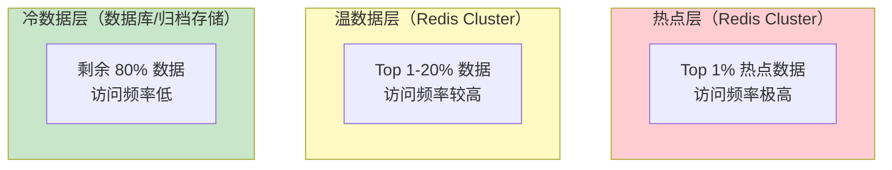
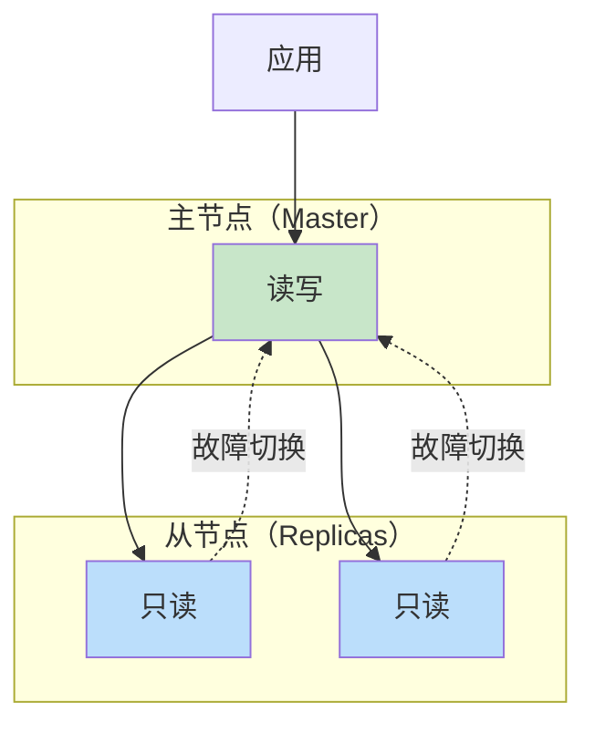
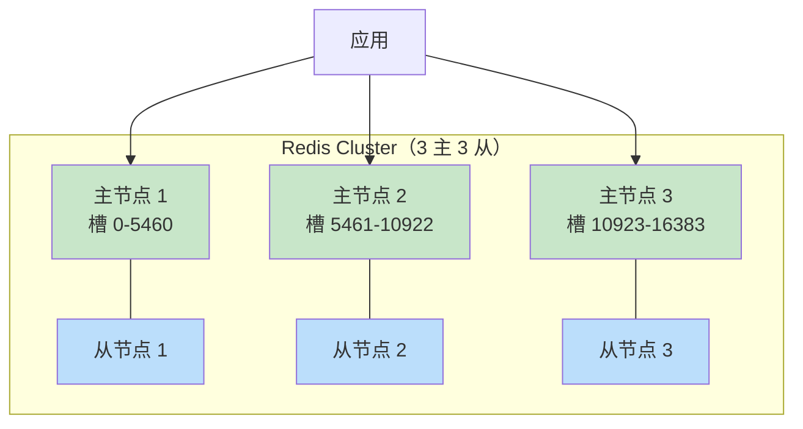

# 分布式缓存（Redis/Memcached）

本地缓存解决了单进程内的性能问题，但现代系统往往由多个进程甚至多台机器组成，这些进程之间如何共享缓存数据？答案是**分布式缓存**。

分布式缓存将缓存数据存储在一个独立的缓存集群中，所有应用节点通过网络访问这个共享缓存。相比本地缓存，分布式缓存的优势在于**跨进程共享**、**容量可扩展**、**故障不影响应用进程**。代价是**增加了网络开销**和**运维复杂度**。

## Redis vs Memcached 对比

分布式缓存领域有两个主流选择：Redis 和 Memcached。它们都是高性能的 Key-Value 存储，但设计哲学和适用场景有显著差异。

| 维度 | Redis | Memcached |
| --- | --- | --- |
| 数据结构 | String, Hash, List, Set, ZSet, Bitmap, HyperLogLog, Stream | 仅 String（二进制） |
| 持久化 | 支持 RDB + AOF | 不支持，重启后数据丢失 |
| 集群模式 | 原生 Cluster，支持数据分片 | 客户端分片，需要额外中间件 |
| 复制 | 主从复制，支持读写分离 | 无，需要第三方实现 |
| 内存管理 | 多种淘汰策略，LRU/LFU/Random | LRU |
| 单线程 vs 多线程 | 单线程（6.0 前），避免锁开销 | 多线程，充分利用多核 |
| Lua 脚本 | 支持，原子执行复杂逻辑 | 不支持 |
| 事务 | 支持 MULTI/EXEC（弱事务） | 不支持 |
| 过期策略 | 惰性删除 + 定期删除 | 惰性删除 |

### 选择建议

**选择 Memcached 的场景**：
- 简单缓存场景，只需要存储字符串
- 追求极致内存效率，不需要额外数据结构
- 多进程缓存共享，不需要持久化

**选择 Redis 的场景**：
- 需要复杂数据结构（如排行榜、分布式锁、消息队列）
- 需要持久化或主从复制
- 需要集群分片和高可用
- 需要 Lua 脚本实现原子操作

**现实情况**：Redis 几乎一统江湖。即使是简单的 String 缓存，很多团队也选择 Redis，因为它提供了更丰富的功能和更好的生态。

## Redis 数据结构与缓存场景

Redis 的数据结构是它相比 Memcached 的最大优势。以下是每种数据结构在缓存场景中的典型应用：

### String（字符串）

最基础的结构，适用于任何简单的 Key-Value 缓存：

```java
// 缓存商品详情（序列化为 JSON）
String key = "product:detail:" + productId;
String json = redisTemplate.opsForValue().get(key);
if (json == null) {
    ProductDetail detail = productService.getDetail(productId);
    redisTemplate.opsForValue().set(key, JSON.toJSONString(detail), 10, TimeUnit.MINUTES);
}
```

### Hash（哈希）

适合缓存对象，可以单独操作字段而无需读取整个对象：

```java
// 缓存用户信息
String key = "user:info:" + userId;
redisTemplate.opsForHash().put(key, "name", "张三");
redisTemplate.opsForHash().put(key, "email", "zhang@example.com");
redisTemplate.opsForHash().put(key, "level", "VIP");

// 只获取某个字段
String name = (String) redisTemplate.opsForHash().get(key, "name");
```

### List（列表）

适合实现简单队列或最新列表：

```java
// 缓存用户最近浏览记录（最多 100 条）
String key = "user:history:" + userId;
redisTemplate.opsForList().leftPush(key, productId);
redisTemplate.opsForList().trim(key, 0, 99);  // 只保留前 100 条
List<Object> history = redisTemplate.opsForList().range(key, 0, 9);  // 获取最近 10 条
```

### Set（集合）

适合去重场景，如用户标签、点赞集合：

```java
// 缓存用户标签
String key = "user:tags:" + userId;
redisTemplate.opsForSet().add(key, "程序员", "开源爱好者", "猫奴");
Boolean hasTag = redisTemplate.opsForSet().isMember(key, "程序员");

// 缓存商品被哪些用户收藏（用于去重）
String favoriteKey = "product:favorites:" + productId;
redisTemplate.opsForSet().add(favoriteKey, userId1, userId2, userId3);
Long totalFavorites = redisTemplate.opsForSet().size(favoriteKey);
```

### ZSet（有序集合）

适合排行榜、延时队列等需要排序的场景：

```java
// 商品销量排行榜
String key = "product:rank:daily";
redisTemplate.opsForZSet().incrementScore(key, productId, 1);  // 增加销量
redisTemplate.opsForZSet().reverseRange(key, 0, 9);           // 获取 Top 10
redisTemplate.opsForZSet().reverseRank(key, productId);         // 获取排名

// 延时任务队列
String delayKey = "task:delay";
redisTemplate.opsForZSet().add(delayKey, taskId, System.currentTimeMillis() + delayMs);
```

## 缓存容量规划

分布式缓存的容量规划比本地缓存更复杂，因为需要考虑整个集群的存储能力。

### 容量估算方法

```
集群总容量 = 单节点容量 × 节点数量 × 副本系数 × 冗余系数

其中：
- 单节点容量：机器内存 × 内存使用率（建议 70~80%）
- 副本系数：1（无副本）或 2（主从复制）
- 冗余系数：0.8~0.9（预留处理突发流量）
```

### 容量规划案例

假设一个 6 节点 Redis Cluster，每个节点 16GB 内存：

```java
// 计算可用容量
int nodeMemoryGB = 16;
int totalMemoryGB = nodeMemoryGB * 6;              // 96GB
double usageRate = 0.75;                           // 使用 75%
int replicaFactor = 2;                             // 主从复制
double safetyMargin = 0.85;                        // 冗余系数

long effectiveCapacity = (long) (totalMemoryGB * usageRate / replicaFactor * safetyMargin);
// 约 24GB 可用于数据存储
```

### 数据分层策略

为了在有限容量内最大化收益，建议采用数据分层策略：



| 层级 | 数据特征 | 存储位置 | 过期策略 |
| --- | --- | --- | --- |
| 热点层 | Top 1%，QPS 占比 80% | Redis 内存 | TTL 短（5~15 分钟） |
| 温数据层 | Top 1-20% | Redis 内存 | TTL 中等（30~60 分钟） |
| 冷数据层 | 剩余 80% | 数据库 | 不过期或 TTL 极长 |

## Redis Cluster vs 主从模式

Redis 的部署模式有两种：**主从复制**和 **Redis Cluster**。

### 主从复制模式



**特点**：
- 一主多从，写操作只在主节点
- 从节点提供**只读**能力，可以水平扩展读性能
- 需要 Sentinel 或其他组件实现自动故障切换
- 数据全量复制，扩展性有限

**适用场景**：读多写少，数据量不是特别大（几十 GB 级别）

### Redis Cluster 模式



**特点**：
- 数据自动分片（16384 个槽），无需客户端分片
- 每个主节点可以有多个从节点，实现高可用
- 故障自动切换，Cluster 自动感知
- 写入能力水平扩展（多个主节点分担写压力）

**适用场景**：数据量大（百 GB 级别），需要水平扩展

### 选型建议

| 维度 | 主从 + Sentinel | Redis Cluster |
| --- | --- | --- |
| 数据量 | < 100GB | 100GB+ |
| 写 QPS | 单节点上限 | 多节点水平扩展 |
| 扩展性 | 有限 | 强 |
| 运维复杂度 | 中等 | 较高 |
| 事务支持 | 支持 | 仅单槽事务（多键操作受限） |

## Redis 缓存最佳实践

### Key 设计

```java
// 推荐：使用冒号分隔层次，便于管理和查看
"user:info:12345"
"product:detail:98765"
"order:status:abc123"
"cache:product:list:category:electronics:page:1"

// 不推荐：过短或过长的 key
"u12345"           // 含义不明
"this_is_a_very_long_key_that_should_not_be_used"  // 占用内存
```

### Value 设计

```java
// 推荐：存储结构化数据（JSON 或序列化对象）
ProductDetail detail = new ProductDetail();
detail.setId(12345L);
detail.setName("iPhone 15");
detail.setPrice(5999);
redisTemplate.opsForValue().set("product:12345", JSON.toJSONString(detail));

// 不推荐：存储过大的 value（单条不超过 10MB）
// 如果确实需要存储大对象，考虑拆分成多个 key
```

### 连接池配置

```java
@Configuration
public class RedisConfig {

    @Bean
    public LettuceConnectionFactory redisConnectionFactory() {
        RedisStandaloneConfiguration config = new RedisStandaloneConfiguration();
        config.setHostName("localhost");
        config.setPort(6379);

        GenericObjectPoolConfig poolConfig = new GenericObjectPoolConfig();
        poolConfig.setMaxTotal(50);           // 最大连接数
        poolConfig.setMaxIdle(20);             // 最大空闲连接
        poolConfig.setMinIdle(5);              // 最小空闲连接
        poolConfig.setMaxWait(Duration.ofMillis(3000));  // 获取连接超时

        LettucePoolingClientConfiguration clientConfig = LettucePoolingClientConfiguration.builder()
            .poolConfig(poolConfig)
            .commandTimeout(Duration.ofMillis(500))  // 命令超时
            .build();

        return new LettuceConnectionFactory(config, clientConfig);
    }
}
```

## 总结

分布式缓存是现代高并发系统的重要组成部分。Redis 凭借丰富的数据结构、完善的集群能力和活跃的生态，是目前分布式缓存的首选方案。

在选型时，需要考虑：
- **数据结构需求**：简单缓存选 Memcached，复杂场景选 Redis
- **容量规划**：根据数据量和访问模式设计容量
- **部署模式**：读多写少选主从，大数据量选 Cluster

下一节我们将介绍如何将本地缓存和分布式缓存结合，构建多级缓存架构。
