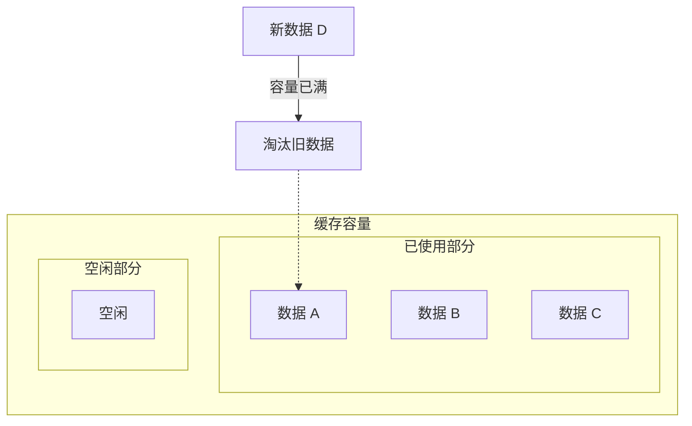
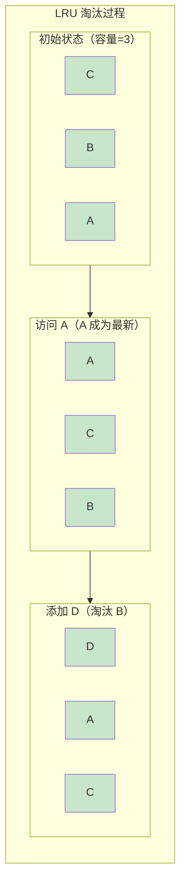
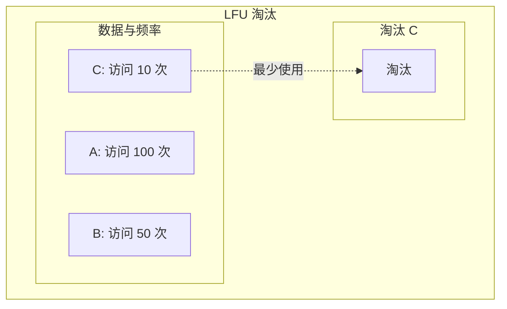
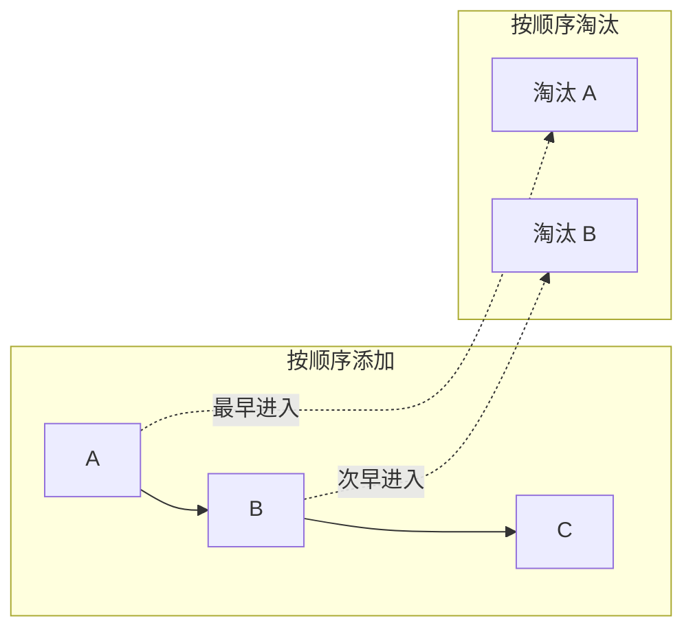
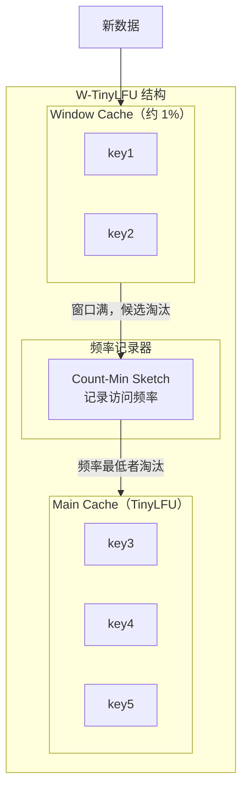

# 缓存淘汰策略

缓存的容量是有限的，当缓存满了之后，新数据要进来，就必须淘汰一些旧数据。**淘汰策略决定了保留哪些数据、淘汰哪些数据**，直接影响缓存的命中率和性能。

## 为什么需要淘汰策略

缓存的容量约束是物理现实：
- 本地缓存：受 JVM 堆内存限制
- 分布式缓存：受机器内存和成本限制



如果不使用淘汰策略：
- **内存溢出**：缓存无限增长，最终 OOM
- **性能下降**：内存碎片化，GC 压力增大
- **缓存失效**：旧的垃圾数据占用空间

## LRU：最近最少使用

LRU（Least Recently Used）是**最常用的淘汰策略**，核心思想是：**淘汰最长时间未被访问的数据。**

### LRU 原理

LRU 假设：如果一个数据最近被访问过，那么它将来被访问的概率也更高。因此，应该淘汰最久未被访问的数据。



### LRU 的问题：缓存污染

LRU 有一个经典问题：**批量查询导致缓存污染**。

场景：系统启动时，执行一次全量数据扫描，将 100 万条数据依次查询一遍。

问题：扫描的数据会把真正的热点数据全部淘汰掉，后续的正常请求全部 cache miss。

```java
// 批量扫描导致缓存污染
public void scanAllProducts() {
    List<Product> products = productRepository.findAll();
    for (Product p : products) {
        // 每次查询都会更新 LRU 顺序
        // 真正的热点数据被挤到后面
        cache.get(p.getId());
    }
}
```

### Caffeine LRU 实现

Caffeine 默认使用 LRU（实际是 LRU 的变种）：

```java
Cache<String, Object> cache = Caffeine.newBuilder()
    .maximumSize(10_000)           // 最大容量
    .recordStats()                  // 开启统计
    .build();

// LRU 会自动淘汰最久未使用的条目
```

## LFU：最不经常使用

LFU（Least Frequently Used）解决了 LRU 的缓存污染问题，核心思想是：**淘汰访问频率最低的数据。**

### LFU 原理

LFU 维护一个访问计数器，淘汰访问次数最少的数据：



### LFU 的问题：历史热点难以淘汰

LFU 也有自己的问题：**历史热点难以淘汰**。

场景：某个数据曾经是热点（访问了 10000 次），但现在已经不再被访问了。它会一直占用缓存空间，直到其他数据的访问次数超过它。

```
时间线：
T1: 热点数据 A 被访问 10000 次
T2: 热点数据 B 开始被访问，访问次数逐渐增加
T3: A 已不再被访问，但访问次数仍为 10000
T4: 即使 B 访问 10001 次，A 才会被淘汰
```

### Caffeine LFU 实现

Caffeine 支持基于 LFU 的淘汰：

```java
// Caffeine 的 W-TinyLFU 综合了 LRU 和 LFU 的优点
Cache<String, Object> cache = Caffeine.newBuilder()
    .maximumSize(10_000)
    .weigher((key, value) -> ((String) value).length())  // 基于权重的淘汰
    .recordStats()
    .build();
```

## FIFO：先进先出

FIFO（First In First Out）是最简单的淘汰策略，核心思想是：**淘汰最早进入缓存的数据。**

### FIFO 原理



### FIFO 的问题

FIFO 完全不考虑数据的访问模式，即使某个数据被访问了 10000 次，也会因为「最早进入」而被淘汰。

```java
// FIFO 缓存实现
Cache<String, Object> cache = Caffeine.newBuilder()
    .maximumSize(10_000)
    .scheduler(Scheduler.systemScheduler())  // FIFO 需要调度器
    .build();
```

**FIFO 只适用于对缓存要求不高的场景**，如临时缓存、结果缓存等。

## TTL：时间过期

TTL（Time To Live）是一种基于时间的淘汰策略，核心思想是：**数据在缓存中停留超过一定时间后自动失效。**

### TTL 分类

| 类型 | 说明 | 实现方式 |
| --- | --- | --- |
| 写入过期（Write TTL） | 数据写入后 N 分钟过期 | `expireAfterWrite` |
| 访问过期（Access TTL） | 数据被访问后 N 分钟过期 | `expireAfterAccess` |
| 自适应过期 | 根据数据特征动态设置过期时间 | `expireAfter` |

### TTL 实现

```java
Cache<String, Object> cache = Caffeine.newBuilder()
    .expireAfterWrite(10, TimeUnit.MINUTES)    // 写入后 10 分钟过期
    .expireAfterAccess(5, TimeUnit.MINUTES)    // 访问后 5 分钟过期
    .expireAfter((key, value, currentTime) -> {
        // 自定义过期：根据数据中的时间戳判断
        if (value instanceof Expirable) {
            Expirable expirable = (Expirable) value;
            return expirable.getExpireAt() - currentTime;
        }
        return -1;  // 返回 -1 表示不过期
    })
    .build();
```

## 淘汰算法对比

| 算法 | 原理 | 优点 | 缺点 | 适用场景 |
| --- | --- | --- | --- | --- |
| LRU | 淘汰最久未使用 | 实现简单，对热点数据友好 | 缓存污染问题 | 大多数通用场景 |
| LFU | 淘汰访问频率最低 | 避免历史热点占用缓存 | 历史热点难以淘汰 | 长期稳定热点 |
| FIFO | 淘汰最早进入 | 实现最简单 | 不考虑访问模式 | 临时缓存 |
| TTL | 基于时间过期 | 自动清理，无需手动淘汰 | 无法保护热点数据 | 数据时效性要求高 |

## Caffeine W-TinyLFU

Caffeine 默认使用的 W-TinyLFU 综合了 LRU 和 LFU 的优点：

```java
// W-TinyLFU 配置
Cache<String, Object> cache = Caffeine.newBuilder()
    .maximumSize(10_000)
    .recordStats()
    .build();

// W-TinyLFU 的优势：
// 1. 使用 Count-Min Sketch 记录频率，解决 LRU 的缓存污染问题
// 2. Window Cache 吸收短期突发访问
// 3. 综合考虑近期和长期频率
```

### W-TinyLFU 工作原理



| 组件 | 作用 | 占比 |
| --- | --- | --- |
| Window Cache | 吸收突发访问，避免短期热点被淘汰 | ~1% |
| Main Cache | 存储长期热点数据 | ~99% |
| Count-Min Sketch | 记录访问频率，用于淘汰决策 | 固定内存 |

## 淘汰策略选择指南

根据业务场景选择淘汰策略：

| 场景 | 推荐策略 | 原因 |
| --- | --- | --- |
| 通用场景 | W-TinyLFU | 综合性能最优 |
| 读多写少，热点稳定 | LFU | 保护长期热点 |
| 批量数据处理 | LRU + 禁用自动淘汰 | 避免污染 |
| 数据时效性要求高 | TTL | 自动清理旧数据 |
| 临时缓存 | FIFO | 实现简单 |

### 生产环境建议

```java
// 推荐配置：W-TinyLFU + 容量限制
Cache<String, ProductDetail> productCache = Caffeine.newBuilder()
    .maximumSize(10_000)                   // 最大容量
    .expireAfterWrite(10, TimeUnit.MINUTES) // 写入后 10 分钟过期
    .recordStats()                         // 开启统计
    .build();

// 配合监控
CacheStats stats = productCache.stats();
System.out.println("命中率: " + stats.hitRate());
System.out.println("淘汰数: " + stats.evictionCount());
System.out.println("平均加载时间: " + stats.averageLoadPenalty() + "ms");
```

## 总结

缓存淘汰策略决定了在容量有限的情况下保留哪些数据：

- **LRU**：淘汰最久未使用，简单但有缓存污染问题
- **LFU**：淘汰访问频率最低，避免历史热点占用
- **FIFO**：淘汰最早进入，实现简单但不智能
- **TTL**：基于时间过期，适合数据时效性要求高的场景
- **W-TinyLFU**：综合 LRU 和 LFU，是 Caffeine 的默认算法

生产环境推荐使用 Caffeine 的 W-TinyLFU，配合容量限制和 TTL 过期。

下一节我们将讲解缓存一致性——当数据在缓存和数据库中同时存在时，如何保证它们的一致性。
