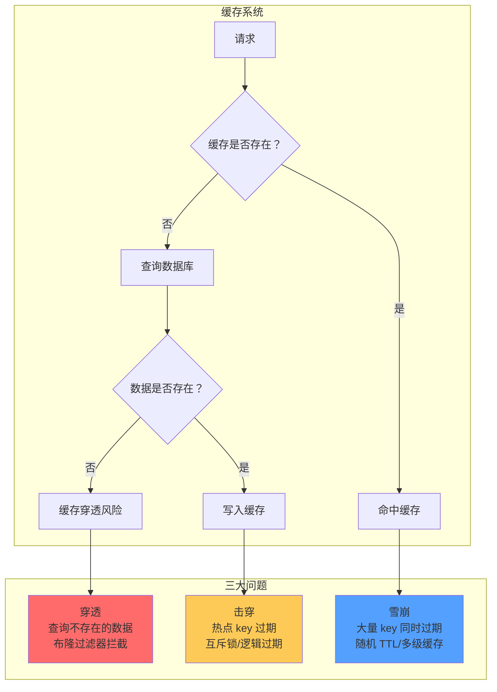
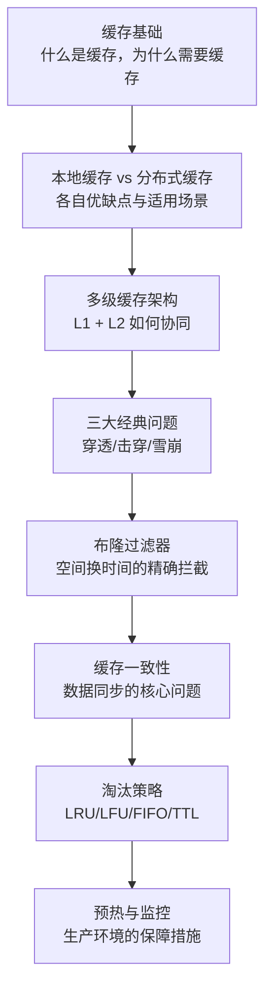

# 缓存策略

凌晨 2 点，发布刚结束，数据库连接池突然被打满，接口开始大量超时。你第一反应是数据库慢了，但打开监控一看——数据库 CPU 使用率正常，磁盘 I/O 也没有异常。问题到底在哪？

翻了半天日志才发现：缓存集群刚刚经历了一次短暂的网络抖动，所有缓存数据在短时间内集中失效。而业务代码里，虽然加了缓存，但缓存过期策略设置得过于简单——大量 key 设置了相同的过期时间。结果是缓存失效的瞬间，所有请求都穿透到了数据库。

这不是孤例。某电商大促时，因为布隆过滤器配置错误，大量不存在的商品 ID 被误判为存在，用户无法正常下单；某社交平台因为 Redis 集群主从切换，缓存雪崩导致数据库被打爆，系统整体宕机 4 小时。

**缓存是性能优化的利器，但如果用不好，它也是生产事故的高发区。**

本模块聚焦缓存策略的核心知识点，从缓存的基础原理出发，深入讲解穿透、击穿、雪崩三大经典问题的成因与解决方案，并系统阐述缓存一致性、淘汰策略、预热监控等生产实践要点。

## 模块结构

本模块按主题分为 8 个子模块：

| 子模块 | 核心问题 | 典型场景 |
| --- | --- | --- |
| 缓存系统概述与收益分析 | 缓存的本质是什么，如何衡量效果 | 命中率计算、收益评估 |
| 本地缓存 | Caffeine/Guava Cache 的使用与取舍 | 单机热点数据、低延迟场景 |
| 分布式缓存 | Redis/Memcached 的选型与使用 | 跨实例共享、大容量缓存 |
| 多级缓存架构 | L1 + L2 缓存如何协同工作 | 高并发场景下的缓存分层 |
| 穿透、击穿、雪崩 | 三大经典问题的成因与解决方案 | 缓存失效场景的全面防护 |
| 布隆过滤器 | 如何高效拦截不存在的数据 | 恶意查询、空值防护 |
| 缓存一致性 | 先删缓存还是先更新数据库 | 数据同步、延迟双删 |
| 淘汰策略与监控 | LRU/LFU/FIFO 如何选型 | 内存管理、缓存治理 |

## 缓存三大经典问题

## 核心演进路径

缓存的学习顺序建议如下：

## 常见认知误区

| 误区 | 真相 |
| --- | --- |
| 加了缓存就一定会提升性能 | 如果命中率过低，缓存反而增加开销 |
| 缓存数据永远不会过期 | 内存有限，过期策略是必须面对的问题 |
| 缓存一致性可以用事务解决 | 缓存和数据库是两种不同的存储，需要独立的一致性策略 |
| 缓存雪崩只是因为 key 过期 | 缓存服务宕机同样会导致雪崩 |
| 布隆过滤器不会误判 | 布隆过滤器有误判率，只能降低风险，不能完全消除 |

## 学习建议

1. **从问题出发**：不要一开始就背概念，想清楚「这个技术解决什么问题」
2. **理解 trade-off**：每种方案都有代价，缓存也不例外
3. **关注边界条件**：线上事故往往发生在边界条件，而不是正常流程
4. **动手验证**：用真实数据测试缓存命中率，理解参数调优的影响

准备好开始了吗？让我们从缓存系统的基础概念开始。
