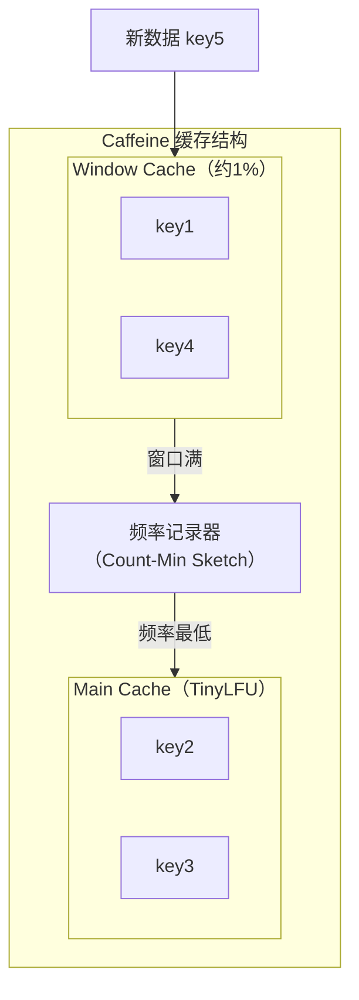

# 本地缓存（Caffeine/Guava）

本地缓存是最简单的缓存形态——数据直接缓存在应用进程的内存中，不依赖外部服务。这意味着**零网络开销**，访问延迟可以低到微秒级。

但本地缓存也有明显的局限：**无法跨进程共享**，且受单机内存限制。本节介绍两种最常用的 Java 本地缓存库——Caffeine 和 Guava Cache，帮助你根据场景选择合适的工具。

## Caffeine 缓存特性：W-TinyLFU 算法

Caffeine 是目前 Java 生态中最流行的本地缓存库，Spring Boot 2.x 之后的默认缓存实现就是 Caffeine。它的核心优势在于**高性能**和**优秀的淘汰算法**——W-TinyLFU（Window TinyLFU）。

### 什么是 W-TinyLFU

W-TinyLFU 是 TinyLFU 的改进版本，TinyLFU 是一种基于频率的淘汰算法。相比 LRU，TinyLFU 能更好地应对**热点数据被一次性大批量查询**的场景。

来看一个 LRU 的经典问题：

```
场景：缓存容量为 3

查询序列：key1, key2, key3, key4, key1, key2, key3, key4...

key1, key2, key3 依次进入缓存（第 1-3 次查询）
key4 进入时，容量已满，LRU 淘汰 key1（最久未使用）
key1 再次查询，key2 被淘汰
key2 再次查询，key3 被淘汰
...
```

在 LRU 下，`key1, key2, key3, key4` 永远无法同时存在于缓存中，因为每次新 key 进入都会淘汰最久未使用的那个。而这个序列中，每个 key 都被查询了多次，都是热点数据。

W-TinyLFU 的解决方案是**同时考虑近期使用频率和长期使用频率**：

- **Window Cache**：小容量的窗口缓存（约 1%），吸收短暂的突发访问
- **TinyLFU**：主缓存区域，使用频率计数决定淘汰



W-TinyLFU 的优势：
- 能识别真正的热点数据（被频繁访问），不会因为一次性批量查询而被淘汰
- 在大多数 benchmark 中，性能优于 LRU 和 LFU
- 内存开销可控（频率记录使用 Count-Min Sketch，空间固定）

### Caffeine 基本配置

```java
import com.github.benmanes.caffeine.cache.Cache;
import com.github.benmanes.caffeine.cache.Caffeine;
import java.util.concurrent.TimeUnit;

public class CaffeineConfig {

    public static void main(String[] args) {
        // 基础配置：容量 + 过期时间
        Cache<String, String> cache = Caffeine.newBuilder()
            .maximumSize(10_000)           // 最大容量 1 万条
            .expireAfterWrite(10, TimeUnit.MINUTES)  // 写入后 10 分钟过期
            .build();

        cache.put("user:1001", "张三");
        String value = cache.getIfPresent("user:1001");  // 命中返回，null 表示未命中
    }
}
```

### Caffeine 过期策略

Caffeine 支持三种过期策略，适用于不同场景：

| 策略 | 方法 | 适用场景 |
| --- | --- | --- |
| 写入过期 | `expireAfterWrite` | 数据更新后需要及时失效 |
| 访问过期 | `expireAfterAccess` | 长时间未访问的数据应该清理 |
| 自定义过期 | `expireAfter` | 需要根据数据本身判断过期时间 |

```java
Cache<String, Object> cache = Caffeine.newBuilder()
    .maximumSize(10_000)
    .expireAfterWrite(10, TimeUnit.MINUTES)    // 写入后 10 分钟过期
    .expireAfterAccess(5, TimeUnit.MINUTES)    // 访问后 5 分钟过期（可与上面叠加）
    .expireAfter((key, value, currentTime) -> {
        // 自定义过期：根据数据中的时间戳判断
        if (value instanceof ExpirableData) {
            ExpirableData data = (ExpirableData) value;
            return data.getExpireAt() - currentTime;
        }
        return -1;  // -1 表示不过期
    })
    .build();
```

### Caffeine 异步加载

```java
// 同步加载（Cache.get 会阻塞）
String result = cache.get("key", k -> {
    // 缓存不存在时，执行这个函数
    return loadFromDatabase(k);
});

// 异步加载（AsyncLoadingCache）
AsyncLoadingCache<String, String> asyncCache = Caffeine.newBuilder()
    .maximumSize(10_000)
    .expireAfterWrite(10, TimeUnit.MINUTES)
    .buildAsync(key -> {
        return loadFromDatabase(key);
    });

// 使用 CompletableFuture
CompletableFuture<String> future = asyncCache.get("key");
future.thenAccept(value -> System.out.println("Loaded: " + value));
```

## Guava Cache 基本用法

Guava Cache 是 Google Guava 库的一部分，在 Caffeine 出现之前是 Java 本地缓存的事实标准。虽然 Caffeine 目前是更好的选择，但 Guava Cache 仍在很多遗留项目中使用，了解它有助于阅读老代码。

### 基础配置

```java
import com.google.common.cache.Cache;
import com.google.common.cache.CacheBuilder;
import java.util.concurrent.TimeUnit;

public class GuavaCacheExample {

    public static void main(String[] args) throws ExecutionException {
        Cache<String, String> cache = CacheBuilder.newBuilder()
            .maximumSize(10_000)           // 最大容量
            .expireAfterWrite(10, TimeUnit.MINUTES)  // 写入后过期
            .recordStats()                 // 开启统计
            .build();

        cache.put("key1", "value1");
        String value = cache.get("key1", () -> "default");  // 不存在时使用 lambda

        // 获取统计信息
        CacheStats stats = cache.stats();
        System.out.println("命中率: " + stats.hitRate());
        System.out.println("未命中数: " + stats.missCount());
    }
}
```

### Guava Cache vs Caffeine

| 维度 | Guava Cache | Caffeine |
| --- | --- | --- |
| 算法 | LRU（默认） | W-TinyLFU |
| 性能 | 中等 | 极高 |
| 功能完整性 | 完整 | 更完整 |
| 异步支持 | 无 | 原生支持 |
| 维护状态 | 已停止新功能开发 | 活跃维护 |
| Spring 集成 | 需要手动配置 | Spring Boot 2.x 默认 |

**结论**：新项目建议使用 Caffeine，只有在维护老项目或 Guava 已是项目依赖时才考虑 Guava Cache。

## 缓存容量设计

本地缓存的容量设计是一个常见问题。容量太小，命中率低；容量太大，可能导致 OOM。

### 容量估算方法

1. **基于内存估算**

```java
// 假设每个缓存对象平均 1KB，目标内存占用 100MB
long maxSize = 100 * 1024 * 1024 / 1024;  // 10 万条

Cache<String, byte[]> cache = Caffeine.newBuilder()
    .maximumSize(maxSize)
    .build();
```

2. **基于访问模式估算**

```java
// 基于权重设置容量
Cache<String, UserInfo> cache = Caffeine.newBuilder()
    .maximumWeight(100 * 1024 * 1024)  // 最大内存 100MB
    .weigher((key, value) -> value.estimateSize())  // 自定义权重
    .build();
```

### 容量规划建议

| 应用类型 | 推荐容量 | 说明 |
| --- | --- | --- |
| 小型应用 | 1,000~10,000 | 存储少量热点配置 |
| 中型应用 | 10,000~100,000 | 存储热点业务数据 |
| 大型应用 | 100,000~1,000,000 | 需要结合 JVM 内存综合规划 |
| 超大应用 | 多级缓存 | 本地缓存 + 分布式缓存 |

**警告**：本地缓存不要占用过多堆内存。经验法则：本地缓存的堆内存占用不应超过 JVM 堆的 `10%`。如果需要存储更多数据，应该考虑分布式缓存。

## 缓存过期策略选择

过期策略的选择取决于数据的更新频率和一致性要求：

| 策略 | 适用场景 | 不适用场景 |
| --- | --- | --- |
| `expireAfterWrite` | 数据更新后需要及时失效 | 更新频率高的数据 |
| `expireAfterAccess` | 只需要清理长期不用的数据 | 需要强制过期的场景 |
| TTL（固定时长） | 大多数场景 | 需要动态过期时间的场景 |

### 过期时间设置建议

```java
// 不同数据类型的过期时间参考
Cache<String, ProductDetail> productCache = Caffeine.newBuilder()
    .maximumSize(10_000)
    .expireAfterWrite(10, TimeUnit.MINUTES)   // 商品详情：10 分钟

Cache<String, Category> categoryCache = Caffeine.newBuilder()
    .maximumSize(1_000)
    .expireAfterWrite(1, TimeUnit.HOURS)     // 分类信息：1 小时（更新不频繁）

Cache<String, UserSession> sessionCache = Caffeine.newBuilder()
    .maximumSize(100_000)
    .expireAfterAccess(30, TimeUnit.MINUTES) // 用户会话：30 分钟未访问过期
```

## 缓存统计与监控

Caffeine 提供丰富的统计信息，对于优化缓存配置至关重要：

```java
Cache<String, Object> cache = Caffeine.newBuilder()
    .maximumSize(10_000)
    .recordStats()  // 必须开启统计
    .build();

// 定期获取统计信息
CacheStats stats = cache.stats();
System.out.println("==== 缓存统计 ====");
System.out.println("命中率: " + String.format("%.2f%%", stats.hitRate() * 100));
System.out.println("未命中率: " + String.format("%.2f%%", stats.missRate() * 100));
System.out.println("总请求数: " + stats.requestCount());
System.out.println("加载耗时(平均): " + stats.averageLoadPenalty() + "ms");
System.out.println("驱逐数: " + stats.evictionCount());
System.out.println("加载失败数: " + stats.loadFailureCount());
```

| 指标 | 说明 | 优化方向 |
| --- | --- | --- |
| `hitRate` | 命中率 | 命中率低考虑扩大容量或预热 |
| `evictionCount` | 淘汰数量 | 淘汰过多考虑扩大容量 |
| `loadFailureCount` | 加载失败数 | 失败过多检查后端服务 |
| `averageLoadPenalty` | 平均加载延迟 | 加载慢考虑异步预加载 |

## 总结

本地缓存是最简单、最高性能的缓存形态，适合存储热点数据。Caffeine 是目前 Java 本地缓存的最佳选择，它的 W-TinyLFU 算法能更好地应对复杂的访问模式。

在使用本地缓存时，需要注意：
- **容量规划**：不超过 JVM 堆的 10%，避免 OOM
- **过期策略**：根据数据更新频率选择合适的过期方式
- **统计监控**：开启 `recordStats()`，持续监控命中率

本地缓存解决了单机内的缓存问题，但无法跨 JVM 共享。下一节我们将介绍分布式缓存——Redis 和 Memcached，它们可以跨进程、跨机器共享缓存数据。
