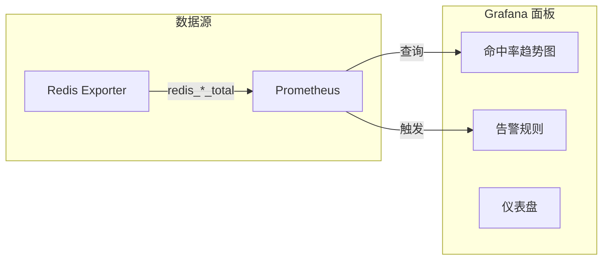

# 缓存监控与指标

缓存系统上线后，如何知道它运行得好不好？命中率有没有达标？有没有潜在问题？答案是**监控**。缓存监控是缓存治理的基础，没有监控的缓存就像没有仪表盘的汽车，你不知道什么时候会出问题。

## 为什么需要缓存监控

很多人以为「缓存加上了就完事了」，但实际上缓存带来的问题比它解决的问题还多：

```
缓存问题清单：
- 命中率低：缓存没有起到应有的作用
- 内存溢出：缓存占用过多内存
- 响应慢：缓存反而拖慢了速度
- 数据不一致：缓存和数据库数据不同步
- 服务不可用：缓存宕机导致雪崩
```

这些问题如果没有监控，往往要到线上出故障了才发现。

## 核心监控指标

### 一、命中率指标

命中率是缓存最核心的指标，反映缓存的有效性：

| 指标 | 计算方式 | 说明 |
| --- | --- | --- |
| 命中率 | `命中数 / 总请求数` | 越高越好 |
| 未命中率 | `未命中数 / 总请求数` | 越低越好 |
| 命中延迟 | 缓存读取耗时 | 越低越好 |

```java
// Caffeine 缓存统计
Cache<String, Object> cache = Caffeine.newBuilder()
    .maximumSize(10_000)
    .recordStats()
    .build();

CacheStats stats = cache.stats();
System.out.println("命中率: " + String.format("%.2f%%", stats.hitRate() * 100));
System.out.println("未命中率: " + String.format("%.2f%%", stats.missRate() * 100));
```

### 二、容量指标

缓存容量直接影响命中率和系统稳定性：

| 指标 | 说明 | 告警阈值 |
| --- | --- | --- |
| 已用容量 | 当前缓存条目数 | `>` 最大容量 80% |
| 最大容量 | 缓存允许的最大条目数 | - |
| 淘汰数 | 触发淘汰的次数 | `>` 100/min |
| 负载因子 | 已用 / 最大 | `>` 0.8 |

### 三、性能指标

缓存的读写性能：

| 指标 | 说明 | 正常范围 |
| --- | --- | --- |
| 读取延迟 | 缓存读取耗时 | `<1ms` |
| 写入延迟 | 缓存写入耗时 | `<5ms` |
| QPS | 每秒操作数 | 根据容量评估 |

### 四、网络指标（Redis）

对于 Redis 等分布式缓存：

| 指标 | 说明 | 告警阈值 |
| --- | --- | --- |
| 连接数 | 当前连接数 | `>` 最大连接数 80% |
| 内存使用 | 已用内存 | `>` 最大内存 80% |
| CPU 使用 | Redis CPU | `>` 80% |
| 阻塞时间 | 阻塞命令耗时 | `>` 100ms |

## Prometheus + Grafana 监控方案

生产环境推荐使用 Prometheus + Grafana 进行缓存监控：

### 暴露 Prometheus 指标

```java
@Configuration
public class CacheMetricsConfig {

    @Autowired
    private Cache<String, ProductDetail> productCache;

    @Bean
    public MeterRegistry meterRegistry(MeterRegistry registry) {
        // 缓存命中率
        Gauge.builder("cache_hit_rate", productCache, cache -> {
            CacheStats stats = cache.stats();
            return stats.hitRate();
        }).tag("cache", "product").register(registry);

        // 缓存条目数
        Gauge.builder("cache_size", productCache, Cache::estimatedSize)
            .tag("cache", "product").register(registry);

        // 缓存淘汰数
        Counter.builder("cache_eviction_total")
            .tag("cache", "product")
            .register(registry);

        return registry;
    }
}
```

### Redis 监控指标

```yaml
# prometheus.yml
scrape_configs:
  - job_name: 'redis'
    static_configs:
      - targets: ['redis-exporter:9121']  # 使用 redis_exporter
```

常用 Redis 指标：

```
# Redis 连接状态
redis_connected_clients
redis_blocked_clients

# Redis 内存
redis_memory_used_bytes
redis_memory_max_bytes
redis_mem_fragmentation_ratio

# Redis 性能
redis_instantaneous_ops_per_second
redis_keyspace_hits_total
redis_keyspace_misses_total
redis_command_duration_seconds_total

# Redis 持久化
redis_rdb_last_bgsave_duration_seconds
redis_aof_last_write_duration_seconds
```

## 缓存命中率监控

### 计算命中率

```java
@Service
public class CacheHitRateMonitor {

    private static final Logger log = LoggerFactory.getLogger(CacheHitRateMonitor.class);

    @Autowired
    private StringRedisTemplate redisTemplate;

    private AtomicLong totalRequests = new AtomicLong(0);
    private AtomicLong cacheHits = new AtomicLong(0);

    public void recordHit() {
        totalRequests.incrementAndGet();
        cacheHits.incrementAndGet();
    }

    public void recordMiss() {
        totalRequests.incrementAndGet();
    }

    public double getHitRate() {
        long total = totalRequests.get();
        if (total == 0) {
            return 0;
        }
        return (double) cacheHits.get() / total;
    }

    @Scheduled(fixedRate = 60000)  // 每分钟打印
    public void reportHitRate() {
        long total = totalRequests.getAndSet(0);
        long hits = cacheHits.getAndSet(0);

        if (total > 0) {
            double rate = (double) hits / total;
            log.info("缓存命中率报告: 命中={}, 总请求={}, 命中率={:.2f}%",
                hits, total, rate * 100);

            // 发送指标到监控系统
            metricsService.recordGauge("cache.hit_rate", rate);
        }
    }
}
```

### 命中率趋势图

使用 Grafana 绘制命中率趋势：

```shell
# 查询 Redis 命中率
(redis_keyspace_hits_total / (redis_keyspace_hits_total + redis_keyspace_misses_total)) * 100
```



## 内存使用监控

### 监控内存使用率

```java
@Service
public class RedisMemoryMonitor {

    @Autowired
    private StringRedisTemplate redisTemplate;

    @Scheduled(fixedRate = 60000)
    public void checkMemoryUsage() {
        Properties info = redisTemplate.getConnectionFactory()
            .getConnection().serverCommands().info("memory");

        if (info != null) {
            String usedMemory = info.getProperty("used_memory");
            String maxMemory = info.getProperty("maxmemory");

            if (usedMemory != null && maxMemory != null) {
                double used = Double.parseDouble(usedMemory);
                double max = Double.parseDouble(maxMemory);
                double usageRate = used / max;

                log.info("Redis 内存使用率: {:.2f}%", usageRate * 100);

                // 告警
                if (usageRate > 0.9) {
                    alertService.sendAlert("Redis 内存使用率超过 90%");
                }
            }
        }
    }
}
```

### Bigkeys 检测

```java
@Service
public class RedisBigKeyMonitor {

    @Autowired
    private StringRedisTemplate redisTemplate;

    private static final long BIG_KEY_THRESHOLD = 10 * 1024 * 1024;  // 10MB

    /**
     * 扫描大 Key（生产环境慎用，会阻塞 Redis）
     */
    public void scanBigKeys() {
        Set<byte[]> keys = redisTemplate.getConnectionFactory()
            .getConnection().scan(ScanOptions.scanOptions().count(100).build());

        List<String> bigKeys = new ArrayList<>();

        for (byte[] key : keys) {
            long size = getKeySize(key);
            if (size > BIG_KEY_THRESHOLD) {
                bigKeys.add(new String(key) + " (" + formatSize(size) + ")");
            }
        }

        if (!bigKeys.isEmpty()) {
            log.warn("发现大 Key: {}", bigKeys);
            alertService.sendAlert("发现 " + bigKeys.size() + " 个大 Key");
        }
    }

    private long getKeySize(byte[] key) {
        return redisTemplate.getConnectionFactory()
            .getConnection().type(key).toString().equals("string")
            ? redisTemplate.opsForValue().getOperations().get(key).toString().length()
            : 0;
    }

    private String formatSize(long bytes) {
        if (bytes < 1024) return bytes + "B";
        if (bytes < 1024 * 1024) return String.format("%.2fKB", bytes / 1024.0);
        if (bytes < 1024 * 1024 * 1024) return String.format("%.2fMB", bytes / 1024.0 / 1024.0);
        return String.format("%.2fGB", bytes / 1024.0 / 1024.0 / 1024.0);
    }
}
```

## 报警阈值设计

### 报警策略

| 指标 | 告警级别 | 阈值 | 说明 |
| --- | --- | --- | --- |
| 命中率 | 严重 | `<60%` | 缓存基本失效 |
| 命中率 | 警告 | `<80%` | 命中率偏低 |
| 内存使用 | 严重 | `>90%` | 即将 OOM |
| 内存使用 | 警告 | `>80%` | 内存紧张 |
| 连接数 | 严重 | `>90%` | 连接即将耗尽 |
| 响应时间 | 警告 | `>10ms` | 缓存响应慢 |
| 淘汰数 | 警告 | `>1000/min` | 缓存容量不足 |

### 报警规则示例

```yaml
# AlertManager 告警规则
groups:
  - name: cache_alerts
    rules:
      # 命中率过低
      - alert: CacheHitRateLow
        expr: cache_hit_rate < 0.6
        for: 5m
        labels:
          severity: critical
        annotations:
          summary: "缓存命中率过低"
          description: "缓存命中率 {{ $value | humanizePercentage }} 已持续 5 分钟"

      # 内存使用过高
      - alert: RedisMemoryHigh
        expr: redis_memory_used_bytes / redis_memory_max_bytes > 0.9
        for: 5m
        labels:
          severity: critical
        annotations:
          summary: "Redis 内存使用率过高"
          description: "内存使用率 {{ $value | humanizePercentage }}"

      # 连接数过多
      - alert: RedisConnectionsHigh
        expr: redis_connected_clients / redis_maxclients > 0.9
        for: 5m
        labels:
          severity: warning
        annotations:
          summary: "Redis 连接数过多"
          description: "连接数使用率 {{ $value | humanizePercentage }}"
```

## 缓存健康检查

```java
@Service
public class CacheHealthIndicator implements HealthIndicator {

    @Autowired
    private StringRedisTemplate redisTemplate;

    @Override
    public Health health() {
        try {
            // Ping Redis
            String result = redisTemplate.execute((RedisCallback<String>) connection -> {
                return connection.ping();
            });

            if ("PONG".equals(result)) {
                // 获取状态信息
                Properties info = redisTemplate.getConnectionFactory()
                    .getConnection().serverCommands().info("server");

                return Health.up()
                    .withDetail("redis", "connected")
                    .withDetail("version", info.getProperty("redis_version"))
                    .build();
            } else {
                return Health.down().withDetail("error", "ping failed").build();
            }
        } catch (Exception e) {
            return Health.down().withDetail("error", e.getMessage()).build();
        }
    }
}
```

## 监控仪表盘设计

推荐在 Grafana 中创建以下仪表盘：

### 仪表盘一：缓存概览

```
┌─────────────────────────────────────────────────────────┐
│                    缓存健康状态                          │
├─────────────────────────────────────────────────────────┤
│  命中率    │  内存使用   │  QPS    │  延迟   │  连接数  │
│  92.5% ✅  │  65.3% ✅   │  12.5K  │  0.5ms  │  256     │
└─────────────────────────────────────────────────────────┘
```

### 仪表盘二：趋势图

```
┌─────────────────────────────────────────────────────────┐
│                     命中率趋势                           │
│  100%│    ╭─╮                                          │
│   90%│───╯   ╰──╮    ╭──╮                              │
│   80%│            ╰──╯    ╰──╮                          │
│   70%│                       ╰──                        │
│      └────────────────────────────────────              │
│       00:00  04:00  08:00  12:00  16:00  20:00  24:00   │
└─────────────────────────────────────────────────────────┘
```

### 仪表盘三：报警面板

```
┌─────────────────────────────────────────────────────────┐
│  严重告警（3）       │  警告告警（5）    │  恢复（12）   │
├─────────────────────────────────────────────────────────┤
│  ⚠️ 命中率 < 60%     │  ⚠️ 内存 > 80%    │  ✅ 已恢复    │
│  ⚠️ Redis 连接耗尽   │  ⚠️ 延迟 > 10ms  │              │
│  ⚠️ 缓存服务不可用   │  ⚠️ 淘汰数过多   │              │
└─────────────────────────────────────────────────────────┘
```

## 总结

缓存监控是缓存治理的基础，需要关注以下核心指标：

**命中率指标**：
- 命中率/未命中率：核心指标，反映缓存有效性
- 命中延迟：缓存读取性能

**容量指标**：
- 已用容量/最大容量：防止 OOM
- 淘汰数：容量是否足够

**性能指标**：
- 读取/写入延迟：缓存性能
- QPS：吞吐量

**报警阈值**：
- 命中率 `<80%` 告警，`<60%` 严重
- 内存使用 `>80%` 告警，`>90%` 严重
- 连接数 `>80%` 告警

生产环境推荐使用 Prometheus + Grafana 进行监控，配合告警规则及时发现问题。

至此，缓存模块的所有核心知识点已经讲解完毕。从下一节开始，我们将进入负载均衡模块的学习。
