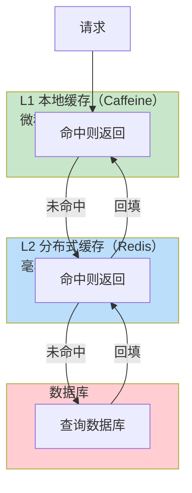
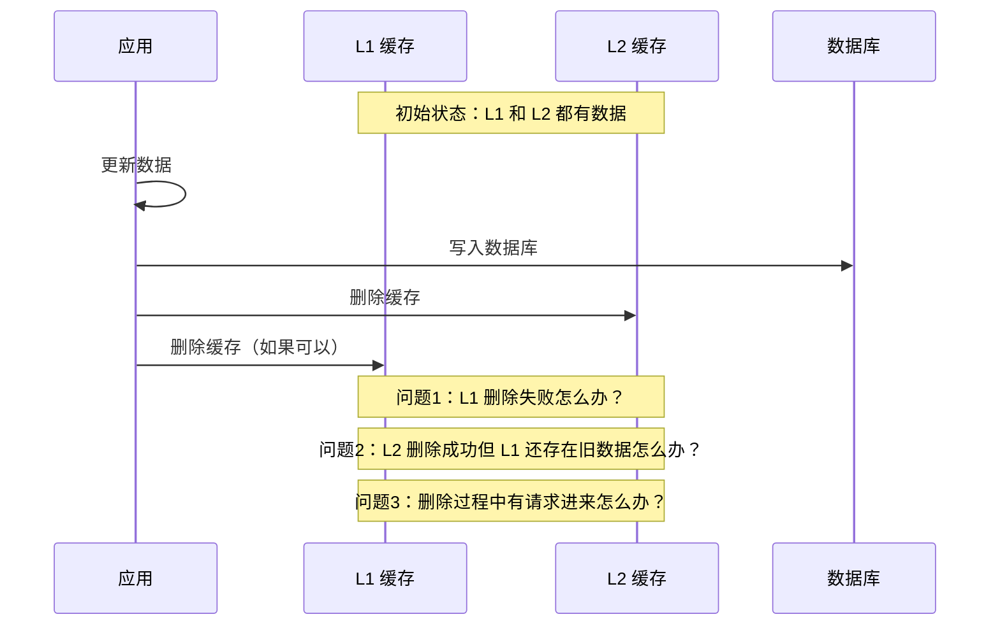

# 多级缓存架构

单级缓存（只有本地缓存或只有分布式缓存）往往难以同时满足「低延迟」和「高吞吐」的需求。本节介绍**多级缓存架构**，通过组合本地缓存和分布式缓存，兼顾两者优势。

## L1 本地缓存 + L2 分布式缓存

多级缓存的核心思想是**分层**：热点数据缓存在本地，命中率高的请求在本地层就被处理，无需访问分布式缓存。



### 访问流程

```java
public String getProductDetail(Long productId) {
    String cacheKey = "product:detail:" + productId;

    // L1：查询本地缓存（Caffeine）
    String result = l1Cache.getIfPresent(cacheKey);
    if (result != null) {
        return result;
    }

    // L1 未命中，查询 L2 分布式缓存（Redis）
    result = redisTemplate.opsForValue().get(cacheKey);
    if (result != null) {
        // 回填 L1：下次同进程请求可直接命中
        l1Cache.put(cacheKey, result);
        return result;
    }

    // L2 未命中，查询数据库
    result = loadFromDatabase(productId);

    // 回填 L2 和 L1
    redisTemplate.opsForValue().set(cacheKey, result, 10, TimeUnit.MINUTES);
    l1Cache.put(cacheKey, result);

    return result;
}
```

### 分层收益分析

假设以下场景：
- L1 命中率：30%（本地进程内的重复请求）
- L2 命中率：80%（热点数据）
- 数据库查询耗时：10ms
- Redis 查询耗时：1ms
- 本地缓存查询耗时：0.1ms

**无多级缓存**：
```
平均延迟 = 80% × 1ms + 20% × (1ms + 10ms) = 2.9ms
```

**有多级缓存**：
```
L1 命中（30%）：0.1ms
L2 命中（56%）：1ms      // 70% × 80% = 56%
L2 未命中（14%）：11ms   // 70% × 20% = 14%

平均延迟 = 30% × 0.1ms + 56% × 1ms + 14% × 11ms ≈ 2.1ms
```

延迟降低约 28%，而且更重要的是，L2 的负载降低了 30%（因为 L1 承担了 30% 的请求）。

## 多级缓存一致性挑战

多级缓存带来的最大问题是**一致性**。当数据更新时，需要同时更新多个缓存层，任何一层遗漏都可能导致数据不一致。

### 一致性问题场景



### 常见的一致性策略

#### 策略一：只删除最外层

```java
public void updateProduct(ProductDetail product) {
    // 更新数据库
    productRepository.save(product);

    // 只删除 Redis，不删除本地缓存
    // 依赖 TTL 自然过期
    redisTemplate.delete("product:detail:" + product.getId());
}
```

**优点**：实现简单，Redis 删除成功即可
**缺点**：同进程内的旧数据会保留到 TTL 过期

#### 策略二：广播失效

```java
@Service
public class ProductService {

    @Autowired
    private RedisTemplate redisTemplate;

    @Autowired
    private LocalCacheService localCacheService;

    public void updateProduct(ProductDetail product) {
        // 更新数据库
        productRepository.save(product);

        // 删除 Redis
        redisTemplate.delete("product:detail:" + product.getId());

        // 广播本地缓存失效（通过消息队列或 Redis Pub/Sub）
        localCacheService.invalidateLocal("product:detail:" + product.getId());
    }
}

// 本地缓存服务处理广播消息
@RabbitListener(queues = "cache-invalidate")
public void handleInvalidateMessage(CacheInvalidateMessage message) {
    l1Cache.invalidate(message.getKey());
}
```

**优点**：可以快速失效所有实例的本地缓存
**缺点**：实现复杂，需要消息队列或 Pub/Sub 支持

## 缓存更新策略

多级缓存的更新策略决定了数据的一致性保证程度。

### 策略一：Cache Aside（旁路缓存）

应用代码负责维护缓存，数据库和缓存分离更新。这是目前最常用的策略：

```java
// 读操作
public String get(String key) {
    String value = l1Cache.getIfPresent(key);
    if (value != null) return value;

    value = redisTemplate.opsForValue().get(key);
    if (value != null) {
        l1Cache.put(key, value);
        return value;
    }

    value = database.query(key);
    redisTemplate.opsForValue().set(key, value);
    l1Cache.put(key, value);
    return value;
}

// 写操作
public void update(String key, String value) {
    database.update(key, value);
    redisTemplate.delete(key);  // 删除缓存，不更新
    // L1 等待 TTL 自然过期
}
```

### 策略二：Read Through（读穿透）

缓存层自动负责加载数据，应用代码只与缓存交互：

```java
public class ReadThroughCache {

    private Cache<String, String> l1Cache;
    private StringRedisTemplate redisTemplate;

    public String get(String key) {
        // 尝试 L1
        String value = l1Cache.getIfPresent(key);
        if (value != null) return value;

        // 尝试 L2（Redis），L2 内部回源到数据库
        value = loadFromL2OrDatabase(key);
        l1Cache.put(key, value);
        return value;
    }

    private String loadFromL2OrDatabase(String key) {
        // 尝试 Redis
        String value = redisTemplate.opsForValue().get(key);
        if (value != null) return value;

        // Redis 没有，查询数据库
        value = database.query(key);
        redisTemplate.opsForValue().set(key, value);
        return value;
    }
}
```

### 策略三：Write Through（写穿透）

写操作同时更新缓存和数据库，缓存层对应用透明：

```java
public class WriteThroughCache {

    public void update(String key, String value) {
        // 同步更新数据库
        database.update(key, value);

        // 同步更新缓存
        redisTemplate.opsForValue().set(key, value);
        l1Cache.put(key, value);
    }
}
```

| 策略 | 一致性 | 复杂度 | 适用场景 |
| --- | --- | --- | --- |
| Cache Aside | 弱一致 | 低 | 大多数场景，允许短暂不一致 |
| Read Through | 弱一致 | 中 | 读多写少，希望简化读逻辑 |
| Write Through | 强一致 | 中 | 对一致性要求高的场景 |

## 实战案例：商品详情页多级缓存

让我们以电商商品详情页为例，完整实现一个多级缓存方案：

```java
@Service
public class ProductDetailCache {

    private static final Logger log = LoggerFactory.getLogger(ProductDetailCache.class);

    @Autowired
    private Cache<String, ProductDetailDTO> l1Cache;

    @Autowired
    private StringRedisTemplate redisTemplate;

    @Autowired
    private ProductRepository productRepository;

    private static final String L2_KEY_PREFIX = "product:detail:";
    private static final Duration L2_TTL = Duration.ofMinutes(10);

    /**
     * 获取商品详情 - 多级缓存查询
     */
    public ProductDetailDTO getProductDetail(Long productId) {
        String l2Key = L2_KEY_PREFIX + productId;

        // L1 查询（本地缓存）
        ProductDetailDTO cached = l1Cache.getIfPresent(l2Key);
        if (cached != null) {
            log.debug("L1 命中: productId={}", productId);
            return cached;
        }

        // L2 查询（Redis）
        String json = redisTemplate.opsForValue().get(l2Key);
        if (json != null) {
            ProductDetailDTO dto = JSON.parseObject(json, ProductDetailDTO.class);
            l1Cache.put(l2Key, dto);  // 回填 L1
            log.debug("L2 命中: productId={}", productId);
            return dto;
        }

        // L1/L2 都未命中，查询数据库
        ProductDetailDTO dto = loadFromDatabase(productId);
        if (dto != null) {
            // 回填 L2 和 L1
            redisTemplate.opsForValue().set(l2Key, JSON.toJSONString(dto), L2_TTL);
            l1Cache.put(l2Key, dto);
            log.debug("数据库加载: productId={}", productId);
        }

        return dto;
    }

    /**
     * 更新商品详情 - 清除缓存
     */
    public void updateProductDetail(ProductDetailDTO dto) {
        String l2Key = L2_KEY_PREFIX + dto.getId();

        // 更新数据库
        productRepository.save(dto);

        // 删除 L2（Redis）
        redisTemplate.delete(l2Key);

        // L1 依赖 TTL 自然过期，或通过广播失效
        log.info("商品更新，缓存已清除: productId={}", dto.getId());
    }

    /**
     * 批量预热 - 大促前使用
     */
    public void preloadHotProducts(List<Long> productIds) {
        for (Long productId : productIds) {
            // 逐个加载，触发缓存回填
            getProductDetail(productId);
        }
        log.info("批量预热完成: {} 个商品", productIds);
    }

    private ProductDetailDTO loadFromDatabase(Long productId) {
        return productRepository.findById(productId)
            .map(entity -> ProductDetailDTO.fromEntity(entity))
            .orElse(null);
    }
}
```

```java
@Configuration
public class CacheConfig {

    @Bean
    public Cache<String, ProductDetailDTO> l1Cache() {
        return Caffeine.newBuilder()
            .maximumSize(10_000)                    // 最多 1 万个商品
            .expireAfterWrite(1, TimeUnit.MINUTES)  // 写入 1 分钟后过期
            .recordStats()                          // 开启统计
            .build();
    }
}
```

### 缓存配置参考

| 缓存层 | 容量 | TTL | 特点 |
| --- | --- | --- | --- |
| L1 本地缓存 | 1 万条 | 1 分钟 | 吸收高频访问，低延迟 |
| L2 Redis 缓存 | 无限制（受集群容量限制） | 10 分钟 | 跨进程共享，容量大 |

## 总结

多级缓存通过分层设计，可以显著提升缓存收益：
- **L1 本地缓存**：吸收高频访问，降低 L2 负载
- **L2 分布式缓存**：跨进程共享，保证大容量

但多级缓存也带来了一致性挑战：
- **只删除最外层**：简单但可能有短暂不一致
- **广播失效**：快速但实现复杂
- **TTL 自然过期**：简单但可能有较长时间的旧数据

下一节我们将深入讲解缓存穿透问题及其解决方案——布隆过滤器。
