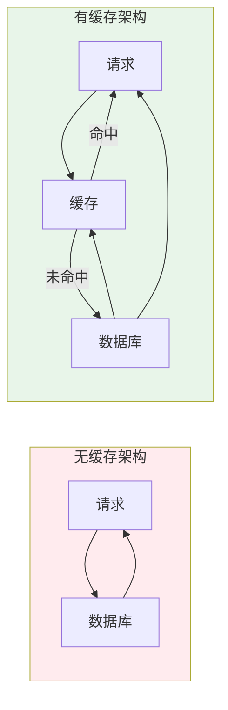
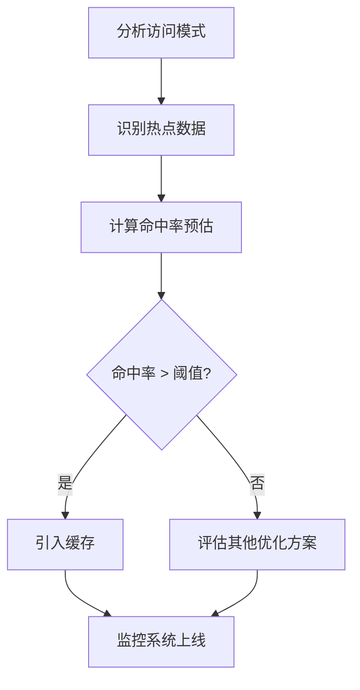

# 缓存系统概述与收益分析

凌晨 2 点，发布刚结束，数据库连接池突然被打满，接口开始大量超时。你第一反应是数据库慢了，但打开监控一看——数据库 CPU 使用率正常，磁盘 I/O 也没有异常。问题到底在哪？

翻了半天日志才发现：缓存集群刚刚经历了一次短暂的网络抖动，所有缓存数据在短时间内集中失效。而业务代码里，虽然加了缓存，但缓存过期策略设置得过于简单——大量 key 设置了相同的过期时间。结果是缓存失效的瞬间，所有请求都穿透到了数据库。

**缓存是性能优化的利器，但如果用不好，它也是生产事故的高发区。** 本节从缓存的本质出发，讲述如何正确评估缓存的收益，以及如何判断一个场景是否适合使用缓存。

## 缓存的本质：用空间换时间

缓存在计算机科学中无处不在——CPU 有 L1/L2/L3 缓存，操作系统有文件缓存，浏览器有静态资源缓存，数据库有查询缓存。它们的共同逻辑是：**将访问频率高的数据临时存储在高速存储介质中，减少对低速存储的访问。**

从时间复杂度的角度看，这是一个经典的 trade-off：

- **时间换空间**：压缩数据（如 ZIP 压缩），占用更少空间但解压缩需要时间
- **空间换时间**：缓存热点数据，减少重复计算和 IO 消耗



缓存的本质是**临时存储**，不是永久存储。这意味着缓存一定有容量限制，必须有淘汰策略，也意味着缓存数据可能与源数据不一致。

## 缓存命中率分析

缓存的核心指标是**命中率**（Hit Rate），定义为命中次数与总请求次数的比值：

```
命中率 = 命中次数 / 总请求次数
```

| 指标 | 计算公式 | 说明 |
| --- | --- | --- |
| 命中率 | `命中次数 / 总请求次数` | 越高越好，1.0 为完美状态 |
| 未命中率 | `未命中次数 / 总请求次数` | 未命中时需要回源 |
| 命中延迟 | 缓存读取耗时 | 通常在微秒级 |
| 未命中延迟 | 缓存查询 + 数据库查询耗时 | 通常在毫秒级 |

影响命中率的三个因素：

1. **缓存容量**：容量越大，能缓存的数据越多，命中率越高。但容量越大，成本也越高。
2. **数据访问模式**：热点集中度高（80/20 法则），缓存效果就好；访问分散（如 UUID 查询），缓存效果差。
3. **缓存过期策略**：过期时间太长，数据可能已失效但还在缓存中；过期时间太短，缓存频繁失效。

### 80/20 法则与缓存

业界有一个经验法则：**20% 的数据承担了 80% 的访问量**。这就是著名的帕累托法则（也叫二八定律）在缓存领域的体现。

举例来说，一个商品列表页面，总共 10 万个商品，但 80% 的用户只访问销量排名前 1000 的商品。如果缓存这 1000 个商品的详细信息，即使只占总容量的 1%，命中率也可能达到 80% 以上。

这个法则告诉我们：**缓存不需要覆盖所有数据，只需要覆盖热点数据。** 找到那 20% 的热点，是缓存设计的第一步。

## 缓存收益量化

缓存的收益主要体现在两个维度：**延迟降低**和**吞吐量提升**。

### 延迟降低

假设以下场景：
- 缓存命中时延迟：0.5ms
- 数据库查询延迟：10ms
- 命中率：80%

平均延迟计算：

```
平均延迟 = 命中率 × 缓存延迟 + (1 - 命中率) × (缓存延迟 + 数据库延迟)
         = 0.8 × 0.5ms + 0.2 × (0.5ms + 10ms)
         = 0.4ms + 2.1ms
         = 2.5ms
```

相比纯数据库查询的 10ms，延迟降低了 75%。

### 吞吐量提升

假设数据库 QPS 上限为 5000：

- 无缓存：最大 QPS = 5000
- 有缓存，命中率 80%：数据库实际负载 = 5000 × (1 - 0.8) = 1000 QPS

数据库负载降低了 80%，意味着在同样的数据库配置下，系统可以支撑更高的整体 QPS。

| 命中率 | 数据库负载降低 | 可支撑 QPS 提升 |
| --- | --- | --- |
| 50% | 50% | 2 倍 |
| 80% | 80% | 5 倍 |
| 90% | 90% | 10 倍 |
| 95% | 95% | 20 倍 |

可以看到，命中率每提升一点，收益都是指数级的。但命中率从 80% 提升到 90% 往往比从 0% 提升到 80% 更难。

### 收益递减规律

缓存收益存在明显的**边际递减效应**：

- 命中率 0% → 60%：数据库负载降低 60%，效果显著
- 命中率 60% → 80%：数据库负载再降低 20%，效果明显
- 命中率 80% → 95%：数据库负载再降低 15%，收益逐渐降低
- 命中率 95% → 99%：数据库负载再降低 4%，边际收益极低

这也解释了为什么很多系统在命中率超过 90% 后，不再花大力气继续优化缓存，而是转向其他优化方向。

## 缓存适用场景

不是所有场景都适合用缓存。以下是判断是否应该使用缓存的几个维度：

### 适合缓存的场景

| 场景特征 | 说明 | 典型例子 |
| --- | --- | --- |
| 读多写少 | 数据变化频率低，缓存过期时间可设长 | 商品详情、用户信息、配置数据 |
| 热点集中 | 20% 数据承担 80% 访问 | 热搜商品、热门文章、明星动态 |
| 延迟敏感 | 对响应时间有严格要求 | 首页加载、搜索建议、下拉列表 |
| 负载瓶颈 | 数据库是系统瓶颈 | 大促秒杀、实时排行、社交 Feed |

### 不适合缓存的场景

| 场景特征 | 说明 | 典型例子 |
| --- | --- | --- |
| 写多读少 | 缓存频繁失效，命中率极低 | 日志写入、实时统计、消息队列 |
| 数据分散 | 访问模式无热点 | UUID 主键查询、随机分页 |
| 一致性要求高 | 缓存延迟不可接受 | 金融交易、库存扣减、订单状态 |
| 数据量小 | 缓存收益不明显 | 配置表、低流量接口 |

### 一致性要求与缓存的矛盾

很多人容易忽略的一个问题是：**缓存和强一致性是矛盾的。**

当你在缓存中存储一份数据，在数据库中存储另一份数据，就存在数据不一致的可能。无论你用什么策略（先删缓存还是先更新），都无法做到完美的强一致性。

这不是缓存的 bug，而是它的本质特征。缓存天生就是**牺牲一定一致性换取性能的方案**。

所以，如果业务对数据一致性有严格要求（如金融账户余额），应该仔细评估是否真的需要缓存。如果需要，应该选择合适的一致性策略，并在代码中明确处理不一致的情况。

## 如何评估缓存收益

在引入缓存之前，建议按以下步骤评估收益：

1. **分析访问模式**：通过日志或 APM 工具，统计每个接口的 QPS 和访问分布
2. **识别热点数据**：找到访问频率最高的那部分数据
3. **计算命中率预估**：根据数据访问分布，预估缓存命中率
4. **评估延迟收益**：计算引入缓存后的平均延迟改善
5. **评估吞吐量收益**：计算数据库负载降低比例和系统可支撑 QPS



通常建议命中率预估低于 50% 时，引入缓存的收益有限，可以考虑其他优化方案（如数据库索引优化、读写分离等）。

## 总结

缓存的本质是用空间换时间，通过存储热点数据减少对慢速存储的访问。缓存的核心指标是命中率，命中率越高，收益越大。但缓存收益存在边际递减效应，90% 以上的命中率往往需要精心设计。

判断一个场景是否适合缓存，主要看三点：**读多写少、热点集中、一致性要求可妥协**。如果一致性要求极高（如金融交易），应该优先考虑其他方案。

下一节我们将介绍本地缓存的具体实现——Caffeine 和 Guava Cache。
