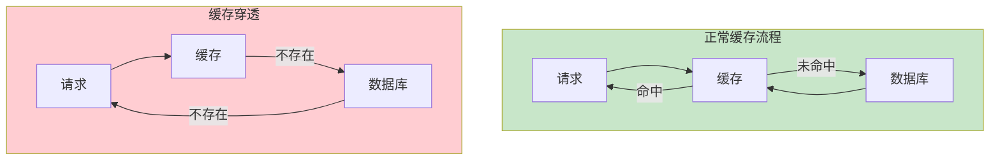
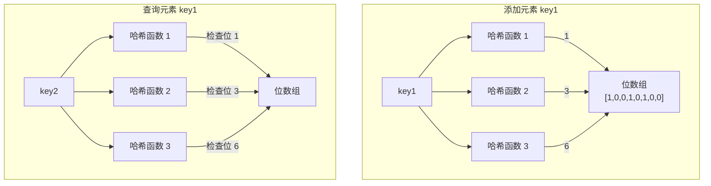

# 缓存穿透详解与解决方案

缓存穿透是缓存领域的三大经典问题之一。它不是缓存本身出了问题，而是**业务逻辑漏洞**被放大后的结果。本节深入讲解穿透问题的成因，以及如何用布隆过滤器和空值缓存来防御。

## 穿透定义：查询不存在的数据

缓存穿透的本质是：**大量请求查询数据库中不存在的数据，每次查询都无法命中缓存，导致请求全部打到数据库。**



### 穿透的典型场景

**场景一：恶意攻击**

攻击者使用大量不存在的 ID 发起请求，例如：
- 爬虫使用自增 ID 遍历商品列表
- 攻击者故意构造不存在的用户 ID 尝试获取敏感信息
- 刷接口调用，消耗服务器资源

这些请求看起来「正常」，但数据库中根本不存在对应数据，缓存无法存储（因为根本没有数据），导致每次请求都穿透到数据库。

**场景二：业务漏洞**

正常用户也可能触发穿透：
- 商品下架后，URL 仍然可访问
- 用户输入了数据库中不存在的查询条件
- 数据被删除但缓存未被清理

**场景三：系统 bug**

代码逻辑错误也可能导致穿透：
- 缓存 key 设计错误，导致每次都是不同的 key
- 序列化/反序列化问题，导致缓存无法命中
- 分页查询参数处理错误

## 穿透的危害

穿透的危害不是「一次请求」，而是**持续的、高并发的无效请求**：

| 指标 | 正常情况 | 穿透情况 |
| --- | --- | --- |
| 缓存命中率 | 90%+ | 0% |
| 数据库 QPS | 100 | 10000+ |
| 响应时间 | 5ms | 500ms+ |
| 数据库 CPU | 10% | 100% |

一个每秒 1000 QPS 的接口，如果被恶意攻击者使用 10000 个不存在的 ID 发起请求，数据库会收到每秒 10000 次查询，最终可能导致数据库宕机。

## 布隆过滤器拦截

布隆过滤器（Bloom Filter）是解决缓存穿透的经典方案。它的核心思想是：**用空间换时间，快速判断一个值「一定不存在」或「可能存在」。**

### 布隆过滤器原理

布隆过滤器使用一个位数组和多个哈希函数：



**关键特性**：
- **一定不存在**：如果布隆过滤器说「不存在」，则数据**一定不存在**
- **可能存在**：如果布隆过滤器说「存在」，则数据**可能存在**（存在误判）

这意味着布隆过滤器可以作为「前置过滤器」：请求进来后，先问布隆过滤器，如果说不存在，直接返回「数据不存在」，不查缓存也不查数据库。

### 误判率计算

布隆过滤器的误判率由以下公式决定：

```
fpr = (1 - e^(-kn/m))^k

其中：
- fpr：误判率（false positive rate）
- k：哈希函数数量
- n：已添加的元素数量
- m：位数组长度
```

经验公式：当 `m/n ≈ 10`（每位存储约 10 个元素），使用 7 个哈希函数时，误判率最低，约为 `0.0081`（0.81%）。

| m/n（每位存储元素数） | 最优哈希数 k | 误判率 fpr |
| --- | --- | --- |
| 5 | 5 | ~3% |
| 10 | 7 | ~0.8% |
| 20 | 14 | ~0.0001% |

### Guava BloomFilter 实现

```java
import com.google.common.hash.BloomFilter;
import com.google.common.hash.Funnels;

public class BloomFilterExample {

    // 创建布隆过滤器：预计 100 万个元素，误判率 1%
    private static final BloomFilter<Long> bloomFilter = BloomFilter.create(
        Funnels.longFunnel(),
        1_000_000,    // 预计元素数量
        0.01          // 误判率
    );

    /**
     * 初始化：添加所有合法 ID 到布隆过滤器
     */
    public void initBloomFilter(List<Long> validProductIds) {
        for (Long id : validProductIds) {
            bloomFilter.put(id);
        }
    }

    /**
     * 查询前先检查布隆过滤器
     */
    public Product getProduct(Long productId) {
        // 布隆过滤器说不存在，直接返回 null（不查缓存和数据库）
        if (!bloomFilter.mightContain(productId)) {
            return null;
        }

        // 布隆过滤器说可能存在，继续查缓存
        return getProductFromCache(productId);
    }
}
```

### Redis BloomFilter 实现

对于分布式场景，可以使用 Redis 的布隆过滤器模块（RedisBloom）：

```java
@Service
public class RedisBloomFilterService {

    @Autowired
    private StringRedisTemplate redisTemplate;

    private static final String BLOOM_KEY = "bloom:product:ids";

    /**
     * 添加元素到布隆过滤器
     */
    public void add(Long id) {
        redisTemplate.opsForValue().setBit(BLOOM_KEY, id % 100_000_000, true);
        // 实际应该使用 RedisBloom 模块的 BF.ADD 命令
        // redisTemplate.execute(new RedisCallback<Void>() {
        //     @Override
        //     public Void doInRedis(RedisConnection connection) throws DataAccessException {
        //         connection.commands().bloomFilterCommands().bfAdd(BLOOM_KEY.getBytes(), String.valueOf(id).getBytes());
        //         return null;
        //     }
        // });
    }

    /**
     * 检查元素是否存在
     */
    public boolean mightContain(Long id) {
        // 实际应该使用 RedisBloom 模块的 BF.EXISTS 命令
        // return redisTemplate.hasKey(BLOOM_KEY + ":" + (id % 1000));
        return true;
    }
}
```

## 空值缓存

空值缓存是另一种解决穿透的方案，核心思想是：**如果数据库中没有这条数据，也在缓存中存储一个「空值」标记。**

### 实现方式

```java
public String getProductDetail(Long productId) {
    String cacheKey = "product:detail:" + productId;

    // 1. 查询缓存
    String cached = redisTemplate.opsForValue().get(cacheKey);
    if (cached != null) {
        // 2. 判断是空值还是真实数据
        if (cached.equals("NULL")) {
            return null;  // 之前查询过，数据库中不存在
        }
        return cached;
    }

    // 3. 缓存不存在，查询数据库
    String result = productRepository.findById(productId).orElse(null);

    // 4. 写入缓存（即使是 null 也缓存）
    if (result != null) {
        redisTemplate.opsForValue().set(cacheKey, JSON.toJSONString(result), 10, TimeUnit.MINUTES);
    } else {
        // 空值缓存：设置较短的过期时间
        redisTemplate.opsForValue().set(cacheKey, "NULL", 1, TimeUnit.MINUTES);
    }

    return result;
}
```

### 空值缓存的配置

| 配置项 | 推荐值 | 说明 |
| --- | --- | --- |
| 空值过期时间 | 1~5 分钟 | 不宜过长，否则数据恢复后仍返回空 |
| 空值标记 | 固定字符串 | 使用 "NULL" 或固定 JSON 对象 |

### 空值缓存的缺点

空值缓存有一个潜在问题：**如果大量不存在的 key 被缓存，会占用大量内存。**

举例：攻击者使用 100 万个不存在的 ID 发起请求，如果每个都缓存 1 分钟，就需要 100 万个缓存条目。

解决方案：
- 空值过期时间设置较短
- 配合布隆过滤器，在入口拦截
- 监控空值缓存的比例，异常时报警

## 方案对比与选择

| 方案 | 原理 | 优点 | 缺点 | 适用场景 |
| --- | --- | --- | --- | --- |
| 布隆过滤器 | 用空间换时间，快速判断不存在 | 内存占用小，查询极快 | 有误判率，只能判断「可能存在」 | 数据相对稳定，ID 可枚举 |
| 空值缓存 | 缓存空值，避免重复查库 | 实现简单，能缓存「不存在」 | 占用内存，无法区分真正的空 | 穿透量不大，不存在数据有限 |
| 两者结合 | 布隆过滤 + 空值缓存 | 最完善的防护 | 实现复杂 | 生产环境推荐 |

### 生产环境推荐方案：布隆过滤 + 空值缓存

```java
public String getProductDetail(Long productId) {
    // 第一层：布隆过滤器
    if (!bloomFilter.mightContain(productId)) {
        return null;  // 一定不存在，直接返回
    }

    // 第二层：查缓存
    String cached = redisTemplate.opsForValue().get(cacheKey);
    if (cached != null) {
        if (cached.equals("NULL")) return null;
        return cached;
    }

    // 第三层：查数据库
    String result = loadFromDatabase(productId);

    // 第四层：回填缓存
    if (result != null) {
        redisTemplate.opsForValue().set(cacheKey, JSON.toJSONString(result), 10, TimeUnit.MINUTES);
    } else {
        // 空值缓存，过期时间短
        redisTemplate.opsForValue().set(cacheKey, "NULL", 1, TimeUnit.MINUTES);
    }

    return result;
}
```

## 总结

缓存穿透的本质是「查询不存在的数据导致缓存失效，请求全部打到数据库」。恶意攻击或业务漏洞都可能触发穿透。

解决穿透的两个核心方案：
- **布隆过滤器**：用空间换时间，快速判断「一定不存在」
- **空值缓存**：缓存空值，避免重复查库

生产环境推荐两者结合：布隆过滤器在入口拦截无效请求，空值缓存处理边缘情况。

下一节我们将讲解另一个经典问题——缓存击穿：热点 key 过期瞬间的流量风暴。
