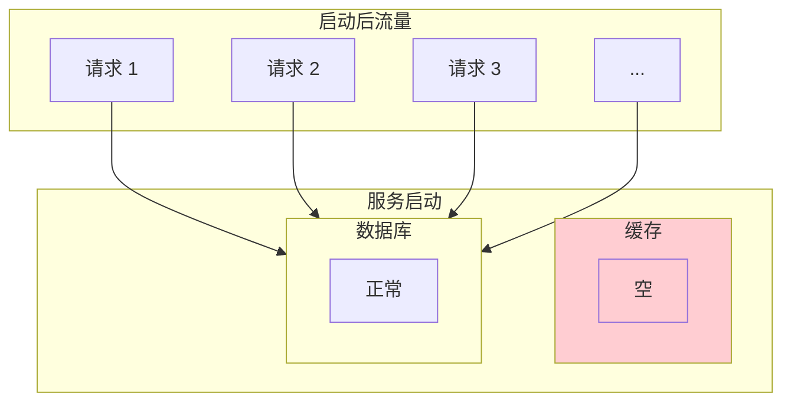

# 缓存预热与缓存刷新

服务刚启动时，缓存是空的，所有的请求都会穿透到数据库，这就是**冷启动问题**。如果热点数据没有预加载到缓存，服务启动后的第一波请求可能会把数据库打爆。本节讲解如何通过缓存预热和缓存刷新来解决冷启动问题。

## 缓存冷启动问题

### 问题描述



**冷启动问题**：
1. 缓存为空，数据库承担全部流量
2. 如果热点数据量大，数据库可能被打爆
3. 预热期间服务质量下降

### 问题影响

| 场景 | 影响 |
| --- | --- |
| 应用重启 | 预热期间大量 cache miss |
| 弹性扩缩容 | 新实例启动时性能下降 |
| 缓存失效 | 缓存过期后的大量穿透 |
| 大促开始 | 瞬间流量涌入，缓存未就绪 |

## 缓存预热策略

缓存预热的核心是**在服务正式对外提供服务前，将热点数据加载到缓存**。

### 策略一：启动时预热

```java
@Component
public class CacheWarmupRunner implements ApplicationRunner {

    private static final Logger log = LoggerFactory.getLogger(CacheWarmupRunner.class);

    @Autowired
    private StringRedisTemplate redisTemplate;

    @Autowired
    private ProductRepository productRepository;

    @Autowired
    private Cache<String, ProductDetail> l1Cache;

    @Override
    public void run(ApplicationArguments args) {
        log.info("开始缓存预热...");

        // 预热热门商品（Top 1000）
        List<Long> hotProductIds = productRepository.findHotProductIds(1000);
        warmupProducts(hotProductIds);

        // 预热热门分类
        List<Long> hotCategoryIds = productRepository.findHotCategoryIds(100);
        warmupCategories(hotCategoryIds);

        log.info("缓存预热完成，共预热 {} 个商品", hotProductIds.size());
    }

    private void warmupProducts(List<Long> productIds) {
        for (Long productId : productIds) {
            try {
                String cacheKey = "product:detail:" + productId;
                Product product = productRepository.findById(productId).orElse(null);

                if (product != null) {
                    ProductDetail detail = ProductDetail.fromEntity(product);
                    redisTemplate.opsForValue().set(cacheKey, JSON.toJSONString(detail), Duration.ofHours(2));
                }
            } catch (Exception e) {
                log.warn("预热商品失败: productId={}", productId, e);
            }
        }
    }
}
```

### 策略二：懒加载 + 异步预热

不阻塞启动，但启动后立即开始异步预热：

```java
@Service
public class AsyncWarmupService {

    private static final Logger log = LoggerFactory.getLogger(AsyncWarmupService.class);

    @Autowired
    private StringRedisTemplate redisTemplate;

    @Autowired
    private ProductRepository productRepository;

    private volatile boolean warmupComplete = false;

    @PostConstruct
    public void startAsyncWarmup() {
        CompletableFuture.runAsync(() -> {
            log.info("开始异步缓存预热...");
            warmupComplete = false;

            // 分批预热，避免对数据库造成压力
            int batchSize = 100;
            int offset = 0;

            while (true) {
                List<Long> batchIds = productRepository.findHotProductIds(batchSize, offset);
                if (batchIds.isEmpty()) {
                    break;
                }

                for (Long productId : batchIds) {
                    try {
                        warmupProduct(productId);
                    } catch (Exception e) {
                        log.warn("预热失败: productId={}", productId);
                    }
                }

                offset += batchSize;
                log.info("预热进度: {}/total", offset);

                // 每批间隔 100ms，避免瞬时压力过大
                try {
                    Thread.sleep(100);
                } catch (InterruptedException e) {
                    Thread.currentThread().interrupt();
                    break;
                }
            }

            warmupComplete = true;
            log.info("异步缓存预热完成");
        });
    }

    private void warmupProduct(Long productId) {
        String cacheKey = "product:detail:" + productId;

        // 避免覆盖已有缓存
        if (Boolean.TRUE.equals(redisTemplate.hasKey(cacheKey))) {
            return;
        }

        Product product = productRepository.findById(productId).orElse(null);
        if (product != null) {
            ProductDetail detail = ProductDetail.fromEntity(product);
            redisTemplate.opsForValue().set(cacheKey, JSON.toJSONString(detail), Duration.ofHours(2));
        }
    }
}
```

### 策略三：热点数据探测 + 实时预热

通过监控实时探测热点数据，动态预热：

```java
@Service
public class HotDataDetector {

    private static final Logger log = LoggerFactory.getLogger(HotDataDetector.class);

    @Autowired
    private StringRedisTemplate redisTemplate;

    @Autowired
    private ProductRepository productRepository;

    // 使用 Redis Sorted Set 统计访问频率
    private static final String HOT_KEY_PREFIX = "hot:product:access:";

    /**
     * 记录访问：每次访问时调用
     */
    public void recordAccess(Long productId) {
        String todayKey = HOT_KEY_PREFIX + LocalDate.now();
        redisTemplate.opsForZSet().incrementScore(todayKey, String.valueOf(productId), 1);
    }

    /**
     * 获取热点数据
     */
    public List<Long> getHotProductIds(int topN) {
        String todayKey = HOT_KEY_PREFIX + LocalDate.now();
        Set<ZSetOperations.TypedTuple<String>> hotData = redisTemplate.opsForZSet()
            .reverseRangeWithScores(todayKey, 0, topN - 1);

        if (hotData == null) {
            return Collections.emptyList();
        }

        return hotData.stream()
            .map(tuple -> Long.parseLong(tuple.getValue()))
            .collect(Collectors.toList());
    }

    /**
     * 热点探测 + 预热任务（定时执行）
     */
    @Scheduled(fixedRate = 60000)  // 每分钟执行
    public void detectAndWarmup() {
        // 获取过去 5 分钟的热点数据
        LocalDateTime fiveMinutesAgo = LocalDateTime.now().minusMinutes(5);
        String key = HOT_KEY_PREFIX + fiveMinutesAgo.toLocalDate();

        Set<ZSetOperations.TypedTuple<String>> recentHot = redisTemplate.opsForZSet()
            .reverseRangeWithScores(key, 0, 99);

        if (recentHot == null || recentHot.isEmpty()) {
            return;
        }

        log.info("探测到 {} 个热点数据，开始预热", recentHot.size());

        for (ZSetOperations.TypedTuple<String> tuple : recentHot) {
            Long productId = Long.parseLong(tuple.getValue());
            Double score = tuple.getScore();

            // 只预热访问次数超过阈值的数据
            if (score != null && score > 100) {
                warmupProduct(productId);
            }
        }
    }
}
```

## 缓存刷新策略

缓存刷新是**主动更新缓存**，避免缓存过期导致的服务质量下降。

### 策略一：定时刷新

```java
@Service
public class CacheRefreshService {

    private static final Logger log = LoggerFactory.getLogger(CacheRefreshService.class);

    @Autowired
    private StringRedisTemplate redisTemplate;

    @Autowired
    private ProductRepository productRepository;

    private static final Duration CACHE_TTL = Duration.ofMinutes(10);

    /**
     * 定时刷新热点商品缓存
     */
    @Scheduled(cron = "0 */5 * * * *")  // 每 5 分钟执行
    public void refreshHotProducts() {
        log.info("开始刷新热点商品缓存...");

        // 获取热点商品列表
        List<Long> hotProductIds = productRepository.findHotProductIds(1000);

        for (Long productId : hotProductIds) {
            try {
                refreshProductCache(productId);
            } catch (Exception e) {
                log.warn("刷新缓存失败: productId={}", productId, e);
            }
        }

        log.info("热点商品缓存刷新完成，共刷新 {} 个", hotProductIds.size());
    }

    private void refreshProductCache(Long productId) {
        String cacheKey = "product:detail:" + productId;

        Product product = productRepository.findById(productId).orElse(null);
        if (product == null) {
            // 商品已删除，删除缓存
            redisTemplate.delete(cacheKey);
            return;
        }

        ProductDetail detail = ProductDetail.fromEntity(product);
        redisTemplate.opsForValue().set(cacheKey, JSON.toJSONString(detail), CACHE_TTL);
    }
}
```

### 策略二：异步刷新

不阻塞请求，但请求触发异步刷新：

```java
@Service
public class AsyncRefreshService {

    @Autowired
    private StringRedisTemplate redisTemplate;

    @Autowired
    private ProductRepository productRepository;

    @Autowired
    private ThreadPoolTaskExecutor refreshExecutor;

    public ProductDetail getProduct(Long productId) {
        String cacheKey = "product:detail:" + productId;

        // 1. 查缓存
        String cached = redisTemplate.opsForValue().get(cacheKey);
        if (cached != null) {
            // 异步刷新，不阻塞返回
            refreshAsync(productId);
            return JSON.parseObject(cached, ProductDetail.class);
        }

        // 2. 缓存未命中，同步加载
        return loadAndCache(productId);
    }

    private void refreshAsync(Long productId) {
        refreshExecutor.execute(() -> {
            try {
                String cacheKey = "product:detail:" + productId;
                Product product = productRepository.findById(productId).orElse(null);
                if (product != null) {
                    ProductDetail detail = ProductDetail.fromEntity(product);
                    redisTemplate.opsForValue().set(cacheKey, JSON.toJSONString(detail), Duration.ofMinutes(10));
                }
            } catch (Exception e) {
                // 忽略刷新失败
            }
        });
    }

    private ProductDetail loadAndCache(Long productId) {
        Product product = productRepository.findById(productId).orElse(null);
        if (product == null) {
            return null;
        }

        ProductDetail detail = ProductDetail.fromEntity(product);
        redisTemplate.opsForValue().set("product:detail:" + productId, JSON.toJSONString(detail), Duration.ofMinutes(10));
        return detail;
    }
}
```

### 策略三：分级刷新

根据数据热度设置不同的刷新频率：

```java
@Service
public class TieredRefreshService {

    @Autowired
    private StringRedisTemplate redisTemplate;

    @Autowired
    private ProductRepository productRepository;

    /**
     * 分级刷新策略
     */
    @Scheduled(fixedRate = 60000)  // 每分钟执行
    public void tieredRefresh() {
        // S 级：超级热点，每 30 秒刷新
        refreshProducts(productRepository.findSuperHotProductIds(100), Duration.ofSeconds(30));

        // A 级：热点，每 1 分钟刷新
        refreshProducts(productRepository.findHotProductIds(1000), Duration.ofMinutes(1));

        // B 级：普通，每 5 分钟刷新
        refreshProducts(productRepository.findNormalProductIds(10000), Duration.ofMinutes(5));
    }

    private void refreshProducts(List<Long> productIds, Duration ttl) {
        for (Long productId : productIds) {
            try {
                Product product = productRepository.findById(productId).orElse(null);
                if (product != null) {
                    String cacheKey = "product:detail:" + productId;
                    ProductDetail detail = ProductDetail.fromEntity(product);
                    redisTemplate.opsForValue().set(cacheKey, JSON.toJSONString(detail), ttl);
                }
            } catch (Exception e) {
                // 忽略单个失败
            }
        }
    }
}
```

## 预热策略选择

| 策略 | 适用场景 | 优点 | 缺点 |
| --- | --- | --- | --- |
| 启动时预热 | 常规启动 | 简单，预热彻底 | 阻塞启动 |
| 懒加载 + 异步 | 应用重启 | 不阻塞启动 | 初期可能有 cache miss |
| 热点探测 | 热点不固定 | 动态适应 | 实现复杂 |
| 定时刷新 | 数据有生命周期 | 主动更新 | 可能有刷新空窗期 |
| 异步刷新 | 高并发读 | 性能好 | 可能返回稍旧的数据 |
| 分级刷新 | 热点差异大 | 资源分配合理 | 实现复杂 |

## 生产环境最佳实践

### 大促预热方案

```java
@Service
public class BigSaleWarmupService {

    private static final Logger log = LoggerFactory.getLogger(BigSaleWarmupService.class);

    @Autowired
    private StringRedisTemplate redisTemplate;

    @Autowired
    private ProductRepository productRepository;

    /**
     * 大促前预热：分批、限速、监控
     */
    public void bigSaleWarmup(List<Long> productIds) {
        log.info("大促预热开始，共 {} 个商品", productIds.size());

        int total = productIds.size();
        int batchSize = 50;
        int successCount = 0;
        int failCount = 0;

        for (int i = 0; i < total; i += batchSize) {
            int end = Math.min(i + batchSize, total);
            List<Long> batch = productIds.subList(i, end);

            for (Long productId : batch) {
                try {
                    warmupSingle(productId);
                    successCount++;
                } catch (Exception e) {
                    failCount++;
                    log.warn("预热失败: productId={}", productId);
                }
            }

            // 每批间隔 200ms
            try {
                Thread.sleep(200);
            } catch (InterruptedException e) {
                Thread.currentThread().interrupt();
                break;
            }

            // 打印进度
            log.info("预热进度: {}/{} ({:.1f}%)", i + batchSize, total, (i + batchSize) * 100.0 / total);
        }

        log.info("大促预热完成，成功: {}，失败: {}", successCount, failCount);
    }

    private void warmupSingle(Long productId) {
        Product product = productRepository.findById(productId).orElse(null);
        if (product == null) {
            return;
        }

        // 写入 Redis，设置较长 TTL
        String cacheKey = "product:detail:" + productId;
        ProductDetail detail = ProductDetail.fromEntity(product);
        redisTemplate.opsForValue().set(cacheKey, JSON.toJSONString(detail), Duration.ofHours(12));

        // 写入本地缓存
        localCache.put(cacheKey, detail);
    }
}
```

## 总结

缓存预热和刷新是保证服务质量的重要手段：

**预热策略**：
- 启动时预热：简单直接，但阻塞启动
- 懒加载 + 异步：推荐，不阻塞启动
- 热点探测：适应动态热点，但实现复杂

**刷新策略**：
- 定时刷新：简单，适用于数据有固定生命周期
- 异步刷新：性能好，不阻塞请求
- 分级刷新：资源分配合理

生产环境推荐组合使用：启动时预热 + 异步刷新 + 定时刷新，可以应对大多数场景。

下一节我们将讲解缓存监控与指标——如何通过监控来发现和解决缓存问题。
