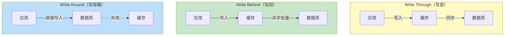
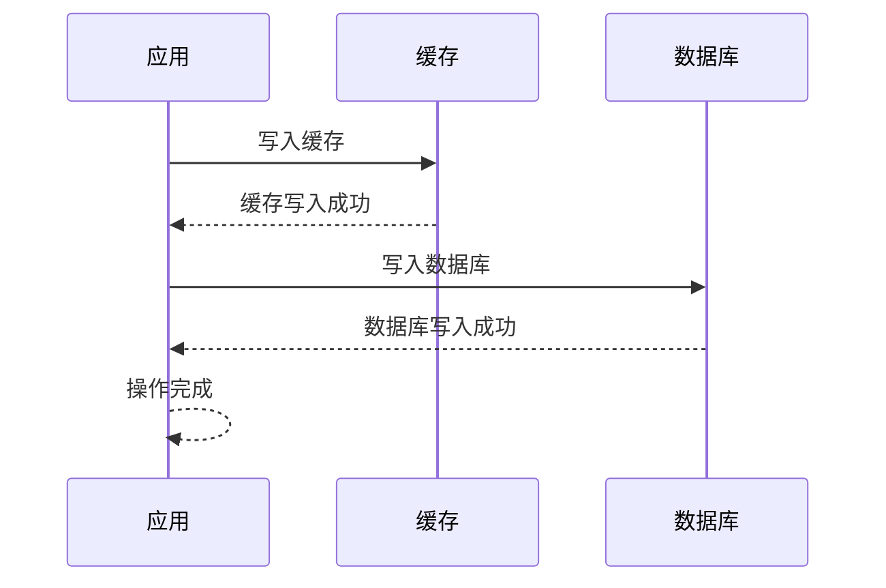
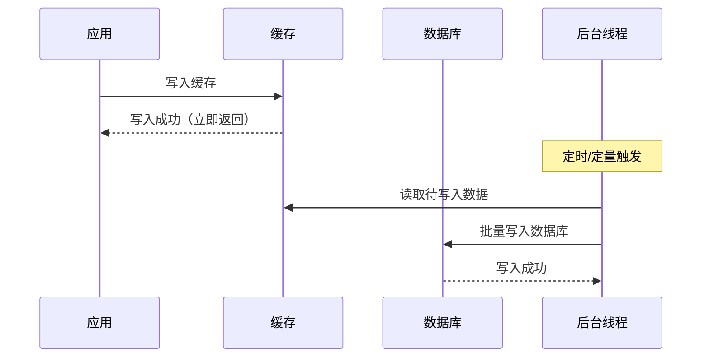
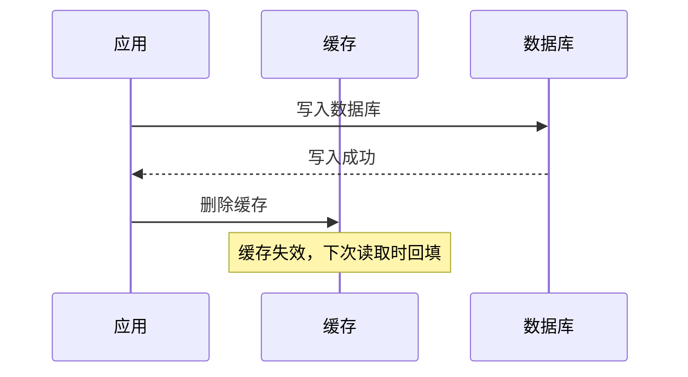

# 写穿/写回/写旁路策略

上一节我们讲了缓存一致性模式，本节聚焦在**写操作**上，详细讲解三种写策略的原理、适用场景和 trade-off。

## 三种写策略概述

| 策略 | 缓存更新时机 | 数据库更新时机 | 一致性 | 性能 |
| --- | --- | --- | --- | --- |
| Write Through（写穿） | 同步写入 | 同步写入 | 强一致 | 较低 |
| Write Behind（写回） | 同步写入 | 异步批量 | 最终一致 | 高 |
| Write Around（写旁路） | 不更新 | 同步写入 | 弱一致 | 最高 |



## Write Through（写穿）

Write Through 的核心是**同步更新**：写入数据时，同时更新缓存和数据库，只有两者都写入成功才返回。

### 流程图



### 实现

```java
@Service
public class WriteThroughService {

    @Autowired
    private StringRedisTemplate redisTemplate;

    @Autowired
    private ProductRepository productRepository;

    @Transactional
    public void updateProduct(Long productId, ProductUpdateRequest request) {
        String cacheKey = "product:" + productId;

        // 1. 先更新缓存
        Product product = productRepository.findById(productId).orElseThrow();
        product.setName(request.getName());
        product.setPrice(request.getPrice());
        redisTemplate.opsForValue().set(cacheKey, JSON.toJSONString(product));

        // 2. 再更新数据库
        productRepository.save(product);
    }
}
```

### 特点分析

| 维度 | 说明 |
| --- | --- |
| 一致性 | 强一致，缓存和数据库同步更新 |
| 延迟 | 高，需要等待两次写入完成 |
| 可靠性 | 高，任一步骤失败可回滚 |
| 适用场景 | 对一致性要求极高的场景，如金融交易 |

### Write Through 的问题

Write Through 虽然一致性高，但存在性能问题：

1. **双写延迟**：每次写入都需要写两次（缓存 + 数据库）
2. **写放大**：如果写入失败，需要回滚缓存
3. **热点写入**：高并发写入同一 key 时，可能成为瓶颈

## Write Behind（写回）

Write Behind 的核心是**异步批量写入**：写入数据时，只更新缓存，缓存层在后台定时或定量将数据批量写入数据库。

### 流程图



### 实现

```java
@Service
public class WriteBehindService {

    @Autowired
    private StringRedisTemplate redisTemplate;

    @Autowired
    private ProductRepository productRepository;

    // 写队列：存储待写入数据库的操作
    private ConcurrentLinkedQueue<WriteOperation> writeQueue = new ConcurrentLinkedQueue<>();

    @Data
    private static class WriteOperation {
        private String operation;  // "UPDATE" 或 "DELETE"
        private String cacheKey;
        private String value;
        private Long id;
    }

    /**
     * 写入操作：只写缓存，加入写队列
     */
    public void updateProduct(Long productId, ProductUpdateRequest request) {
        String cacheKey = "product:" + productId;

        // 1. 写入缓存
        Product product = new Product();
        product.setId(productId);
        product.setName(request.getName());
        product.setPrice(request.getPrice());
        redisTemplate.opsForValue().set(cacheKey, JSON.toJSONString(product));

        // 2. 加入写队列
        writeQueue.offer(new WriteOperation("UPDATE", cacheKey, JSON.toJSONString(product), productId));
    }

    /**
     * 删除操作：删除缓存，加入写队列
     */
    public void deleteProduct(Long productId) {
        String cacheKey = "product:" + productId;
        redisTemplate.delete(cacheKey);
        writeQueue.offer(new WriteOperation("DELETE", cacheKey, null, productId));
    }

    /**
     * 后台线程：批量写入数据库
     */
    @Scheduled(fixedDelay = 1000)
    public void flushToDatabase() {
        List<WriteOperation> batch = new ArrayList<>();

        // 批量取出，最多 100 条或队列非空
        WriteOperation op;
        while ((op = writeQueue.poll()) != null && batch.size() < 100) {
            batch.add(op);
        }

        if (batch.isEmpty()) {
            return;
        }

        try {
            // 按类型分组处理
            List<WriteOperation> updates = batch.stream()
                .filter(op -> "UPDATE".equals(op.getOperation()))
                .collect(Collectors.toList());
            List<WriteOperation> deletes = batch.stream()
                .filter(op -> "DELETE".equals(op.getOperation()))
                .collect(Collectors.toList());

            // 批量写入
            if (!updates.isEmpty()) {
                List<Product> products = updates.stream()
                    .map(op -> JSON.parseObject(op.getValue(), Product.class))
                    .collect(Collectors.toList());
                productRepository.saveAll(products);
            }

            if (!deletes.isEmpty()) {
                List<Long> ids = deletes.stream()
                    .map(WriteOperation::getId)
                    .collect(Collectors.toList());
                productRepository.deleteAllById(ids);
            }
        } catch (Exception e) {
            // 写入失败，重新加入队列（幂等处理）
            batch.forEach(writeQueue::offer);
            throw e;
        }
    }
}
```

### 特点分析

| 维度 | 说明 |
| --- | --- |
| 一致性 | 最终一致，可能有数据丢失 |
| 延迟 | 低，写缓存后立即返回 |
| 可靠性 | 中等，需要处理数据丢失 |
| 适用场景 | 高并发写入、对性能要求高的场景 |

### Write Behind 的风险

**数据丢失风险**：

```
T1: 应用写入缓存
T2: 缓存写入成功，数据库写入前，应用宕机
T3: 重启后，缓存中的数据丢失（内存易失）
```

**解决方案**：
1. 使用持久化缓存（如 Redis AOF）
2. 写入前先记录操作日志
3. 降低批量大小，增加写入频率

## Write Around（写旁路）

Write Around 的核心是**只写数据库，不更新缓存**：写入数据时，直接写数据库，然后删除（而非更新）缓存。

### 流程图



### 实现

```java
@Service
public class WriteAroundService {

    @Autowired
    private StringRedisTemplate redisTemplate;

    @Autowired
    private ProductRepository productRepository;

    /**
     * 写入操作：只写数据库，删除缓存
     */
    public void updateProduct(Long productId, ProductUpdateRequest request) {
        // 1. 更新数据库
        Product product = productRepository.findById(productId).orElseThrow();
        product.setName(request.getName());
        product.setPrice(request.getPrice());
        productRepository.save(product);

        // 2. 删除缓存（不是更新！）
        redisTemplate.delete("product:" + productId);
    }

    /**
     * 读取操作：Cache Aside 模式
     */
    public Product getProduct(Long productId) {
        String cacheKey = "product:" + productId;

        // 1. 查缓存
        String cached = redisTemplate.opsForValue().get(cacheKey);
        if (cached != null) {
            return JSON.parseObject(cached, Product.class);
        }

        // 2. 查数据库
        Product product = productRepository.findById(productId).orElse(null);
        if (product != null) {
            // 3. 回填缓存
            redisTemplate.opsForValue().set(cacheKey, JSON.toJSONString(product), Duration.ofMinutes(10));
        }

        return product;
    }
}
```

### 特点分析

| 维度 | 说明 |
| --- | --- |
| 一致性 | 弱一致，可能读到旧缓存 |
| 延迟 | 低，只需要写一次 |
| 复杂度 | 低，逻辑清晰 |
| 适用场景 | 大多数通用场景 |

## 三种策略对比

| 维度 | Write Through | Write Behind | Write Around |
| --- | --- | --- | --- |
| 缓存更新 | 同步 | 同步 | 不更新（删除） |
| 数据库更新 | 同步 | 异步批量 | 同步 |
| 一致性 | 强一致 | 最终一致 | 弱一致 |
| 写延迟 | 高 | 低 | 低 |
| 数据可靠性 | 高 | 中 | 高 |
| 实现复杂度 | 中 | 高 | 低 |
| 数据库负载 | 高 | 低 | 中 |
| 适用场景 | 金融交易 | 高并发写入 | 通用场景 |

## 场景选择指南

### 选择 Write Through

场景特点：
- 对数据一致性要求极高
- 写少读多
- 数据量不大

典型场景：
- 银行转账
- 库存扣减
- 账户余额变更

### 选择 Write Behind

场景特点：
- 高并发写入
- 对性能要求极高
- 可以容忍短暂数据丢失

典型场景：
- 日志收集
- 实时统计
- 用户行为追踪

### 选择 Write Around

场景特点：
- 大多数通用场景
- 不确定哪种策略最优
- 团队经验不足

典型场景：
- 商品信息更新
- 用户资料修改
- 配置数据变更

## 生产环境推荐

大多数生产环境推荐使用 **Write Around（Cache Aside 的写操作部分）**，原因：

1. **实现简单**：逻辑清晰，易于维护
2. **性能适中**：写操作只需一次数据库写入
3. **风险可控**：配合延迟双删和重试机制，可以保证最终一致
4. **经验成熟**：业界最常用的方案，踩坑指南丰富

```java
// 生产环境推荐：Write Around + 延迟双删
public void updateProduct(Long productId, ProductUpdateRequest request) {
    // 1. 更新数据库
    Product product = productRepository.findById(productId).orElseThrow();
    product.setName(request.getName());
    productRepository.save(product);

    // 2. 删除缓存（第一次）
    redisTemplate.delete("product:" + productId);

    // 3. 延迟双删：异步再删除一次（解决并发问题）
    CompletableFuture.runAsync(() -> {
        try {
            Thread.sleep(500);  // 等待并发请求完成
            redisTemplate.delete("product:" + productId);
        } catch (InterruptedException e) {
            Thread.currentThread().interrupt();
        }
    });
}
```

## 总结

三种写策略各有优劣：

- **Write Through**：同步写缓存和数据库，一致性最高但性能最低
- **Write Behind**：异步批量写数据库，性能最高但有数据丢失风险
- **Write Around**：只写数据库，配合 Cache Aside 读模式，是最常用的生产方案

下一节我们将详细讲解延迟双删——处理 Cache Aside 并发问题的经典方案。
