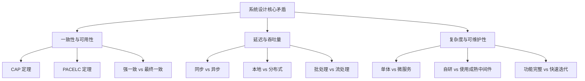
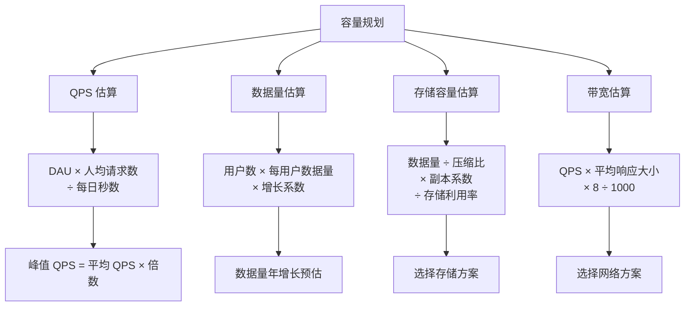
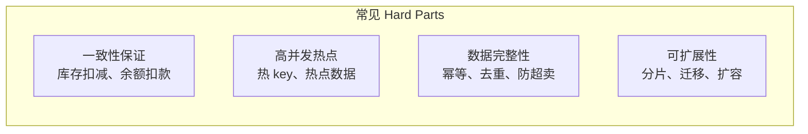
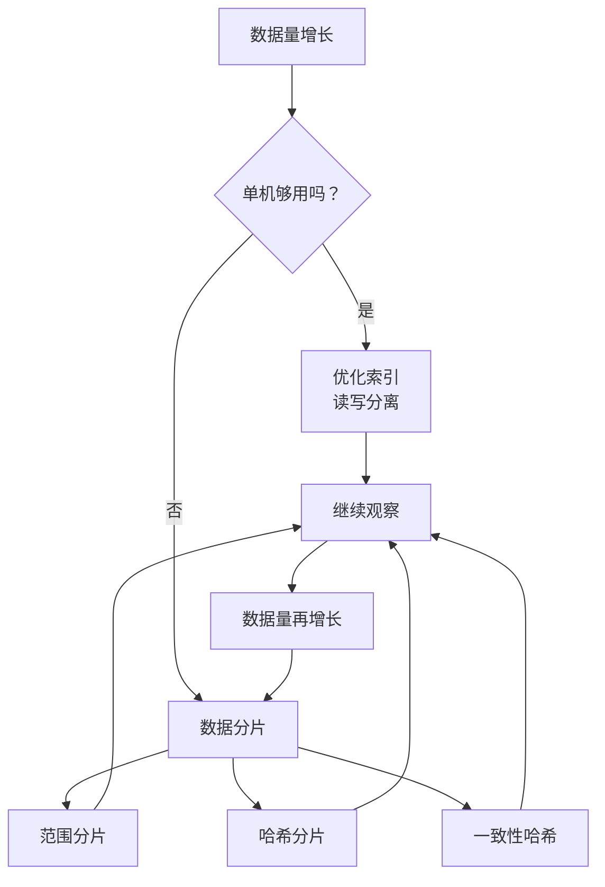
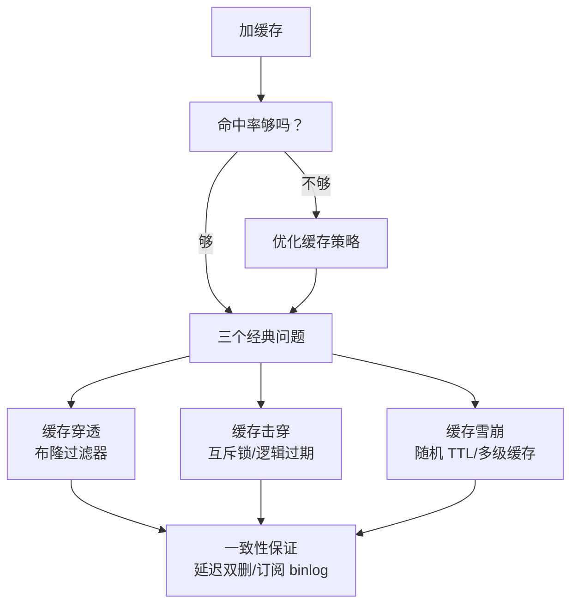
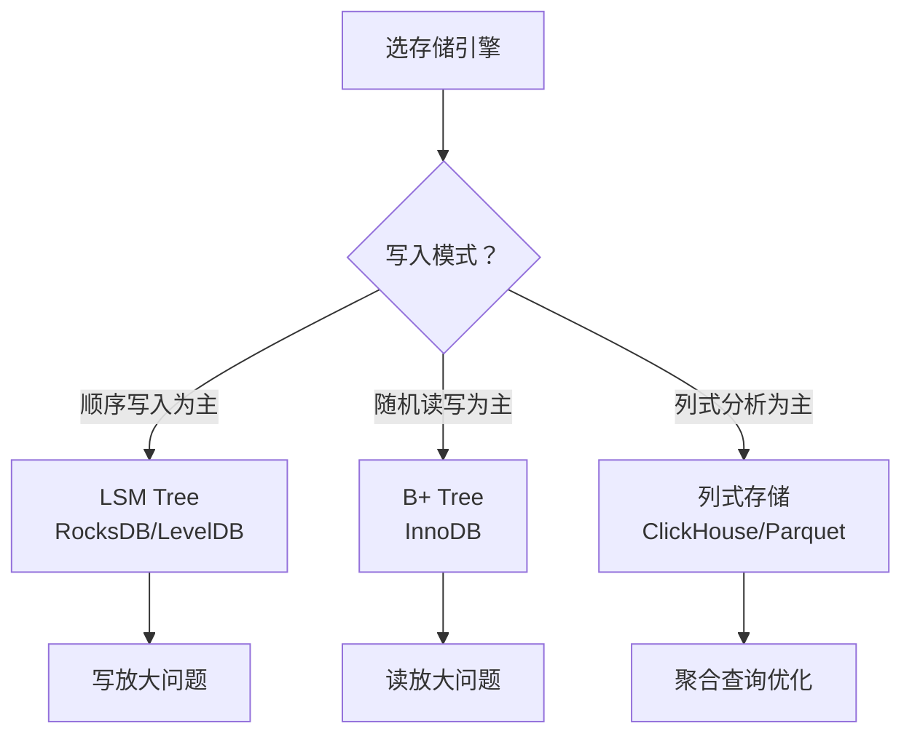
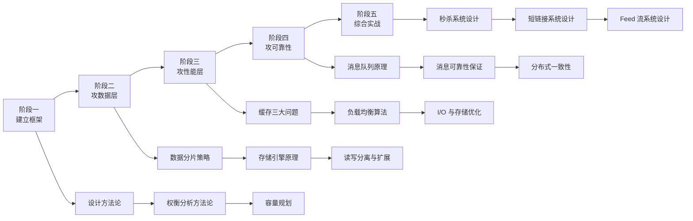

# 系统设计

「面试官问：如果要设计一个秒杀系统，你怎么入手？」

大多数人第一反应是画架构图：网关、缓存、消息队列、数据库——看起来面面俱到。但面试官追问几个细节就卡住了：库存怎么扣？超卖怎么避免？热 key 怎么应对？削峰填谷用消息队列还是本地队列？每个问题背后都是一个深坑。

系统设计的能力，本质上是一种**权衡决策能力**。不存在完美的架构，只有在特定约束下的最优解。你需要在一致性 vs 可用性、延迟 vs 吞吐量、复杂度 vs 可维护性之间做出取舍。理解这些权衡，比记住某个具体问题的标准答案更重要。

本分类聚焦系统设计的核心知识体系，从设计方法论出发，深入讲解权衡分析、扩展策略、数据分片、缓存策略、负载均衡、消息与流系统、存储引擎等核心领域——帮助你建立「面对未知问题，能从第一性原理出发，做出合理设计决策」的能力。

## 模块结构

本分类按主题分为 8 个子模块：

| 子模块 | 核心问题 | 典型场景 |
| --- | --- | --- |
| **设计方法论** | 怎么从零开始设计一个系统？ | 面试框架、需求分析、容量规划 |
| **权衡分析** | 每个技术选型背后的 trade-off 是什么？ | CAP/PACELC、一致性选型、架构风格选择 |
| **扩展策略** | 系统怎么从单机扩展到多机？ | 垂直扩展、水平扩展、读写分离 |
| **数据分片** | 数据怎么分不到多个节点？ | 一致性哈希、分片键设计、跨分片查询 |
| **缓存策略** | 缓存怎么用才能真正提升性能？ | 穿透/击穿/雪崩、布隆过滤器、多级缓存 |
| **负载均衡** | 流量怎么分发到多个节点？ | L4/L7 负载均衡、一致性哈希、会话保持 |
| **消息与流系统** | 异步消息怎么保证可靠？ | Kafka 分区、RocketMQ 事务消息、Exactly-Once |
| **存储引擎** | 数据怎么存储才能既快又稳？ | B+ Tree、LSM Tree、InnoDB、RocksDB |

## 系统设计的核心矛盾

系统设计的所有问题，本质上都围绕着三对核心矛盾的权衡：

**一致性 vs 可用性**：CAP 定理告诉我们，在网络分区发生时，一致性和可用性只能二选一。但 PACELC 更进一步：即使没有网络分区，一致性和延迟之间也存在权衡。

**延迟 vs 吞吐量**：低延迟和高吞吐量往往不可兼得。追求低延迟通常意味着更多资源投入（如预热缓存），追求高吞吐量通常意味着接受一定延迟（如批量处理）。

**复杂度 vs 可维护性**：越复杂的系统，能解决的问题越多，但出问题的概率也越大，运维成本也越高。架构选型的关键在于判断当前阶段的「合适复杂度」。

## 设计方法论：从问题到方案

系统设计不是一上来就画架构图，而是从理解问题开始。

### 第一步：需求分析

**功能需求 vs 非功能需求**。功能需求回答「系统做什么」，非功能需求回答「系统做得怎么样」。

非功能需求通常包括：

- **性能**：QPS/TPS、延迟（p50/p90/p99）
- **可用性**：多少个 9、容灾要求
- **扩展性**：预期数据量、用户规模、增长速率
- **一致性**：强一致还是最终一致、可接受的延迟
- **成本**：预算约束、人力约束

**常见错误**：上来就关注「用什么技术」，而忽略了「业务真正需要什么」。很多系统设计失败，不是因为技术选错了，而是因为没有充分理解需求。

### 第二步：容量规划

在动手设计之前，先估算规模：

### 第三步：高层设计

从整体架构入手，不要一开始就陷入细节。

典型的高层设计流程：

1. **画出核心组件**：前端、网关、业务服务、数据存储
2. **确定数据流**：请求从哪里进、数据往哪里走
3. **识别瓶颈点**：可能的单点和热点
4. **制定扩展策略**：先抗住，再优化

### 第四步：细节设计

针对核心问题深入设计。每个系统都有几个「hard parts」，这些是需要重点突破的地方：

## 核心问题域

### 数据层

数据层是大多数系统最难的部分。当数据量超过单机容量时，一切都会变得复杂：

每一步扩展都会引入新的复杂度：分片后跨分片查询怎么解决？分片键选错了怎么办？节点扩缩容时数据怎么迁移？这些问题在没有实际压力之前，往往被忽视。

### 缓存层

缓存是性能优化的利器，但也是生产事故的高发区：

**常见误区**：加了缓存性能就提升了。实际上，如果缓存命中率过低，缓存反而增加开销；如果缓存和数据库的一致性没做好，可能导致更严重的数据问题。

### 消息层

消息队列解决了异步化和削峰的问题，但引入了新的复杂度：

- **消息可靠性**：消息会不会丢？怎么保证？
- **消息顺序**：消息消费的顺序能否保证？
- **消息重复**：At-Least-Once 语义下如何做到 Exactly-Once？
- **消息积压**：消费者处理不过来怎么办？

这些问题的根源在于：**消息队列是异步的，而业务逻辑通常是同步的**。异步通信的复杂性远高于同步通信。

### 存储层

存储引擎的选择往往是最难回头的决策：

LSM Tree 适合写多读少的场景（如日志、消息），B+ Tree 适合读多写少的场景（如业务库）。选错了存储引擎，后续迁移成本极高。

## 各子模块导读

### 设计方法论

如果你不知道拿到一个系统设计题怎么入手，从这里开始。

**必读**：[系统设计面试流程与框架](/system-design/methodology/interview-framework)——四步法：需求分析、高层设计、细节设计、权衡分析；[需求分析](/system-design/methodology/requirements)——功能需求 vs 非功能需求；[容量规划](/system-design/methodology/capacity-planning)——QPS/TPS 怎么估算。

**推荐**：[延迟估算](/system-design/methodology/latency-estimation)——数字速算表，快速估算各组件延迟量级；[存储容量估算](/system-design/methodology/storage-estimation)——数据量、存储容量、备份策略；[系统设计文档规范](/system-design/methodology/sdd)——如何写一份合格的设计文档。

### 权衡分析

这是整个分类的「思想基础」，帮助你理解为什么设计决策没有标准答案。

**必读**：[CAP 定理与 PACELC](/system-design/tradeoffs/pacelc)——分布式系统不可能三角；[一致性选择矩阵](/system-design/tradeoffs/consistency-choices)——强一致 vs 最终一致的使用场景；[延迟 vs 吞吐量](/system-design/tradeoffs/latency-throughput)——两者为什么往往不可兼得。

**推荐**：[同步 vs 异步](/system-design/tradeoffs/sync-vs-async)；[SQL vs NoSQL 选型矩阵](/system-design/tradeoffs/sql-vs-nosql)；[单体 vs 微服务](/system-design/tradeoffs/monolith-vs-microservices)；[状态ful vs 状态less](/system-design/tradeoffs/stateful-vs-stateless)。

**选读**：[读优化 vs 写优化](/system-design/tradeoffs/read-vs-write)；[推模式 vs 拉模式](/system-design/tradeoffs/push-vs-pull)；[成本 vs 性能](/system-design/tradeoffs/cost-vs-performance)。

### 扩展策略

如果你在思考「系统扛不住了怎么办」，从这里开始。

**核心概念**：[AKF 扩展立方体](/system-design/scaling/akf-cube)——X/Y/Z 三轴扩展的理论基础；[无状态化设计](/system-design/scaling/stateless)——可扩展的前提；[水平扩展](/system-design/scaling/horizontal)——最常用的扩展方式。

**具体策略**：[垂直扩展（Scale Up）](/system-design/scaling/vertical)；[X 轴扩展：水平复制](/system-design/scaling/x-axis)；[Y 轴扩展：功能拆分](/system-design/scaling/y-axis)；[Z 轴扩展：数据分区](/system-design/scaling/z-axis)；[读写分离扩展](/system-design/scaling/read-write-split)；[计算与存储分离](/system-design/scaling/compute-storage-separation)；[弹性伸缩（Auto-scaling）](/system-design/scaling/auto-scaling)。

### 数据分片

如果数据量超过单机容量，从这里开始。

**核心概念**：[分片策略总览](/system-design/sharding/overview)——范围/哈希/一致性哈希的选择；[一致性哈希原理](/system-design/sharding/consistent-hashing)——环、分片、虚拟节点；[分片键设计](/system-design/sharding/shard-key)——选错分片键的代价。

**分片策略**：[范围分片](/system-design/sharding/range)；[哈希分片](/system-design/sharding/hash)；[一致性哈希](/system-design/sharding/consistent-hashing)；[虚拟节点与负载均衡](/system-design/sharding/virtual-nodes)；[目录分片](/system-design/sharding/directory)；[地理分片](/system-design/sharding/geo)。

**进阶问题**：[热点数据处理](/system-design/sharding/hotspot)；[动态分片与重平衡](/system-design/sharding/rebalancing)；[分片带来的查询挑战](/system-design/sharding/query-challenges)；[分片与二级索引](/system-design/sharding/secondary-index)；[分片 vs 分区](/system-design/sharding/sharding-vs-partitioning)。

### 缓存策略

缓存是性能优化最有效的手段之一，也是最容易踩坑的地方。

**入门**：[缓存系统概述与收益分析](/system-design/caching/overview)——缓存的本质与收益评估；[本地缓存](/system-design/caching/local-cache)——Caffeine/Guava Cache；[分布式缓存](/system-design/caching/distributed-cache)——Redis/Memcached。

**三大问题**：[缓存穿透](/system-design/caching/penetration)；[缓存击穿](/system-design/caching/breakdown)；[缓存雪崩](/system-design/caching/avalanche)；[布隆过滤器](/system-design/caching/bloom-filter)——解决缓存穿透的利器。

**进阶**：[多级缓存架构](/system-design/caching/multi-level)；[缓存一致性](/system-design/caching/coherency)；[写穿/写回/写旁路](/system-design/caching/write-policies)；[延迟双删](/system-design/caching/delay-double-delete)；[缓存预热与刷新](/system-design/caching/preheat-refresh)；[缓存淘汰策略](/system-design/caching/eviction)；[缓存监控与指标](/system-design/caching/monitoring)。

### 负载均衡

流量分发的核心机制，理解它是理解分布式系统的基础。

**核心概念**：[负载均衡概述](/system-design/load-balancing/overview)；[四层负载均衡（LVS/DPVS）](/system-design/load-balancing/layer4)；[七层负载均衡（Nginx/HAProxy）](/system-design/load-balancing/layer7)。

**算法**：[轮询与加权轮询](/system-design/load-balancing/round-robin)；[最小连接数](/system-design/load-balancing/least-connections)；[最短响应时间](/system-design/load-balancing/least-time)；[IP Hash 与一致性哈希](/system-design/load-balancing/ip-hash)；[地理位置负载均衡（GSLB）](/system-design/load-balancing/geo)。

**实践**：[客户端负载均衡](/system-design/load-balancing/client-side)；[服务端负载均衡](/system-design/load-balancing/server-side)；[健康检查机制](/system-design/load-balancing/health-check)；[会话保持（Sticky Session）](/system-design/load-balancing/sticky-session)；[全局负载均衡与灾备](/system-design/load-balancing/global)。

### 消息与流系统

异步通信的核心，理解它才能设计出真正可扩展的系统。

**核心概念**：[消息队列核心概念](/system-design/messaging/concepts)；[点对点 vs 发布订阅模型](/system-design/messaging/models)；[消息顺序保证](/system-design/messaging/ordering)；[消息可靠性与确认机制](/system-design/messaging/reliability)；[死信队列与重试队列](/system-design/messaging/dead-letter)；[消息积压处理策略](/system-design/messaging/backlog)。

**进阶**：[Exactly-Once 语义实现](/system-design/messaging/exactly-once)；[流处理 vs 批处理](/system-design/messaging/stream-vs-batch)；[消息队列在微服务中的应用](/system-design/messaging/microservices)。

**中间件对比**：[Kafka 架构深度解析](/system-design/messaging/kafka)；[Kafka 分区与消费者组](/system-design/messaging/kafka-partition)；[Pulsar 架构深度解析](/system-design/messaging/pulsar)；[RabbitMQ 架构深度解析](/system-design/messaging/rabbitmq)；[RocketMQ 架构深度解析](/system-design/messaging/rocketmq)；[消息队列选型对比矩阵](/system-design/messaging/comparison)。

### 存储引擎

理解数据是如何被持久化的，才能做出正确的存储选型。

**核心概念**：[存储引擎概述](/system-design/storage-engine/overview)；[WAL 预写日志机制](/system-design/storage-engine/wal)。

**LSM Tree 系列**：[LSM Tree 原理详解](/system-design/storage-engine/lsm-tree)；[SSTable 与 MemTable](/system-design/storage-engine/sstable-memtable)；[LSM Tree 的 Compaction 策略](/system-design/storage-engine/compaction)；[RocksDB 架构解析](/system-design/storage-engine/rocksdb)；[LevelDB 架构解析](/system-design/storage-engine/leveldb)；[Bloom Filter 在存储引擎中的应用](/system-design/storage-engine/bloom-filter-storage)。

**B+ Tree 系列**：[B+ Tree 原理详解](/system-design/storage-engine/bplus-tree)；[InnoDB 存储引擎架构](/system-design/storage-engine/innodb)。

**对比与选型**：[B+ Tree 与 LSM Tree 对比](/system-design/storage-engine/comparison)；[列式存储 vs 行式存储](/system-design/storage-engine/column-vs-row)；[位图索引与倒排索引](/system-design/storage-engine/inverted-index)；[存储引擎选型指南](/system-design/storage-engine/selection)。

## 学习路线建议

**面试速成路线**（目标：应对系统设计面试）：

设计方法论 → 容量规划 → 数据分片 → 缓存策略 → 消息队列 → 经典问题（秒杀、Feed流、URL短链）

**工程实践路线**（目标：实际项目设计）：

权衡分析方法论 → 扩展策略 → 存储引擎原理 → 缓存一致性 → 消息可靠性 → 分片键设计

**深度原理路线**（目标：成为系统设计专家）：

存储引擎原理 → 一致性协议 → 分布式事务 → 性能优化深度 → 架构演进案例

准备好了吗？让我们从系统设计的方法论开始，建立正确的设计思维。
