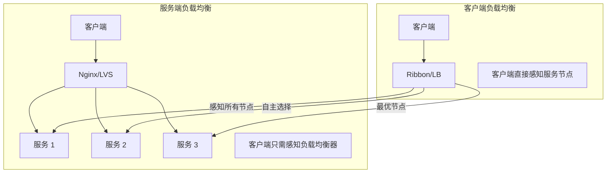
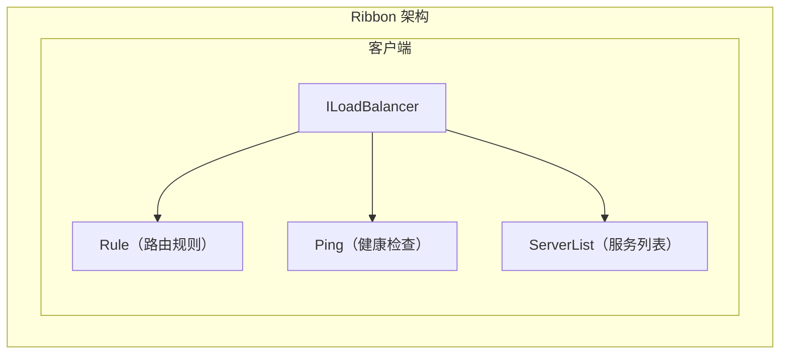
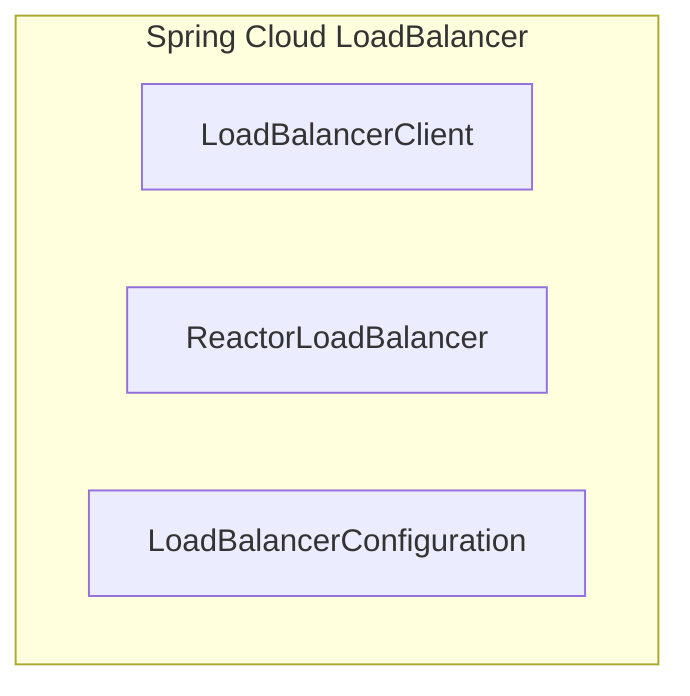

# 客户端负载均衡

传统的负载均衡是**集中式**的——所有请求都经过一个负载均衡器。但对于微服务架构，客户端负载均衡将负载均衡逻辑分散到每个客户端，让客户端直接感知所有服务节点，**自主选择**要调用的服务。

## 客户端 vs 服务端负载均衡



| 维度 | 服务端负载均衡 | 客户端负载均衡 |
| --- | --- | --- |
| 架构 | 集中式 | 分布式 |
| 复杂度 | 低 | 高 |
| 灵活性 | 低 | 高 |
| 性能 | 可能有瓶颈 | 无单点 |
| 升级 | 需要改负载均衡器 | 客户端 SDK 升级 |

## Ribbon 负载均衡器

Ribbon 是 Netflix 开源的客户端负载均衡器，曾经是 Spring Cloud 微服务的标配。

### Ribbon 核心组件



| 组件 | 说明 |
| --- | --- |
| ServerList | 服务列表（静态或动态） |
| IRule | 负载均衡策略（轮询、随机等） |
| IPing | 健康检查方式 |
| ServerListFilter | 服务列表过滤 |

### Ribbon 配置

#### 方式一：配置文件

```yaml
# application.yml
user-service:
  ribbon:
    # 服务列表
    listOfServers: 10.0.1.1:8080,10.0.1.2:8080,10.0.1.3:8080
    # 负载均衡策略
    NFLoadBalancerRuleClassName: com.netflix.loadbalancer.RoundRobinRule
    # 连接超时
    ConnectTimeout: 1000
    # 读取超时
    ReadTimeout: 3000
    # 重试次数
    MaxAutoRetries: 3
```

#### 方式二：Java 配置

```java
@Configuration
public class RibbonConfig {

    @Bean
    public IRule ribbonRule() {
        // 加权轮询
        return new WeightedResponseTimeRule();
    }

    @Bean
    public IPing ribbonPing() {
        // 禁用健康检查（使用服务发现的健康检查）
        return new NoOpPing();
    }

    @Bean
    public ServerList<Server> serverList() {
        // 静态服务列表
        ConfigurationBasedServerList serverList = new ConfigurationBasedServerList();
        serverList.initWithNiwsConfig(new DefaultClientConfigImpl());
        return serverList;
    }
}
```

### Ribbon 负载均衡策略

```java
// 轮询（默认）
IRule rule = new RoundRobinRule();

// 随机
IRule rule = new RandomRule();

// 重试（失败后重试其他节点）
IRule rule = new RetryRule(new RoundRobinRule(), 500);

// 权重（根据响应时间分配权重）
IRule rule = new WeightedResponseTimeRule();

// 可用性过滤（跳过熔断的节点）
IRule rule = new AvailabilityFilteringRule();

// 最低并发
IRule rule = new BestAvailableRule();

// 可用性过滤 + 轮询
IRule rule = new ZoneAvoidanceRule();
```

### Ribbon 使用示例

```java
@Service
public class UserServiceClient {

    @Autowired
    private LoadBalancerClient loadBalancer;

    public User getUser(Long userId) {
        // 1. 选择一个服务实例
        ServiceInstance instance = loadBalancer.choose("user-service");

        // 2. 构建请求 URL
        String url = String.format("http://%s:%d/user/%d",
            instance.getHost(),
            instance.getPort(),
            userId);

        // 3. 发起请求
        return restTemplate.getForObject(url, User.class);
    }
}

// 或者使用 @LoadBalanced RestTemplate
@Configuration
public class RestTemplateConfig {

    @Bean
    @LoadBalanced
    public RestTemplate restTemplate() {
        return new RestTemplate();
    }
}

@Service
public class UserServiceClient2 {

    @Autowired
    private RestTemplate restTemplate;

    public User getUser(Long userId) {
        // 直接使用服务名，Ribbon 会自动负载均衡
        return restTemplate.getForObject(
            "http://user-service/user/" + userId,
            User.class
        );
    }
}
```

## Spring Cloud LoadBalancer

Ribbon 已经进入维护模式，Spring Cloud 推荐使用 **Spring Cloud LoadBalancer** 作为替代。

### 核心概念



### Spring Cloud LoadBalancer 配置

```java
@Configuration
public class LoadBalancerConfig {

    @Bean
    public ReactorLoadBalancer<ServiceInstance> randomLoadBalancer(
            Environment environment,
            LoadBalancerClientFactory factory) {

        String name = environment.getProperty(LoadBalancerClientFactory.PROPERTY_NAME);

        return new RandomLoadBalancer(
            factory.getLazyProvider(name, ServiceInstanceListSupplier.class),
            name
        );
    }
}
```

### 内置策略

```java
// 随机策略
ReactorLoadBalancer<ServiceInstance> randomLB =
    new RandomLoadBalancer(serviceInstanceListSupplier, "user-service");

// 轮询策略
ReactorLoadBalancer<ServiceInstance> roundRobinLB =
    new RoundRobinLoadBalancer(serviceInstanceListSupplier, "user-service");

// 权重响应时间策略（需要配置）
ReactorLoadBalancer<ServiceInstance> weightedLB =
    new WeightedResponseTimeServiceInstanceLoadBalancer(
        serviceInstanceListSupplier,
        "user-service",
        100  // 初始权重
    );
```

### 自定义策略

```java
public class CustomLoadBalancerConfiguration {

    @Bean
    public ReactorLoadBalancer<ServiceInstance> customLoadBalancer(
            ServiceInstanceListSupplier supplier) {

        return new ReactorLoadBalancer<ServiceInstance>() {

            @Override
            public Mono<Response<ServiceInstance>> choose(Request request) {
                return supplier.get(request)
                    .next()
                    .map(instances -> {
                        // 自定义选择逻辑
                        ServiceInstance selected = selectByCustomLogic(instances);
                        return new DefaultResponse(selected);
                    });
            }

            private ServiceInstance selectByCustomLogic(List<ServiceInstance> instances) {
                // 示例：选择标签匹配的服务
                return instances.stream()
                    .filter(instance -> {
                        Map<String, String> metadata = instance.getMetadata();
                        return "v2".equals(metadata.get("version"));
                    })
                    .findFirst()
                    .orElse(instances.get(0));
            }
        };
    }
}
```

## 服务发现集成

客户端负载均衡需要服务发现来获取服务列表：

### Eureka 集成

```java
@Configuration
public class EurekaConfig {

    @Bean
    public ServerList<Server> serverList(Provider< EurekaClient > eurekaClientProvider) {
        return new DiscoveryEnabledNIWSServerList<>(
            eurekaClientProvider,
            "user-service"  // 服务名
        );
    }
}
```

### Consul 集成

```java
@Configuration
@LoadBalancerClient(value = "user-service", configuration = ConsulLBConfig.class)
public class UserServiceClient {

    @Autowired
    private LoadBalancerClient loadBalancer;

    public User getUser(Long userId) {
        ServiceInstance instance = loadBalancer.choose("user-service");
        String url = String.format("http://%s:%d/user/%d",
            instance.getHost(),
            instance.getPort(),
            userId);
        return restTemplate.getForObject(url, User.class);
    }
}

@Configuration
class ConsulLBConfig {
    @Bean
    public ServiceInstanceListSupplier discoveryClientServiceInstanceListSupplier(
            ConfigurableApplicationContext context) {
        return ServiceInstanceListSupplier.builder()
            .withDiscoveryClient()
            .withHealthChecks()
            .build(context);
    }
}
```

## 客户端 vs 服务端负载均衡对比

| 维度 | 客户端负载均衡 | 服务端负载均衡 |
| --- | --- | --- |
| 代表技术 | Ribbon、Spring Cloud LB | Nginx、LVS |
| 架构 | 分布式 | 集中式 |
| 复杂度 | 高 | 低 |
| 灵活性 | 高（可自定义路由） | 低 |
| 升级 | 需要改客户端 | 只改服务端 |
| 性能 | 无单点 | 可能瓶颈 |
| 调试 | 困难 | 简单 |
| 适用场景 | 微服务内部调用 | 入口流量 |

## 常见问题

### 问题一：客户端版本不一致

```
问题：不同客户端使用不同版本的 Ribbon，行为不一致

解决：
1. 统一 SDK 版本
2. 迁移到 Spring Cloud LoadBalancer
```

### 问题二：服务列表更新延迟

```
问题：服务上线/下线后，客户端感知延迟

解决：
1. 缩短缓存刷新间隔
2. 使用推送机制（Eureka Push）
```

### 问题三：心跳检测开销

```
问题：每个客户端都检测所有服务，网络开销大

解决：
1. 集中式健康检查
2. 服务端代理
```

## 总结

客户端负载均衡将负载均衡逻辑嵌入到客户端：

**Ribbon**（已停止维护）：
- Netflix 开源的客户端负载均衡器
- 支持多种负载均衡策略
- 与 Eureka/Consul 集成

**Spring Cloud LoadBalancer**（推荐）：
- Spring Cloud 官方推荐
- 响应式设计
- 支持自定义策略

客户端负载均衡的特点：
- **灵活性高**：可以自定义路由逻辑
- **无单点**：每个客户端独立
- **复杂度高**：需要管理服务列表

服务端负载均衡的特点：
- **简单**：集中管理
- **可观测**：统一的入口
- **可能瓶颈**：单点或少量节点

下一节我们将讲解服务端负载均衡。
