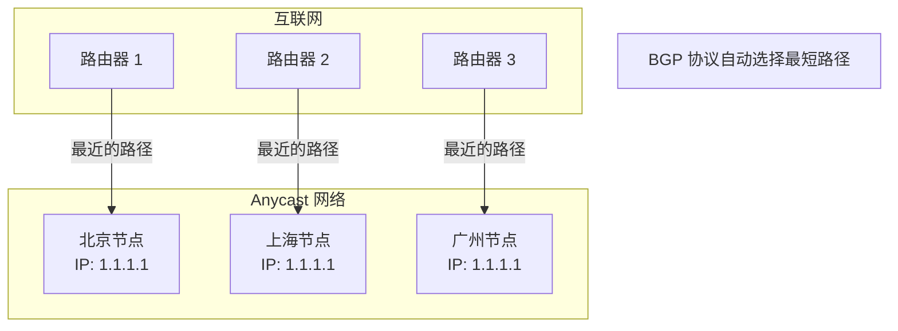
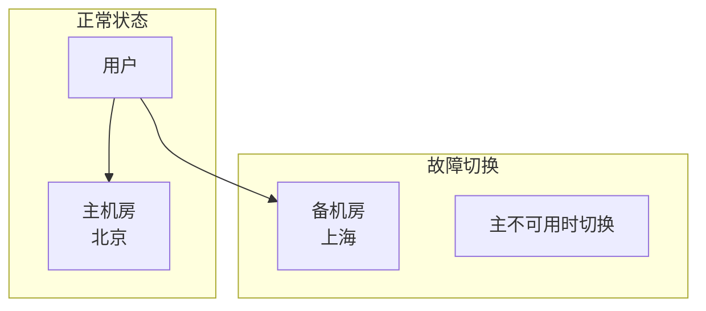
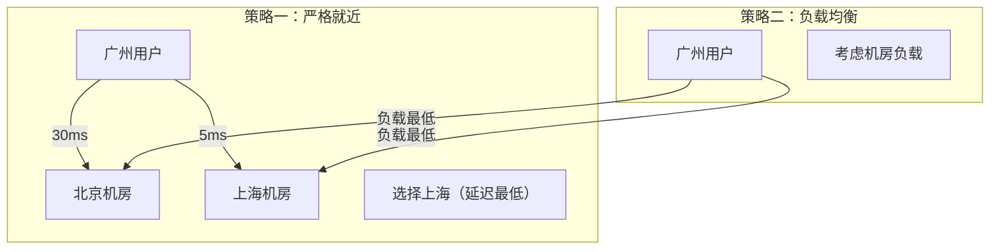

# 地理位置负载均衡（GSLB）

对于拥有多个数据中心的互联网公司，如何让用户访问「最近」的服务器？答案是**地理位置负载均衡（GSLB - Global Server Load Balancing）**。GSLB 是跨地域流量调度的核心组件，决定了用户的访问延迟和体验。

## 为什么需要 GSLB

单地域部署的问题：

```
用户分布：
- 北京用户：40%（延迟 30ms）
- 上海用户：30%（延迟 200ms）
- 广州用户：30%（延迟 250ms）

单地域（上海）部署结果：
- 北京用户体验差（200ms vs 30ms）
- 广州用户体验差（250ms vs 50ms）
```

GSLB 的价值：**让每个用户访问最近的机房，获得最佳体验。**

## GSLB 架构

```mermaid
flowchart TB
    subgraph Client["用户"]
        C1["北京用户"]
        C2["上海用户"]
        C3["广州用户"]
    end

    subgraph GSLB["GSLB 层"]
        DNS["DNS 服务器"]
        GSLB["GSLB 控制器"]
    end

    subgraph Region1["北京机房"]
        LB1["四层 LB"]
        APP1["应用服务"]
    end

    subgraph Region2["上海机房"]
        LB2["四层 LB"]
        APP2["应用服务"]
    end

    subgraph Region3["广州机房"]
        LB3["四层 LB"]
        APP3["应用服务"]
    end

    C1 --> DNS
    C2 --> DNS
    C3 --> DNS

    DNS --> GSLB
    GSLB -->|"北京用户 → 北京机房"| Region1
    GSLB -->|"上海用户 → 上海机房"| Region2
    GSLB -->|"广州用户 → 广州机房"| Region3
```

## DNS 负载均衡

最简单的方式是通过 DNS 实现地理位置路由：

### DNS 轮询

```bash
# DNS 配置：同一域名返回多个 IP
$ dig api.example.com

api.example.com.    300    IN    A    10.0.1.1    # 北京
api.example.com.    300    IN    A    10.0.2.1    # 上海
api.example.com.    300    IN    A    10.0.3.1    # 广州
```

### 基于地理位置的 DNS

使用 GeoDNS，根据用户 IP 返回最近的服务器 IP：

```bash
# 北京用户查询
$ dig @ns1.example.com api.example.com
api.example.com.    300    IN    A    10.0.1.1    # 返回北京 IP

# 上海用户查询
$ dig @ns1.example.com api.example.com
api.example.com.    300    IN    A    10.0.2.1    # 返回上海 IP
```

### DNS 配置示例（Bind）

```zone
# named.conf.local
zone "api.example.com" {
    type master;
    file "/etc/bind/zones/api.example.com.zone";
};

# /etc/bind/zones/api.example.com.zone
$TTL 300
@    IN    SOA    ns1.example.com. admin.example.com. (
        2024010101 ; Serial
        3600       ; Refresh
        1800       ; Retry
        604800     ; Expire
        300        ; Minimum TTL
)

@         IN    NS    ns1.example.com.
@         IN    A     10.0.1.1   ; 默认 IP

; 北京用户
10.0.1.0/24   IN    A     10.0.1.1

; 上海用户
10.0.2.0/24   IN    A     10.0.2.1

; 广州用户
10.0.3.0/24   IN    A     10.0.3.1

; 其他用户默认到北京
*             IN    A     10.0.1.1
```

## Anycast 架构

Anycast 是一种特殊的网络架构，多个节点使用**相同的 IP 地址**，用户请求自动路由到最近的节点：



Anycast 的优势：
- **自动就近**：BGP 协议自动选择最短路径
- **高可用**：一个节点故障，流量自动切换
- **抗 DDoS**：攻击流量分散到多个节点

## GSLB 实现方案

### 方案一：DNS + 健康检查

```
架构：DNS 服务器 + 健康检查
实现难度：低
功能：地理位置路由 + 故障切换
```

```java
public class DNSBasedGSLB {

    private final Map<String, List<Endpoint>> geoRouting;
    private final HealthChecker healthChecker;

    public InetAddress resolve(String domain, String clientIP) {
        // 1. 获取用户的地理位置
        GeoLocation location = geoLocator.locate(clientIP);

        // 2. 获取该地区的服务器列表
        List<Endpoint> endpoints = geoRouting.get(location.getRegion());

        // 3. 选择健康的服务器
        Endpoint selected = selectHealthy(endpoints);

        // 4. 返回服务器 IP
        return selected.getAddress();
    }

    private Endpoint selectHealthy(List<Endpoint> endpoints) {
        return endpoints.stream()
            .filter(e -> healthChecker.isHealthy(e))
            .findFirst()
            .orElse(endpoints.get(0));  // 无健康节点时返回第一个
    }
}
```

### 方案二：Anycast + BGP

```
架构：Anycast IP + BGP 路由
实现难度：高
功能：自动就近 + 高可用 + 抗 DDoS
```

适用于：CDN（Cloudflare、Akamai）、DNS 服务（Cloudflare DNS、Google DNS）

### 方案三：GSLB 设备/服务

商业 GSLB 解决方案：

| 厂商 | 产品 | 特点 |
| --- | --- | --- |
| F5 | BIG-IP Global Traffic Manager | 功能全面 |
| Citrix | NetScaler | 集成负载均衡 |
| AWS | Route 53 | 云原生，按需付费 |
| Cloudflare | Cloudflare Load Balancing | CDN 集成 |

### AWS Route 53 GSLB 配置

```yaml
# Route 53 健康检查配置
aws route53 create-health-check --caller-reference $(date +%s) \
    --health-check-config '
    {
        "Type": "HTTPS",
        "FullyQualifiedDomainName": "api-beijing.example.com",
        "Port": 443,
        "ResourcePath": "/health",
        "RequestInterval": 10,
        "FailureThreshold": 3
    }'

# 创建 GSLB 记录
aws route53 change-resource-record-sets --hosted-zone-id Z1234567890ABC \
    --change-batch '
    {
        "Changes": [
            {
                "Action": "CREATE",
                "ResourceRecordSet": {
                    "Name": "api.example.com",
                    "Type": "A",
                    "SetIdentifier": "beijing",
                    "Region": "ap-northeast-1",
                    "GeoLocation": {
                        "ContinentCode": "AS"
                    },
                    "AliasTarget": {
                        "DNSName": "api-beijing.example.com",
                        "HostedZoneId": "Z1234567890ABC"
                    },
                    "HealthCheckId": "abc123-health-check-id"
                }
            },
            {
                "Action": "CREATE",
                "ResourceRecordSet": {
                    "Name": "api.example.com",
                    "Type": "A",
                    "SetIdentifier": "shanghai",
                    "Region": "ap-east-1",
                    "GeoLocation": {
                        "CountryCode": "CN",
                        "SubdivisionCode": "31"
                    },
                    "AliasTarget": {
                        "DNSName": "api-shanghai.example.com",
                        "HostedZoneId": "Z1234567890ABC"
                    },
                    "HealthCheckId": "def456-health-check-id"
                }
            }
        ]
    }'
```

## 故障切换策略

### 主备切换



### 地理位置路由 + 故障切换

```yaml
# GSLB 规则
rules:
  - name: "主备切换"
    condition: "健康检查失败"
    action: "切换到备用机房"

  - name: "地理位置路由"
    condition: "用户地理位置 = 北京"
    action: "路由到北京机房"

  - name: "回退"
    condition: "目标机房不可用"
    action: "路由到最近可用机房"
```

## 延迟与吞吐量权衡

GSLB 需要在延迟和负载均衡之间权衡：



**选择建议**：
- 对延迟敏感 → 严格就近
- 对吞吐量敏感 → 负载均衡
- 综合 → 就近 + 负载均衡

## 总结

地理位置负载均衡（GSLB）是多地域部署的核心：

**DNS 负载均衡**：
- 最简单，基于地理位置返回不同 IP
- 缺点：DNS 缓存时间长，故障切换慢

**Anycast**：
- 多节点使用相同 IP，BGP 自动就近
- 适合 CDN、DNS 等边缘服务

**GSLB 控制器**：
- DNS + 健康检查 + 故障切换
- 支持地理位置路由、负载均衡、故障恢复

GSLB 的核心价值：
- **降低延迟**：用户访问最近的机房
- **提高可用性**：故障时自动切换
- **抗 DDoS**：攻击流量分散

下一节我们将讲解客户端负载均衡。
