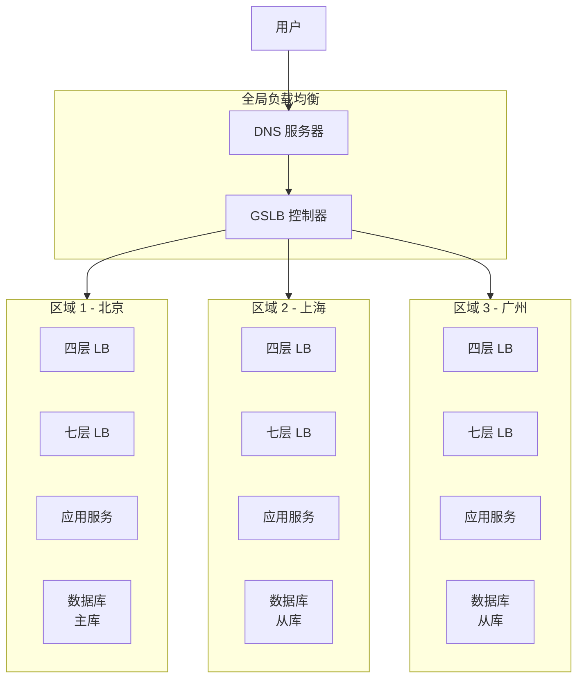
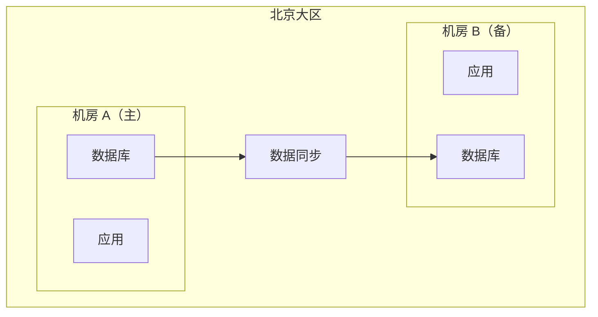
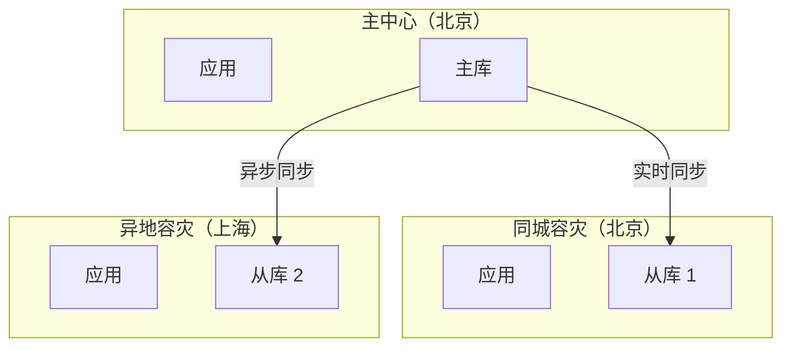
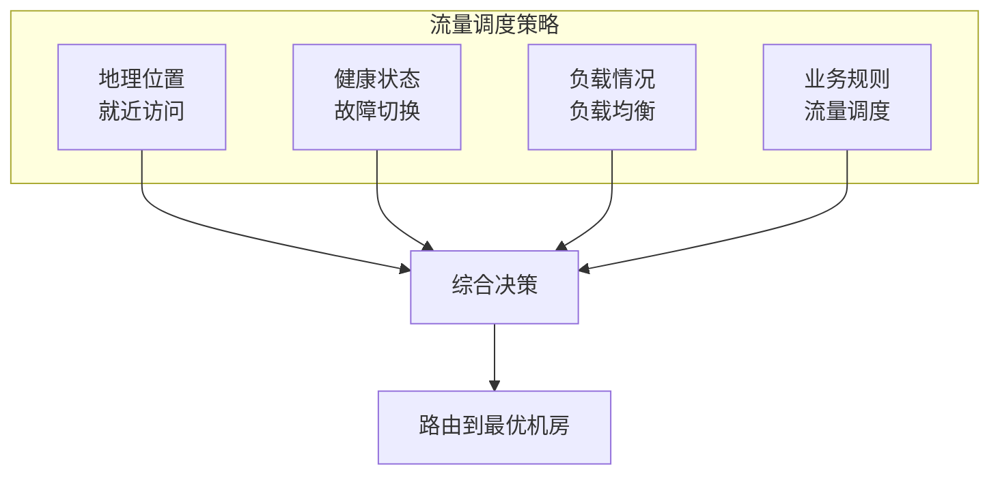
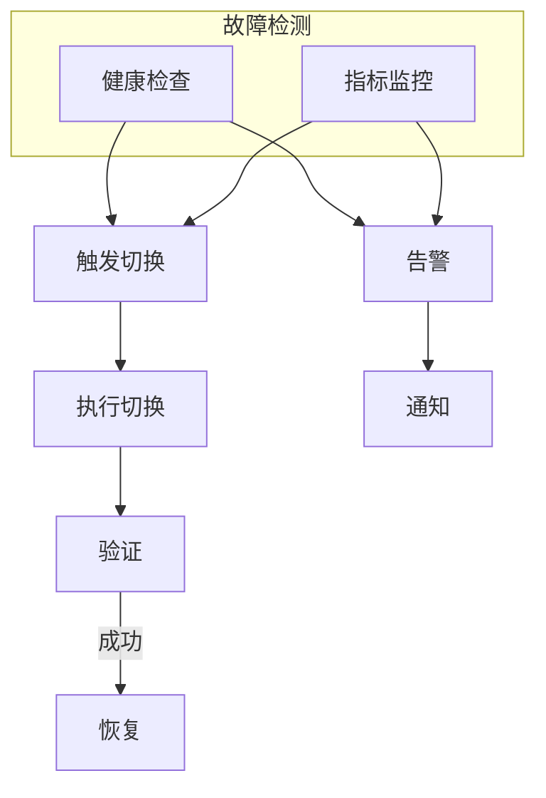
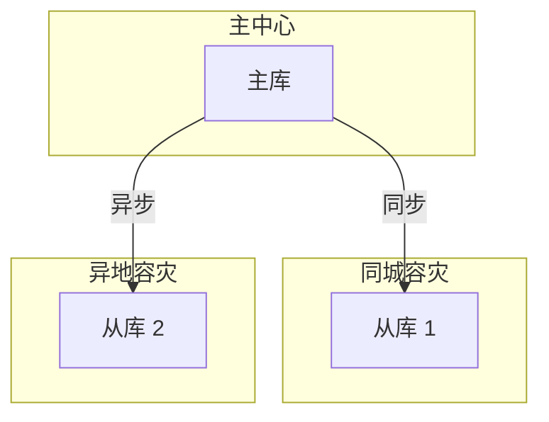
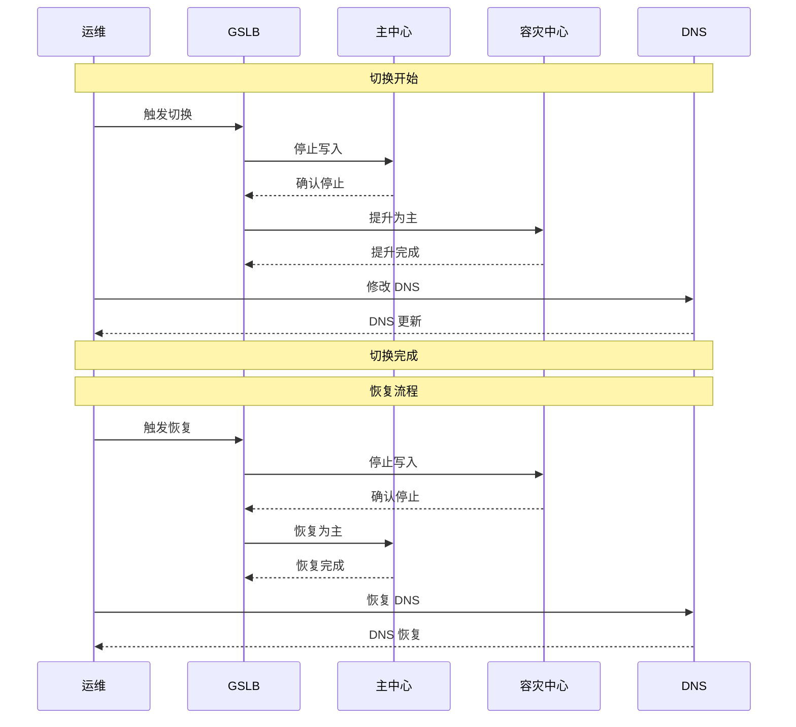

# 全局负载均衡与灾备

对于拥有多个数据中心的公司，如何在故障时快速切换流量？如何在日常运营中实现负载均衡？答案是**全局负载均衡（GSLB）**。本节讲解多机房架构、流量调度和灾备策略。

## 多机房架构概述



## 多活架构模式

### 模式一：同城双活

```
架构：北京机房 A + 北京机房 B（同城）
特点：
- 延迟低（<1ms）
- 同城容灾
- 数据同步简单
```



### 模式二：两地三中心

```
架构：北京主中心 + 北京容灾 + 上海容灾
特点：
- 跨城容灾
- 业务级别切换
- RPO（恢复点目标）可控
```



### 模式三：全球多活

```
架构：全球多个数据中心，每个都是活的
特点：
- 就近访问
- 独立运营
- 数据同步复杂
```

## DNS + GSLB 联动

### 流量调度策略



### DNS 配置

```yaml
# Route 53 地理位置路由
api.example.com:
  - geo_location:
      continent: AS
    set_identifier: beijing
    alias_target: lb-beijing.example.com
    health_check: hc-beijing
    weight: 100

  - geo_location:
      continent: EU
    set_identifier: frankfurt
    alias_target: lb-frankfurt.example.com
    health_check: hc-frankfurt
    weight: 100
```

### 健康检查 + 故障切换

```java
@Service
public class GSLBService {

    private final Map<String, Region> regions;

    public String resolveEndpoint(String clientIP) {
        // 1. 获取用户地理位置
        GeoLocation location = geoService.locate(clientIP);

        // 2. 获取该地区的机房列表
        List<Region> candidates = regions.getByContinent(location.getContinent());

        // 3. 过滤不健康的机房
        List<Region> healthy = candidates.stream()
            .filter(Region::isHealthy)
            .collect(Collectors.toList());

        if (healthy.isEmpty()) {
            // 所有机房都不健康，回退到默认
            return getDefaultEndpoint();
        }

        // 4. 选择负载最轻的
        return selectByLoad(healthy);
    }

    private String selectByLoad(List<Region> regions) {
        return regions.stream()
            .min(Comparator.comparingDouble(Region::getLoadFactor))
            .map(Region::getEndpoint)
            .orElse(getDefaultEndpoint());
    }
}
```

## 故障切换策略

### 自动切换



### 切换决策树

```java
public class FailoverDecision {

    public FailoverResult decide(FailoverContext context) {
        // 1. 检查是否是误判（网络抖动）
        if (context.isNetworkIssue()) {
            return FailoverResult.CONTINUE;
        }

        // 2. 检查健康检查结果
        if (!context.getHealthCheck().isHealthy()) {
            // 3. 检查失败次数
            if (context.getFailureCount() < context.getThreshold()) {
                return FailoverResult.RETRY;
            }

            // 4. 触发切换
            return FailoverResult.SWITCH;
        }

        // 5. 健康检查通过，尝试恢复
        if (context.getPreviousStatus().equals("FAILED")) {
            // 连续 N 次健康检查通过后恢复
            if (context.getSuccessCount() >= context.getRecoveryThreshold()) {
                return FailoverResult.RECOVER;
            }
        }

        return FailoverResult.CONTINUE;
    }
}
```

### 灰度切流

```yaml
# 故障切换时的灰度策略
failover:
  strategy: gradual
  steps:
    - weight: 10%  # 先切 10%
      duration: 5m
      monitor:
        error_rate: < 1%
        latency_p99: < 100ms
    - weight: 30%
      duration: 10m
    - weight: 100%
```

## 流量调度

### 基于权重的流量分配

```yaml
# 日常流量分配
routing:
  weights:
    - region: beijing
      weight: 50  # 50% 流量
    - region: shanghai
      weight: 30  # 30% 流量
    - region: guangzhou
      weight: 20  # 20% 流量
```

### 基于标签的流量调度

```java
@Service
public class LabelBasedRouting {

    public String route(Request request, Map<String, String> labels) {
        // 获取请求的标签
        String version = request.getHeader("X-Version");
        String region = request.getHeader("X-Region");

        // 根据标签选择服务
        List<ServiceInstance> candidates = serviceDiscovery.getByLabels(
            Map.of("version", version, "region", region)
        );

        if (candidates.isEmpty()) {
            // 回退到默认版本
            return serviceDiscovery.getDefault().choose();
        }

        return loadBalancer.choose(candidates);
    }
}
```

### A/B 测试流量分配

```yaml
# A/B 测试配置
experiment:
  name: "new-checkout-flow"
  traffic_split:
    control: 80  # 80% 流量到旧版本
    treatment: 20  # 20% 流量到新版本
  targeting:
    - attribute: "user_segment"
      values: ["premium", "vip"]
      traffic: 50
```

## 数据同步策略

### 同步复制

```
特点：
- 实时同步
- 强一致性
- 延迟低（<1ms）
- 距离有限（同城）

适用：同城双活
```

```sql
-- MySQL 同步复制配置
CHANGE MASTER TO
  MASTER_HOST = '10.0.1.1',
  MASTER_USER = 'repl',
  MASTER_PASSWORD = 'password',
  MASTER_LOG_FILE = 'mysql-bin.001',
  MASTER_LOG_POS = 123;
```

### 异步复制

```
特点：
- 非实时同步
- 最终一致性
- 延迟高（秒级~分钟级）
- 距离无限制

适用：异地灾备
```

### 混合策略



## RPO / RTO 设计

| 容灾等级 | RPO（恢复点目标） | RTO（恢复时间目标） | 方案 |
| --- | --- | --- | --- |
| 基础 | 小时级 | 小时级 | 异地备份 |
| 标准 | 分钟级 | 30 分钟 | 同城双活 |
| 高级 | 秒级 | 分钟级 | 同城双活 + 异地同步 |
| 金融级 | 0 | 分钟级 | 两地三中心 |

### 切换流程



## 总结

全局负载均衡实现多机房、跨地域的流量调度：

**多活架构**：
- 同城双活：低延迟，同城容灾
- 两地三中心：跨城容灾，业务级切换
- 全球多活：就近访问，独立运营

**流量调度**：
- 地理位置路由：就近访问
- 健康检查 + 故障切换
- 灰度切流：减少切换风险

**容灾设计**：
- RPO：恢复点目标，决定数据同步策略
- RTO：恢复时间目标，决定切换速度
- 切换流程：DNS 切换 + 服务切换

负载均衡模块到此结束。通过本模块的学习，你应该掌握了：
- 负载均衡的基础概念
- 四层与七层负载均衡的区别
- 各种负载均衡算法（轮询、最小连接、一致性哈希等）
- 客户端与服务端负载均衡
- 健康检查与会话保持
- 全局负载均衡与灾备

这些知识构成了现代分布式系统的基础设施核心。
