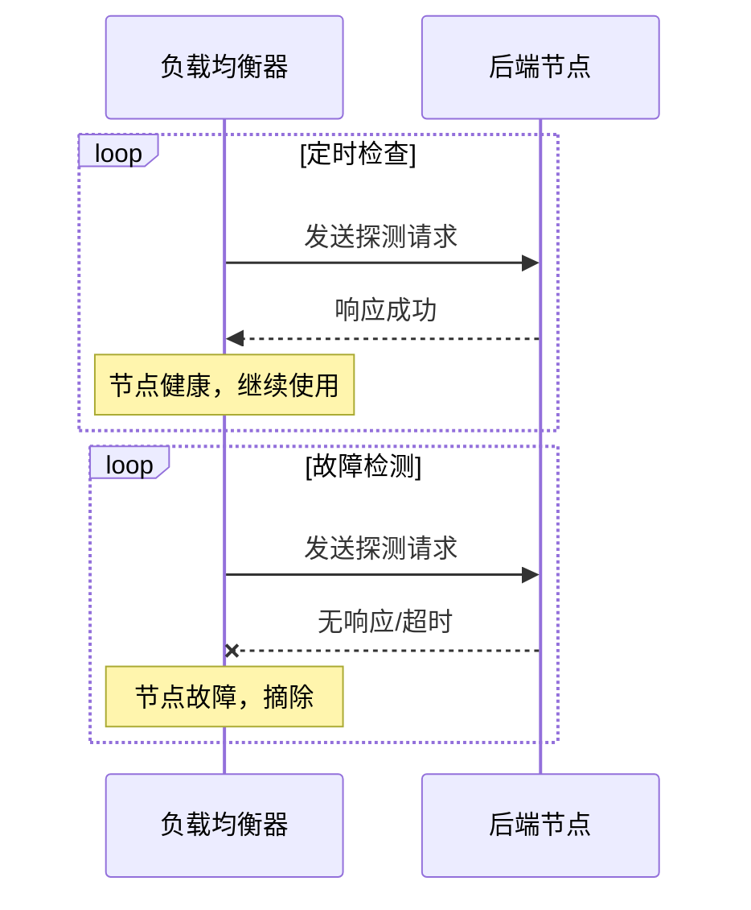
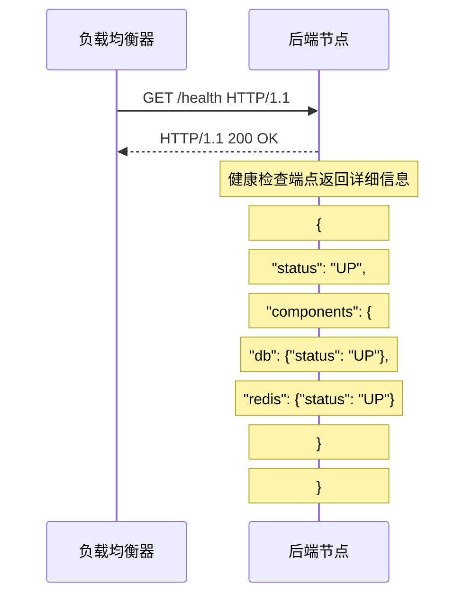

# 健康检查机制

健康检查是负载均衡器的「眼睛」，负责判断后端节点是否存活、是否能够处理请求。没有健康检查，负载均衡器会把请求发到故障节点，导致服务不可用。本节深入讲解健康检查的原理和配置。

## 为什么需要健康检查

```mermaid
flowchart TB
    subgraph Problem["无健康检查的问题"]
        R["请求"] --> F["故障节点"]
        F -.x|"无响应"| R
    end

    subgraph Solution["有健康检查"]
        LB["负载均衡器"]
        HC["健康检查器"]
        S1["节点 1\n正常"]
        S2["节点 2\n故障"]

        LB --> HC
        HC -.->|"检测"| S1
        HC -.->|"检测"| S2
        S2 -.x|"故障"| HC

        R2["请求"] --> LB
        LB --> S1
        LB -.->|"摘除"| S2
    end

    style Problem fill:#ffcdd2
    style Solution fill:#c8e6c9
```

**问题场景**：
- 后端服务进程崩溃
- JVM 发生 OOM
- 数据库连接耗尽
- 应用hang住无法响应

如果没有健康检查，这些故障节点会持续收到请求，导致大量超时和错误。

## 健康检查类型

### 主动检查 vs 被动检查

| 类型 | 原理 | 优点 | 缺点 |
| --- | --- | --- | --- |
| 主动检查 | 负载均衡器主动探测 | 提前发现问题 | 增加网络流量 |
| 被动检查 | 根据实际请求结果判断 | 无额外开销 | 故障已发生 |

### 主动检查详解



### 协议类型

| 协议 | 实现方式 | 适用场景 |
| --- | --- | --- |
| TCP 检测 | 尝试建立 TCP 连接 | 通用场景 |
| HTTP/HTTPS 检测 | 发送 GET 请求，检查响应码 | Web 服务 |
| UDP 检测 | 发送 UDP 包，检查响应 | DNS、游戏服务器 |
| 自定义协议 | 发送特定报文，验证响应 | 特殊业务服务 |

## TCP 端口检查

最基础的健康检查方式——检查端口是否可连接：

```mermaid
flowchart LR
    subgraph TCP["TCP 健康检查"]
        LB["负载均衡器"] -->|"连接 10.0.1.1:8080"| S1["节点 1"]
        LB -->|"连接 10.0.1.2:8080"| S2["节点 2"]

        S1 -->>|"连接成功"| LB
        S2 --x|"连接失败"| LB
    end
```

### 配置示例

```nginx
# Nginx（TCP 端口检查需要 nginx_upstream_check_module 模块）
upstream backend {
    server 10.0.1.1:8080;
    server 10.0.1.2:8080;

    # 主动健康检查
    check interval=3000 rise=2 fall=3 timeout=1000 type=tcp;
}
```

```bash
# LVS IPVSadm TCP 检查
ipvsadm -A -t 192.168.1.100:80 -s rr
ipvsadm -a -t 192.168.1.100:80 -r 10.0.1.1:80 -w 1
ipvsadm -a -t 192.168.1.100:80 -r 10.0.1.2:80 -w 1

# 设置健康检查
# 使用 piranha 或 keepalived 配置
```

## HTTP 健康检查

HTTP 检查比 TCP 更智能，可以检查应用层的健康状态：



### 健康检查端点实现

```java
// Spring Boot Actuator 健康检查
@RestController
@RequestMapping("/health")
public class HealthController {

    @Autowired
    private DataSource dataSource;

    @Autowired
    private RedisTemplate redisTemplate;

    @GetMapping
    public Map<String, Object> health() {
        Map<String, Object> result = new HashMap<>();
        result.put("status", "UP");

        // 检查数据库
        Map<String, String> dbHealth = new HashMap<>();
        try (Connection conn = dataSource.getConnection()) {
            dbHealth.put("status", "UP");
        } catch (Exception e) {
            dbHealth.put("status", "DOWN");
            result.put("status", "DOWN");
        }
        result.put("database", dbHealth);

        // 检查 Redis
        Map<String, String> redisHealth = new HashMap<>();
        try {
            redisTemplate.getConnectionFactory().getConnection().ping();
            redisHealth.put("status", "UP");
        } catch (Exception e) {
            redisHealth.put("status", "DOWN");
            result.put("status", "DOWN");
        }
        result.put("redis", redisHealth);

        return result;
    }
}
```

### HTTP 健康检查配置

```nginx
# Nginx Plus HTTP 健康检查
upstream backend {
    zone backend 64k;

    server 10.0.1.1:8080;
    server 10.0.1.2:8080;

    # HTTP 健康检查
    check interval=5000 rise=2 fall=3 timeout=3000 type=http;
    check_http_send "GET /health HTTP/1.0\r\n\r\n";
    check_http_expect_alive http_2xx http_3xx;
}
```

```haproxy
# HAProxy HTTP 健康检查
backend api_backend
    mode http
    option httpchk GET /health

    # 健康检查配置
    http-check expect status 200

    server api1 10.0.1.1:8080 check inter 2000 fall 2 rise 1
    server api2 10.0.1.2:8080 check inter 2000 fall 2 rise 1
```

## 自定义健康检查

有些场景需要更复杂的健康检查逻辑：

### 场景一：检查依赖服务

```java
// 带依赖检查的健康检查
@GetMapping("/health/detailed")
public ResponseEntity<Map<String, Object>> detailedHealth() {
    Map<String, Object> health = new LinkedHashMap<>();

    boolean allHealthy = true;

    // 数据库健康
    try {
        jdbcTemplate.execute("SELECT 1");
        health.put("database", Map.of("status", "UP"));
    } catch (Exception e) {
        health.put("database", Map.of("status", "DOWN", "error", e.getMessage()));
        allHealthy = false;
    }

    // Redis 健康
    try {
        redisTemplate.opsForValue().get("health_check");
        health.put("redis", Map.of("status", "UP"));
    } catch (Exception e) {
        health.put("redis", Map.of("status", "DOWN", "error", e.getMessage()));
        allHealthy = false;
    }

    // 外部 API 健康
    try {
        ResponseEntity<String> response = restTemplate.getForEntity(
            "https://external-api.com/health",
            String.class
        );
        health.put("externalApi", Map.of("status", "UP"));
    } catch (Exception e) {
        health.put("externalApi", Map.of("status", "DOWN", "error", e.getMessage()));
        // 外部 API 故障不影响主服务
    }

    health.put("status", allHealthy ? "UP" : "DOWN");

    return allHealthy
        ? ResponseEntity.ok(health)
        : ResponseEntity.status(503).body(health);
}
```

### 场景二：渐进式健康检查

```java
@GetMapping("/health")
public ResponseEntity<Health> health() {
    Health.Builder builder = new Health();

    // 基础检查（必须通过）
    builder.up()
        .withDetail("timestamp", System.currentTimeMillis());

    // 详细检查（异步）
    CompletableFuture.runAsync(() -> {
        checkDatabase();
        checkRedis();
        checkExternalServices();
    });

    return ResponseEntity.ok(builder.build());
}
```

## 检查参数设计

### 核心参数

| 参数 | 说明 | 推荐值 |
| --- | --- | --- |
| 检查间隔 | 两次检查之间的时间 | `3~10s` |
| 超时时间 | 等待响应的最大时间 | `1~3s` |
| 成功阈值 | 连续成功次数后才恢复 | `1~2次` |
| 失败阈值 | 连续失败次数后才摘除 | `2~5次` |

### 参数计算公式

```
故障发现时间 = 检查间隔 × 失败阈值 + 超时时间

恢复发现时间 = 检查间隔 × 成功阈值
```

### 不同场景的配置

| 场景 | 检查间隔 | 超时 | 失败阈值 | 说明 |
| --- | --- | --- | --- | --- |
| 金融交易 | 2~3s | 1s | 2 | 快速发现，快速切换 |
| Web 服务 | 5~10s | 2s | 3 | 避免网络抖动误判 |
| 长连接 | 30s+ | 5s | 3 | 基于应用层心跳 |

## 健康检查的 trade-off

### 检查太频繁

| 问题 | 影响 |
| --- | --- |
| 增加负载均衡器压力 | 资源消耗 |
| 增加网络流量 | 带宽浪费 |
| 可能误判 | 网络抖动导致误摘 |

### 检查间隔太长

| 问题 | 影响 |
| --- | --- |
| 故障发现慢 | 用户体验差 |
| 故障时间长 | 系统不稳定 |

**建议**：根据业务对故障的容忍度调整参数。

## 常见问题

### 问题一：健康检查占用资源

```
问题：大量节点时，健康检查流量大

场景：
- 1000 个节点
- 每 5 秒检查一次
- 每次检查 100 字节
- 流量：1000 × 60/5 × 100 = 12MB/min

解决：
1. 批量健康检查
2. 抽样检查
3. 降低检查频率
```

### 问题二：误判

```
问题：网络抖动导致健康检查失败

解决：
1. 增加失败阈值
2. 增加超时时间
3. 使用更智能的检查（连续失败才摘除）
```

### 问题三：健康检查端点被攻击

```
问题：健康检查端点暴露，可能被恶意扫描

解决：
1. 只允许负载均衡器 IP 访问
2. 使用 HTTPS
3. 简单响应（不暴露内部信息）
```

## 总结

健康检查是负载均衡器的核心能力：

**检查类型**：
- TCP 端口检查：基础，简单
- HTTP 健康检查：智能，可检查应用状态
- 自定义检查：灵活，可检查依赖

**参数设计**：
- 检查间隔：3~10s
- 超时时间：1~3s
- 失败阈值：2~5 次
- 成功阈值：1~2 次

**常见问题**：
- 检查太频繁：增加资源消耗
- 检查间隔太长：故障发现慢
- 误判：合理设置阈值

下一节我们将讲解会话保持——如何保证同一用户的请求路由到同一节点。
