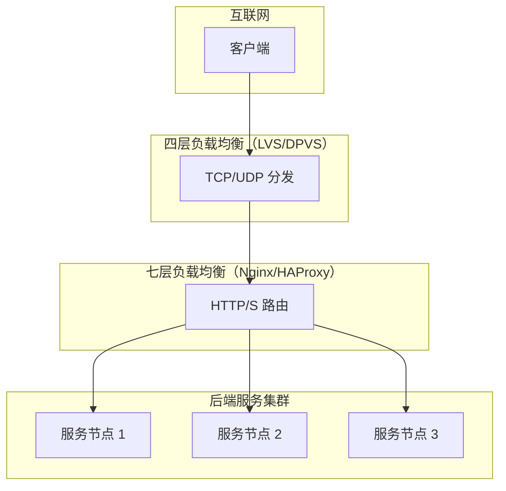
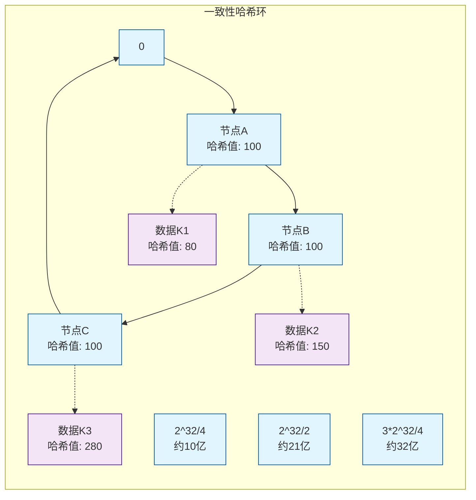
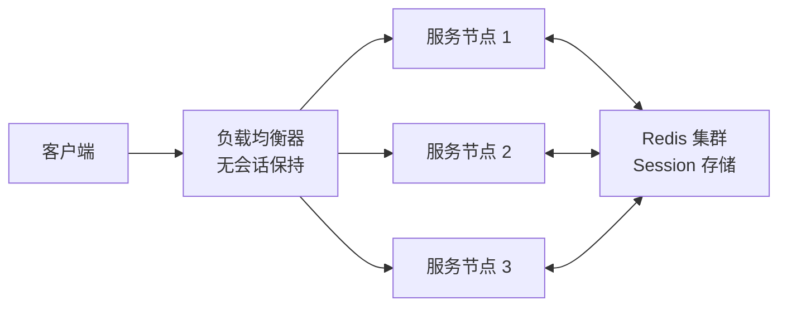
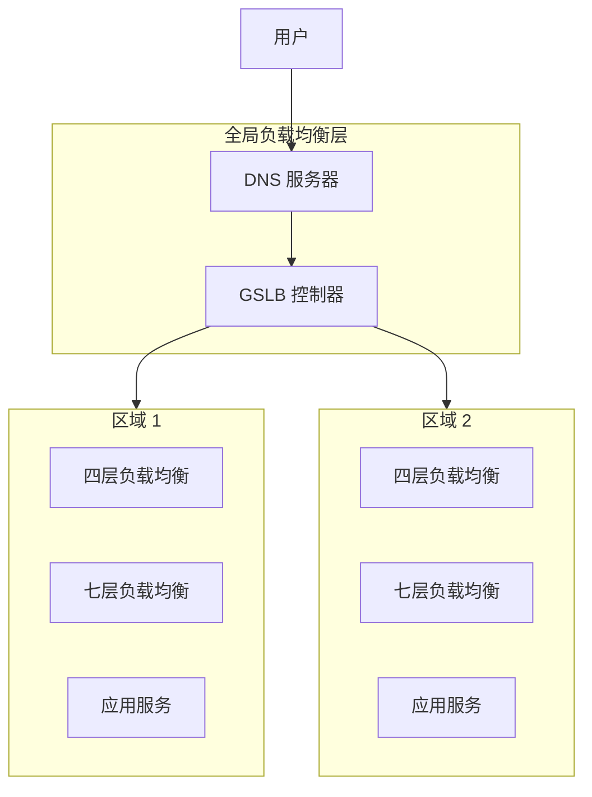

# 负载均衡

凌晨 2 点，电商大促刚刚结束，运维群里突然炸了：某台后端服务器 CPU 被打满到 100%，接口响应时间从正常的 50ms 飙升到 5 秒，而其他两台服务器却悠闲地idle着。你紧急登录负载均衡器查看，发现问题根源是一个「看起来很合理」的配置——加权轮询权重设置为 `4:2:1`，但实际处理能力比例却是 `1:1:1`。更糟糕的是，由于会话保持策略，这台被"照顾"的机器上还堆满了长连接，GC 压力剧增，雪球越滚越大。

这个场景折射出负载均衡领域最典型的两类问题：**流量分配策略选择不当**与**会话保持机制的双刃剑效应**。很多人以为负载均衡只是一个「把请求分到多台机器」的工具，但实际上，从算法选型、协议选择、健康检查到会话管理，每个环节都有深坑。

本模块将系统讲解负载均衡的核心知识，从四层到七层、从轮询到一致性哈希、从单机到全局，帮你建立完整的负载均衡知识体系。下次再遇到「流量倾斜」「服务雪崩」类的问题，你能快速定位根因并给出解决方案。

## 什么是负载均衡

负载均衡的核心目标很简单：**将进入系统的请求合理分配到多个后端节点**，使每台节点的负载保持在合理范围内，同时最大化系统整体吞吐能力。

但「合理分配」这四个字背后，涉及到流量分配算法、健康检查机制、会话管理策略等一系列复杂设计。一个配置失误，可能导致集群整体能力打个对折；一个策略不当，可能引发雪崩式的连锁故障。

## 三层模型

负载均衡按工作层级可分为三层：

| 层级 | 位置 | 职责 | 典型技术 |
| --- | --- | --- | --- |
| 网络层 | 传输层 | 基于 IP/端口的流量分发 | LVS、DPVS、F5 |
| 应用层 | HTTP/S 协议层 | 基于 URL/Header 的智能路由 | Nginx、HAProxy、Envoy |
| 数据层 | 数据库/缓存层 | 数据分片与请求路由 | ShardingSphere、MySQL Proxy |



三层模型的选择取决于业务场景：追求极致性能选四层，需要精细路由选七层，数据分片则需要在应用层或数据层处理。

## 四层 vs 七层负载均衡

这两者的本质区别在于**协议解析深度**与**转发性能**的权衡。

| 维度 | 四层负载均衡 | 七层负载均衡 |
| --- | --- | --- |
| 工作位置 | TCP/UDP 层 | HTTP/HTTPS 层 |
| 协议解析 | 仅解析 IP + 端口 | 解析 URL、Header、Cookie |
| 转发方式 | 基于连接的代理 | 重新建立连接 |
| 性能 | 极高（单实例百万级 CPS） | 较高（单实例十万级 CPS） |
| 功能 | 基础分发 | 路径路由、重写、限流、认证 |
| 适用场景 | 数据库、Redis、高并发短连接 | Web API、微服务网关 |

**选择依据**：如果只需要把请求均匀分到后端节点，选四层；如果需要根据请求内容做路由选择，选七层。两者也可以组合使用——四层做入口流量分发，七层做细粒度路由。

## 负载均衡算法

负载均衡算法是本模块的核心内容。从流量分配策略来看，算法可分为三大类：

### 静态算法

静态算法不考虑节点实时负载状态，仅根据预设规则分配流量。优点是实现简单、行为可预测，缺点是无法应对节点性能差异和实时负载波动。

| 算法 | 描述 | 适用场景 |
| --- | --- | --- |
| 轮询（Round Robin） | 依次分发请求，循环往复 | 节点性能一致 |
| 加权轮询（Weighted Round Robin） | 按权重比例分发 | 节点性能不一致 |
| 随机（Random） | 随机选择节点 | 负载波动小、节点数量多 |
| 加权随机（Weighted Random） | 按权重随机选择 | 节点性能不一致 |

### 动态算法

动态算法会采集节点实时状态（连接数、响应时间等），选择当前负载最轻的节点。优点是能更好利用集群整体能力，缺点是实现复杂、状态采集有延迟。

| 算法 | 描述 | 适用场景 |
| --- | --- | --- |
| 最小连接数（Least Connections） | 选择当前连接数最少的节点 | 长连接场景 |
| 加权最小连接数（WLC） | 结合连接数与权重 | 异构集群 |
| 最短响应时间（Least Response Time） | 选择响应时间最短的节点 | 对延迟敏感的业务 |

### 哈希算法

哈希算法将某些特征（客户端 IP、请求参数等）映射到特定节点，保证相同特征的请求始终路由到同一节点。这对有状态服务至关重要。

| 算法 | 描述 | 适用场景 |
| --- | --- | --- |
| 源 IP Hash | 基于客户端 IP 哈希 | 无 Cookie 的简单会话保持 |
| 一致性哈希 | 环结构 + 虚拟节点 | 缓存集群、分布式哈希表 |

## 一致性哈希详解

一致性哈希是分布式系统中的核心技术，面试中的高频问题，也是缓存集群（如 Redis、Cassandra）广泛采用的路由算法。

### 环结构

传统哈希取模的问题是：当节点数量变化时，几乎所有键的映射关系都会改变，导致缓存大量失效。

一致性哈希的解决方案是引入**环结构**。将哈希空间组织成一个环，范围从 `0` 到 `2^32 - 1`，节点和数据都映射到这个环上，数据顺时针找到最近的节点。



### 虚拟节点

物理节点数量少时，环上的数据分布可能极不均匀。例如三个节点恰好哈希到相邻位置，某个节点可能承担 50% 的数据。

**虚拟节点**通过为每个物理节点创建多个虚拟副本（通常 150~200 个），使节点在环上均匀分布。当某节点宕机时，其负载会平滑转移到多个虚拟节点，降低单点压力。

| 指标 | 无虚拟节点 | 有虚拟节点（150个/物理节点） |
| --- | --- | --- |
| 节点下线影响 | 单节点全部数据重新分布 | 影响分散到多个节点 |
| 负载均衡度 | 依赖哈希均匀性 | 实际负载偏差 `<10%` |
| 内存开销 | 无 | 每节点增加少量路由表项 |

### 迁移量控制

节点变更时，一致性哈希的迁移量远小于传统哈希：

| 场景 | 传统哈希迁移率 | 一致性哈希迁移率 |
| --- | --- | --- |
| 新增 1 节点 | `n/(n+1)` ≈ 100% | `1/(n+1)` ≈ 33% |
| 删除 1 节点 | `1/n` ≈ 50% | `1/n` ≈ 33% |

假设原来有 3 个节点，新增第 4 个节点后，传统哈希有 75% 的数据需要迁移，而一致性哈希只有约 25%。

## 健康检查机制

健康检查是负载均衡器的「眼睛」，负责判断后端节点是否存活、是否能够处理请求。

### 主动检查 vs 被动检查

| 类型 | 原理 | 优点 | 缺点 |
| --- | --- | --- | --- |
| 主动检查 | 负载均衡器主动探测节点状态 | 提前发现问题 | 增加网络流量 |
| 被动检查 | 根据实际请求结果判断 | 无额外开销 | 故障已发生 |

### 协议类型

| 协议 | 实现方式 | 适用场景 |
| --- | --- | --- |
| TCP 检测 | 尝试建立 TCP 连接 | 通用场景 |
| HTTP/HTTPS 检测 | 发送 GET 请求，检查响应码 | Web 服务 |
| 自定义协议 | 发送特定报文，验证响应 | 特殊业务服务 |

### 检查参数设计

健康检查看似简单，但配置不当会引发两个问题：**检查太频繁**增加负载均衡器压力；**检查间隔太长**导致故障节点长时间未被摘除。

| 参数 | 推荐值 | 说明 |
| --- | --- | --- |
| 检查间隔 | `3~5s` | 太短则资源消耗大，太长则故障发现慢 |
| 超时时间 | `1~2s` | 应小于检查间隔 |
| 成功阈值 | `1~2次` | 连续成功次数后才恢复 |
| 失败阈值 | `3~5次` | 连续失败次数后才摘除 |

## 会话保持与会话复制

无状态设计是分布式系统的最佳实践，但现实中总有例外。某些场景下，同一用户的请求必须路由到同一节点——这就是会话保持（Sticky Session）的需求。

### 三种实现方式

| 方式 | 原理 | 优点 | 缺点 |
| --- | --- | --- | --- |
| Cookie 重写 | 在响应 Cookie 中写入节点标识 | 客户端无需改造 | Cookie 暴露节点信息 |
| Session 亲和性 | 负载均衡器维护会话表 | 可追溯 | 增加内存开销 |
| 分布式 Session | Session 统一存储（Redis） | 节点无关 | 增加网络延迟 |

### Cookie 重写的细节

七层负载均衡器可以在 HTTP 响应头中植入 Cookie，标记本次分配的节点。后续请求携带此 Cookie，负载均衡器解析后路由到对应节点。

```
# 请求 1: 用户首次访问，无 Cookie
GET /api/user HTTP/1.1
Host: example.com

# 响应: 负载均衡器植入 Cookie
HTTP/1.1 200 OK
Set-Cookie: SERVERID=node-02; Path=/; HttpOnly

# 请求 2: 用户携带 Cookie
GET /api/user HTTP/1.1
Host: example.com
Cookie: SERVERID=node-02

# 负载均衡器解析 Cookie，路由到 node-02
```

### 分布式 Session 方案

当服务需要水平扩展时，本地 Session 会成为瓶颈。常见方案是将 Session 集中存储到 Redis：



这个方案的trade-off是：节点可以任意扩展，但所有请求都需要访问 Redis，网络开销增加约 `1~2ms`。如果 Redis 不可用，服务将无法获取 Session。

## 部署架构

负载均衡的部署位置决定其职责范围。从客户端到服务端，存在三种部署形态：

### 客户端负载均衡

负载均衡逻辑嵌入到客户端 SDK 中，客户端直接感知所有后端节点地址。典型实现如 Ribbon（已停止维护）、Spring Cloud LoadBalancer。

| 特点 | 说明 |
| --- | --- |
| 优点 | 无单点瓶颈，客户端可自定义路由策略 |
| 缺点 | 客户端升级需要全量发布，策略分散难以统一管理 |

### 服务端负载均衡

负载均衡逻辑集中在一组专用节点（软件如 Nginx、HAProxy，或硬件如 F5）。客户端只需感知负载均衡器地址。

| 特点 | 说明 |
| --- | --- |
| 优点 | 策略集中管理，客户端轻量 |
| 缺点 | 单层负载均衡器可能成为瓶颈 |

### 全局负载均衡（GSLB）

在多个机房或地域之间进行流量调度，结合 DNS 解析实现就近访问、故障切换。典型场景是「两地三中心」架构。



GSLB 解决的问题是：**如何让用户访问最近、最健康的机房？** 这需要结合地理位置信息、健康状态、负载情况综合决策。

## 本章文章导读

负载均衡是一个涉及面极广的领域，从协议栈底层到应用层都有覆盖。以下是本模块的文章结构，建议按顺序阅读：

| 文章 | 核心内容 | 建议阅读人群 |
| --- | --- | --- |
| [负载均衡概述](./overview) | 基本概念、三层模型、选型依据 | 入门必读 |
| [四层负载均衡（LVS/DPVS）](./layer4) | LVS 架构、DR/NAT/Tunnel 模式 | 基础设施工程师 |
| [七层负载均衡（Nginx/HAProxy）](./layer7) | HTTP 协议处理、高级路由功能 | 后端开发 |
| [轮询与加权轮询算法](./round-robin) | 静态算法的实现与权重配置 | 运维工程师 |
| [最小连接数与加权最小连接数](./least-connections) | 动态算法的原理与实现 | 架构师 |
| [IP Hash 与一致性哈希](./ip-hash) | 哈希算法详解、虚拟节点原理 | 分布式系统开发者 |
| [最短响应时间算法](./least-time) | 算法设计与性能优化 | 性能工程师 |
| [地理位置负载均衡（GSLB）](./geo) | DNS + 智能调度、就近访问 | 多地域架构设计 |
| [客户端负载均衡](./client-side) | Ribbon/Spring Cloud LB 实战 | Java 开发者 |
| [服务端负载均衡](./server-side) | Nginx/K8s Ingress 配置 | 运维/后端 |
| [健康检查机制](./health-check) | 主动/被动检查、阈值设计 | 可靠性工程师 |
| [会话保持](./sticky-session) | Cookie 重写、分布式 Session | 全栈工程师 |
| [全局负载均衡与灾备](./global) | 多活架构、故障切换策略 | 架构师 |

如果你已经有了明确的学习目标，可以直接跳转到对应文章。如果你是第一次接触负载均衡，建议从[负载均衡概述](./overview)开始，建立基本认知后再深入各个细分主题。

## 常见问题

**Q：四层负载均衡一定比七层快吗？**

不一定。LVS 的性能上限确实比 Nginx 高，但在现代硬件条件下，Nginx 单实例能轻松处理十万级 CPS，对大多数业务已经足够。七层负载均衡的协议解析能力在微服务场景下是刚需，不应为了「更快」而放弃。

**Q：一致性哈希的虚拟节点数量怎么定？**

经验值是 `150~200` 个/物理节点。这个数值在负载均衡度和内存开销之间取得了较好平衡。如果集群规模大（数十个节点），可以适当减少；如果节点异构性高（性能差异大），可以增加高性能节点的虚拟节点数。

**Q：健康检查间隔设为多少合适？**

这取决于业务对故障敏感度要求：
- 金融交易类：`2~3s`，快速发现快速切换
- 普通 Web 服务：`5~10s`，避免网络抖动误判
- 长连接场景：`30s`+，基于应用层心跳检测

**Q：会话保持一定要用吗？**

尽量不用。会话保持会破坏负载均衡的均匀性，引发流量倾斜。优先考虑无状态设计，或者使用分布式 Session 将状态外置。
