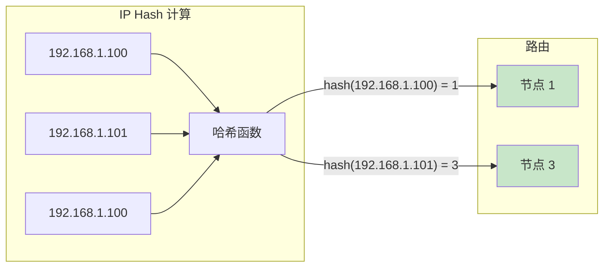
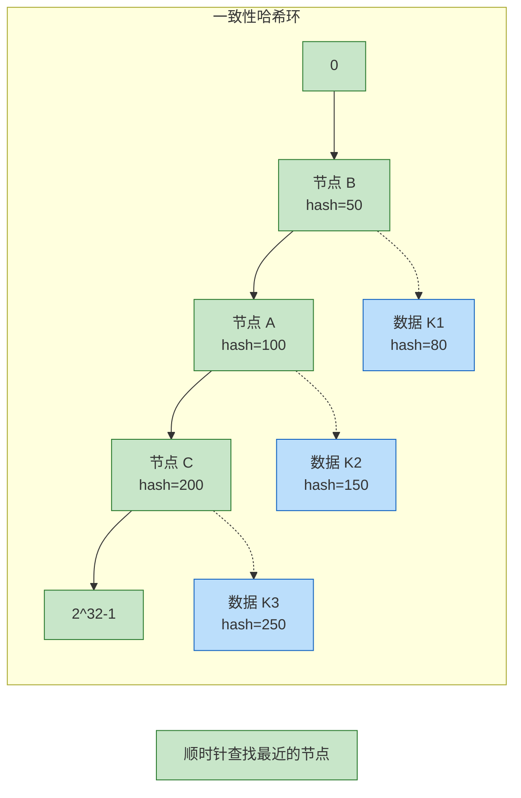

# IP Hash 与一致性哈希

有些场景下，我们需要保证**同一个用户的请求始终路由到同一台后端节点**——这就是会话保持的需求。哈希算法通过计算请求特征的哈希值，实现相同特征的请求路由到同一节点。

## IP Hash 原理

IP Hash 是最简单的哈希负载均衡，基于客户端 IP 地址计算哈希值，然后将请求路由到对应节点：



### IP Hash 实现

```java
public class IPHashLoadBalancer {

    private final List<String> servers;
    private final HashFunction hashFunction = Hashing.murmur3_128();

    public IPHashLoadBalancer(List<String> servers) {
        this.servers = new ArrayList<>(servers);
    }

    public String select(String clientIP) {
        if (servers.isEmpty()) {
            throw new IllegalStateException("No servers available");
        }

        // 计算 IP 的哈希值
        int hash = hashFunction.hashString(clientIP, StandardCharsets.UTF_8).asInt();

        // 取模得到节点索引
        int index = Math.abs(hash % servers.size());

        return servers.get(index);
    }
}
```

### Nginx IP Hash 配置

```nginx
upstream backend {
    ip_hash;  # 启用 IP Hash

    server 10.0.1.1:8080;
    server 10.0.1.2:8080;
    server 10.0.1.3:8080;
}
```

## 一致性哈希原理

### 问题：普通哈希取模的缺陷

```
假设有 3 个节点：hash(key) % 3

请求分布：
key1 → hash=5 → 5%3=2 → 节点2
key2 → hash=8 → 8%3=2 → 节点2
key3 → hash=11 → 11%3=2 → 节点2

结果：所有请求都打到节点2
```

但更重要的是**节点变更时的问题**：

```
初始：3 个节点
新增节点 4：hash(key) % 4

结果：几乎所有请求的路由都改变了！

n/(n+1) ≈ 75% 的请求会打到不同的节点
```

### 一致性哈希的解决方案

一致性哈希通过**环结构**解决这个问题：



**核心思想**：
1. 将哈希空间组织成一个环（0 到 2^32-1）
2. 节点和数据都映射到这个环上
3. 数据顺时针找到最近的节点

### 一致性哈希实现

```java
public class ConsistentHashLoadBalancer {

    private final SortedMap<Long, String> ring = new TreeMap<>();
    private final int virtualNodeCount;
    private final HashFunction hashFunction = Hashing.murmur3_128();

    public ConsistentHashLoadBalancer(List<String> servers, int virtualNodeCount) {
        this.virtualNodeCount = virtualNodeCount;
        for (String server : servers) {
            addNode(server);
        }
    }

    public void addNode(String server) {
        // 添加物理节点
        ring.put(hash(server), server);

        // 添加虚拟节点（用于负载均衡）
        for (int i = 0; i < virtualNodeCount; i++) {
            String virtualNode = server + "#VN" + i;
            ring.put(hash(virtualNode), server);
        }
    }

    public void removeNode(String server) {
        ring.remove(hash(server));
        for (int i = 0; i < virtualNodeCount; i++) {
            String virtualNode = server + "#VN" + i;
            ring.remove(hash(virtualNode));
        }
    }

    public String select(String key) {
        if (ring.isEmpty()) {
            throw new IllegalStateException("No servers available");
        }

        // 计算 key 的哈希值
        long hash = hash(key);

        // 找到第一个大于等于 hash 的节点
        SortedMap<Long, String> tail = ring.tailMap(hash);

        // 如果没有更大的，则选择环的第一个节点
        Long nodeHash = tail.isEmpty() ? ring.firstKey() : tail.firstKey();

        return ring.get(nodeHash);
    }

    private long hash(String key) {
        return hashFunction.hashString(key, StandardCharsets.UTF_8).asLong();
    }
}
```

### 虚拟节点的作用

没有虚拟节点时，节点在环上的分布可能不均匀：

```
场景：3 个节点，哈希值恰好相近

节点位置：
- 节点 A：hash = 100
- 节点 B：hash = 101
- 节点 C：hash = 102

环分布：
0 ---- 100 ---- 101 ---- 102 ---- 2^32-1
 | A+B 区域 | C 区域  |  大部分  |

结果：节点 C 承担了绝大部分数据
```

虚拟节点通过**增加节点副本**使分布更均匀：

```
虚拟节点数量：150 个/物理节点

物理节点 A：A#VN1, A#VN2, ..., A#VN150
物理节点 B：B#VN1, B#VN2, ..., B#VN150
物理节点 C：C#VN1, C#VN2, ..., C#VN150

结果：450 个节点均匀分布在环上
```

## 节点变更的影响

### 普通哈希 vs 一致性哈希

| 场景 | 普通哈希 | 一致性哈希 |
| --- | --- | --- |
| 初始（3 节点） | 分布均匀 | 分布均匀 |
| 新增 1 节点 | 75% 请求路由变化 | 25% 请求路由变化 |
| 删除 1 节点 | 50% 请求路由变化 | 33% 请求路由变化 |

```
节点变更影响计算公式：

普通哈希：
- 新增节点：n/(n+1) 的数据需要迁移

一致性哈希（无虚拟节点）：
- 新增节点：(1/(n+1)) 的数据需要迁移

一致性哈希（有虚拟节点）：
- 新增节点：(1/(n+1)) × (虚拟节点数/总虚拟节点数)
```

## 应用场景

### IP Hash 适用场景

| 场景 | 说明 |
| --- | --- |
| 简单会话保持 | 无 Cookie 时基于 IP 做会话保持 |
| 内部服务 | 客户端 IP 固定的网络环境 |
| 临时方案 | 快速实现会话保持 |

### 一致性哈希适用场景

| 场景 | 说明 |
| --- | --- |
| 分布式缓存 | Redis Cluster、Cassandra |
| 负载均衡 | 减少节点变更时的数据迁移 |
| 分布式哈希表 | DynamoDB、Memcached |

### Redis 一致性哈希配置

```java
// Jedis ShardedJedis（已过时，使用 Redis Cluster 替代）
List<JedisShardInfo> shards = Arrays.asList(
    new JedisShardInfo("10.0.1.1", 6379),
    new JedisShardInfo("10.0.1.2", 6379),
    new JedisShardInfo("10.0.1.3", 6379)
);

ShardedJedis shardedJedis = new ShardedJedis(shards);
// Jedis 会自动使用一致性哈希分配 key
```

## 算法对比

| 算法 | 原理 | 会话保持 | 节点变更影响 | 适用场景 |
| --- | --- | --- | --- | --- |
| 轮询 | 静态 | 否 | 无 | 节点性能一致 |
| 加权轮询 | 静态权重 | 否 | 无 | 异构集群 |
| 最小连接 | 动态连接数 | 否 | 无 | 长连接 |
| IP Hash | 哈希 IP | 是 | 部分 | 简单会话保持 |
| 一致性哈希 | 环结构 | 是 | 最小 | 分布式缓存 |

## 常见问题

### 问题一：IP Hash 分布不均

```
场景：大量用户来自同一 NAT 网关

问题：所有用户 IP 前缀相同，哈希后集中到少数节点

解决：使用其他特征（Cookie、Header）做哈希
```

### 问题二：虚拟节点数量设置

```
数量太少：分布不均匀
数量太多：内存开销增加

经验值：150~200 个/物理节点
```

### 问题三：节点故障时虚拟节点重新分配

```
问题：节点故障后，虚拟节点需要重新分配

影响：
- 虚拟节点转移到其他节点
- 部分数据需要迁移

解决：使用副本节点，故障时自动切换
```

## 总结

哈希算法是实现会话保持的核心技术：

- **IP Hash**：基于客户端 IP 的简单哈希，适合简单会话保持
- **一致性哈希**：环结构 + 虚拟节点，节点变更时影响最小

一致性哈希的核心价值：
- 最小化节点变更时的数据迁移
- 通过虚拟节点实现均匀分布
- 适合分布式缓存和分布式哈希表

选择算法时：
- 需要简单会话保持 → IP Hash
- 分布式系统节点频繁变更 → 一致性哈希
- 需要感知节点负载 → 动态算法

下一节我们将讲解最短响应时间算法。
